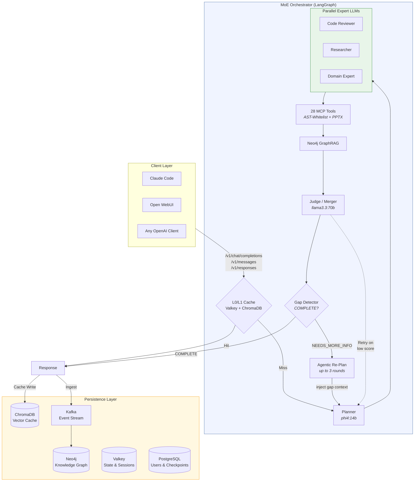
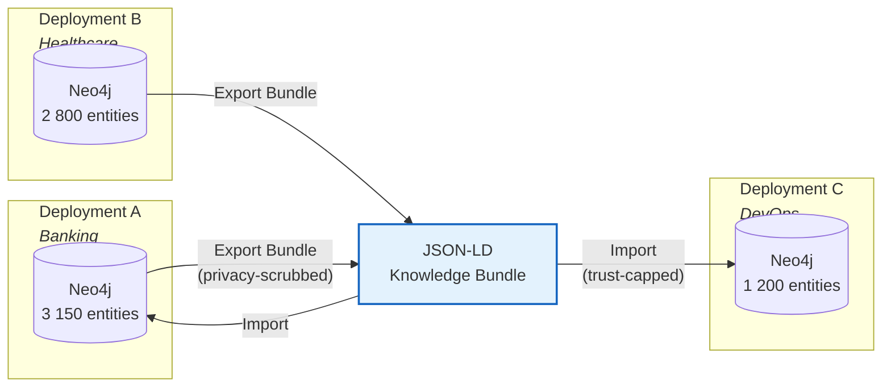
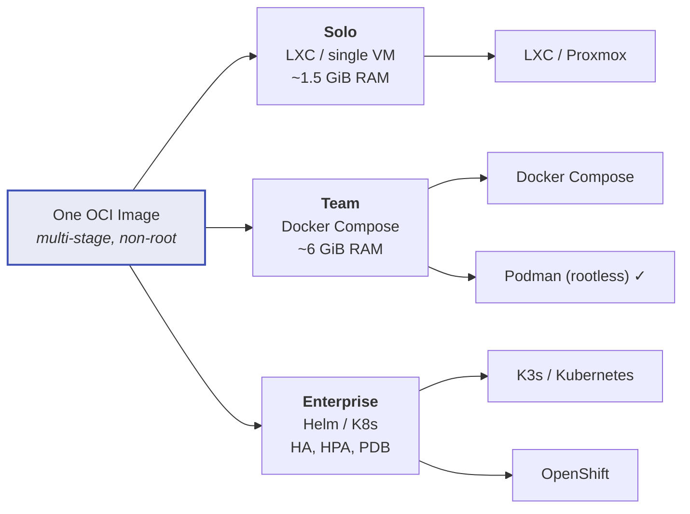

<div align="center">

# MoE Sovereign

**A Self-Hosted Multi-Model Orchestrator with Template-Based Expert Routing<br>for Sovereign AI Infrastructure**

[](LICENSE)
[](#deployment-targets)
[](#)
[](https://docs.moe-sovereign.org)

[Documentation](https://docs.moe-sovereign.org) &bull;
[Website](https://moe-sovereign.org) &bull;
[Issues](https://github.com/h3rb3rn/moe-sovereign/issues) &bull;
[Changelog](CHANGELOG.md)

</div>

---

## Motivation

Commercial AI APIs process every request on infrastructure the customer neither owns nor can inspect. Training-data extraction, prompt logging, and retroactive policy changes are documented incidents. The European regulatory framework --- in particular GDPR Articles 25 and 32 --- mandates data protection by design, a requirement difficult to discharge with an opaque black box in a foreign jurisdiction.

**MoE Sovereign** is a fully self-hosted multi-model orchestrator with template-based expert routing that runs entirely on your own hardware. No data leaves your network. No cloud dependency. No vendor lock-in.

---

## Architecture



### Pipeline Stages

| Stage | Description |
|:---:|---|
| **1. Cache** | L0 query-hash (Valkey, 30 min TTL) and L1 semantic similarity (ChromaDB, cosine &lt; 0.25) |
| **2. Planner** | Decomposes request into 1--4 subtasks with expert category assignment |
| **3. Experts** | T1 models (&le;20B) screen with confidence gating; T2 (24--80B) engage only on low confidence |
| **4. Tools** | 28 MCP precision tools (math, subnet, date, legal, PPTX) via AST-whitelist --- zero hallucination |
| **5. GraphRAG** | Neo4j context enrichment with domain-scoped entity filters and trust-score decay |
| **6. Judge** | Synthesises expert outputs, evaluates quality, retries on failure (up to 3 attempts) |
| **7. Agentic Re-Plan** | Lightweight gap detector checks completeness; if unresolved, injects findings into a new planner round (up to 3 agentic iterations) |
| **8. Ingest** | Validated knowledge flows back into Neo4j via Kafka for graph accumulation acceleration |

### Module Structure

The orchestrator codebase is organised into focused modules. `main.py` is the entry point; domain logic lives in dedicated packages:

```
moe-infra/
├── main.py                    # FastAPI app, lifespan, graph wiring (~7 800 LOC, ongoing decomposition)
├── pipeline/
│   ├── __init__.py            # LangGraph graph builder — assembles nodes into the pipeline DAG
│   └── state.py               # AgentState TypedDict (67 fields across 3 categories)
├── parsing.py                 # Stateless parser helpers: JSON extraction, confidence, usage, dedup
├── web_search.py              # SearXNG integration with domain-reliability scoring
├── math_node.py               # SymPy-backed math node (solve, integrate, differentiate)
├── graph_rag/
│   ├── manager.py             # GraphRAG query, entity linking, trust-score application
│   ├── ontology.py            # Domain ontology definitions and scope filters
│   └── corrections.py        # Contradiction detection and graph self-healing
├── federation/
│   ├── client.py              # Push / pull to MoE Libris hubs
│   ├── sync.py                # Background sync scheduler
│   └── outbound_policy.py     # Privacy-scrubbing policy before bundle export
├── mcp_server/
│   └── server.py              # 28 MCP precision tools (AST-whitelisted)
├── admin_ui/
│   └── app.py                 # Admin backend: experts, users, budgets, cleanup manager
├── prompts/systemprompt/      # 15 expert system prompts (English, "Respond in German.")
├── tests/
│   ├── test_parsing.py        # Unit tests for parsing.py
│   ├── test_web_search.py     # Unit tests for web_search.py
│   ├── test_routing.py        # LLM routing and node-selection tests
│   └── test_mcp_validation.py # MCP AST-whitelist validation tests
└── benchmarks/                # Overnight benchmark suite, GAIA runner, result injection
```

---

## Key Capabilities

| | Capability | Description |
|:---:|---|---|
| **1** | Deterministic Expert Routing | Versioned, auditable templates --- not a probabilistic black box |
| **2** | Two-Tier Escalation | T1 screens fast; T2 engages only when needed |
| **3** | Neo4j GraphRAG | Trust-score self-healing, contradiction detection, domain-scoped filters |
| **4** | Community Knowledge Bundles | Export/import learned knowledge as JSON-LD with regex-based privacy scrubbing (PII, secrets, hostnames) |
| **5** | 51 MCP Precision Tools | AST-whitelisted --- 100% accuracy on deterministic tasks; includes wikidata_sparql, pubmed_search, crossref_lookup, openalex_search, duckduckgo_search, web_browser (Splash JS rendering), wayback_fetch, github_search_issues with fuzzy label resolution |
| **6** | VRAM-Aware Scheduling | Per-node VRAM limits, warm-model affinity, sticky sessions |
| **7** | Multi-Tenant RBAC | Per-user token budgets, template permissions, SSO (Authentik/OIDC) |
| **8** | Claude Code Integration | Full Anthropic Messages API with 6 profiles and streaming thinking blocks |
| **9** | Deployment Flexibility | One OCI image &rarr; LXC (tested), Docker Compose (tested), Podman rootless (tested), Helm/K8s (architecturally prepared, community validation requested) |
| **10** | 9.3&times; Accumulation Speedup | 707 s &rarr; 76 s latency over 5 benchmark epochs |
| **11** | Autonomous Disk Management | System Cleanup Manager in Admin UI: configurable TTL per subsystem, daily cron automation, LangGraph checkpoint archiving, Docker build-cache pruning, history tracking with averages |
| **12** | Agentic Re-Planning Loop | After each synthesis the Judge checks completeness; unresolved gaps trigger a focused re-plan with injected context --- up to 3 autonomous iterations per request; domain-aware search cache prevents result poisoning across iterations |
| **13** | PowerPoint Generation | MCP `generate_pptx` tool creates fully formatted `.pptx` presentations from structured content and delivers them as signed MinIO download links |
| **14** | Selective Template & Profile Export | Admin UI: individual templates and CC profiles can be checkbox-selected for targeted export --- no need to export the full set every time |
| **15** | Endpoint Availability Graph | System Monitoring shows a 24-hour stepped-line chart per inference server (UP/DOWN, 5-min resolution via Prometheus `query_range`) |
| **16** | API Endpoint Budget Overview | Per-endpoint budget cards with spend, limit, and colour-coded progress bar — read live from LiteLLM `x-litellm-key-spend` / `x-litellm-key-max-budget` headers |
| **17** | User Budget Response Headers | `/v1/chat/completions` returns `X-MoE-Budget-Daily-Used` and `X-MoE-Budget-Daily-Limit` — clients can gate on quota without a separate API call |
| **18** | Dynamic Sequential/Parallel Experts | Planner tasks support `depends_on` for multi-hop chains (e.g. find author → find their papers). Independent tasks run in parallel; dependent tasks execute sequentially with result injection via `{result_of:id}` placeholders |
| **19** | Adaptive Context Budget | Context window limits per model auto-scale web-research blocks and GraphRAG budget. Fallback models (gemma4:31b 8K, qwen3.6:35b 32K) receive proportionally smaller context slices |
| **20** | GraphRAG On-Demand | Neo4j queries skipped for external research questions (papers, APIs, media) — only runs for internal knowledge queries or when the plan includes a knowledge_healing task |
| **21** | OpenAI Responses API (`/v1/responses`) | Full Responses API streaming with correct SSE events (`sequence_number`, `output_index`, `content_index`) — enables Codex CLI, Continue.dev, and any OpenAI Responses API compatible agent out of the box |
| **22** | Pipeline Transparency Log | Per-request routing log: expert domains engaged, complexity level, latency, cache hit, agentic rounds — queryable via `/v1/admin/pipeline-log` with CSV export for BI tools |
| **23** | Chess Analysis via Lichess | MCP tool `chess_analyze_position` queries Lichess cloud Stockfish (342M positions, depth 20–99) for best moves given a FEN string — no local engine required |
| **24** | Claude Desktop & Cowork Gateway | Full Anthropic Third-Party Inference Gateway spec: `display_name` in `/v1/models`, `/v1/messages/count_tokens` endpoint, `X-Claude-Code-Session-Id` tracking — compatible with Claude Desktop, Claude Cowork, and Claude Code out of the box. Run `scripts/setup-claude-desktop.sh` to auto-configure |

---

## Federated Knowledge Ecosystem

MoE Sovereign goes beyond a local RAG system. With **community knowledge bundles**, deployments exchange domain knowledge (law, Kubernetes, React, medicine) without sharing proprietary data or source code.



**Privacy protection:** Metadata stripping &bull; Regex detection of PII/secrets &bull; Sensitive relation-type filter &bull; &#9888; Human-in-the-loop responsible for contextual/structural PII (see [Privacy Scrubber limitations](https://docs.moe-sovereign.org/federation/trust/#privacy-scrubber))<br>
**Import safety:** Entity MERGE (no duplicates) &bull; Trust ceiling (0.5) &bull; Contradiction detection via `moe.linting`

> Every new installation enriches the collective knowledge graph. Every bundle import accelerates all participants. This is the **network effect** for open-source AI.

---

## Benchmarks

| Benchmark | Score | Reference |
|---|:---:|---|
| **GAIA Level 1** | **60%** | GPT-4o: 33% &bull; Claude 3.7: 44% &bull; MoE Sovereign: **60%** (6/10, `moe-aihub-free-gremium-deep-wcc`, best run) |
| **GAIA Level 2** | **50%** | GPT-4o Mini: &lt;30% &bull; MoE Sovereign: **50%** (5/10) — multi-hop database lookups, github issue events, Wikidata SPARQL |
| **GAIA Level 3** | **40%** | MoE Sovereign: **40%** (4/10) — complex multi-step research chains |
| **GAIA Overall** | **46.7%** | GPT-4o Mini reference: 44.8% &bull; MoE Sovereign best: **46.7%** (14/30) — 5 iterative runs 2026-04-25 |
| **Math Precision (MCP)** | **10/10** | Deterministic AST computation, 0% variance |
| **Security Code Review** | **9.0/10** | SQLi + XSS identified and fixed |
| **Adversarial MCP** | **9/9 blocked** | All code injection attempts stopped by AST firewall |
| **69 LLM Model Test** | **phi4:14b** | Best planner/judge from 69 models tested |
| **Accumulation Effect** | **9.3&times;** | 707 s &rarr; 76 s over 5 epochs (GraphRAG + cache) |

---

## Quick Start

### One-Line Install

```bash
curl -sSL https://moe-sovereign.org/install.sh | bash
```

### Manual Setup

```bash
git clone https://github.com/h3rb3rn/moe-sovereign.git
cd moe-sovereign
cp .env.example .env
nano .env                      # Set credentials and inference server URLs
sudo docker compose up -d
curl http://localhost:8002/v1/models
```

| Endpoint | URL |
|---|---|
| **API** (OpenAI-compatible) | `http://<host>:8002/v1` |
| **API** (Anthropic/Claude Code) | `http://<host>:8002/v1/messages` |
| **Admin UI** | `http://<host>:8088` |

---

## Deployment Targets



| Target | Status | Profile | Command |
|---|:---:|---|---|
| Docker Compose | **Tested** | `team` | `docker compose up -d` |
| LXC / Proxmox | **Tested** | `solo` | `deploy/lxc/setup.sh` |
| Podman (rootless) | **Tested** | `team` | `curl -sSL https://raw.githubusercontent.com/h3rb3rn/moe-sovereign/main/install.sh \| bash` |
| K3s / Kubernetes | Planned | `enterprise` | `helm install moe charts/moe-sovereign` |
| OpenShift | Untested | `enterprise` | `helm install` with `openshift.enabled=true` |

> All targets use the **same OCI image** --- no code forks, no feature loss.

---

## Services

| Container | Port | Purpose |
|---|:---:|---|
| `langgraph-orchestrator` | 8002 | Core API (OpenAI + Anthropic compatible) |
| `moe-admin-ui` | 8088 | Admin: experts, models, users, budgets, knowledge export, system cleanup manager |
| `mcp-precision` | 8003 | 27 deterministic tools (math, date, subnet, law) |
| `neo4j-knowledge` | 7474 | Knowledge graph (GraphRAG) |
| `terra_cache` | 6379 | Valkey: state, sessions, performance scores |
| `chromadb-vector` | 8001 | Semantic vector cache |
| `moe-kafka` | 9092 | Event streaming (ingest, audit, feedback) |
| `terra_checkpoints` | 5432 | PostgreSQL: user DB, LangGraph checkpoints |
| `moe-prometheus` | 9090 | Metrics collection |
| `moe-grafana` | 3000 | Dashboards (GPU, pipeline, infrastructure) |

---

## Agent Integration

| Agent | Endpoint | Configuration |
|---|---|---|
| **Claude Code** | `/v1/messages` | `export ANTHROPIC_BASE_URL=https://your-server` |
| **Codex CLI** | `/v1/responses` | `export OPENAI_BASE_URL=https://your-server` |
| **OpenCode** | `/v1/chat/completions` | Provider config in `config.toml` |
| **Aider** | `/v1/chat/completions` | `export OPENAI_BASE_URL=https://your-server/v1` |
| **Continue.dev** | `/v1/chat/completions` or `/v1/responses` | Add in `.continue/config.json` |
| **Open WebUI** | `/v1/chat/completions` | Add as OpenAI-compatible connection |

---

## Competitive Landscape

| Feature | MoE Sovereign | Palantir AIP | Databricks | Glean | CrewAI | Ollama+WebUI |
|---|:---:|:---:|:---:|:---:|:---:|:---:|
| Multi-expert routing | &check; | &check; | &check; | --- | ~ | --- |
| Deterministic routing | &check; | &check; | --- | --- | --- | --- |
| Knowledge graph | &check; | &check; | ~ | &check; | --- | --- |
| VRAM-aware scheduling | &check; | --- | --- | --- | --- | ~ |
| Knowledge export/import | &check; | --- | --- | --- | --- | --- |
| Air-gap / fully local | &check; | ~ | --- | --- | &check; | &check; |
| Open source | &check; | --- | ~ | --- | &check; | &check; |
| Cost | Free | &gt;$1M/yr | Pay/DBU | $25+/user | Free | Free |

---

## Hardware Requirements

| Resource | Minimum (`solo`) | Recommended (`team`) |
|---|---|---|
| OS | Debian 11+ / Ubuntu 22.04+ | Debian 13 (trixie) |
| RAM | 8 GB | 16 GB+ |
| CPU | 4 cores | 8 cores+ |
| Disk | 60 GB | 200 GB+ |
| GPU | None (API-only mode) | NVIDIA with CUDA, &ge; 8 GB VRAM |
| Docker | CE 24+ | Docker CE 27+ |

> The orchestrator runs on CPU. GPU VRAM is only needed on **inference nodes** (Ollama).

---

## Documentation

Full documentation: **[docs.moe-sovereign.org](https://docs.moe-sovereign.org)**

| Section | Content |
|---|---|
| [Quick Start](https://docs.moe-sovereign.org/guide/quickstart/) | First steps after installation |
| [Architecture](https://docs.moe-sovereign.org/system/architecture/) | System design, data flow, pipeline |
| [Expert Templates](https://docs.moe-sovereign.org/guide/templating-guide/) | Template design and LLM routing |
| [Agent Profiles](https://docs.moe-sovereign.org/guide/agent-profiles/) | Claude Code, OpenCode, Aider, Continue.dev |
| [GPU Monitoring](https://docs.moe-sovereign.org/deployment/gpu-monitoring/) | Node-exporter + Grafana for inference nodes |
| [Import / Export](https://docs.moe-sovereign.org/reference/import-export/) | Templates, profiles, and knowledge bundles |
| [Deployment](https://docs.moe-sovereign.org/deployment/) | LXC, Docker, Podman, Kubernetes, OpenShift |
| [API Reference](https://docs.moe-sovereign.org/guide/api/) | Full endpoint documentation |
| [Maintenance & Disk Management](https://docs.moe-sovereign.org/admin/maintenance/) | Cleanup Manager, TTL configuration, checkpoint archiving |

Local preview: `pip install mkdocs-material && mkdocs serve`

---

## Publications

| Document | Format | Pages |
|---|---|---|
| [Whitepaper (EN)](https://moe-sovereign.org/whitepaper-en.pdf) | PDF | ~60 |
| [Whitepaper (DE)](https://moe-sovereign.org/whitepaper-de.pdf) | PDF | ~63 |

---

## Contributing

See [CONTRIBUTING.md](CONTRIBUTING.md) for the extension model (MCP tools, expert templates, Admin UI).<br>
Please read [CODE_OF_CONDUCT.md](CODE_OF_CONDUCT.md) before opening issues or pull requests.

---

## Disclaimer

MoE Sovereign is a research and productivity tool. AI-generated output may be inaccurate or misleading.
**Medical** and **legal** expert outputs do not constitute professional advice.
All AI output should be verified independently.
See [PRIVACY.md](docs/PRIVACY.md) for data handling details.

---

## License

**[Apache License 2.0](LICENSE)**

See [THIRD_PARTY_NOTICES.md](THIRD_PARTY_NOTICES.md) for bundled component licenses.

---

<div align="center">
<sub>

**Digital sovereignty lived, not preached.**<br>

Built on personally purchased consumer hardware. No cloud credits, no institutional funding.<br>

*If it works on five second-hand RTX 3060 cards, it works on anything.*

[moe-sovereign.org](https://moe-sovereign.org) &bull;

[docs.moe-sovereign.org](https://docs.moe-sovereign.org) &bull;

[GitHub](https://github.com/h3rb3rn/moe-sovereign)

</sub>
</div>
