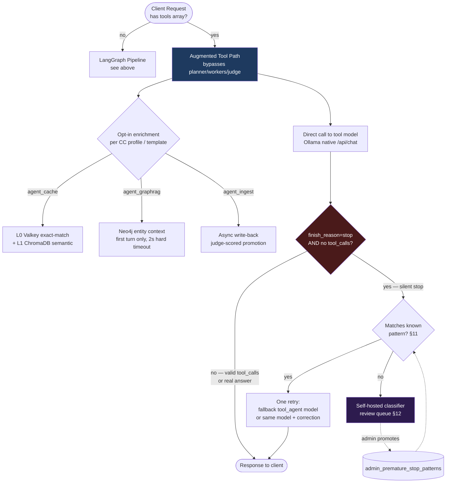
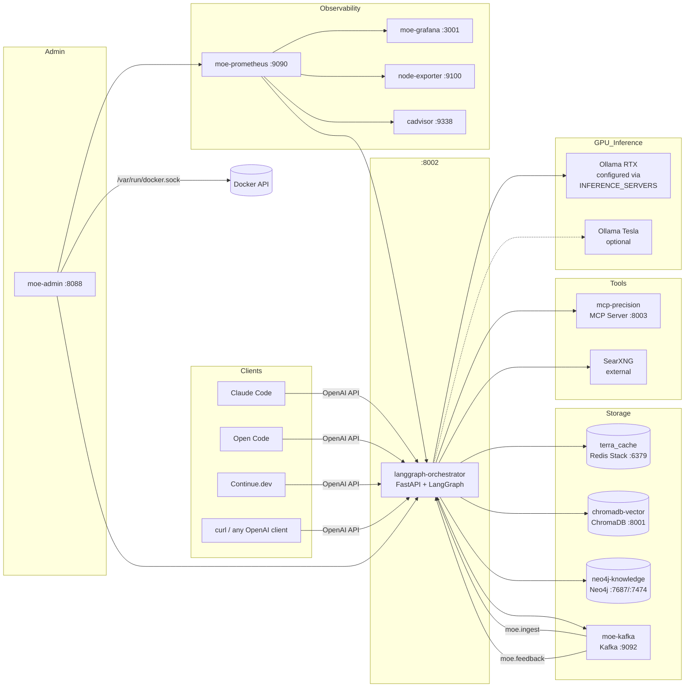

# MoE Sovereign — System Architecture

## Overview

MoE Sovereign is a LangGraph-based Multi-Model Orchestrator. Each incoming query is decomposed by a planner LLM into typed tasks, routed to specialist models in parallel, enriched with knowledge graph context and optional web research, then synthesized by a judge LLM into a single coherent response.

All caching is multi-layered: semantic vector cache (ChromaDB), plan cache (Valkey), GraphRAG cache (Valkey), and performance-scored expert routing (Valkey). The API is fully OpenAI-compatible.

---

## Code Structure

The orchestrator is organised as a thin `main.py` (lifespan, middleware, FastAPI app) plus topic-focused packages.

```
moe-infra/
├── main.py               (~1,500 lines)  Lifespan, middleware, app, init tasks
├── config.py                              All os.getenv() — typed config constants
├── state.py                               Shared mutable globals (redis_client, _userdb_pool, …)
├── prompts.py                             Static prompt text + routing detection regexes
├── metrics.py                             Single Prometheus registry
├── parsing.py                             Pure functions: JSON, content extraction, history truncation
├── context_budget.py                      Per-model context-window estimation
│
├── routes/                                FastAPI APIRouters (one per concern)
│   ├── health.py             /health, /metrics
│   ├── watchdog.py           /api/watchdog/*, /api/starfleet/features
│   ├── mission_context.py    /api/mission-context
│   ├── graph.py              /graph/*
│   ├── feedback.py           /v1/feedback, /v1/memory/ingest
│   ├── admin_benchmark.py    /v1/admin/benchmark/lock
│   ├── admin_ontology.py     /v1/admin/ontology/*
│   ├── admin_stats.py        /v1/admin/stats/*
│   ├── models.py             /v1/models
│   ├── ollama_compat.py      /api/* (Ollama protocol)
│   └── anthropic_compat.py   /v1/messages, /v1/responses, /v1/chat/completions
│
├── services/                              Business logic — no FastAPI imports
│   ├── auth.py               OIDC + API key validation + budget enforcement
│   ├── tracking.py           Usage logging, request lifecycle, budget counters
│   ├── routing.py            Expert template + per-template prompt resolution
│   ├── templates.py          Expert template + Claude Code profile loading
│   ├── llm_instances.py      ChatOpenAI singletons (judge, planner, ingest, search)
│   ├── inference.py          Node selection, fallback chain, Thompson sampling
│   ├── helpers.py            Progress reports, semantic memory, self-evaluation
│   ├── skills.py             Server-side skill resolution + ADMIN_APPROVED hard-lock
│   ├── healer.py             Ontology gap-healer (one-shot + dedicated subprocess)
│   ├── kafka.py              Fire-and-forget Kafka publish helper
│   └── pipeline/             OpenAI / Anthropic / Ollama / Responses API handlers
│       ├── chat.py               OpenAI chat completions
│       ├── anthropic.py          Anthropic Messages API + tool/MoE/reasoning handlers
│       ├── ollama.py             Ollama-protocol streaming wrappers
│       └── responses.py          OpenAI Responses API
│
└── graph/                                 LangGraph node implementations
    ├── router_nodes.py       cache_lookup, semantic_router, fuzzy_router, _route_cache
    ├── tool_nodes.py         mcp_node, graph_rag_node, math_node_wrapper
    ├── planner.py            planner_node + plan sanitization + topological levels
    ├── expert.py             expert_worker (parallel expert execution)
    ├── research.py           research_node + research_fallback + domain extraction
    └── synthesis.py          merger_node, thinking_node, resolve_conflicts_node, critic_node
```

The split was completed in 14 phases — `main.py` shrank from 11,190 → ~1,500 lines (−86 %) without a single behavioural change. Every phase ended with all 195 tests green.

---

## LangGraph Pipeline


### Node Descriptions

| Node | Function | Key Logic |
|---|---|---|
| `cache_lookup` | ChromaDB semantic similarity | distance < 0.15 → hard hit; 0.15–0.50 → soft/few-shot examples |
| `planner` | Task decomposition (phi4:14b) | Produces `[{task, category, search_query?, mcp_tool?}]`; Valkey plan cache TTL=30 min |
| `workers` | Parallel expert execution | Two-tier routing; T1 (≤20B) first, T2 (>20B) only if T1 confidence < threshold |
| `research` | SearXNG web search | Single or multi-query deep search; always runs if `research` category in plan |
| `math` | SymPy calculation | Runs only if `math` category in plan AND no `precision_tools` task |
| `mcp` | MCP Precision Tools | 20 deterministic tools via HTTP; runs if `precision_tools` in plan |
| `graph_rag` | Neo4j knowledge graph | Entity + relation context; Valkey cache TTL=1h |
| `research_fallback` | Conditional extra search | Triggers if merger needs more context |
| `thinking` | Chain-of-thought reasoning | Generates `reasoning_trace`; activated by `force_think` modes |
| `merger` | Response synthesis (Judge LLM) | Fast-path bypasses Judge for single high-confidence experts |
| `critic` | Post-generation validation | Async self-evaluation; flags low-quality cache entries |

---

## Augmented Tool Path (Agentic Clients)

The LangGraph Pipeline above assumes MoE Sovereign owns the tool-calling
loop — it plans, dispatches to `mcp`/`research`/`math`, and synthesizes the
result itself. Agentic CLI clients (Claude Code, OpenCode) already run their
*own* tool-calling loop client-side (their own planning, their own MCP
tools, their own file edits) and only need a raw model to talk to — running
them through the full planner→workers→judge pipeline on every turn would
mean double planning, wrong latency characteristics for an interactive CLI,
and cache/GraphRAG enrichment aimed at a different kind of query entirely.

Any request whose body carries a `tools` array is therefore routed around
the LangGraph graph completely, straight to the configured tool-capable
model — the "Augmented Tool Path", implemented in
`_handle_tool_calls` (`services/pipeline/chat.py`, OpenCode / OpenAI-format
clients) and `_anthropic_tool_handler` (`services/pipeline/anthropic.py`,
Claude Code / Anthropic-format clients).



The three enrichment layers (`agent_cache`, `agent_graphrag`, `agent_ingest`)
are opt-in per CC profile / Expert Template and otherwise inert —
`services/agent_enrichment.py` is written so every public function is safe
to call unconditionally and degrades to plain passthrough on any failure or
disabled flag. Silent-stop detection and its retry (§11) and the review
queue for cases that slip past it (§12) are the one part of this path that
is **not** opt-in — see [expert-template-guide.md § Augmented Tool
Path](reference/expert-template-guide.md#augmented-tool-path-agentic-clients)
for the full operational writeup and the [Configuration
Reference](#augmented-tool-path-agentic-clients_1) below for the tunable
flags.

---

## Live Pipeline Visualization

Both paths above are observable while they run, not just after the fact,
from the Admin UI's Live Monitoring page (`/live-monitoring`,
`admin_ui/templates/live_monitoring.html` +
`admin_ui/static/js/pipeline_diagram.js`) and the equivalent panel in the
User Portal.

**LangGraph Pipeline diagram.** A Cytoscape.js graph mirrors the node
diagram from the LangGraph Pipeline section above, live, per in-flight
request: `_record_stage` (`services/tracking.py`) appends
`{stage, status, detail, ts}` to a capped Redis list
(`moe:active:{chat_id}:trace`, `LTRIM -30 -1`, TTL'd) at each LangGraph node
transition; the panel polls `/api/live/request-trace/{chat_id}` (admin) or
`/user/api/live/request-trace/{chat_id}` (portal, gated by
`_user_owns_chat_id`) and colors nodes by their latest status. Per-template
**experts and MCP tools** are overlaid on the same diagram filtered to only
the ones actually used by the in-flight request (not the full configured
set) — extracted from the request's Expert Template at render time — so the
diagram stays readable instead of listing every idle tool the template
merely has access to.

**Session replay.** Once a request completes, the same stage trace doesn't
disappear — `applyTrace(stageTrace.slice(0, i))` (`pipeline_diagram.js`)
replays it against the diagram frame-by-frame. `enterReplayMode` /
`playReplay` / `stepReplay` drive a scrub bar (play/pause, step, speed
select, `Space`/`←`/`→` keyboard control while the panel is open) — the
same "replay a completed agent session as a timeline" idea as
[cosmtrek/mindwalk](https://github.com/cosmtrek/mindwalk), adapted to this
project's existing Redis-trace/Cytoscape machinery rather than a new
storage layer.

**File-touch view (Augmented Tool Path only).** For OpenCode/Claude Code
sessions specifically, `extract_file_touches` (`services/agent_enrichment.py`)
scans each tool call's arguments for known path keys, classifies the action
(`classify_file_action`: read / write / search / exec / other), and
`_record_file_touch` appends it to `moe:active:{chat_id}:files` — surfaced
as a compact, newest-first list (`/api/live/file-touches/{chat_id}`)
alongside the diagram, answering "which files has this session actually
touched" without attaching a file-system node to the graph itself (files
aren't LangGraph stages, so they get their own panel rather than polluting
the diagram's node set).

---

## Service Topology



### Kafka Topics

| Topic | Publisher | Consumer | Purpose |
|---|---|---|---|
| `moe.ingest` | orchestrator | orchestrator | GraphRAG entity ingestion from responses |
| `moe.requests` | orchestrator | orchestrator | Audit log (input, answer snippet, models used) |
| `moe.feedback` | orchestrator | orchestrator | User ratings → plan pattern learning & model scoring |

---

## Caching Architecture

```mermaid
graph TD
    Q([Query]) --> L1

    L1{L1: ChromaDB\nSemantic Cache\ncosine distance}
    L1 -->|< 0.15 hard hit| DONE([Return cached response])
    L1 -->|0.15–0.50 soft hit| FEW[Few-shot examples\nfor experts]
    L1 -->|> 0.50 miss| L2

    L2{L2: Valkey\nPlan Cache\nmoe:plan:sha256[:16]}
    L2 -->|TTL 30 min hit| SKIP_PLAN[Skip planner LLM\n~1,600 tokens saved]
    L2 -->|miss| PLAN_LLM[Planner LLM call]
    PLAN_LLM -->|write-back| L2

    SKIP_PLAN --> L3

    L3{L3: Valkey\nGraphRAG Cache\nmoe:graph:sha256[:16]}
    L3 -->|TTL 1h hit| SKIP_NEO4J[Skip Neo4j query\n1–3s saved]
    L3 -->|miss| NEO4J_Q[Neo4j query]
    NEO4J_Q -->|write-back| L3

    SKIP_NEO4J --> L4

    L4{L4: Valkey\nPerformance Scores\nmoe:perf:model:category}
    L4 -->|Laplace-smoothed\nscore ≥ 0.3| TIER1[Prefer high-scoring\nT1 model]
    L4 -->|score < 0.3| TIER2[Fallback to T2]

    style L1 fill:#1e3a5f,color:#fff
    style L2 fill:#3a1e5f,color:#fff
    style L3 fill:#1e5f3a,color:#fff
    style L4 fill:#5f3a1e,color:#fff
    style DONE fill:#1a4a1a,color:#fff
```

### Cache Key Reference

| Cache | Key Pattern | TTL | Storage |
|---|---|---|---|
| Semantic cache | ChromaDB collection `moe_fact_cache` | permanent (flagged if bad) | ChromaDB |
| Plan cache | `moe:plan:{sha256(query[:300])[:16]}` | 30 min | Valkey |
| GraphRAG cache | `moe:graph:{sha256(query[:200]+categories)[:16]}` | 1 h | Valkey |
| Perf scores | `moe:perf:{model}:{category}` | permanent | Valkey Hash |
| Response metadata | `moe:response:{response_id}` | 7 days | Valkey Hash |
| Planner patterns | `moe:planner_success` (sorted set) | 180 days | Valkey ZSet |
| Ontology gaps | `moe:ontology_gaps` (sorted set) | 90 days | Valkey ZSet |
| Agent cache (L0 exact) | `moe:agent:qcache:{scope}:{sha256(query)[:24]}` | 30 min | Valkey |
| Agent cache (L1 semantic) | ChromaDB collection `moe_agent_cache` | 14 days (confidence + freshness gated) | ChromaDB |
| Agent GraphRAG context | `cc:graphctx:{session_id}` | 1 h | Valkey |

The agent cache layers are a **separate namespace** from the interactive
L1 cache above — see [Augmented Tool Path](#augmented-tool-path-agentic-clients).
They serve the tool-calling fast path (Claude Code, OpenCode) instead of
the planner/expert/judge pipeline, are scoped per `sha256(user_id|workspace)`,
and are opt-in per CC profile / Expert Template (default off).

---

## Expert Routing


### Expert Categories

| Category | Planner Trigger Keywords | Tier Preference |
|---|---|---|
| `general` | General knowledge questions, definitions, explanations | T1 |
| `math` | Calculation, equation, formula, statistics | T1 |
| `technical_support` | IT, server, Docker, network, debugging, DevOps | T1 |
| `creative_writer` | Writing, creativity, storytelling, marketing | T1 |
| `code_reviewer` | Code, programming, review, security, refactoring | T1 |
| `medical_consult` | Medicine, symptoms, diagnosis, medication | T1 |
| `legal_advisor` | Law, statute, BGB, StGB, contract, judgments | T1 |
| `translation` | Translate, language, translation | T1 |
| `reasoning` | Analysis, logic, complex argumentation, strategy | T2 |
| `vision` | Image, screenshot, document, photo, recognition | T2 |
| `data_analyst` | Data, CSV, table, visualization, pandas | T1 |
| `science` | Chemistry, biology, physics, environment, research | T1 |

---

## AgentState

The LangGraph state object passed through all nodes:

| Field | Type | Description |
|---|---|---|
| `input` | `str` | Original user query (after skill resolution) |
| `response_id` | `str` | UUID for feedback tracking |
| `mode` | `str` | Active mode: `default`, `code`, `concise`, `agent`, `agent_orchestrated`, `research`, `report`, `plan` |
| `system_prompt` | `str` | Client system prompt (e.g., file context from Claude Code) |
| `plan` | `List[Dict]` | `[{task, category, search_query?, mcp_tool?, mcp_args?}]` |
| `expert_results` | `List[str]` | Accumulated expert outputs (reducers: `operator.add`) |
| `expert_models_used` | `List[str]` | `["model::category", ...]` for metrics |
| `web_research` | `str` | SearXNG results with inline citations |
| `cached_facts` | `str` | ChromaDB hard cache hit content |
| `cache_hit` | `bool` | True if hard cache hit — skips most nodes |
| `math_result` | `str` | SymPy output |
| `mcp_result` | `str` | MCP precision tool output |
| `graph_context` | `str` | Neo4j entity + relation context |
| `final_response` | `str` | Synthesized answer from merger |
| `prompt_tokens` | `int` | Cumulative across all nodes (reducer: `operator.add`) |
| `completion_tokens` | `int` | Cumulative across all nodes |
| `chat_history` | `List[Dict]` | Compressed conversation turns |
| `reasoning_trace` | `str` | Chain-of-thought from `thinking_node` |
| `soft_cache_examples` | `str` | Few-shot examples from soft cache |
| `images` | `List[Dict]` | Extracted image blocks for vision expert |

---

## Configuration Reference

### Core

| Variable | Default | Description |
|---|---|---|
| `URL_RTX` | — | Ollama base URL for primary GPU (e.g., `http://192.168.1.10:11434/v1`) |
| `URL_TESLA` | — | Ollama base URL for secondary GPU (optional) |
| `INFERENCE_SERVERS` | `""` | JSON array of server configs (overrides URL_RTX/URL_TESLA) |
| `JUDGE_ENDPOINT` | `RTX` | Which server runs the judge/merger LLM |
| `PLANNER_MODEL` | `phi4:14b` | Model for task decomposition |
| `PLANNER_ENDPOINT` | `RTX` | Which server runs the planner |
| `EXPERT_MODELS` | `{}` | JSON: expert category → model list (set via Admin UI) |
| `MCP_URL` | `http://mcp-precision:8003` | MCP precision tools server |
| `SEARXNG_URL` | — | SearXNG instance for web research |

### Caching & Thresholds

| Variable | Default | Description |
|---|---|---|
| `CACHE_HIT_THRESHOLD` | `0.15` | ChromaDB cosine distance for hard cache hit |
| `SOFT_CACHE_THRESHOLD` | `0.50` | Distance threshold for few-shot examples |
| `SOFT_CACHE_MAX_EXAMPLES` | `2` | Max few-shot examples per query |
| `CACHE_MIN_RESPONSE_LEN` | `150` | Min chars to store a response in cache |
| `MAX_EXPERT_OUTPUT_CHARS` | `2400` | Max chars per expert output (~600 tokens) |

### Expert Routing

| Variable | Default | Description |
|---|---|---|
| `EXPERT_TIER_BOUNDARY_B` | `20` | GB parameter threshold for Tier 1 vs Tier 2 |
| `EXPERT_MIN_SCORE` | `0.3` | Laplace score threshold to consider a model |
| `EXPERT_MIN_DATAPOINTS` | `5` | Minimum feedback points before score is used |

### History & Timeouts

| Variable | Default | Description |
|---|---|---|
| `HISTORY_MAX_TURNS` | `4` | Conversation turns to include |
| `HISTORY_MAX_CHARS` | `3000` | Max total history chars |
| `JUDGE_TIMEOUT` | `900` | Merger/judge LLM timeout (seconds) |
| `EXPERT_TIMEOUT` | `900` | Expert model timeout (seconds) |
| `PLANNER_TIMEOUT` | `300` | Planner timeout (seconds) |

### Claude Code Integration

| Variable | Default | Description |
|---|---|---|
| `CLAUDE_CODE_PROFILES` | `[]` | JSON array of integration profiles (set via Admin UI) |
| `CLAUDE_CODE_MODELS` | (8 claude-* model IDs) | Comma-separated Anthropic model IDs to route through MoE |
| `TOOL_MAX_TOKENS` | `8192` | Max tokens for tool-use responses |
| `REASONING_MAX_TOKENS` | `16384` | Max tokens for extended thinking |

### Augmented Tool Path (Agentic Clients)

See [Augmented Tool Path](#augmented-tool-path-agentic-clients) above for
the architectural overview and [expert-template-guide.md § Augmented Tool
Path](reference/expert-template-guide.md#augmented-tool-path-agentic-clients)
for the full operational writeup. All flags default off and are normally
set per CC profile / Expert Template via the Admin UI or User Portal, not
globally — the env defaults below are the fallback when a profile doesn't
set the field explicitly.

| Variable | Default | Description |
|---|---|---|
| `AGENT_CACHE_ENABLED` | `false` | Global fallback for the `agent_cache` profile/template field |
| `AGENT_CACHE_MIN_CONF` | `0.85` | Confidence an agent-cache entry must reach (via async judge promotion) before it can be served |
| `AGENT_CACHE_TTL_DAYS` | `14` | Max age of an agent-cache entry (L1, ChromaDB) that can still be served |
| `AGENT_CACHE_L0_TTL` | `1800` | TTL (seconds) of the L0 exact-match Valkey key, written only after judge promotion |
| `AGENT_CACHE_MAX_LOOKUP_MS` | `300` | Hard timeout for the combined L0+L1 cache lookup; a miss on timeout, never a blocked request |
| `AGENT_GRAPHRAG_ENABLED` | `false` | Global fallback for the `agent_graphrag` profile/template field |
| `AGENT_GRAPHRAG_TIMEOUT_S` | `2.0` | Hard timeout for the Neo4j query on the first turn of a session |
| `AGENT_GRAPHRAG_MAX_CHARS` | `4000` | Max characters of injected graph context (also capped by the model's context budget) |
| `AGENT_INGEST_ENABLED` | `false` | Global fallback for the `agent_ingest` profile/template field |
| `AGENT_INGEST_JUDGE` | `true` | Whether a background judge call re-scores a fresh write-back to decide promotion (0.6→0.9) vs. flagging |

### Infrastructure

| Variable | Default | Description |
|---|---|---|
| `REDIS_URL` | `redis://terra_cache:6379` | Redis connection |
| `NEO4J_URI` | `bolt://neo4j-knowledge:7687` | Neo4j Bolt endpoint |
| `NEO4J_USER` | `neo4j` | Neo4j username |
| `NEO4J_PASS` | `moe-sovereign` | Neo4j password |
| `KAFKA_URL` | `kafka://moe-kafka:9092` | Kafka broker |

---

## API Endpoints

### Orchestrator (`:8002`)

| Method | Path | Description |
|---|---|---|
| `POST` | `/v1/chat/completions` | Main chat endpoint (OpenAI-compatible, streaming) |
| `POST` | `/v1/messages` | Anthropic Messages API format |
| `GET` | `/v1/models` | List all modes as model IDs |
| `POST` | `/v1/feedback` | Submit rating (1–5) for a response |
| `GET` | `/v1/provider-status` | Rate-limit status for Claude Code |
| `GET` | `/metrics` | Prometheus metrics scrape |
| `GET` | `/graph/stats` | Neo4j entity/relation counts |
| `GET` | `/graph/search?q=term` | Semantic search in knowledge graph |
| `GET` | `/v1/admin/ontology-gaps` | Unknown terms found in queries |
| `GET` | `/v1/admin/planner-patterns` | Learned expert-combination patterns |

### Admin UI (`:8088`)

| Path | Description |
|---|---|
| `/` | Dashboard — system overview |
| `/profiles` | Claude Code integration profiles |
| `/skills` | Skill management (CRUD + upstream sync) |
| `/servers` | Inference server health & model list |
| `/mcp-tools` | MCP tool enable/disable |
| `/monitoring` | Prometheus/Grafana integration |
| `/tool-eval` | Tool invocation logs |
| `/live-monitoring` | Live LangGraph pipeline diagram, session replay, file-touch view — see [Live Pipeline Visualization](#live-pipeline-visualization) |
| `/patterns` | Admin-editable premature-stop detection patterns — see §11 |
| `/tool-endings` | Self-hosted LLM-judged review queue for silent stops that matched no pattern — see §12 |

---

## Performance Optimizations

| Optimization | Savings | Condition |
|---|---|---|
| ChromaDB hard cache | Full pipeline skip | Cosine distance < 0.15 |
| Valkey plan cache (TTL 30 min) | ~1,600 tokens, 2–5 s | Same query within 30 min |
| Valkey GraphRAG cache (TTL 1 h) | 1–3 s, Neo4j query | Same query+categories within 1 h |
| Merger Fast-Path | ~1,500–4,000 tokens, 3–8 s | 1 expert + `hoch` + no extra context |
| Query normalization | +20–30% cache hit rate | Lowercase + strip punctuation before lookup |
| History compression | ~600–1,800 tokens | History > 2,000 chars → old turns → `[…]` |
| Two-tier routing | T2 LLM call skipped | T1 expert returns `hoch` confidence |
| VRAM unload after inference | VRAM freed for judge | Async `keep_alive=0` after each expert |
| Soft cache few-shot | Better accuracy without hit | Distance 0.15–0.50 → in-context examples |
| Feedback-driven scoring | Optimal model selection | Laplace score from user feedback |

---

## Formal Logic State Management

This section documents the transition from purely heuristic LLM-based routing
to a hybrid approach grounded in formal mathematical logic. The theoretical
foundation spans algebraic logic, algorithmic information theory, and Bayesian
statistics. All implementations are derived from peer-reviewed literature; no
formal logic primitive is introduced without an attributed mathematical basis.

---

### Scientific Foundation & Acknowledgement

The core algebraic framework is drawn from:

> **A. de Vries**, *"Algebraic hierarchy of logics unifying fuzzy logic and
> quantum logic"*, arXiv:0707.2161 \[math.LO\], 2007.
> <https://arxiv.org/abs/0707.2161>

Professor de Vries establishes that fuzzy logic is the most general framework
in an algebraic hierarchy — containing paraconsistent, quantum, intuitionistic,
and Boolean logics as special cases via lattice-theoretic embedding. This
unified view makes it possible to treat LLM routing and knowledge-graph state
management under a single, mathematically coherent theory rather than as
independent engineering heuristics.

The implementations in this system directly apply three of the four logic
layers de Vries formalises:

- **§2 — Paraconsistent logic:** contradictions between experts are tolerated
  and preserved rather than causing pipeline failure.
- **§3 — Intuitionistic logic (Heyting algebras):** LLM-generated claims are
  treated as unproven (⊥) until constructively verified by an executor.
- **§4 — Fuzzy logic (t-norms):** routing decisions use continuous confidence
  values in \[0, 1\] rather than binary flags.

Beyond the algebraic hierarchy, the following classical results are used:

| Author | Year | Result | Used for |
|---|---|---|---|
| K. Gödel | 1932 | Gödel t-norm `T_G(a,b) = min(a,b)` | Conservative routing conjunction |
| J. Łukasiewicz | 1920 | Łukasiewicz t-norm `T_Ł(a,b) = max(0, a+b−1)` | Tolerant routing conjunction |
| A. Kolmogorov | 1965 | Algorithmic information content (AIC) | Complexity estimation via zlib |
| G. Chaitin | 1966 | Kolmogorov complexity upper bound via compression | Complexity estimation |
| Ratcliff & Metzener | 1988 | Ratcliff/Obershelp string similarity | Fuzzy entity deduplication |
| A. de Vries | 2014 | Fuzzy profile matching via numerical attributes | Entity merging threshold model |

---

### 1 — Intuitionistic Logic — `ConstructiveProof[T]`

**Basis:** De Vries (2007), §3 — Heyting algebras.  
**Location:** `pipeline/logic_types.py`

A formula ϕ is valid in intuitionistic logic only when an explicit *proof
object* exists; the default truth value without a proof is ⊥ (the bottom
element of the Heyting lattice). The generic Pydantic model
`ConstructiveProof[T]` enforces this on every LLM output:

```python
class ConstructiveProof(BaseModel, Generic[T]):
    content:      T
    is_proven:    bool = False        # ⊥ by default — LLM output is unproven
    proof_method: Literal["unverified", "sandbox_exec", "unit_test", "static_analysis"]
```

`is_proven` may only be set to `True` by an executor node performing a
constructive verification (sandbox run, test suite pass). LLM assertion alone
is never sufficient — this mirrors the intuitionistic rejection of the law of
excluded middle.

---

### 2 — Paraconsistent Logic — Expert Conflict Registry

**Basis:** De Vries (2007), §2 — paraconsistent systems reject *ex
contradictione quodlibet*: from A ∧ ¬A it does not follow that every formula
is derivable. Contradictions are tolerated as structured data.  
**Location:** `pipeline/state.py`, `parsing.py`, `graph/synthesis.py`, `graph_rag/manager.py`

#### 2a — LLM Expert Conflicts

When two experts in the same domain category return significantly divergent
outputs (divergence ratio ≥ 0.35 via `_collect_conflicts`), the `merger_node`
records both propositions in `conflict_registry` before deduplication:

```python
conflict_registry: Annotated[list, operator.add]  # List[ConflictEntry-dict]
```

Each `ConflictEntry` carries `category`, `proposition_a`, `proposition_b`,
`divergence_score ∈ [0,1]`, and a lifecycle `resolution` flag:
`pending → resolved | dismissed`. No entry is ever deleted.

The `resolve_conflicts_node` implements two resolution strategies:

- **Strategy A — Auto-dismiss:** divergence score < 0.5 → dismiss as noise.
- **Strategy B — Judge arbitration:** safety-critical categories with score
  ≥ 0.5 → invoke judge LLM; result stored in `resolved_by`.

**Before:** `_dedup_by_category` silently discarded divergent knowledge.
**After:** All contradictions are preserved for audit and downstream reasoning.

#### 2b — Knowledge Graph Conflicts

Paraconsistent tolerance is extended to the Neo4j knowledge graph. When
`extract_and_ingest` updates an existing relation (version > 1) and its
confidence shifts by ≥ 0.30, the conflict is logged to Redis
`moe:graph_conflict_log` (TTL 30 days) as a structured entry with
`prev_confidence`, `new_confidence`, `prev_model`, `new_model`, and `triple`:

```
({s})-[{rel}]->({o})  conf 0.85→0.41  v3  [pending]
```

This preserves the information that a previously high-confidence fact is now
contested — rather than silently overwriting the relation property.

---

### 3 — Fuzzy Logic — T-Norm Routing

**Basis:** De Vries (2007), §4 — fuzzy logics as the most general framework;
t-norms define logical conjunction over \[0, 1\]-valued truth degrees.  
**Location:** `parsing.py` (`_compute_routing_confidence`), `graph/router_nodes.py` (`fuzzy_router_node`)

The `planner_node` previously emitted binary routing flags (`skip_research:
bool`). The `fuzzy_router_node` replaces this with a two-stage process:

1. **Confidence derivation** (`_compute_routing_confidence`): derives
   `vector_confidence` and `graph_confidence` ∈ \[0, 1\] from plan category
   distribution, search-query presence, and complexity level.

2. **T-norm conjunction**: combines the derived confidence with a complexity
   weight via Gödel t-norm `min(a, b)` — the most conservative conjunction,
   which bounds the result by the weaker of the two signals:

```python
tnorm_vector = goedel_tnorm(vector_conf, complexity_score)
tnorm_graph  = goedel_tnorm(graph_conf,  complexity_score)
skip_research    = tnorm_vector < FUZZY_VECTOR_THRESHOLD   # default 0.30
enable_graphrag  = tnorm_graph  >= FUZZY_GRAPH_THRESHOLD   # default 0.35
```

Both thresholds are configurable via environment variables. The
Łukasiewicz t-norm (`max(0, a+b-1)`) is available in `pipeline/logic_types.py`
for contexts where partial evidence from either signal should suffice.

---

### 4 — Algorithmic Information Content — Complexity Estimation

**Basis:** Kolmogorov (1965), Chaitin (1966) — the algorithmic information
content of a string is the length of its shortest description (Kolmogorov
complexity). Lossless compression provides a computable upper bound.  
**Location:** `complexity_estimator.py`

The `_aic_compressibility` function uses zlib (DEFLATE = LZ77 + Huffman) as a
practical Kolmogorov approximation:

```python
compressibility = 1.0 - len(zlib.compress(text.encode(), level=9)) / len(text.encode())
```

A high compressibility score indicates a redundant, low-information prompt
(simple); a low score indicates an information-dense prompt (complex). This
AIC signal acts as a tie-breaker in `estimate_complexity()` when keyword
heuristics are ambiguous:

- `compressibility < 0.15` and `n ≥ 35 words` → upgrade to `complex`
- `compressibility > 0.55` and `n ≤ 15 words` → downgrade to `trivial`

Critically, the AIC signal is only applied in the ambiguous middle range — it
cannot override a definitive keyword match (e.g., a research-paper marker
always yields `complex` regardless of compressibility).

---

### 5 — Bayesian Maximum-Entropy — Infrastructure-Adaptive Expert Scoring

**Basis:** Bayesian prior adjustment under the maximum-entropy principle:
given a load constraint on an inference node, the prior over that node's
performance should reflect the available capacity.  
**Location:** `services/inference.py` (`_get_expert_score`, `_get_model_node_load`)

MoE Sovereign uses Thompson Sampling (Beta distribution) for stochastic expert
selection. Previously, the Beta prior was determined solely by historical
feedback (`α = positive + 1`, `β = failures + 1`). The infrastructure-adaptive
extension inflates `β` proportionally to the node's current load:

```
β_adj = β × (1 + LOAD_PENALTY × node_load)
```

where `node_load ∈ [0, 1]` is read from the `_ps_cache` (populated by
`_pick_inference_server`, no additional API calls) and `LOAD_PENALTY`
defaults to `2.0` (configurable via env). At `load = 0`: no penalty. At
`load = 1`: `β` triples, reducing the expected Thompson sample from
`α/(α+β)` to `α/(α+3β)` — steering selection toward less-loaded nodes.

The Beta distribution remains mathematically well-defined for all positive
`(α, β_adj)`, preserving the exploration property of Thompson Sampling.

---

### 6 — Fuzzy Profile Matching — Entity Deduplication

**Basis:** De Vries (2014) — fuzzy profile matching via numerical attribute
similarity; tolerance-based identity under partial information.  
**Location:** `graph_rag/manager.py` (`_fuzzy_resolve_entity_name`)

Before every Neo4j `MERGE`, incoming entity names are resolved against a
session-local index of known entity names built from a single prefix-batched
query. Resolution uses the Ratcliff/Obershelp algorithm (SequenceMatcher):

```python
score = SequenceMatcher(None, name.lower(), candidate.lower()).ratio()
```

A candidate is accepted as canonical when `score ≥ 0.82` (configurable via
`_FUZZY_ENTITY_THRESHOLD`). At equal scores, the shorter name is preferred
as the canonical form. This prevents duplicate Neo4j nodes for entities
that appear under alternate spellings across different knowledge sources
(e.g., `"Einstein, Albert"` → resolved to `"Albert Einstein"`).

The threshold 0.82 was calibrated to tolerate case, punctuation, and minor
spelling variants while rejecting unrelated short names where high ratio
scores are coincidental.

---

---

### 7 — Corrective RAG Gate

**Basis:** Yan et al. 2024, *Corrective Retrieval Augmented Generation* (arXiv:2401.15884).  
**Location:** `graph_rag/manager.py` (`_corrective_relevance_score`, `query_context`)

The Corrective RAG (CRAG) paper introduces a lightweight relevance evaluator that
gates retrieved documents before injection into the generation prompt. It defines
three retrieval states — **Correct** (inject), **Ambiguous** (refine), **Incorrect**
(discard + web fallback) — based on a document-level relevance score.

MoE Sovereign's adaptation operates at the Neo4j entity level rather than document
level. After `query_context()` builds the `found` dict from the graph, each entity
is scored by `_corrective_relevance_score()`:

```
score = overlap * 0.75 + avg_confidence * 0.25
```

where `overlap` is a weighted term-coverage ratio: entity-name hits count **2×**
(strong signal — the graph matched the query directly), relation-target hits count
**1×** (weaker signal — the query term appears only in a neighbour).

Entities scoring below `GRAPHRAG_CORRECTIVE_THRESHOLD` (default `0.15`) are
discarded. When all entities fall below threshold, `query_context()` returns `""`
— the pipeline proceeds without graph context rather than injecting noise.

The threshold of 0.15 is deliberately conservative: it only removes entities where
fewer than 15 % of query terms appear anywhere in the entity's textual surface.
Administrators can raise it (e.g. `0.30`) for precision-critical deployments or
set it to `0` to disable the gate entirely (original behaviour).

**Before:** All Neo4j-matched entities were injected unconditionally.  
**After:** Only entities with meaningful query alignment reach the judge prompt.

---

### 8 — Context-Augmented Generation — Compliance Layer

**Basis:** Chan et al. 2024, *Don't Do RAG: When Cache-Augmented Generation is
All You Need for Knowledge Tasks* (arXiv:2412.15605).  
**Location:** `compliance_cag.py`, `graph/tool_nodes.py` (`graph_rag_node`)

Cache-Augmented Generation (CAG) demonstrates empirically that for **stable,
authoritative knowledge domains** — where the ground truth is static and known
in advance — pre-loading the full context outperforms retrieval in accuracy,
latency, and consistency.

MoE Sovereign applies this principle to regulatory compliance domains (BAIT,
VAIT, DORA, KRITIS, MaRisk) where the BaFin/DORA regulatory texts are:

1. **Static** — they change only on legislative update cycles.
2. **Authoritative** — the exact wording matters; paraphrased retrieval risks
   omissions that create audit liability.
3. **Bounded** — the relevant excerpt fits within a single context block.

When `graph_rag_node` detects a compliance keyword in the query, it calls
`get_compliance_context()` which returns a pre-loaded text block directly —
bypassing the Neo4j round-trip entirely. The result is cached in Valkey at the
same TTL as standard GraphRAG results.

**Admin interface:** Drop `*.json` files into `$MOE_DATA_ROOT/cag/` with schema
`{"name": str, "keywords": [str, ...], "context": str}`. Files are hot-reloaded
every `CAG_RELOAD_INTERVAL_S` seconds — no restart required.

**Before:** BAIT/DORA queries triggered Neo4j entity matching, which depended on
graph coverage and could return empty or partial results.  
**After:** Compliance queries receive deterministic, complete regulatory context
with zero retrieval latency.

---

### 9 — Episodic Memory

**Basis:** Tulving (1972) episodic/semantic memory distinction; Park et al. 2023,
*Generative Agents: Interactive Simulacra of Human Behavior* (Stanford);
Packer et al. 2023, *MemGPT: Towards LLMs as Operating Systems*.  
**Location:** `episodic_memory.py`, `graph/synthesis.py` (`merger_node`),
`graph/tool_nodes.py` (`graph_rag_node`)

Tulving's taxonomy distinguishes three long-term memory systems:

| Type | Content | MoE mapping |
|---|---|---|
| **Semantic** | Facts, rules, world knowledge | Neo4j knowledge graph |
| **Episodic** | Past experiences + outcomes | `:Episode` nodes (this module) |
| **Procedural** | Skill execution patterns | `graph_rag` procedural relations |

Park et al. (Generative Agents) and Packer et al. (MemGPT) operationalise
episodic memory for LLM agents as streams of past experience that are retrieved
by similarity and injected as context. MoE Sovereign adapts this architecture:

**Logging (`log_episode`):** After every successful merger response, a fire-and-forget
`asyncio.create_task()` writes a `:Episode` node to Neo4j with:
- `task_type` — primary expert category from the planner
- `routing_path` — ordered list of categories executed
- `tools_used` — which pipeline tools were active (graphrag, mcp, math, web, cache)
- `confidence` — weighted estimate: `expert_conf * 0.7 + response_completeness * 0.3`
- `total_tokens` — total prompt + completion tokens
- `expires_at` — TTL-based expiry (default 90 days)

**Recall (`get_episode_hint`):** In `graph_rag_node`, before Neo4j retrieval,
past episodes for the same `task_type` are ranked by Sørensen–Dice string
similarity against the current query pattern. The top `EPISODIC_MAX_HINTS`
episodes above a confidence floor are formatted as an `[Episode Hint]` block
and appended to `graph_context`.

The hint signals to the judge which routing strategies have historically produced
high-confidence answers for similar queries — without prescribing the answer.

**Failure isolation:** All episodic memory operations are non-blocking and
swallow all exceptions — a Neo4j connectivity issue never degrades the
primary pipeline.

---

### 10 — Incremental Cost-Map Node Selection (Flood-Fill Heuristic)

**Basis:** Flood-fill maze-solving (breadth-first shortest-path search from a
known goal state, incrementally recomputed only in the region where a new
wall was just observed, rather than a full re-plan) — the dominant algorithm
in autonomous maze-solving robotics (Micromouse competitions), chosen for its
combination of an optimistic prior (a cell is assumed open until a wall is
actually observed) and cheap incremental updates.  
**Location:** `services/inference.py` (`_select_node`), `services/tracking.py`
(`_record_node_latency`, `_get_node_latency_stats`, `_record_premature_stop_outcome`,
`_get_premature_stop_rate`)

§5 above already adjusts Thompson-sampling expert *model* selection by
current node load. This extension applies the same infrastructure-adaptive
principle one level lower, to `_select_node`'s node/endpoint choice itself,
using two rolling signals that were previously collected only for
observability (admin dashboards) and never fed back into a routing decision:

- **Recent latency** — a bounded rolling window (last 20 samples, 1h TTL) of
  wall-clock call duration per node, keyed `moe:latency:{node}`.
- **Recent premature-stop rate** — the fraction of recent Agent Tool Path
  turns for a given `(model, node)` pair that ended without a valid tool
  call or answer (see §11), keyed `moe:pstop:{model}:{node}`.

Both feed into `load_score` as an **additive**, not multiplicative, penalty:

```
reliability = (1 + LATENCY_PENALTY × max(0, avg_ms/BASELINE_MS − 1))
            × (1 + PSTOP_PENALTY × premature_stop_rate)
load_score  = (running / gpu_count / cost_factor) + (reliability − 1)
```

The additive form is deliberate: at `raw_load = 0` (the common case on an
idle node) a multiplicative penalty would vanish (`0 × factor == 0`),
silently defeating the whole mechanism for exactly the nodes most likely to
be selected. `reliability − 1` is `0` for a clean node (no behavioural
change) and grows only once evidence justifies it.

**Optimistic prior:** a node/model pair with no data yet, or fewer than
`_PSTOP_MIN_SAMPLES` (3) premature-stop observations, contributes a factor of
exactly `1.0` — mirroring flood fill's core property of assuming a cell is
open (no wall) until a wall has actually been confirmed, rather than
penalizing on a single unlucky sample.

**Scope:** only takes effect once `_select_node` has more than one candidate
endpoint for a category (`len(candidates) > 1`); the single-candidate fast
path is unchanged. Currently gated by production `EXPERT_MODELS` config
(every category has exactly one endpoint as of this writing), but the
mechanism is live and ready as soon as a category is given a second
fallback endpoint.

---

### 11 — Premature-Stop Detection (Agent Tool Path)

**Basis:** Not a formal-logic import — a pragmatic pattern-matching
heuristic layered defensively over structural protocol violations (a model
must either answer in text or call a tool; neither is never valid under
`tool_choice=auto` with `tools` present).  
**Location:** `services/agent_enrichment.py` (`looks_like_premature_stop`),
`services/pipeline/chat.py` (`_resolve_text_only_ending`, slow-path
equivalent), Admin UI at `/patterns`

Some tool-calling models (confirmed live: qwen3.6:35b) occasionally end a
turn with a plain-text announcement of intent ("Let me now…", "Ich fixe das
jetzt…") instead of an actual tool call, or write a tool call as literal
XML-like text instead of populating the API's structured `tool_calls` field
— both are protocol-valid completions (`finish_reason=stop`) that an
OpenAI-format client (OpenCode, Hermes, …) has no way to distinguish from a
real, finished answer, so the session just goes silent with no error
anywhere.

Detection patterns (announcement phrases, malformed tool-call markers,
trailing-colon endings, …) are stored in Postgres
(`admin_premature_stop_patterns`, cached 60s per-process, stale-while-
revalidate — same mechanism as `services/templates.py`) rather than
hardcoded, so a newly observed phrasing can be added or disabled from the
Admin UI in production, without a code change or container rebuild.
`looks_like_premature_stop` always returns `False` on empty text (nothing to
pattern-match); a fully empty response (no text, no tool call) is instead
caught by a separate, unconditional check in the two call sites — an even
more clear-cut failure signal, since under `tool_choice=auto` with `tools`
offered, returning literally nothing is never a valid outcome. One check is
structural rather than DB-driven and lives directly in
`looks_like_premature_stop`: an odd number of ` ``` ` fence markers means a
code/diagram block was opened and never closed — confirmed live as a plan
narrated inside an unclosed ` ```mermaid ` block that matched no phrase
pattern (fluent text, not a truncated word) — a language-independent
invariant that doesn't fit the literal/regex pattern shape at all.

On a match, `_retry_tool_agent_fallback` retries once against a different
configured `tool_agent` model where available, or the same model with an
appended corrective instruction otherwise — preserving the warm model's
context window (queries `/api/ps` first, never downgrades `num_ctx`) and
targeting Ollama's native `/api/chat` endpoint with tool-call history
normalized to Ollama's wire format (`arguments` as a parsed object, not the
OpenAI JSON-string form) rather than the OpenAI-compatible endpoint the
initial call used.

Both the match/no-match outcome and the retry outcome feed
`moe:pstop:{model}:{node}` (§10) regardless of whether a retry fires, so the
reliability signal stays representative of the underlying model's real
behaviour on that node.

---

### 12 — Self-Hosted LLM-Judged Review Queue for Undetected Silent Stops

**Basis:** Human-in-the-loop escalation with a self-hosted judge model,
closing back into §11's deterministic pattern set — not a formal-logic
import.  
**Location:** `services/agent_enrichment.py` (`_classify_tool_ending`,
`record_and_classify_tool_ending`, `admin_classifier_config`), wired from
`services/pipeline/chat.py` at both text-only-ending diagnostic points,
Admin UI at `/tool-endings`

**The problem.** §11's pattern list and the structural fence check catch
every *previously observed* shape of silent stop, by construction — a new
phrasing that matches none of them still passes through unretried. Finding
one used to mean a human watching `docker logs -f langgraph-orchestrator`
live, recognising the shape by eye, and manually adding a pattern — exactly
how the unclosed-`` ```mermaid `` gap above was found. That doesn't scale
past the person doing the watching, and it only catches whatever incident
happens to occur while someone happens to be looking.

**The path to a self-hosted solution.** Rather than only logging these
residual cases for someone to eventually notice, every text-only ending that
matches no known pattern is now persisted
(`admin_unclassified_tool_endings`) and judged asynchronously by an LLM —
deliberately **another local Ollama instance**, not an external API call.
Routing this through a hosted third-party classifier would have been
simpler to wire up, but it would mean every ambiguous agent turn — often
containing in-progress source code, file paths, and internal reasoning —
leaves the sovereign infrastructure purely to decide whether a *different*
local model behaved correctly. That's a real confidentiality cost for a
diagnostic side-channel, and it runs against this project's sovereign-by-
default premise. `admin_classifier_config` is a single admin-editable
Postgres row (model, base URL, token, enabled — default
`gemma4:12b@N04-RGTX`) rather than a `config.py` constant, so the judge
model/endpoint can be pointed at a different local instance or a different
size without a code change or rebuild, the same reasoning that made §11's
patterns DB-backed rather than hardcoded.

**Closing the loop.** A judged case surfaces at `/tool-endings` with the
model's verdict and reasoning; an admin reviewing a real finding promotes it
into a permanent `admin_premature_stop_patterns` row with one click. From
then on, that phrasing is caught by §11's cheap, deterministic, sub-
millisecond pattern match — the LLM judge's cost (a full inference call,
paid once per genuinely novel case) is never paid twice for the same shape
of failure. The system's blind spot shrinks with usage instead of staying
fixed at whatever was known at deploy time, without needing a human to be
watching logs at the moment it happens.

---

### Implementation Summary

| Component | Logic / Theory | Pub. basis | Status |
|---|---|---|---|
| `ConstructiveProof[T]` | Intuitionistic / Heyting algebra | De Vries 2007, §3 | ✅ Active |
| `conflict_registry` (LLM experts) | Paraconsistent | De Vries 2007, §2 | ✅ Active |
| `resolve_conflicts_node` (Strategy A+B) | Paraconsistent | De Vries 2007, §2 | ✅ Active |
| `moe:graph_conflict_log` (Neo4j) | Paraconsistent | De Vries 2007, §2 | ✅ Active |
| `fuzzy_router_node` (Gödel t-norm) | Fuzzy / T-norm | De Vries 2007, §4; Gödel 1932 | ✅ Active |
| `_compute_routing_confidence` | Fuzzy | De Vries 2007, §4 | ✅ Active |
| `_aic_compressibility` | Algorithmic information | Kolmogorov 1965; Chaitin 1966 | ✅ Active |
| Load-adaptive Thompson β | Bayesian max-entropy | Statistical learning theory | ✅ Active |
| `_fuzzy_resolve_entity_name` | Fuzzy profile matching | De Vries 2014; Ratcliff 1988 | ✅ Active |
| `_corrective_relevance_score` | Retrieval quality gating | Yan et al. 2024 (CRAG) | ✅ Active |
| `compliance_cag` (CAG layer) | Context-augmented generation | Chan et al. 2024 | ✅ Active |
| `:Episode` nodes + `log_episode` | Episodic memory | Tulving 1972; Park et al. 2023; Packer et al. 2023 | ✅ Active |
| `_select_node` reliability weighting | Flood-fill incremental cost map | Micromouse maze-solving heuristic | ✅ Active |
| `looks_like_premature_stop` + DB-backed patterns | Protocol-violation detection | — (pragmatic heuristic) | ✅ Active |
| `record_and_classify_tool_ending` + self-hosted judge | Human-in-the-loop escalation | — (pragmatic heuristic) | ✅ Active |
| `ConstructiveProof` executor node | Intuitionistic | De Vries 2007, §3 | ⏳ Planned |

---

### References

- A. de Vries, *Algebraic hierarchy of logics unifying fuzzy logic and quantum logic*, arXiv:0707.2161 [math.LO], 2007. <https://arxiv.org/abs/0707.2161>
- A. de Vries, *Profile matching via fuzzy numerical attributes*, 2014.
- K. Gödel, *Zum intuitionistischen Aussagenkalkül*, Anzeiger Akademie der Wissenschaften Wien, 1932.
- J. Łukasiewicz, *O logice trójwartościowej*, Ruch Filozoficzny 5, 1920.
- A. N. Kolmogorov, *Three approaches to the quantitative definition of information*, Problems of Information Transmission 1(1), 1965.
- G. J. Chaitin, *On the length of programs for computing finite binary sequences*, Journal of the ACM 13(4), 1966.
- J. W. Ratcliff & D. E. Metzener, *Pattern Matching: The Gestalt Approach*, Dr. Dobb's Journal, 1988.
- S.-Q. Yan et al., *Corrective Retrieval Augmented Generation*, arXiv:2401.15884, 2024. <https://arxiv.org/abs/2401.15884>
- B. J. Chan et al., *Don't Do RAG: When Cache-Augmented Generation is All You Need for Knowledge Tasks*, arXiv:2412.15605, 2024. <https://arxiv.org/abs/2412.15605>
- E. Tulving, *Episodic and semantic memory*, in *Organisation of Memory*, Academic Press, 1972.
- J. S. Park et al., *Generative Agents: Interactive Simulacra of Human Behavior*, arXiv:2304.03442, 2023. <https://arxiv.org/abs/2304.03442>
- C. Packer et al., *MemGPT: Towards LLMs as Operating Systems*, arXiv:2310.08560, 2023. <https://arxiv.org/abs/2310.08560>
- I. A. Sutherland, *A Method for Solving Arbitrary-Wall Mazes by Computer*, IEEE Transactions on Computers C-18(12), 1969 — early precursor to the flood-fill maze-solving approach standardised by the Micromouse competition (est. 1977, IEEE Spectrum).
