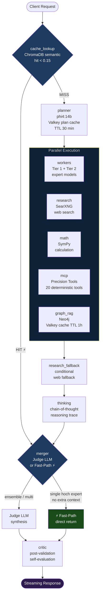
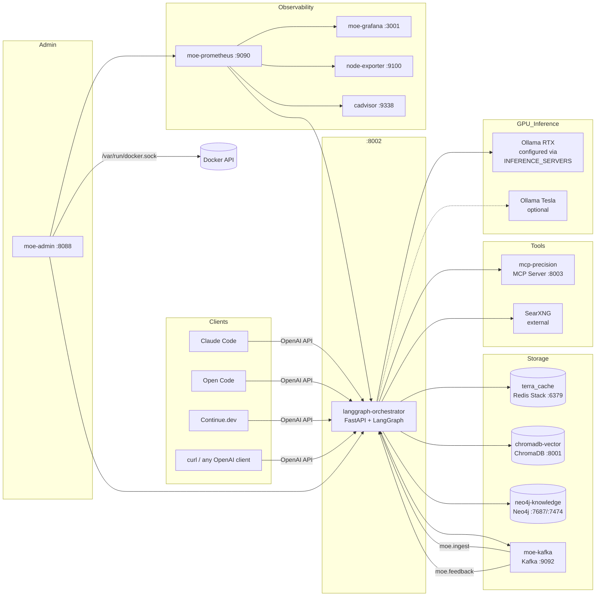
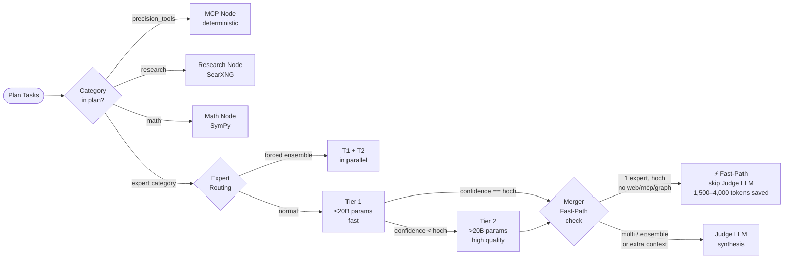

# MoE Sovereign — System Architecture

## Overview

MoE Sovereign is a LangGraph-based Mixture-of-Experts orchestrator. Each incoming query is decomposed by a planner LLM into typed tasks, routed to specialist models in parallel, enriched with knowledge graph context and optional web research, then synthesized by a judge LLM into a single coherent response.

All caching is multi-layered: semantic vector cache (ChromaDB), plan cache (Valkey), GraphRAG cache (Valkey), and performance-scored expert routing (Valkey). The API is fully OpenAI-compatible.

---

## LangGraph Pipeline



### Node Descriptions

| Node | Function | Key Logic |
|---|---|---|
| `cache_lookup` | ChromaDB semantic similarity | distance < 0.15 → hard hit; 0.15–0.50 → soft/few-shot examples |
| `planner` | Task decomposition (phi4:14b) | Produces `[{task, category, search_query?, mcp_tool?}]`; Valkey plan cache TTL=30 min |
| `workers` | Parallel expert execution | Two-tier routing; T1 (≤20B) first, T2 (>20B) only if T1 confidence < threshold |
| `research` | SearXNG web search | Single or multi-query deep search; always runs if `research` category in plan |
| `math` | SymPy calculation | Runs only if `math` category in plan AND no `precision_tools` task |
| `mcp` | MCP Precision Tools | 20 deterministic tools via HTTP; runs if `precision_tools` in plan |
| `graph_rag` | Neo4j knowledge graph | Entity + relation context; Valkey cache TTL=1h |
| `research_fallback` | Conditional extra search | Triggers if merger needs more context |
| `thinking` | Chain-of-thought reasoning | Generates `reasoning_trace`; activated by `force_think` modes |
| `merger` | Response synthesis (Judge LLM) | Fast-path bypasses Judge for single high-confidence experts |
| `critic` | Post-generation validation | Async self-evaluation; flags low-quality cache entries |

---

## Service Topology



### Kafka Topics

| Topic | Publisher | Consumer | Purpose |
|---|---|---|---|
| `moe.ingest` | orchestrator | orchestrator | GraphRAG entity ingestion from responses |
| `moe.requests` | orchestrator | orchestrator | Audit log (input, answer snippet, models used) |
| `moe.feedback` | orchestrator | orchestrator | User ratings → plan pattern learning & model scoring |

---

## Caching Architecture

```mermaid
graph TD
    Q([Query]) --> L1

    L1{L1: ChromaDB\nSemantic Cache\ncosine distance}
    L1 -->|< 0.15 hard hit| DONE([Return cached response])
    L1 -->|0.15–0.50 soft hit| FEW[Few-shot examples\nfor experts]
    L1 -->|> 0.50 miss| L2

    L2{L2: Valkey\nPlan Cache\nmoe:plan:sha256[:16]}
    L2 -->|TTL 30 min hit| SKIP_PLAN[Skip planner LLM\n~1,600 tokens saved]
    L2 -->|miss| PLAN_LLM[Planner LLM call]
    PLAN_LLM -->|write-back| L2

    SKIP_PLAN --> L3

    L3{L3: Valkey\nGraphRAG Cache\nmoe:graph:sha256[:16]}
    L3 -->|TTL 1h hit| SKIP_NEO4J[Skip Neo4j query\n1–3s saved]
    L3 -->|miss| NEO4J_Q[Neo4j query]
    NEO4J_Q -->|write-back| L3

    SKIP_NEO4J --> L4

    L4{L4: Valkey\nPerformance Scores\nmoe:perf:model:category}
    L4 -->|Laplace-smoothed\nscore ≥ 0.3| TIER1[Prefer high-scoring\nT1 model]
    L4 -->|score < 0.3| TIER2[Fallback to T2]

    style L1 fill:#1e3a5f,color:#fff
    style L2 fill:#3a1e5f,color:#fff
    style L3 fill:#1e5f3a,color:#fff
    style L4 fill:#5f3a1e,color:#fff
    style DONE fill:#1a4a1a,color:#fff
```

### Cache Key Reference

| Cache | Key Pattern | TTL | Storage |
|---|---|---|---|
| Semantic cache | ChromaDB collection `moe_fact_cache` | permanent (flagged if bad) | ChromaDB |
| Plan cache | `moe:plan:{sha256(query[:300])[:16]}` | 30 min | Valkey |
| GraphRAG cache | `moe:graph:{sha256(query[:200]+categories)[:16]}` | 1 h | Valkey |
| Perf scores | `moe:perf:{model}:{category}` | permanent | Valkey Hash |
| Response metadata | `moe:response:{response_id}` | 7 days | Valkey Hash |
| Planner patterns | `moe:planner_success` (sorted set) | 180 days | Valkey ZSet |
| Ontology gaps | `moe:ontology_gaps` (sorted set) | 90 days | Valkey ZSet |

---

## Expert Routing



### Expert Categories

| Category | Planner Trigger Keywords | Tier Preference |
|---|---|---|
| `general` | General knowledge questions, definitions, explanations | T1 |
| `math` | Calculation, equation, formula, statistics | T1 |
| `technical_support` | IT, server, Docker, network, debugging, DevOps | T1 |
| `creative_writer` | Writing, creativity, storytelling, marketing | T1 |
| `code_reviewer` | Code, programming, review, security, refactoring | T1 |
| `medical_consult` | Medicine, symptoms, diagnosis, medication | T1 |
| `legal_advisor` | Law, statute, BGB, StGB, contract, judgments | T1 |
| `translation` | Translate, language, translation | T1 |
| `reasoning` | Analysis, logic, complex argumentation, strategy | T2 |
| `vision` | Image, screenshot, document, photo, recognition | T2 |
| `data_analyst` | Data, CSV, table, visualization, pandas | T1 |
| `science` | Chemistry, biology, physics, environment, research | T1 |

---

## AgentState

The LangGraph state object passed through all nodes:

| Field | Type | Description |
|---|---|---|
| `input` | `str` | Original user query (after skill resolution) |
| `response_id` | `str` | UUID for feedback tracking |
| `mode` | `str` | Active mode: `default`, `code`, `concise`, `agent`, `agent_orchestrated`, `research`, `report`, `plan` |
| `system_prompt` | `str` | Client system prompt (e.g., file context from Claude Code) |
| `plan` | `List[Dict]` | `[{task, category, search_query?, mcp_tool?, mcp_args?}]` |
| `expert_results` | `List[str]` | Accumulated expert outputs (reducers: `operator.add`) |
| `expert_models_used` | `List[str]` | `["model::category", ...]` for metrics |
| `web_research` | `str` | SearXNG results with inline citations |
| `cached_facts` | `str` | ChromaDB hard cache hit content |
| `cache_hit` | `bool` | True if hard cache hit — skips most nodes |
| `math_result` | `str` | SymPy output |
| `mcp_result` | `str` | MCP precision tool output |
| `graph_context` | `str` | Neo4j entity + relation context |
| `final_response` | `str` | Synthesized answer from merger |
| `prompt_tokens` | `int` | Cumulative across all nodes (reducer: `operator.add`) |
| `completion_tokens` | `int` | Cumulative across all nodes |
| `chat_history` | `List[Dict]` | Compressed conversation turns |
| `reasoning_trace` | `str` | Chain-of-thought from `thinking_node` |
| `soft_cache_examples` | `str` | Few-shot examples from soft cache |
| `images` | `List[Dict]` | Extracted image blocks for vision expert |

---

## Configuration Reference

### Core

| Variable | Default | Description |
|---|---|---|
| `URL_RTX` | — | Ollama base URL for primary GPU (e.g., `http://192.168.1.10:11434/v1`) |
| `URL_TESLA` | — | Ollama base URL for secondary GPU (optional) |
| `INFERENCE_SERVERS` | `""` | JSON array of server configs (overrides URL_RTX/URL_TESLA) |
| `JUDGE_ENDPOINT` | `RTX` | Which server runs the judge/merger LLM |
| `PLANNER_MODEL` | `phi4:14b` | Model for task decomposition |
| `PLANNER_ENDPOINT` | `RTX` | Which server runs the planner |
| `EXPERT_MODELS` | `{}` | JSON: expert category → model list (set via Admin UI) |
| `MCP_URL` | `http://mcp-precision:8003` | MCP precision tools server |
| `SEARXNG_URL` | — | SearXNG instance for web research |

### Caching & Thresholds

| Variable | Default | Description |
|---|---|---|
| `CACHE_HIT_THRESHOLD` | `0.15` | ChromaDB cosine distance for hard cache hit |
| `SOFT_CACHE_THRESHOLD` | `0.50` | Distance threshold for few-shot examples |
| `SOFT_CACHE_MAX_EXAMPLES` | `2` | Max few-shot examples per query |
| `CACHE_MIN_RESPONSE_LEN` | `150` | Min chars to store a response in cache |
| `MAX_EXPERT_OUTPUT_CHARS` | `2400` | Max chars per expert output (~600 tokens) |

### Expert Routing

| Variable | Default | Description |
|---|---|---|
| `EXPERT_TIER_BOUNDARY_B` | `20` | GB parameter threshold for Tier 1 vs Tier 2 |
| `EXPERT_MIN_SCORE` | `0.3` | Laplace score threshold to consider a model |
| `EXPERT_MIN_DATAPOINTS` | `5` | Minimum feedback points before score is used |

### History & Timeouts

| Variable | Default | Description |
|---|---|---|
| `HISTORY_MAX_TURNS` | `4` | Conversation turns to include |
| `HISTORY_MAX_CHARS` | `3000` | Max total history chars |
| `JUDGE_TIMEOUT` | `900` | Merger/judge LLM timeout (seconds) |
| `EXPERT_TIMEOUT` | `900` | Expert model timeout (seconds) |
| `PLANNER_TIMEOUT` | `300` | Planner timeout (seconds) |

### Claude Code Integration

| Variable | Default | Description |
|---|---|---|
| `CLAUDE_CODE_PROFILES` | `[]` | JSON array of integration profiles (set via Admin UI) |
| `CLAUDE_CODE_MODELS` | (8 claude-* model IDs) | Comma-separated Anthropic model IDs to route through MoE |
| `TOOL_MAX_TOKENS` | `8192` | Max tokens for tool-use responses |
| `REASONING_MAX_TOKENS` | `16384` | Max tokens for extended thinking |

### Infrastructure

| Variable | Default | Description |
|---|---|---|
| `REDIS_URL` | `redis://terra_cache:6379` | Redis connection |
| `NEO4J_URI` | `bolt://neo4j-knowledge:7687` | Neo4j Bolt endpoint |
| `NEO4J_USER` | `neo4j` | Neo4j username |
| `NEO4J_PASS` | `moe-sovereign` | Neo4j password |
| `KAFKA_URL` | `kafka://moe-kafka:9092` | Kafka broker |

---

## API Endpoints

### Orchestrator (`:8002`)

| Method | Path | Description |
|---|---|---|
| `POST` | `/v1/chat/completions` | Main chat endpoint (OpenAI-compatible, streaming) |
| `POST` | `/v1/messages` | Anthropic Messages API format |
| `GET` | `/v1/models` | List all modes as model IDs |
| `POST` | `/v1/feedback` | Submit rating (1–5) for a response |
| `GET` | `/v1/provider-status` | Rate-limit status for Claude Code |
| `GET` | `/metrics` | Prometheus metrics scrape |
| `GET` | `/graph/stats` | Neo4j entity/relation counts |
| `GET` | `/graph/search?q=term` | Semantic search in knowledge graph |
| `GET` | `/v1/admin/ontology-gaps` | Unknown terms found in queries |
| `GET` | `/v1/admin/planner-patterns` | Learned expert-combination patterns |

### Admin UI (`:8088`)

| Path | Description |
|---|---|
| `/` | Dashboard — system overview |
| `/profiles` | Claude Code integration profiles |
| `/skills` | Skill management (CRUD + upstream sync) |
| `/servers` | Inference server health & model list |
| `/mcp-tools` | MCP tool enable/disable |
| `/monitoring` | Prometheus/Grafana integration |
| `/tool-eval` | Tool invocation logs |

---

## Performance Optimizations

| Optimization | Savings | Condition |
|---|---|---|
| ChromaDB hard cache | Full pipeline skip | Cosine distance < 0.15 |
| Valkey plan cache (TTL 30 min) | ~1,600 tokens, 2–5 s | Same query within 30 min |
| Valkey GraphRAG cache (TTL 1 h) | 1–3 s, Neo4j query | Same query+categories within 1 h |
| Merger Fast-Path | ~1,500–4,000 tokens, 3–8 s | 1 expert + `hoch` + no extra context |
| Query normalization | +20–30% cache hit rate | Lowercase + strip punctuation before lookup |
| History compression | ~600–1,800 tokens | History > 2,000 chars → old turns → `[…]` |
| Two-tier routing | T2 LLM call skipped | T1 expert returns `hoch` confidence |
| VRAM unload after inference | VRAM freed for judge | Async `keep_alive=0` after each expert |
| Soft cache few-shot | Better accuracy without hit | Distance 0.15–0.50 → in-context examples |
| Feedback-driven scoring | Optimal model selection | Laplace score from user feedback |
