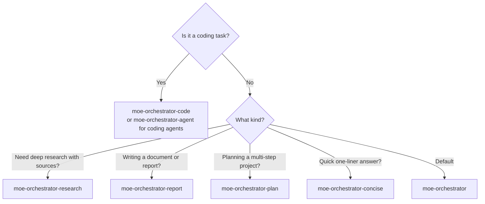

# MoE Sovereign — User Guide

```
  ███╗   ███╗ ██████╗ ███████╗    ███████╗ ██████╗ ██╗   ██╗███████╗██████╗ ███████╗██╗ ██████╗ ███╗   ██╗
  ████╗ ████║██╔═══██╗██╔════╝    ██╔════╝██╔═══██╗██║   ██║██╔════╝██╔══██╗██╔════╝██║██╔════╝ ████╗  ██║
  ██╔████╔██║██║   ██║█████╗      ███████╗██║   ██║██║   ██║█████╗  ██████╔╝█████╗  ██║██║  ███╗██╔██╗ ██║
  ██║╚██╔╝██║██║   ██║██╔══╝      ╚════██║██║   ██║╚██╗ ██╔╝██╔══╝  ██╔══██╗██╔══╝  ██║██║   ██║██║╚██╗██║
  ██║ ╚═╝ ██║╚██████╔╝███████╗    ███████║╚██████╔╝ ╚████╔╝ ███████╗██║  ██║███████╗██║╚██████╔╝██║ ╚████║
  ╚═╝     ╚═╝ ╚═════╝ ╚══════╝    ╚══════╝ ╚═════╝   ╚═══╝  ╚══════╝╚═╝  ╚═╝╚══════╝╚═╝ ╚═════╝ ╚═╝  ╚═══╝
```

Self-hosted • OpenAI-compatible • 12 specialist experts • GraphRAG • Vision • Skills

---

## Quick Start

### Claude Code

```bash
# Option A — per-session flag
claude --model moe-orchestrator \
       --api-key any \
       --base-url http://localhost:8002/v1

# Option B — persistent config in ~/.claude/settings.json
{
  "env": {
    "ANTHROPIC_BASE_URL": "http://localhost:8002/v1",
    "ANTHROPIC_API_KEY": "any-string"
  }
}
```

### OpenAI-compatible clients (Continue.dev, Open Code, curl)

```bash
# Chat completion (streaming)
curl -s http://localhost:8002/v1/chat/completions \
  -H "Content-Type: application/json" \
  -d '{
    "model": "moe-orchestrator",
    "stream": true,
    "messages": [{"role": "user", "content": "Erkläre mir Transformer-Architekturen."}]
  }'

# List available model IDs
curl -s http://localhost:8002/v1/models | jq '.data[].id'
```

---

## Modes

Select a mode by setting the `model` field. Each mode is optimized for a different workflow.

| Model ID | Mode | Best for | Output format |
|---|---|---|---|
| `moe-orchestrator` | `default` | General questions, explanations, analysis | Full answer with KONFIDENZ block |
| `moe-orchestrator-code` | `code` | Code generation, no prose | Code only, `# KONFIDENZ:` first line |
| `moe-orchestrator-concise` | `concise` | Quick answers, mobile, tight context | ≤ 120 words |
| `moe-orchestrator-agent` | `agent` | Continue.dev, Open Code — coding workflows | Clean Markdown, no confidence block |
| `moe-orchestrator-agent-orchestrated` | `agent_orchestrated` | Claude Code — maximum quality | Full pipeline + reasoning, clean output |
| `moe-orchestrator-research` | `research` | Deep-dive topics, citations needed | Structured research report with sources |
| `moe-orchestrator-report` | `report` | Professional documents, decision support | Full Markdown report with Executive Summary |
| `moe-orchestrator-plan` | `plan` | Multi-step planning, project breakdowns | Full pipeline, planning structure |

### Choosing a mode



---

## Expert Categories

The planner routes your query to one or more of these 12 specialists automatically. You don't need to select them manually.

| Category | Specialization | Example prompts |
|---|---|---|
| `general` | Facts, definitions, explanations across domains | "Was ist Quantenverschränkung?" / "Erkläre Docker Volumes." |
| `math` | Mathematics, physics formulas, LaTeX output | "Leite die Ableitung von sin(x²) her." / "Löse 3x² + 5x - 2 = 0" |
| `technical_support` | IT, DevOps, networking, debugging, servers | "Mein Nginx gibt 502 zurück — was prüfe ich zuerst?" |
| `code_reviewer` | Code review, security audit, refactoring | "Review this Python function for security issues." |
| `creative_writer` | Creative writing, storytelling, marketing copy | "Schreibe einen Blogpost-Einstieg über KI-Sicherheit." |
| `medical_consult` | Medical information (with disclaimer) | "Was sind Symptome einer Schilddrüsenunterfunktion?" |
| `legal_advisor` | German law: BGB, StGB, GG, HGB, EU-Recht | "Was regelt §433 BGB?" / "Kündigungsfristen nach TzBfG" |
| `translation` | Professional multi-language translation | "Übersetze diesen Text ins Englische, formell." |
| `reasoning` | Complex analysis, logical chains, strategy | "Analysiere die Vor- und Nachteile von Microservices." |
| `vision` | Image, screenshot, document analysis | *(send image in message content)* |
| `data_analyst` | Statistics, data analysis, pandas/numpy code | "Schreibe pandas-Code für Pivot-Analyse dieser CSV." |
| `science` | Chemistry, biology, physics, environmental | "Wie funktioniert CRISPR-Cas9 auf molekularer Ebene?" |

> **Multi-expert queries:** "Schreibe ein Python-Skript, das Rechtsfragen analysiert und dokumentiert" — the planner routes to `code_reviewer`, `legal_advisor`, and `creative_writer` simultaneously.

---

## Skills System

Skills are Markdown files with YAML frontmatter. When you call `/skill-name [arguments]`, the server resolves the skill before it enters the pipeline — this works with **any client** (Claude Code, Continue.dev, Open Code, curl).

### Calling a skill

```
/commit -m "Fix authentication bug"
/review-pr 123
/pdf summarize this document
```

### Skill file format

Skills live in `~/.claude/commands/` (mounted into the container at `/app/skills`):

```markdown
---
name: commit
description: Create a well-formatted git commit
---

Create a git commit with this message: $ARGUMENTS

Follow conventional commits format. Include a concise subject line
and a body explaining the "why", not just the "what".
```

- `$ARGUMENTS` is replaced with everything after `/skill-name `
- A skill without `$ARGUMENTS` ignores any arguments
- Disable a skill: rename `skill.md` → `skill.md.disabled`

### Upstream skills (Anthropic)

The `skills-upstream/` directory contains a clone of `anthropics/skills`. Sync and import via:

- **Admin UI → Skills → Upstream (Anthropic)** — browse, pull updates, import individual skills
- Or via API: `POST /api/skills/upstream/pull` then `POST /api/skills/upstream/import/{name}`

### Available upstream skills (examples)

`pdf`, `docx`, `xlsx`, `pptx`, `claude-api`, `webapp-testing`, `frontend-design`, and more.

---

## Vision & Multimodal

Send images as base64-encoded content blocks in the OpenAI messages format:

```json
{
  "model": "moe-orchestrator",
  "messages": [{
    "role": "user",
    "content": [
      {
        "type": "image_url",
        "image_url": {
          "url": "data:image/png;base64,<BASE64_DATA>"
        }
      },
      {
        "type": "text",
        "text": "Was zeigt dieses Diagramm?"
      }
    ]
  }]
}
```

Claude Code sends images automatically when you paste or attach them.

**What happens internally:**
1. The API layer extracts image blocks → `AgentState.images`
2. The planner detects the `[BILD-EINGABE: N Bild(er)]` annotation and routes to `vision` category
3. The vision expert receives the full multimodal message (text + images)
4. Models used: `llama3.2-vision:11b` (T1), `llava:34b` (T2), or configured models

**Supported content:** screenshots, diagrams, charts, photos, scanned documents, UI mockups.

---

## KONFIDENZ System

Most responses include a structured confidence block:

```
KERNAUSSAGE: [one-line summary]
KONFIDENZ: hoch
DETAILS:
[full answer here]
```

### Confidence levels

| Level | Meaning | What to do |
|---|---|---|
| `hoch` | Expert answered with high certainty; factual, cross-validated | Trust and use directly |
| `mittel` | Reasonable answer but some uncertainty; may need verification | Verify important details |
| `niedrig` | Low confidence, especially in safety-critical categories | Consult a professional; treat as starting point only |

### Per-mode format

| Mode | Format |
|---|---|
| `default`, `research`, `report`, `plan` | Full `KERNAUSSAGE / KONFIDENZ / DETAILS` block |
| `code` | First-line comment: `# KONFIDENZ: hoch` |
| `concise` | Inline prefix: `KONFIDENZ: hoch — [answer]` |
| `agent`, `agent_orchestrated` | No confidence block (clean output for coding agents) |

### Submit feedback

Help the system learn which models perform best:

```bash
curl -X POST http://localhost:8002/v1/feedback \
  -H "Content-Type: application/json" \
  -d '{"response_id": "<id-from-response>", "rating": 5}'
```

Ratings 4–5 are positive, 1–2 are negative. After 5 feedback points per model/category pair, the routing algorithm uses Laplace-smoothed scores to prefer better-performing models.

---

## Best Practices

### Choose the right mode

| Task | Recommended mode |
|---|---|
| Explain a concept | `moe-orchestrator` |
| Write or review code | `moe-orchestrator-code` |
| Quick factual lookup | `moe-orchestrator-concise` |
| Research a topic with sources | `moe-orchestrator-research` |
| Write a business document | `moe-orchestrator-report` |
| Plan a project or architecture | `moe-orchestrator-plan` |
| Integrate with Claude Code | `moe-orchestrator-agent-orchestrated` |
| Integrate with Open Code / Continue.dev | `moe-orchestrator-agent` |

### Use skills for repetitive workflows

Instead of re-typing the same prompt pattern, create a skill:

```markdown
---
name: explain-code
description: Explain a code block in simple terms
---
Explain the following code in simple, clear German. Describe what it does,
why it does it, and any potential issues:

$ARGUMENTS
```

Then just: `/explain-code def foo(x): return x * 2`

### Give feedback

Every `niedrig` confidence response you rate with 1–2 trains the routing to prefer better models for that category. Every `hoch` response you rate 5 reinforces the winner. After ~20 ratings per category, the system self-optimizes.

### Use research mode for current events

`moe-orchestrator-research` runs multiple SearXNG queries in parallel and structures the result as a citable research report. Better than asking a single model about topics after its training cutoff.

### Avoid overloading the context window

- The `concise` mode limits answers to ~120 words — useful for in-editor tooltips
- History is automatically compressed (older turns → `[…]`) after 3,000 chars
- For long documents, use the `pdf` or `docx` skill from upstream

### Configure models without rebuilding

All expert models, system prompts, and Claude Code profiles can be changed live via **Admin UI → Servers / Skills / Profiles**. Changes take effect immediately (loaded from `.env` volume on each request) — no container rebuild required.

---

## Admin UI (Port 8088)

Open `http://localhost:8088` in your browser.

| Page | Path | What you can do |
|---|---|---|
| **Dashboard** | `/` | System health, service status, recent activity |
| **Profiles** | `/profiles` | Create/edit/activate Claude Code integration profiles |
| **Skills** | `/skills` | CRUD for custom skills + upstream Anthropic skills sync |
| **Servers** | `/servers` | Check Ollama server health, list available models |
| **MCP Tools** | `/mcp-tools` | Enable/disable individual precision tools |
| **Monitoring** | `/monitoring` | Grafana + Prometheus metrics overview |
| **Tool Eval** | `/tool-eval` | Log of all MCP tool invocations |

### Integration Profiles

A profile bundles all Claude Code settings into one named configuration:

| Field | Description |
|---|---|
| `name` | Display name (e.g., "Coding Heavy", "Fast & Concise") |
| `tool_model` | Model for tool-use calls (default: `devstral:24b`) |
| `reasoning_model` | Model for extended thinking (optional) |
| `moe_mode` | Default mode: `agent_orchestrated`, `agent`, `default`, ... |
| `tool_max_tokens` | Max tokens for tool responses (default: 8192) |
| `reasoning_max_tokens` | Max tokens for reasoning (default: 16384) |

Activate a profile in Admin UI → it writes to `.env` and takes effect on the next request.

---

## MCP Precision Tools

The MCP server (`http://localhost:8003`) provides 20 deterministic tools for computations where LLMs are unreliable. The planner routes `precision_tools` tasks here automatically.

| Tool | Description | Example input |
|---|---|---|
| `calculate` | Safe math expressions (AST eval + SymPy fallback) | `"sqrt(2) * pi"` |
| `solve_equation` | Algebraic equation solving | `"x**2 - 4 = 0"`, var=`"x"` |
| `date_diff` | Days between two dates | `"2024-01-01"`, `"2025-04-01"` |
| `date_add` | Add/subtract days from a date | date=`"2025-01-01"`, days=`90` |
| `day_of_week` | Weekday from date | `"2026-04-01"` → `"Wednesday"` |
| `unit_convert` | Unit conversion | value=`100`, from=`"km"`, to=`"miles"` |
| `statistics_calc` | Mean, median, stdev, variance, percentiles | data=`[1,2,3,4,5]`, op=`"mean"` |
| `hash_text` | MD5 / SHA256 / SHA512 | text=`"hello"`, alg=`"sha256"` |
| `base64_codec` | Encode / decode Base64 | data=`"hello"`, mode=`"encode"` |
| `regex_extract` | Pattern matching & extraction | text=`"IP: 192.168.1.1"`, pattern=`"\d+\.\d+\.\d+\.\d+"` |
| `subnet_calc` | IP/CIDR network analysis | cidr=`"192.168.1.0/24"` |
| `text_analyze` | Word count, char count, sentence count | text=`"..."` |
| `prime_factorize` | Prime factorization | number=`360` |
| `gcd_lcm` | GCD and LCM of two integers | a=`48`, b=`18` |
| `json_query` | JSON path extraction | json=`"..."`, path=`"$.users[0].name"` |
| `roman_numeral` | Arabic ↔ Roman numeral conversion | input=`"2024"`, dir=`"to_roman"` |
| `legal_search_laws` | Find German laws by keyword | keyword=`"Kündigung"` |
| `legal_get_law_overview` | List sections of a law | law=`"BGB"` |
| `legal_get_paragraph` | Exact text of a paragraph | law=`"BGB"`, paragraph=`"433"` |
| `legal_fulltext_search` | Full-text search within a law | law=`"StGB"`, query=`"Betrug"` |

---

## Monitoring

### Key Prometheus metrics

| Metric | Labels | Description |
|---|---|---|
| `moe_tokens_total` | `model`, `token_type`, `node` | Cumulative token usage per model/node |
| `moe_expert_calls_total` | `model`, `category`, `node` | Expert invocation count |
| `moe_confidence_total` | `level`, `category` | Confidence distribution per category |
| `moe_cache_hits_total` | `type` | Cache hit count (`hard`, `soft`) |
| `moe_cache_misses_total` | — | Cache miss count |

### Grafana dashboards

Open `http://localhost:3001` (admin / configured password).

Default dashboard: **MoE Operations** — includes cache hit rate, token spend per node, expert call distribution, confidence levels over time, response latency percentiles.

### Useful Prometheus queries

```promql
# Cache hit rate (last 1h)
rate(moe_cache_hits_total[1h]) / (rate(moe_cache_hits_total[1h]) + rate(moe_cache_misses_total[1h]))

# Token spend per model (last 24h)
sum by (model) (increase(moe_tokens_total[24h]))

# Expert calls by category (last 1h)
sum by (category) (rate(moe_expert_calls_total[1h]))

# Confidence distribution
sum by (level) (moe_confidence_total)
```

---

## Troubleshooting

### Response is slow on the first call

The first call warms up the model in Ollama VRAM. Subsequent calls within the keep-alive window are fast. Check which models are loaded: `curl http://<ollama-host>:11434/api/ps`

### "niedrig" confidence on every response

Either:
- The assigned model is too small for the category → configure a larger model in Admin UI → Servers
- No feedback has been given yet → rate responses with 4–5 for the good ones so the scorer learns

### Skills not resolving

- Check the skill file exists: `ls ~/.claude/commands/skill-name.md`
- Check it doesn't end in `.disabled`
- The skill must start with `---` (YAML frontmatter) or just have content directly

### Cache returns outdated answers

Flag the response via feedback (rating 1–2). The orchestrator automatically marks flagged cache entries and skips them on future queries.

### Vision queries don't work

- Confirm a vision model is configured in Admin UI (e.g., `llama3.2-vision:11b`)
- Images must be sent as `image_url` with `data:image/...;base64,...` URL
- Check logs: `sudo docker logs langgraph-orchestrator | grep vision`
