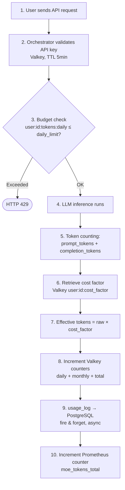

# Token Budget & Costs

The budget system controls token usage per user and calculates the resulting costs based on a configurable token price.

## Budget Configuration in Admin Backend

### Assignment Workflow

1. **Admin opens User Edit** → Tab **Budget**
2. **Set limits** (all optional, empty = unlimited):
   - Daily limit (tokens/day, reset daily at midnight UTC)
   - Monthly limit (tokens/month, reset on the 1st of the month UTC)
   - Total limit (cumulative, no automatic reset)
3. **Select budget type**:
   - `Subscription`: Daily and monthly limits are automatically reset
   - `One-time`: Only `total_limit` is relevant, no reset
4. **Save budget** → writes to PostgreSQL + syncs Valkey

### Budget Types

| Type | Reset | Recommended Limits |
|------|-------|-------------------|
| `subscription` | Daily + Monthly | `daily_limit` + `monthly_limit` |
| `onetime` | No reset | Only `total_limit` |

## Token Counting

### What is counted?

Every API request counts both **prompt tokens** (input) and **completion tokens** (output):

```
total_tokens = prompt_tokens + completion_tokens
```

### Cost Factor

A **cost factor** can be applied to the actual token usage:

```
effective_tokens = round(total_tokens × cost_factor)
```

| Source | Field | Default |
|--------|-------|---------|
| User template | `cost_factor` (REAL) | `1.0` |
| Inference server | `cost_factor` (REAL) | `1.0` |

The cost factor is derived from the user's active expert template and/or the inference server used, and cached in Valkey for 24 hours:

```
user:{user_id}:cost_factor  →  STRING  "1.5"   TTL 86400s
```

**Example:**

| Raw Tokens | Cost Factor | Effective Tokens |
|-----------|-------------|-----------------|
| 1,000 | 1.0 | 1,000 |
| 1,000 | 1.5 | 1,500 |
| 1,000 | 0.8 | 800 |

### Valkey Counters (Real-Time)

All budget counters run in Valkey for minimal latency:

```
user:{id}:tokens:daily:{YYYY-MM-DD}    →  INCRBY  TTL 48h
user:{id}:tokens:monthly:{YYYY-MM}    →  INCRBY  TTL 35d
user:{id}:tokens:total                →  INCRBY
```

Budget exceeded is detected **on the next API request**. The request is rejected with HTTP 429.

## Cost Calculation (EUR)

### Configuring Token Price

The global token price is set in the Admin Dashboard under **Token Price**:

```
Admin Dashboard → "Token Price (EUR per token)" → Save
```

Default: `0.00002 EUR` per token (= €0.02 per 1,000 tokens).

The value is stored in the `.env` file as `TOKEN_PRICE_EUR`.

### Cost Formula

```
cost_eur = effective_tokens × TOKEN_PRICE_EUR
         = (raw_tokens × cost_factor) × TOKEN_PRICE_EUR
```

**Example** (default configuration):

| Tokens | Cost Factor | Effective | Price/Token | Cost |
|--------|-------------|---------|-------------|------|
| 10,000 | 1.0 | 10,000 | €0.00002 | €0.20 |
| 10,000 | 1.5 | 15,000 | €0.00002 | €0.30 |
| 50,000 | 1.0 | 50,000 | €0.00002 | €1.00 |

### Where is the price shown?

- **Admin → User Edit → Tab Budget**: Current usage with `≈ €X.XX` below each counter
- **User Portal → Billing**: Full breakdown by period and model
- **User Portal → Dashboard**: Compact budget cards with percentage display

## Budget Alerts

Users can configure automatic email notifications when their budget is nearly exhausted.

### Configuration (by user in the portal)

| Field | Description | Default |
|-------|-------------|---------|
| Alert enabled | On/Off toggle | Off |
| Threshold | At what % to warn | 80% |
| Email address | Recipient (default: account email) | – |

### Behavior

- Background task runs **hourly**
- Checks: was the threshold exceeded in any period?
- Max. **1 alert per user per 24 hours** (rate limiting via `last_alert_sent_at`)
- Period coverage: Daily AND Monthly AND Total

### Alert Email Content

```
Subject: Budget Warning: Daily limit 85% exhausted

Your daily token budget is 85% exhausted.
Usage: 85,000 / 100,000 tokens
Remaining: 15,000 tokens
Reset: in 6 hours
```

## Usage Log

Every API request is logged in the PostgreSQL database:

```sql
CREATE TABLE usage_log (
    id                TEXT PRIMARY KEY,
    user_id           TEXT NOT NULL,
    api_key_id        TEXT,
    request_id        TEXT NOT NULL,
    model             TEXT NOT NULL,
    moe_mode          TEXT NOT NULL,
    prompt_tokens     INTEGER DEFAULT 0,
    completion_tokens INTEGER DEFAULT 0,
    total_tokens      INTEGER DEFAULT 0,
    status            TEXT DEFAULT 'ok',  -- 'ok' or error code
    requested_at      TEXT NOT NULL,       -- ISO-8601 UTC
    notes             TEXT                 -- user-editable note
);
```

### Usage Query (Admin)

```
GET /api/users/{user_id}/usage?days=30
```

Returns JSON with all entries from the last N days, including key label and key prefix.

## Budget Headers in API Responses

Every `/v1/chat/completions` response for an authenticated (non-anonymous) user includes budget information as HTTP response headers — no extra API call needed:

| Header | Value | Example |
|--------|-------|---------|
| `X-MoE-Budget-Daily-Used` | Tokens consumed today | `142350` |
| `X-MoE-Budget-Daily-Limit` | Daily token limit (omitted if unlimited) | `500000` |

These headers are appended after the LLM call completes, so the values reflect the state **before** the current request's tokens are added (Valkey increment is fire-and-forget, race-condition-free for display purposes).

**Usage example (curl):**
```bash
curl -s -D - -o /dev/null \
  -H "Authorization: Bearer moe-sk-..." \
  -H "Content-Type: application/json" \
  -d '{"model":"moe-default","messages":[{"role":"user","content":"Hi"}]}' \
  http://localhost:8002/v1/chat/completions \
  | grep -i x-moe-budget
# X-MoE-Budget-Daily-Used: 142350
# X-MoE-Budget-Daily-Limit: 500000
```

---

## Summary: Life of a Token


