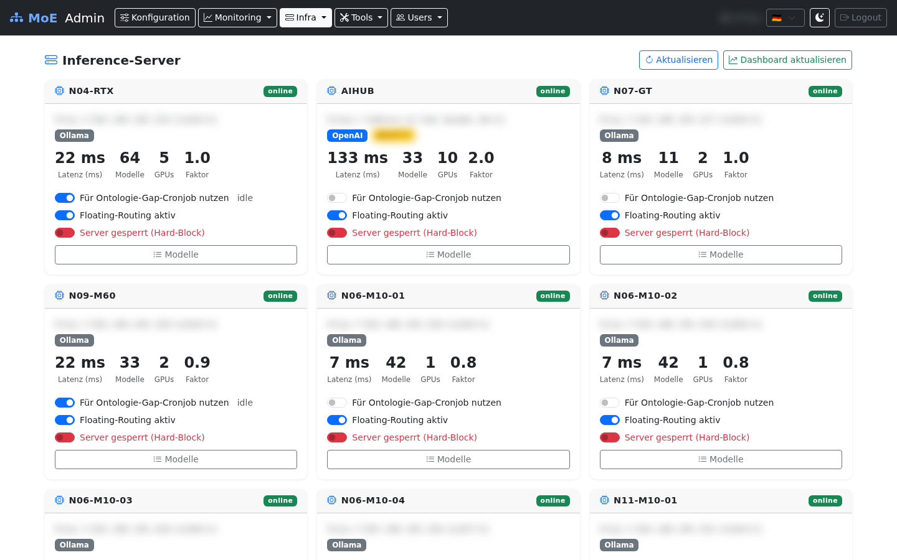
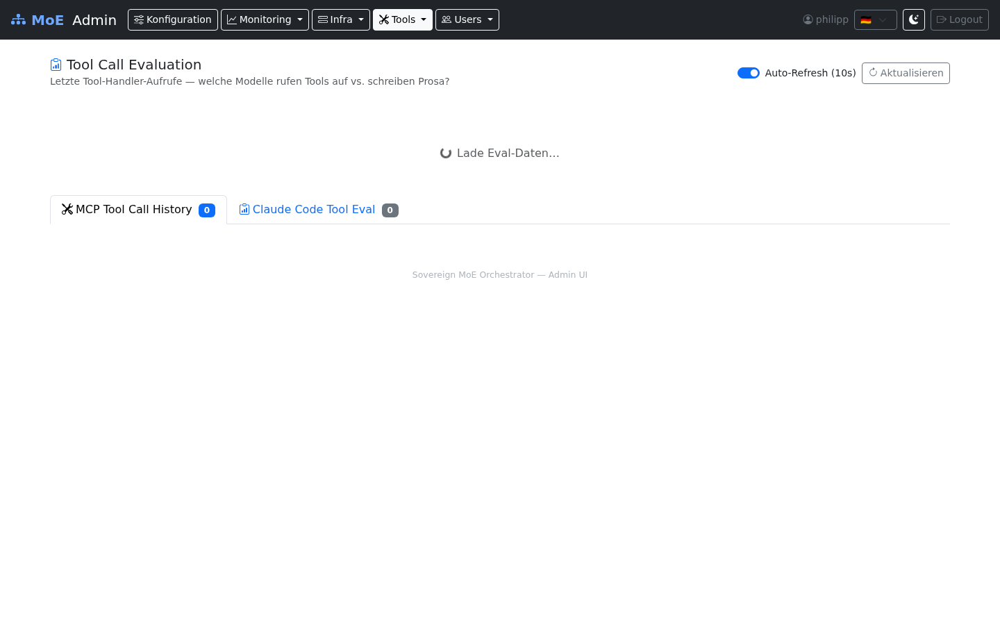

# Admin Backend – Overview

The Admin Backend (`http://localhost:8088`) is the central control panel for the Sovereign MoE cluster. It is accessible to administrators only.

## Login

Administrators can authenticate via local credentials or via SSO (Authentik). The login form supports CSRF protection.

## Dashboard

## Navigation

The navbar groups all sections into dropdown menus, visible from ≥992 px screen width.
On smaller screens a hamburger menu opens the full offcanvas sidebar.

### Direct links

| Menu Item | Path | Function |
|-----------|------|---------|
| Config | `/` | System configuration, container status |

### Monitoring (dropdown)

| Menu Item | Path | Function |
|-----------|------|---------|
| Monitoring | `/monitoring` | Prometheus metrics, server status |
| Live Monitoring | `/live-monitoring` | Active processes, process kill, LLM instances |
| Starfleet | `/starfleet` | Ambient intelligence dashboard, node health, alerts |
| Pipeline Log | `/pipeline-log` | Per-request routing decisions, filters, CSV export |
| Statistics | `/statistics` | Token and cost statistics |
| Benchmarks | `/benchmarks` | GAIA / LongMemEval benchmark runs |

### Infra (dropdown)

| Menu Item | Path | Function |
|-----------|------|---------|
| Servers | `/servers` | Configure inference servers |
| Knowledge | `/knowledge` | Neo4j knowledge graph management |
| Federation | `/federation` | Multi-tenant cluster federation |
| Quarantine | `/quarantine` | Blocked content review |
| Maintenance | `/maintenance` | System maintenance tasks |

### Enterprise Stack (dropdown)

These pages integrate the optional Enterprise Stack (Marquez · lakeFS · NiFi).
They appear when the stack is reachable and surface a Foundry-equivalent
catalog/approval/explorer/notebook workflow without leaving the admin UI.

| Menu Item | Path | Function |
|-----------|------|---------|
| Enterprise Dashboard | `/enterprise` | Lineage runs, lakeFS commits, NiFi ETL submissions, drift events |
| Data Catalog | `/catalog` | Cross-source dataset browser (Marquez · Neo4j domains · lakeFS repos) |
| Knowledge Approvals | `/approval` | Review and approve/reject pending knowledge bundles staged on `pending/*` lakeFS branches |
| Object Explorer | `/explorer` | Read-only Cypher console with regex blacklist + Neo4j Browser deep-link |
| Notebook | `/notebook` | Embedded JupyterLite + copy-paste snippets for the orchestrator API |

### Tools (dropdown)

| Menu Item | Path | Function |
|-----------|------|---------|
| CC Profiles | `/profiles` | Claude Code profiles |
| Skills | `/skills` | Manage slash commands |
| MCP Tools | `/mcp-tools` | Enable/disable precision tools |
| Tool Eval | `/tool-eval` | Tool usage evaluation log |
| Templates | `/templates` | Manage expert configurations |

### Users (dropdown)

| Menu Item | Path | Function |
|-----------|------|---------|
| Users | `/users` | User CRUD, budgets, permissions, API keys |
| Teams | `/teams` | Team and tenant management |
| User Content | `/user-content` | All user templates and profiles |

## Dashboard – Global Configuration

The Admin Dashboard (`/`) allows changing system-wide settings. Changes are written to the `.env` file via `POST /save`.

### Configurable Fields

| Field | Env Variable | Meaning |
|-------|-------------|---------|
| Token Price | `TOKEN_PRICE_EUR` | EUR per token for cost calculation (default: `0.00002`) |
| Expert Models | `EXPERT_MODELS` | JSON array: model assignments per category |
| Inference Servers | `INFERENCE_SERVERS` | JSON array: server configurations |
| Claude Code URL | `CC_API_BASE` | Base URL for Claude Code API |
| Planner Model | `PLANNER_MODEL` | Global default planner LLM |
| Judge Model | `JUDGE_MODEL` | Global default judge LLM |
| SMTP | `SMTP_HOST` etc. | Email configuration for user notifications |

### Container Status

The dashboard shows the live status of these Docker containers:

- `langgraph-orchestrator`
- `moe-kafka`
- `neo4j-knowledge`
- `mcp-precision`
- `terra_cache` (Valkey)
- `chromadb-vector`

## Inference Servers

## Skills

## Tool Evaluation Log

## Cluster Impact

Every change made via the Admin Backend takes effect immediately:

| Action | Immediate Effect |
|--------|-----------------|
| Change token price | Applies immediately to all new requests |
| Change inference servers | New requests use the updated server list |
| Toggle profile | Orchestrator is restarted |
| Suspend user | Valkey cache is immediately invalidated |
| Revoke permission | Next API request from the user will be rejected |
| Set budget | Valkey counter is validated against the new limit |
