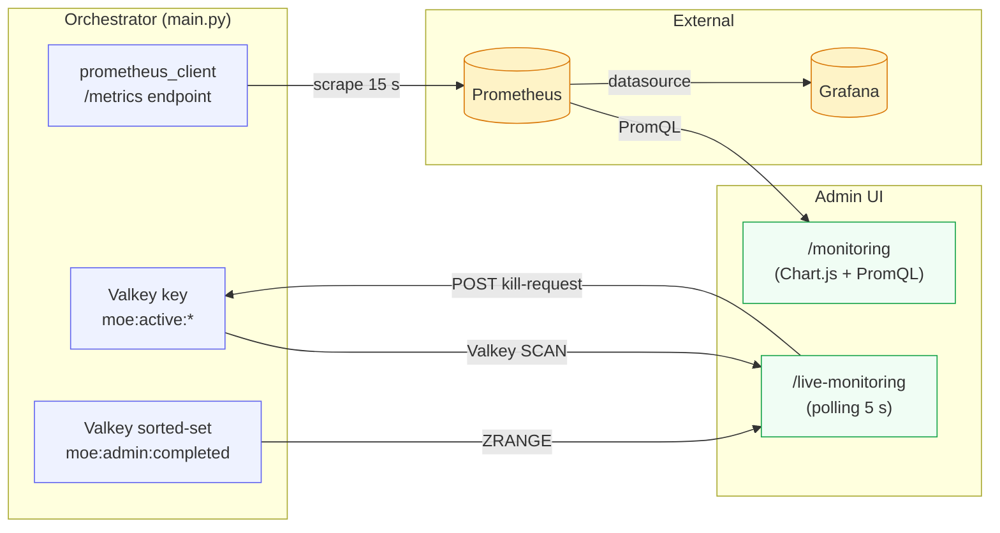
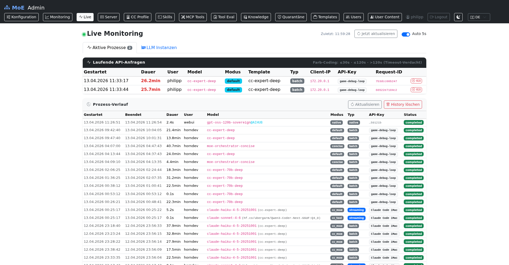
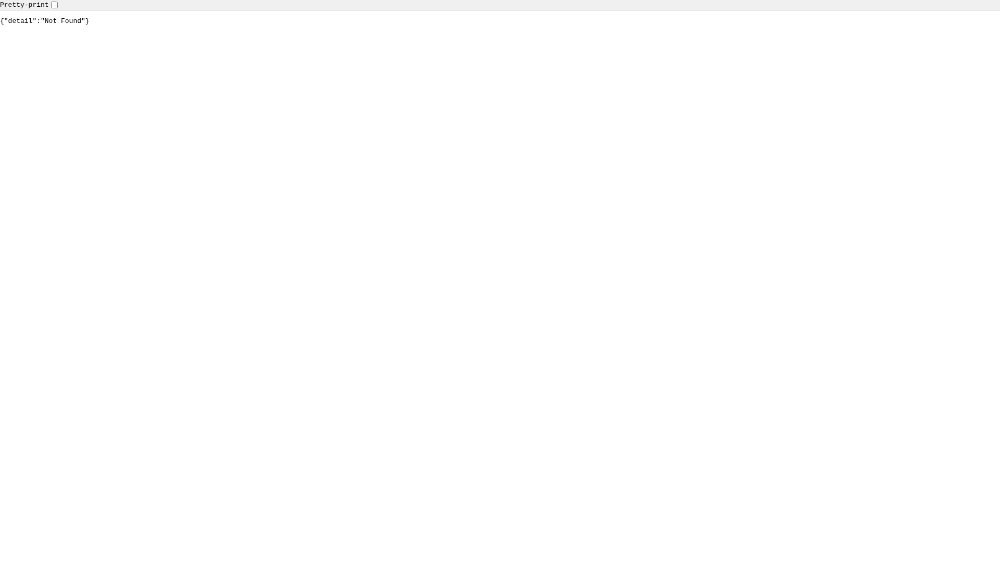
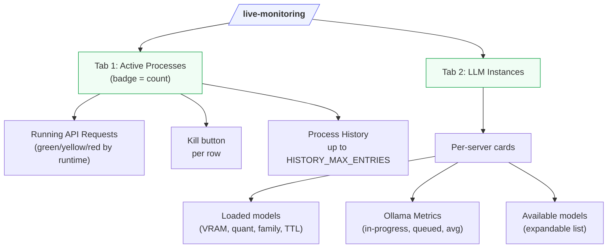
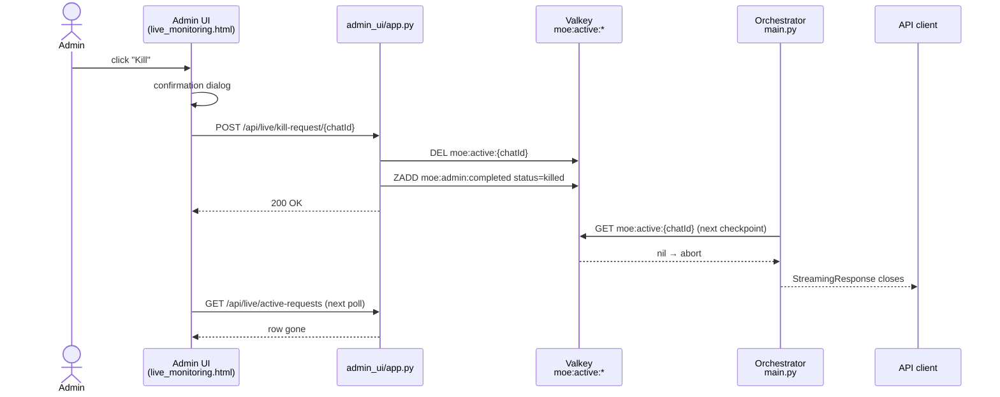

# Monitoring & Processes

The admin backend provides two monitoring layers: **System Monitoring** for aggregated Prometheus metrics and **Live Monitoring** for real-time process tracking with kill functionality.

## Observability architecture at a glance



- **System Monitoring** is *pull-based*: it queries Prometheus on-demand when the operator opens the page.
- **Live Monitoring** is *poll-based*: the browser hits Valkey-backed REST endpoints every 5 s.
- Both layers share the same `prometheus_client` data surface but serve different latency needs.

## Screenshots

### System Monitoring

Fully populated dashboard after 24 h of production traffic — all six system gauges, LLM server status row, Chart.js widgets for token usage, cache performance, expert-calls-by-category/model/mode, requests-by-mode donut, confidence distribution, and latency & ratings.


!!! note "Privacy"
    Internal node identifiers in this screenshot (e.g. `NODE-XX`) are anonymised
    placeholders. In a live deployment you will see your actual inference-server
    names (as configured under **Configuration → Servers**).

### Live Monitoring — Active Processes & History

Real-time view with a running long task (top panel, `6.2 min` streaming request against an enterprise template) plus the recent history of completed requests.



!!! info "Redacted columns"
    For the docs, the **User**, **Client IP**, **API-Key**, **Request ID**, and
    **Template** columns are blurred. In your own install all columns are
    visible to admins — the mask is purely a documentation-time privacy filter.

### Live Monitoring — LLM Instances tab

Per-server card view: loaded models with VRAM / parameters / quantisation / family / TTL, Ollama metrics (in-progress, queued, loaded, total requests, avg latency, I/O volumes), and an expandable list of all installed models per node.



!!! tip "Idle detection"
    Cards without any loaded models are labelled **"Kein Modell geladen (idle)"**
    — useful for spotting cold nodes during load-balancing reviews.

### Grafana — MoE System Overview


### Grafana — LLM & Expert Usage


### Grafana — Knowledge Base Health


### Grafana — GPU & Inference Nodes

The `moe-gpu-nodes` dashboard (`grafana/dashboards/moe-gpu-nodes.json`) provides
per-node, per-GPU panels for VRAM usage, GPU utilization, RAM, and disk. Data
is scraped from node-exporter instances on each inference host via the
`inference-nodes` Prometheus job.

Key panels:

| Panel | Metric |
|-------|--------|
| VRAM Usage | `node_gpu_memory_used_bytes` / `node_gpu_memory_total_bytes` |
| GPU Utilization | `node_gpu_utilization_percent` |
| RAM Usage | `node_memory_MemTotal_bytes` - `node_memory_MemAvailable_bytes` |
| Disk Usage | `node_filesystem_size_bytes` - `node_filesystem_avail_bytes` |

### Grafana — Infrastructure & Resources


### Grafana — User Metrics


### Prometheus — Scrape Targets


---

---

## System Monitoring (`/monitoring`)

### Provider Rate Limits

When Claude Code is active, this section shows the remaining API quota for each endpoint:

| Column | Description |
|--------|-------------|
| Endpoint | Server/provider name |
| Remaining | Remaining tokens until next reset |
| Limit | Total limit |
| % | Usage as progress bar |
| Reset | Next reset time |

Color coding: Green (>20% remaining) · Yellow (<20%) · Red (exhausted)

### System Gauges

Six real-time indicators for the state of the knowledge stack:

| Gauge | Metric | Description |
|-------|--------|-------------|
| ChromaDB Documents | `moe_chroma_documents_total` | Number of vector documents in cache |
| Neo4j Entities | `moe_graph_entities_total` | Nodes in knowledge graph |
| Neo4j Relations | `moe_graph_relations_total` | Edges in knowledge graph |
| Ontology Entities | `moe_ontology_entities_total` | Ontology concepts |
| Planner Patterns | `moe_planner_patterns_total` | Learned routing patterns |
| Ontology Gaps | `moe_ontology_gaps_total` | Topics not covered |

### LLM Server Status

Compact overview of all configured inference servers:

- **Online / Offline** badge
- **API type** badge (Ollama / OpenAI)
- Latency (ms)
- GPU count
- Loaded models with VRAM usage (Ollama) or model count (OpenAI)
- Error message when offline

!!! note "Hardware Metrics from Node Exporter"
    Each server status card also displays **GPU, VRAM, RAM, and disk metrics**
    when a [node-exporter](https://github.com/prometheus/node_exporter) instance
    is reachable on port 9100 of the inference node's host. The Admin UI
    derives the host IP from the Ollama URL and queries the `/metrics` endpoint
    directly. GPU metrics (`node_gpu_memory_used_bytes`, `node_gpu_memory_total_bytes`,
    `node_gpu_utilization_percent`) are expected from a textfile collector
    (e.g., a cron job running `nvidia-smi` and writing to the collector directory).

### Metrics Charts

All charts are queried via the Prometheus API (`/api/monitoring`) and rendered with Chart.js.

| Chart | Metric | Type |
|-------|--------|------|
| Token usage by model | `moe_tokens_total` (by model) | Bar chart |
| Cache performance | `moe_cache_hits_total` / `moe_cache_misses_total` | Donut |
| Expert calls by category | `moe_expert_calls_total` (by category) | Bar chart |
| Expert calls by model | `moe_expert_calls_total` (by model) | Bar chart |
| Expert calls by model & node | Grouped | Bar chart |
| Requests by mode | `moe_requests_total` (by mode) | Donut |
| Confidence distribution | `moe_expert_confidence_total` | Donut |
| Latency & scores | P50/P95, self-evaluation, feedback | Table |

#### Latency Metrics

| Metric | Formula |
|--------|---------|
| P50 (Median) | `histogram_quantile(0.50, rate(moe_response_duration_seconds_bucket[1h]))` |
| P95 (95th percentile) | `histogram_quantile(0.95, rate(moe_response_duration_seconds_bucket[1h]))` |
| Self-evaluation avg | `moe_self_eval_score_bucket` (avg) |
| User feedback avg | `moe_feedback_score_bucket` (avg) |

---

## Live Monitoring (`/live-monitoring`)

Live Monitoring provides real-time insight into running processes with the ability to terminate individual requests.

### Tab layout



All tab panes share the same 5-second polling loop but hit different REST endpoints:

| Tab | Endpoint | Data source |
|---|---|---|
| Active Processes — running | `GET /api/live/active-requests` | Valkey `SCAN moe:active:*` |
| Active Processes — history | `GET /api/live/history` | Valkey `ZRANGE moe:admin:completed` |
| LLM Instances | `GET /api/live/llm-instances` | Direct HTTP fan-out to each configured inference server (`/api/ps`, `/api/tags` for Ollama; `/v1/models` for OpenAI-compatible) |

### Tab: Active Processes

#### Running API Requests

Table of all currently running requests (auto-refresh every 5 seconds):

| Column | Description |
|--------|-------------|
| Started | Request start time |
| Duration | Runtime in seconds |
| User | Username |
| Model | LLM in use |
| Mode | MoE mode (`native`, `moe_reasoning`, etc.) |
| Template | Expert template used (if set) |
| Type | `streaming` or `standard` |
| Client IP | Client IP address |
| Request ID | Unique chat ID |
| Kill | Button to terminate |

**Color coding by runtime:**

| Color | Runtime | Meaning |
|-------|---------|---------|
| Green | ≤ 30s | Normal |
| Yellow | ≤ 120s | Longer than usual |
| Red | > 120s | Potential timeout |

#### Killing a Process



What happens on kill:

1. The Valkey key `moe:active:{chatId}` is deleted
2. The request is moved to `moe:admin:completed` (Sorted Set) with status `killed`
3. The running LangGraph node receives the kill signal on the next checkpoint
4. The client receives an abort error

!!! note "Streaming Requests"
    For streaming requests, it may take a few seconds for the kill command to take effect (at the next LangGraph checkpoint).

#### Process History

Table of all completed requests (up to `HISTORY_MAX_ENTRIES`, default: 5000):

| Column | Description |
|--------|-------------|
| Started | Start time |
| Ended | End time |
| Duration | Total runtime |
| User | Username |
| Model | LLM |
| Mode | MoE mode |
| Type | streaming / standard |
| Status | `completed` (green) or `killed` (red) |

Use the **"Clear History"** button (top right in the history panel) to delete the entire history from Valkey.

The history limit can be configured via environment variable:

```env
HISTORY_MAX_ENTRIES=5000   # Maximum number of entries before cleanup (default: 5000)
```

### Tab: LLM Instances

Detailed status of all inference servers:

#### Per Server (Ollama)

**Loaded Models:**

| Column | Description |
|--------|-------------|
| Model | Model name:tag |
| VRAM | Currently used VRAM (MB) |
| Total | Total model size (MB) |
| Parameters | Parameter count |
| Quant. | Quantization level |
| Family | Model family |
| Expires | When the model will be unloaded from VRAM |

**Ollama Metrics (chips):**

| Metric | Meaning | Alert |
|--------|---------|-------|
| In Progress | Current requests | Red if > 0 |
| Queued | Queue length | Red if > 0 |
| Loaded | Number of loaded models | – |
| Total Requests | Lifetime requests | – |
| Avg / Request | Average duration | – |
| ↑ Input | Request size (MB) | – |
| ↓ Output | Response size (MB) | – |

**Available Models** (expandable):

All installed models with name, size (GB), parameter count, quantization.

#### Per Server (OpenAI-compatible)

- Model count
- Available models (list)

### Refresh Controls

| Element | Function |
|---------|---------|
| Last Updated | Timestamp of last query |
| Refresh manually | Immediate query |
| Auto 5s ☑ | 5-second polling (default: active) |

---

## Prometheus Metrics – Full List

| Metric | Labels | Type | Description |
|--------|--------|------|-------------|
| `moe_tokens_total` | model, token_type, node, user_id | Counter | Processed tokens |
| `moe_expert_calls_total` | category, model, node | Counter | Expert invocations |
| `moe_requests_total` | mode | Counter | Requests by mode |
| `moe_response_duration_seconds` | – | Histogram | Response times |
| `moe_cache_hits_total` | – | Counter | Cache hits |
| `moe_cache_misses_total` | – | Counter | Cache misses |
| `moe_expert_confidence_total` | level | Counter | Confidence distribution |
| `moe_self_eval_score_bucket` | le | Histogram | Self-evaluation scores |
| `moe_feedback_score_bucket` | le | Histogram | User feedback scores |
| `moe_chroma_documents_total` | – | Gauge | ChromaDB documents |
| `moe_graph_entities_total` | – | Gauge | Neo4j entities |
| `moe_graph_relations_total` | – | Gauge | Neo4j relations |
| `moe_ontology_entities_total` | – | Gauge | Ontology entities |
| `moe_planner_patterns_total` | – | Gauge | Planner patterns |
| `moe_ontology_gaps_total` | – | Gauge | Ontology gaps |

All metrics are also directly accessible via Prometheus (`http://localhost:9090`) and Grafana (`http://localhost:3001`).
