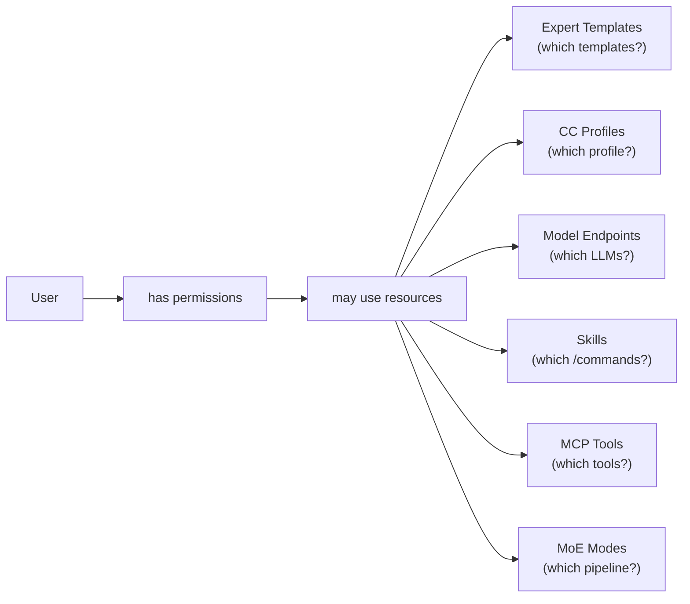

# Permissions

The MoE system uses a **whitelist model**: by default, all access is blocked. Every resource must be explicitly granted to a user.

## Concept



## Resource Types

| `resource_type` | Example `resource_id` | Meaning |
|----------------|----------------------|---------|
| `expert_template` | `tmpl-uuid-...` | Access to a specific admin template |
| `cc_profile` | `prof-uuid-...` | Access to a CC profile (profile must also be enabled) |
| `model_endpoint` | `qwen2.5:32b@inference-server` | Access to model X on server Y |
| `model_endpoint` | `*` | Access to all models on all servers |
| `skill` | `pdf` | Access to the `/pdf` skill |
| `skill` | `*` | Access to all skills |
| `mcp_tool` | `calc` | Access to the `calc` MCP tool |
| `mcp_tool` | `*` | Access to all MCP tools |
| `moe_mode` | `native` | Direct inference access (lowest latency) |
| `moe_mode` | `moe_reasoning` | Reasoning expert pipeline |
| `moe_mode` | `moe_orchestrated` | Full MoE pipeline |

## Managing Permissions

In the User Edit dialog → Tab **Permissions**:

### Active Permissions

The upper table shows all currently valid permissions for the user:

| Column | Description |
|--------|-------------|
| ☐ (Checkbox) | Multi-select for bulk delete |
| Type (Badge) | `resource_type` color-coded |
| Resource | `resource_id` (with resolved name if possible) |
| 🗑 (Button) | Revoke individual permission |

**Bulk Delete**: Check multiple boxes → **Revoke Selected** → Confirmation → all selected permissions are removed. The tab remains on **Permissions**.

**Select All**: Checkbox in the table header selects all entries at once.

### Adding Permissions

Five section cards allow targeted addition of permissions:

=== "Expert Template"
    - Dropdown with all admin templates (name + ID)
    - Multi-select possible
    - Click **+** → saves permission

=== "Claude Code Profile"
    - Dropdown with all CC profiles
    - Multi-select possible
    - Note: the profile must also be **enabled** for the user to be able to use it

=== "Native LLMs"
    - Grouped dropdown by inference server
    - Format: `Model@Server`
    - Wildcard `*` available for all models

=== "Skills"
    - Dropdown with all enabled skills
    - Quick button **Grant All Skills** → grant `skill:*`

=== "MCP Tools"
    - Dropdown with all active MCP tools
    - Quick button **Grant All MCP Tools** → grant `mcp_tool:*`

### Extended Permissions (moe_mode)

Expandable area for manual entry of `moe_mode` permissions:

- Type: `moe_mode` (fixed)
- Value: e.g. `native`, `moe_reasoning`, `moe_orchestrated`

### Workflow: Saving Permissions

Two approaches:

1. **Section by section**: Check boxes in one card → press **+** → only that category is saved
2. **All at once**: Check boxes in multiple cards → **Save Permissions** → all selected are created in one step

## Cluster Impact

| Permission | Effect when missing from request |
|----------|----------------------------------|
| `model_endpoint` missing | HTTP 403 – model not allowed |
| `expert_template` missing | Template is not shown in UI |
| `skill` missing | `/skill-name` returns 403 |
| `mcp_tool` missing | Tool call is blocked |
| `moe_mode` missing | Request with this mode is rejected |

## Valkey Sync

After every change to permissions, the user's Valkey cache is immediately updated:

```
user:{user_id}:permissions  →  HASH  { resource_type: [id, ...] }
```

The orchestrator checks permissions exclusively from the Valkey cache (TTL: 5 minutes). Changes therefore take effect within at most 5 minutes, in practice immediately after the next request.

## Database Schema

```sql
CREATE TABLE permissions (
    id            TEXT PRIMARY KEY,           -- UUID4
    user_id       TEXT NOT NULL REFERENCES users(id) ON DELETE CASCADE,
    resource_type TEXT NOT NULL,
    resource_id   TEXT NOT NULL,
    granted_at    TEXT NOT NULL,               -- ISO-8601 UTC
    UNIQUE(user_id, resource_type, resource_id)
);
```

!!! note "Duplicates"
    A duplicate grant (same `user_id + resource_type + resource_id`) is ignored by the UNIQUE constraint and does not generate an error.
