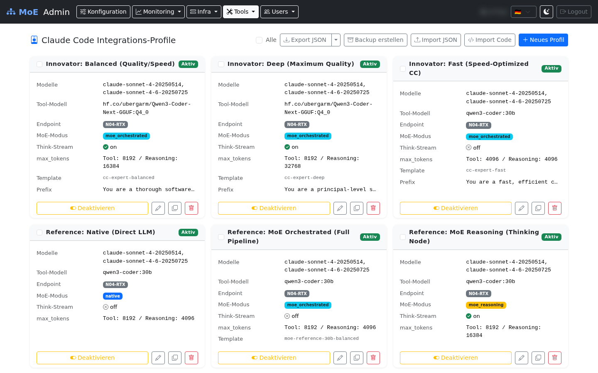

# Claude Code Profiles

Claude Code Profiles control how **Claude Code** (Anthropic CLI / IDE extension) interacts with the MoE orchestrator. A profile defines model routing, pipeline mode, and response parameters.



## Concept

Claude Code communicates via the Anthropic Messages API. A profile defines:

- Which **tool model** (LLM for tool calls) is used
- On which **endpoint** (inference server) it runs
- Which **MoE mode** is active
- Whether and how **reasoning streaming** is forwarded to Claude

## Profile States: enabled / disabled

Profiles no longer have an exclusive "active" flag. Instead, each profile has an **enabled** state (`enabled: true/false`):

- **Multiple profiles can be enabled simultaneously**
- A user must have an explicit **permission grant** (`cc_profile`) for a specific profile to access it
- The profile must also be **enabled** — a disabled profile is not available to any user, even if they have a permission grant
- Toggling a profile's enabled state **restarts the orchestrator** so the change takes effect

!!! warning "Orchestrator Restart"
    Enabling or disabling a profile triggers an orchestrator restart. Requests in progress may be interrupted.

## Profile Management (`/profiles`)

### Profile Cards

Each profile is displayed as a card:

- **Enabled** / **Disabled** badge
- Actions: **Edit**, **Enable/Disable toggle**, **Delete**
- Multiple profiles can be enabled at the same time

### Creating / Editing a Profile

| Field | Description | Example Value |
|-------|-------------|--------------|
| **Name** | Unique profile name | `Production – Claude Sonnet` |
| **Accepted Claude Model IDs** | Comma-separated model IDs | `claude-sonnet-4-6, claude-opus-4-6` |
| **Tool Model** | LLM for tool calls | `qwen2.5:32b` or `devstral:24b` |
| **Tool Endpoint** | Inference server (dropdown of configured servers) | *(select from Admin UI → Servers)* |
| **MoE Mode** | Pipeline mode | `native` / `moe_reasoning` / `moe_orchestrated` |
| **Tool Choice** | How tools are invoked | `auto` (default) or `required` |
| **Tool max_tokens** | Max tokens for tool responses | `8192` (min: 512) |
| **Reasoning max_tokens** | Max tokens for reasoning responses | `16384` (min: 512) |
| **System Prompt Prefix** | Prepended to all system prompts | `You are a helpful assistant.` |
| **Think Stream** | Send MoE pipeline progress to Claude | ☑ |

### MoE Modes

| Mode | Description | Latency | Quality |
|------|-------------|---------|---------|
| `native` | Direct to GPU, no routing | Low | Standard |
| `moe_reasoning` | Reasoning expert pipeline | Medium | High |
| `moe_orchestrated` | Full MoE pipeline (Planner → Experts → Judge) | High | Maximum |

### Enabling a Profile

Click the **Enable** toggle:

1. Sets `enabled = true` for this profile
2. **Restarts the orchestrator** (with loading overlay)
3. Users who have a permission grant for this profile can now use it

### Disabling a Profile

Click the **Disable** toggle:

1. Sets `enabled = false` for this profile
2. **Restarts the orchestrator**
3. The profile is no longer available to any user, even if they have a permission grant

## Granting Profile Access to Users

CC profiles are assigned to users via permission grants:

```
Admin → Edit User → Tab Permissions → Section Claude Code Profile → Select profile → +
```

Both conditions must be met for a user to use a profile:
1. The user has a `cc_profile` permission grant for the profile
2. The profile is enabled (`enabled = true`)

## Import / Export

### Export

```
Admin → Profiles → Export button
```

Downloads `cc_profiles.json`. See [Import & Export](../reference/import-export.md) for the full schema.

### Import

Two ways to import profiles:

**Option A – Upload file:**
```
Admin → Profiles → Import JSON → Select JSON file
```

**Option B – Paste JSON code:**
```
Admin → Profiles → Import Code → Paste JSON → Import
```

**Import modes:**

| Mode | Behavior |
|------|----------|
| `merge` | Profiles with the same name are skipped |
| `replace` | Profiles with the same name are overwritten |

## Cluster Impact

| Action | Effect |
|--------|--------|
| Create profile | Immediately available for permission grants |
| Edit profile | Active from the next Claude Code session |
| Enable profile | Orchestrator restart |
| Disable profile | Orchestrator restart |
| Delete profile | Grants for this profile are invalidated |

## User-Owned Profiles

Users with the `expert` role and a `model_endpoint` permission can create their own CC profiles in the User Portal. These apply only to the respective user and override the admin profile while the user is logged in.

Admins can view and manage all user profiles under `/user-content`.
