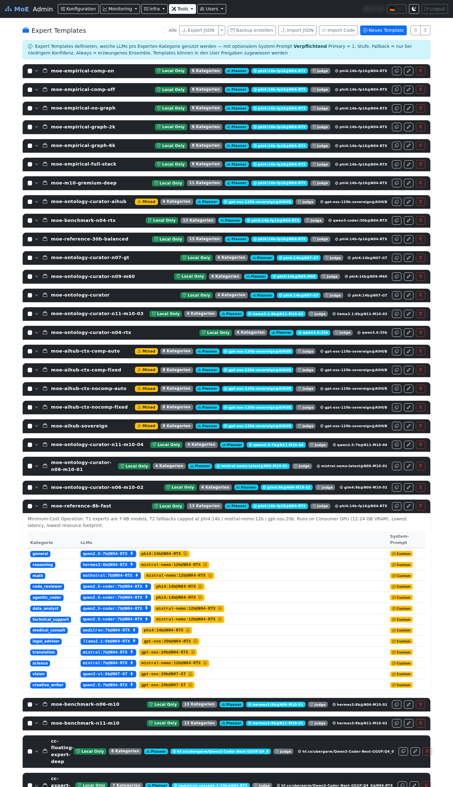

# Expert Templates

Expert Templates define **which LLMs in which configuration** are used for which task category. They are the central control instrument for MoE routing.



## Overview

An expert template defines:

- Which **LLM models** are responsible for which **expert category**
- Whether a model is **required** (Required) or **optional** (Two-Tier fallback)
- Optional **system prompts** per category
- An optional **planner LLM** for routing decisions
- An optional **judge/merger LLM** for response synthesis

## Template Management (`/templates`)

### Template Cards

Each template is displayed as a card with:

- Name and description
- Category badges (which expert categories are configured)
- Badge **Planner** (if planner LLM is set)
- Badge **Judge** (if judge LLM is set)
- Actions: **Edit**, **Copy as Template**, **Delete**

### Creating / Editing a Template

**Basic data:**

| Field | Description |
|-------|-------------|
| Name | Unique display name |
| Description | Optional free text |

**Expert configuration** (per category):

1. Enable category (checkbox)
2. Add LLMs (one or more rows):
   - **LLM@Node**: Model and inference server (format: `model:tag@server`)
   - **Required**: Model must be available; if missing, the request fails
   - **Optional (Two-Tier)**: Used only if the required model does not respond
3. Optional: enable and edit a **system prompt** for this category

**Orchestration prompts** (optional):

| Area | Description |
|------|-------------|
| Planner LLM | Model for routing decisions (overrides global PLANNER_MODEL) |
| Planner Prompt | System prompt for the planner LLM |
| Judge/Merger LLM | Model for response synthesis (overrides global JUDGE_MODEL) |
| Judge Prompt | System prompt for the judge LLM |

### Standard Expert Categories

| Category ID | Display Name | Use Case |
|-------------|-------------|---------|
| `general` | General | General queries |
| `code_reviewer` | Code Review | Code analysis and reviews |
| `technical_support` | Technical Support | IT issues, debugging |
| `data_analyst` | Data Analysis | Statistics, CSV, data |
| `creative_writer` | Creative Writing | Texts, ideas, storytelling |
| `medical_consult` | Medicine | Medical questions |
| `legal_advisor` | Legal | Legal questions |
| `math` | Mathematics | Calculations, proofs |
| `science` | Science | Natural sciences |
| `reasoning` | Reasoning | Logic, conclusions |
| `translation` | Translation | Language translations |
| `vision` | Vision | Image analysis |
| `financial_advisor` | Finance | Financial advice |
| `security_expert` | Security | IT security, pen testing |

Custom categories can be added via text input.

## Assigning to Users

Templates are assigned to users via permissions (`resource_type: expert_template`):

```
Admin → Edit User → Tab Permissions → Section Expert Template → Select template → +
```

The user then sees the granted template in the User Portal under **My Expert Configuration**.

## Import / Export

All admin templates can be exported as JSON and re-imported.

### Export

```
Admin → Expert Templates → Export button
```

Downloads `expert_templates.json`. See [Import & Export](../reference/import-export.md) for the full schema.

### Import

Two ways to import templates:

**Option A – Upload file:**
```
Admin → Expert Templates → Import JSON → Select JSON file
```

**Option B – Paste JSON code:**
```
Admin → Expert Templates → Import Code → Paste JSON → Import
```

**Import modes:**

| Mode | Behavior |
|------|----------|
| `merge` | Templates with the same name are skipped |
| `replace` | Templates with the same name are overwritten |

Result display: `X imported, Y skipped`

## Cluster Impact

| Action | Effect |
|--------|--------|
| Create template | Immediately available in permission management |
| Edit template | Takes effect on the user's next request using the template |
| Delete template | All permissions for this template are invalidated |
| Assign template to user | User's next API request uses the template |

## Service Toggles

Each expert template includes three boolean toggles that control which pipeline
components are active for requests using that template:

| Toggle | Default | Effect when disabled |
|--------|---------|---------------------|
| `enable_cache` | `true` | Skips ChromaDB L1 semantic cache lookup |
| `enable_graphrag` | `true` | Skips Neo4j knowledge graph query and ingestion |
| `enable_web_research` | `true` | Skips SearXNG web search |

These toggles are stored as part of the template JSON and propagated through
`AgentState` to each pipeline node. Use cases:

- **Compliance-sensitive templates**: Disable `enable_web_research` to guarantee
  no data leaves the local network during query processing.
- **Speed-optimized templates**: Disable `enable_graphrag` and `enable_cache`
  to reduce latency for simple, stateless queries.
- **Offline templates**: Disable all three for pure LLM-only processing with
  no external dependencies.

---

## Pinned vs Floating Expert Assignment

Expert models in a template can be assigned in two modes:

| Mode | Endpoint Field | Behavior |
|------|---------------|----------|
| **Pinned** | `model:tag@N04-RTX` | Model always runs on the specified node. Fails if node is unavailable. |
| **Floating** | `model:tag` (no `@node`) | Orchestrator searches all configured nodes for the model. Prefers warm nodes. |

**When to use pinned:** Deterministic scheduling, compliance requirements (data
must stay on a specific host), or when a model is only installed on one node.

**When to use floating:** Maximum availability and automatic failover. The
orchestrator uses the 3-phase selection strategy (sticky session, warm model,
load score) to pick the optimal node at request time. See
[Floating Node Discovery](../system/intelligence/enterprise_features.md#floating-node-discovery).

---

## Compliance Badge

Each template card in the Admin UI displays a color-coded privacy badge that
indicates whether data may leave the local network:

| Badge | Color | Condition |
|-------|-------|-----------|
| **Local Only** | Green | All expert endpoints resolve to local Ollama nodes |
| **Mixed** | Yellow | Some experts use external APIs (e.g., OpenAI, Anthropic) |
| **External** | Red | All experts use external APIs |

The badge is computed automatically from the template's endpoint configuration.
It helps administrators quickly identify which templates are safe for
sovereignty-critical workloads.

---

## User-Owned Templates

Users with the `expert` role can create their own templates in the User Portal. These are only visible to the respective user. Admins can view all user templates under `/user-content` and delete them if needed.
