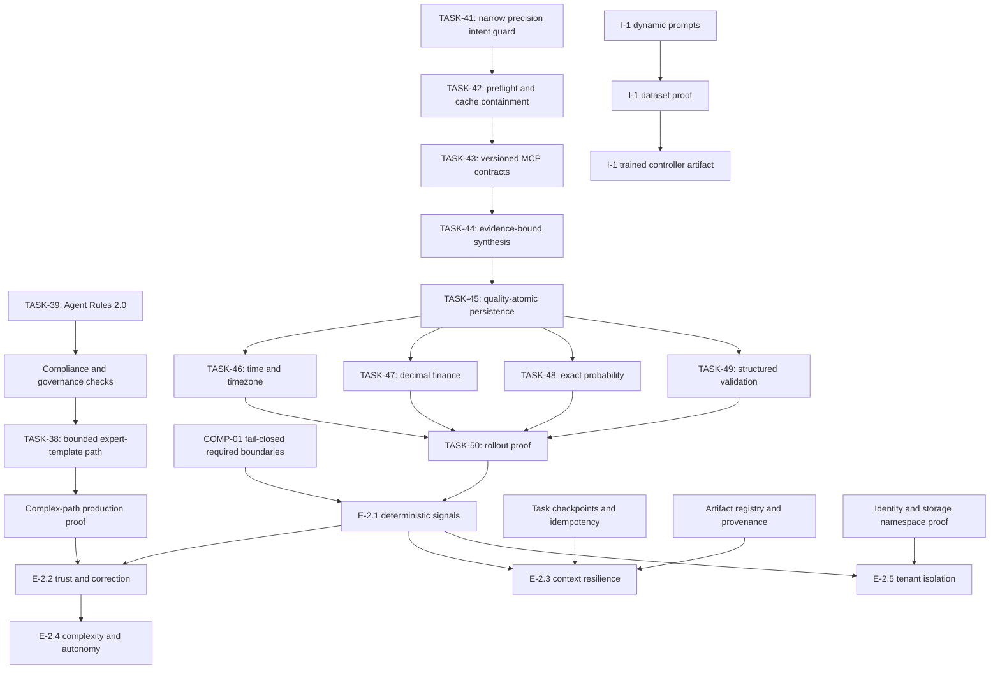

# Current Dependency Map

Owner: Platform Engineering
Version: 1.1
Last verified: 2026-08-01

This map describes delivery/proof dependencies, not only code imports.

## Gates

| Consumer | Required predecessor evidence |
|---|---|
| Complex expert-template production readiness | TASK-38 cold/warm E2E, no silent task loss, one propagated deadline, complete usage/audit |
| E-2.1 completion | Required boundary configuration/check errors fail closed; emission/export failures may degrade independently; S-2.1.1 proves precision intent→contract→evidence→output→commit |
| E-2.2 completion | Precision/MCP provenance contributes correctly to trust and a valid candidate reaches the API within budget |
| E-2.3 completion | Idempotent checkpoint resume and SHA-256 artifact lineage, not handover alone |
| E-2.4 completion | Caller-visible supervised confirmation before expensive dispatch |
| E-2.5 completion | Negative cross-tenant tests across API, PostgreSQL, Valkey, ChromaDB, Neo4j, memory, and tools |
| I-1 completion | Versioned dataset, reproducible training, evaluated artifact, deployment/rollback evidence |

The normative failure semantics are defined in
`../../../PROJECT_COMPLIANCE.md`.
