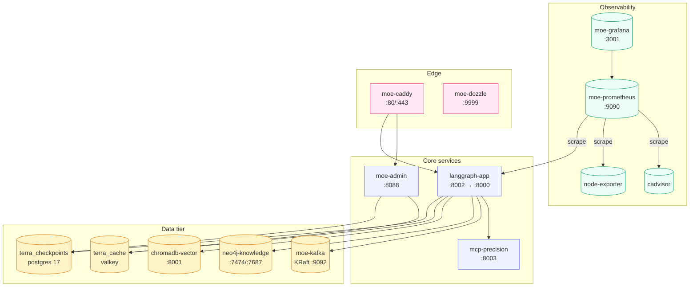

# Docker Compose

Docker Compose is the **team profile default** and the fastest way to get a
complete MoE Sovereign stack running on a single host. The same
`docker-compose.yaml` that the development team uses is production-ready.

!!! danger "Firewall is mandatory in production"
    The compose stack publishes ports `8002` (orchestrator), `8003` (MCP),
    `8088` (admin UI), `8098` (ChromaDB) and `3001` (Grafana) on `0.0.0.0` —
    they are reachable from any host that can route to this machine.
    Several of these endpoints have **no authentication** (e.g.
    `POST /graph/knowledge/import`) and assume network-level isolation.
    Configure your host firewall to expose only `80/443` to the public
    internet. See [Firewall & Network Exposure](firewall.md) for
    ready-to-run UFW / firewalld / iptables rules.

## What the stack contains



## Launch

```bash
# team profile (all 19 services)
sudo docker compose up -d

# solo profile — smaller resource footprint, optional services off
sudo docker compose -f docker-compose.yaml -f docker-compose.solo.yaml up -d

# enterprise profile — omit data-tier services, connect to external clusters
sudo docker compose -f docker-compose.yaml -f docker-compose.enterprise.yaml up -d
```

The profile overrides are additive: Compose merges the base file with the
profile-specific file, so you never maintain two parallel copies.

## Rebuilding after code changes

```bash
sudo docker compose build langgraph-app && sudo docker compose up -d langgraph-app
sudo docker compose build moe-admin    && sudo docker compose up -d moe-admin
sudo docker compose build mcp-precision && sudo docker compose up -d mcp-precision
```

The Dockerfiles are multi-stage, so rebuilds only redo the layers that
actually changed — a typical `main.py` edit rebuilds in under 10 seconds.

## Configuration via `.env` (no compose-file edits needed)

The shipped `docker-compose.yml` is fully parameterised. Every host path
and every published port resolves through `${VAR:-default}` so you can
override them from `.env` without touching the compose file. This keeps
`git pull` conflict-free.

### Required passwords

Compose enforces these with `${VAR:?…}` — `docker compose up` aborts
with an explicit error if any are missing. `install.sh` /
`bootstrap-macos.sh` write all of them automatically.

| `.env` key | Used by |
|---|---|
| `POSTGRES_CHECKPOINT_PASSWORD` | terra_checkpoints, langgraph-app, moe-admin |
| `MOE_USERDB_PASSWORD` | langgraph-app, moe-admin |
| `REDIS_PASSWORD` | terra_cache, langgraph-app, moe-admin |
| `NEO4J_PASS` | neo4j-knowledge, mcp-precision, langgraph-app |
| `GF_SECURITY_ADMIN_PASSWORD` | moe-grafana |
| `ADMIN_PASSWORD`, `ADMIN_SECRET_KEY` | moe-admin, moe-dozzle-init |

### Host data roots (bind-mount sources)

| `.env` key | Linux default | macOS default | Holds |
|---|---|---|---|
| `MOE_DATA_ROOT` | `/opt/moe-infra` | `$HOME/moe-data` | Postgres, Neo4j, Redis, ChromaDB, Kafka, Prometheus, logs |
| `GRAFANA_DATA_ROOT` | `/opt/grafana` | `$HOME/moe-grafana` | Grafana SQLite + dashboards |
| `FEW_SHOT_HOST_DIR` | `${MOE_DATA_ROOT}/few-shot` | same | Few-shot example store |
| `CLAUDE_SKILLS_DIR` | `./skills` | `./skills` | Claude Code skill bundle |

### Published host ports (override to avoid collisions)

All ports are remappable. Container-internal ports stay the same; only
the host side changes when you set `<SERVICE>_HOST_PORT` in `.env`.

| Default | `.env` key | Service | Bind |
|---:|---|---|---|
| 80 | `CADDY_HTTP_PORT` | Caddy reverse proxy | `0.0.0.0` |
| 443 | `CADDY_HTTPS_PORT` | Caddy HTTPS / HTTP3 | `0.0.0.0` |
| 8002 | `LANGGRAPH_HOST_PORT` | Orchestrator API | `0.0.0.0` |
| 8003 | `MCP_HOST_PORT` | MCP precision tools | `0.0.0.0` |
| 8088 | `ADMIN_UI_HOST_PORT` | Admin UI | `0.0.0.0` |
| 8098 | `DOCS_HOST_PORT` | Docs site | `0.0.0.0` |
| 3001 | `GRAFANA_HOST_PORT` | Grafana | `0.0.0.0` |
| 8001 | `CHROMA_HOST_PORT` | ChromaDB | `127.0.0.1` |
| 9090 | `PROMETHEUS_HOST_PORT` | Prometheus | `127.0.0.1` |
| 7474 | `NEO4J_HTTP_PORT` | Neo4j Browser | `127.0.0.1` |
| 7687 | `NEO4J_BOLT_PORT` | Neo4j Bolt | `127.0.0.1` |
| 9092 | `KAFKA_HOST_PORT` | Kafka broker | `127.0.0.1` |
| 9999 | `DOZZLE_HOST_PORT` | Dozzle log viewer | `127.0.0.1` |
| 9100 | `NODE_EXPORTER_HOST_PORT` | node-exporter | `127.0.0.1` |
| 9338 | `CADVISOR_HOST_PORT` | cAdvisor | `127.0.0.1` |

Example `.env` snippet to move the Admin UI off the default 8088 because
your host already runs something there:

```bash
ADMIN_UI_HOST_PORT=8089
```

After editing `.env`, `docker compose up -d` re-creates only the
affected container.

See `.env.example` for the full annotated reference and
[Firewall & Network Exposure](firewall.md) for which services to
firewall on each binding interface.
