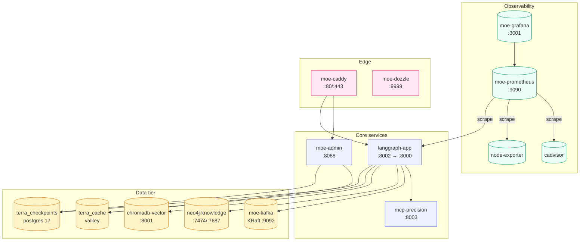

# Docker Compose

Docker Compose is the **team profile default** and the fastest way to get a
complete MoE Sovereign stack running on a single host. The same
`docker-compose.yaml` that the development team uses is production-ready.

!!! danger "Firewall is mandatory in production"
    The compose stack publishes ports `8002` (orchestrator), `8003` (MCP),
    `8088` (admin UI), `8098` (ChromaDB) and `3001` (Grafana) on `0.0.0.0` —
    they are reachable from any host that can route to this machine.
    Several of these endpoints have **no authentication** (e.g.
    `POST /graph/knowledge/import`) and assume network-level isolation.
    Configure your host firewall to expose only `80/443` to the public
    internet. See [Firewall & Network Exposure](firewall.md) for
    ready-to-run UFW / firewalld / iptables rules.

## What the stack contains



## Launch

```bash
# team profile (all 19 services)
sudo docker compose up -d

# solo profile — smaller resource footprint, optional services off
sudo docker compose -f docker-compose.yaml -f docker-compose.solo.yaml up -d

# enterprise profile — omit data-tier services, connect to external clusters
sudo docker compose -f docker-compose.yaml -f docker-compose.enterprise.yaml up -d
```

The profile overrides are additive: Compose merges the base file with the
profile-specific file, so you never maintain two parallel copies.

## Rebuilding after code changes

Per project policy (see `CLAUDE.md`):

```bash
sudo docker compose build langgraph-app && sudo docker compose up -d langgraph-app
sudo docker compose build moe-admin    && sudo docker compose up -d moe-admin
sudo docker compose build mcp-precision && sudo docker compose up -d mcp-precision
```

The Dockerfiles are multi-stage, so rebuilds only redo the layers that
actually changed — a typical `main.py` edit rebuilds in under 10 seconds.
