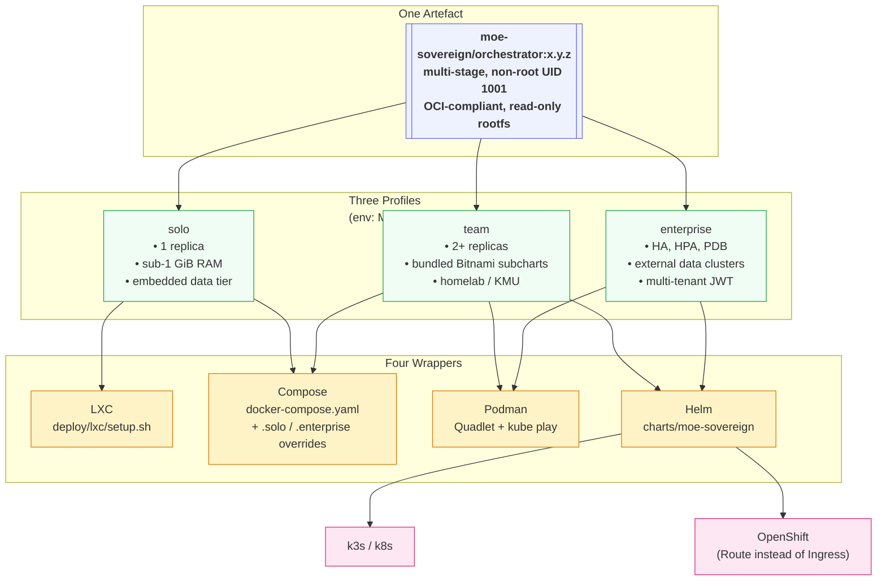
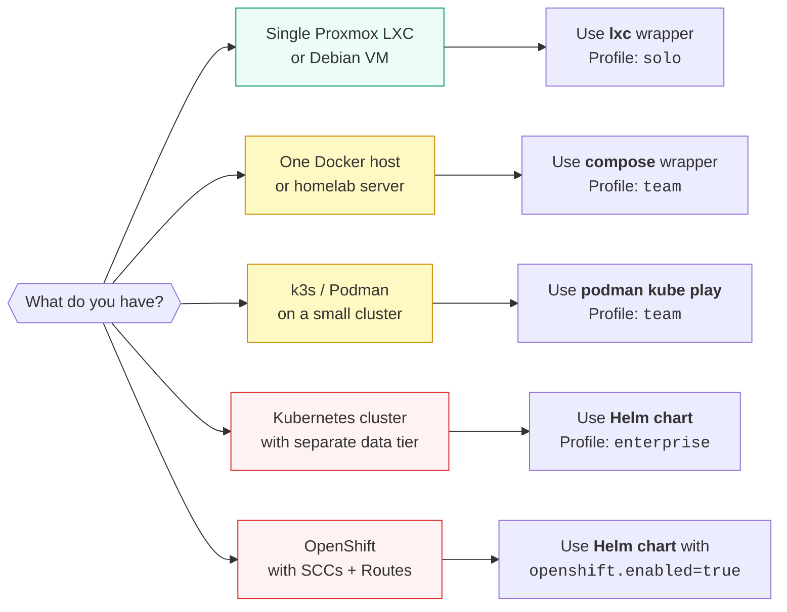

# Deployment Overview

MoE Sovereign ships as a **single OCI image**, wrapped in **multiple deployment
formats**, and parameterised by **three profiles** — so the same artefact runs
everywhere from a Raspberry Pi inside a Proxmox LXC to a multi-AZ OpenShift
cluster, without code forks or feature loss.

## The universal deployment principle



**Nothing in the code path changes between profiles.** The image is identical
byte-for-byte; only the environment and the surrounding wrapper differ. This is
what guarantees "no performance or functional loss across all layers".

## Choosing your tier



| Tier | Wrapper | Profile | Typical target | RAM footprint |
|---|---|---|---|---|
| Hobbyist / Edge | `deploy/lxc/setup.sh` | `solo` | Proxmox LXC, Raspberry Pi 5, Debian VM | ~1.5 GiB |
| Homelab / KMU | `docker-compose.yaml` | `team` | 1 Docker host | ~6 GiB |
| Rootless clusters | `podman kube play` | `team` | Podman 4.4+ on a few hosts | ~6 GiB |
| Enterprise k8s | `charts/moe-sovereign` | `enterprise` | k3s / k8s / OpenShift | variable |

## Directory layout

The deployment assets live at the repository root:

```
moe-infra/
├── Dockerfile                                   # multi-stage, non-root, OCI
├── docker-compose.yaml                          # existing team-profile stack
├── charts/
│   └── moe-sovereign/                           # Helm chart
│       ├── Chart.yaml                           # Bitnami conditional subcharts
│       ├── values.yaml                          # profile: enterprise (default)
│       ├── values-solo.yaml
│       ├── values-team.yaml
│       └── templates/                           # 14 Helm templates
└── deploy/
    ├── lxc/setup.sh                             # Proxmox/Debian bootstrap
    ├── podman/
    │   ├── systemd/moe-orchestrator.container   # Quadlet unit
    │   └── kube.yaml                            # podman kube play manifest
    └── alloy/
        ├── alloy.river                          # universal Grafana Alloy config
        └── alloy.systemd.service                # LXC service unit
```

## What every wrapper delivers

Regardless of which wrapper you use, all four of these guarantees hold:

1. **Non-root execution** — UID 1001, capabilities dropped to `ALL`, `no_new_privs`.
2. **Read-only root filesystem** — writable paths are `emptyDir` (k8s), `tmpfs`
   (Podman), or bind-mounts (LXC). Runtime code cannot mutate the image.
3. **W3C `traceparent` propagation** — a request that enters the orchestrator on
   LXC and fans out to a Kafka cluster on k8s retains the same trace ID, so
   logs correlate across tiers in a single Loki query.
4. **Env-var driven configuration** — `MOE_PROFILE`, `MOE_LOGS_DIR`,
   `MOE_CACHE_DIR`, `MOE_EXPERTS_DIR`, `KAFKA_URL`, `REDIS_URL`,
   `POSTGRES_CHECKPOINT_URL`, `NEO4J_URI`, `CHROMA_HOST`, `JWT_ISSUER`,
   `JWT_AUDIENCE`. No hardcoded hostnames, no baked-in paths.

## Maturity & Test Status

!!! warning "Not all deployment targets have been tested equally"
    Docker Compose is the primary, production-tested deployment method.
    Other wrappers are prepared but have varying levels of real-world validation.

| Wrapper | Status | Test Environment | Notes |
|---------|:------:|-----------------|-------|
| **Docker Compose** | Tested | Production (5-node GPU cluster) | Primary deployment method. All features validated. |
| **LXC / Proxmox** | Tested | Proxmox CT with `nesting=1, fuse=1` | Docker-in-LXC works with correct cgroup2 config. GPU passthrough requires additional setup. |
| **Podman (rootless)** | Planned | macOS (Podman Desktop) | Prepared but not yet validated. UID mapping and GPU access are known challenges. |
| **K3s** | Planned | 3-node cluster (netcup VPS) | Helm chart prepared. Requires shared storage (Longhorn recommended). Internet-connected nodes only. |
| **Kubernetes (managed)** | Untested | No cluster available | Helm chart provided, community validation welcome. |
| **OpenShift** | Untested | No cluster available | SecurityContextConstraints and Route configuration documented but not validated. Contributions welcome. |

### LXC Configuration Reference

For Docker-in-LXC on Proxmox, the container requires these settings in
`/etc/pve/lxc/<CTID>.conf`:

```ini
features: fuse=1,mount=nfs;cifs,nesting=1
lxc.cgroup2.devices.allow: c 10:200 rwm
lxc.mount.entry: /dev/net/tun dev/net/tun none bind,create=file
```

For GPU passthrough (NVIDIA), add:
```ini
lxc.cgroup2.devices.allow: c 195:* rwm
lxc.cgroup2.devices.allow: c 509:* rwm
lxc.mount.entry: /dev/nvidia0 dev/nvidia0 none bind,optional,create=file
lxc.mount.entry: /dev/nvidiactl dev/nvidiactl none bind,optional,create=file
lxc.mount.entry: /dev/nvidia-uvm dev/nvidia-uvm none bind,optional,create=file
```

### K3s Storage Considerations

For multi-node K3s deployments, stateful services (Neo4j, PostgreSQL, Valkey,
ChromaDB) require persistent volumes. Options:

- **Longhorn** (recommended): K3s-native distributed block storage. Works across
  internet-connected nodes but adds latency.
- **NFS**: Simple but not recommended over WAN for database workloads.
- **Local path provisioner**: Pin stateful pods to a single node. Simplest but
  no redundancy.

## Next steps

- [LXC / Proxmox bootstrap](lxc.md)
- [Docker Compose](compose.md)
- [Podman (rootless + Quadlet)](podman.md)
- [Kubernetes & OpenShift (Helm chart)](kubernetes.md)
- [Universal observability with Grafana Alloy](observability.md)
