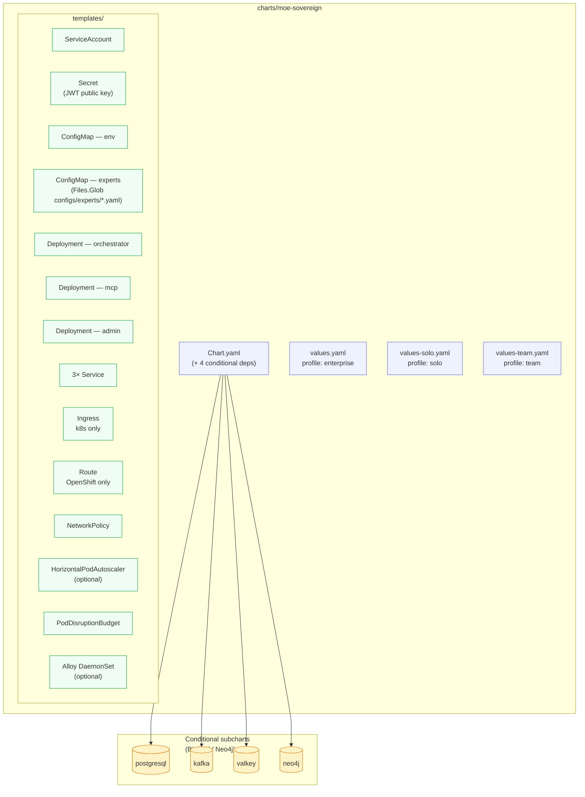
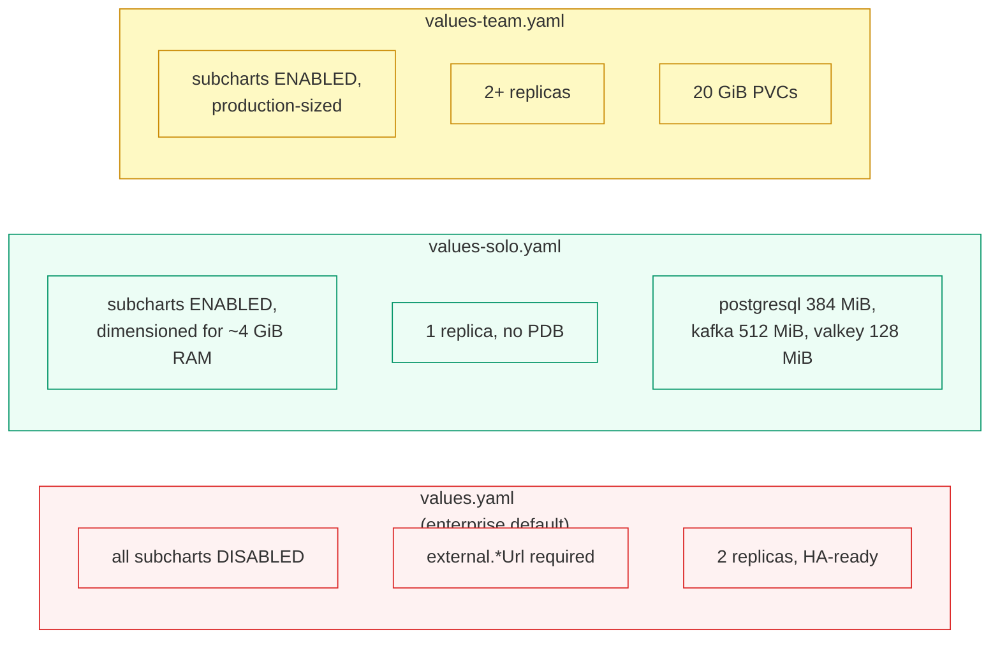

# Kubernetes & OpenShift (Helm)

MoE Sovereign ships a modular Helm chart at `charts/moe-sovereign/` that targets
vanilla Kubernetes, k3s, and Red Hat OpenShift from the same source tree.

!!! warning "Community Validation Requested"
    The MoE Sovereign Helm chart is architecturally prepared for Kubernetes and OpenShift
    (OCI-compliant, non-root, read-only rootfs, NetworkPolicy, HPA, PDB). However, no
    formal production validation has been completed on these targets. K3s/Kubernetes
    is **Planned** and OpenShift is **Untested** in the deployment matrix.

    If you successfully deploy on K8s/OpenShift, please share your experience via a
    [GitHub Discussion](https://github.com/h3rb3rn/moe-sovereign/discussions) — your
    feedback directly drives the validation milestone.

## Chart structure



Every subchart is **conditional**: set `postgresql.enabled=true` (etc.) to let
Helm manage the data tier, leave it `false` to point at an existing cluster via
`external.postgresUrl`.

## Three profiles, three values files



## Install — homelab / solo (k3s)

```bash
curl -sfL https://get.k3s.io | sh -
export KUBECONFIG=/etc/rancher/k3s/k3s.yaml

helm repo add bitnami https://charts.bitnami.com/bitnami
helm repo add neo4j   https://helm.neo4j.com/neo4j
helm dependency update charts/moe-sovereign

helm install moe charts/moe-sovereign \
    -f charts/moe-sovereign/values-solo.yaml \
    --set-file auth.jwt_public_key.pem=/path/to/jwt_pubkey.pem \
    --create-namespace --namespace moe

kubectl -n moe wait --for=condition=ready pod -l app.kubernetes.io/component=orchestrator --timeout=5m
kubectl -n moe port-forward svc/moe-moe-sovereign-orchestrator 8000:8000
```

## Install — enterprise with external data tier

```bash
helm install moe charts/moe-sovereign \
    --namespace moe \
    --set-file auth.jwt_public_key.pem=/path/to/jwt_pubkey.pem \
    --set external.postgresUrl='postgres://moe:pw@pg.prod:5432/moe' \
    --set external.kafkaUrl='kafka.prod:9092' \
    --set external.valkeyUrl='redis://valkey.prod:6379/0' \
    --set external.neo4jUri='bolt://neo4j.prod:7687' \
    --set orchestrator.autoscaling.enabled=true \
    --set orchestrator.autoscaling.maxReplicas=8
```

## Install — OpenShift

The chart auto-detects OpenShift via the presence of `route.openshift.io/v1`,
but you can force it:

```bash
helm install moe charts/moe-sovereign \
    --set openshift.enabled=true \
    --set route.host=moe.apps.ocp.example.com \
    --set-file auth.jwt_public_key.pem=/path/to/jwt_pubkey.pem \
    -f charts/moe-sovereign/values-team.yaml \
    --namespace moe
```

What changes automatically on OpenShift:

| Behaviour | k8s (default) | OpenShift (`openshift.enabled=true`) |
|---|---|---|
| Ingress object | `Ingress` (`networking.k8s.io/v1`) | `Route` (`route.openshift.io/v1`) |
| Pod `runAsUser` | `1001` (from values) | **omitted** — SCC injects the namespace's UID range |
| Pod `fsGroup` | `0` | omitted |
| Container `readOnlyRootFilesystem` | `true` | `true` (unchanged) |
| Dropped capabilities | `ALL` | `ALL` (unchanged) |

This satisfies the `restricted-v2` SCC out of the box. No cluster admin action
is required.

## Security posture

```mermaid
flowchart TB
    subgraph P[Pod]
        direction TB
        SC1["runAsNonRoot: true"]:::ok
        SC2["runAsUser: 1001<br/>(or SCC-injected)"]:::ok
        SC3["readOnlyRootFilesystem: true"]:::ok
        SC4["allowPrivilegeEscalation: false"]:::ok
        SC5["capabilities.drop: [ALL]"]:::ok
        SC6["seccompProfile: RuntimeDefault"]:::ok
        V1[emptyDir: logs]:::wr
        V2[emptyDir: cache]:::wr
        V3[emptyDir: tmp]:::wr
        V4[ConfigMap: experts<br/>read-only]:::ro
        V5[Secret: JWT pubkey<br/>read-only]:::ro
    end

    classDef ok fill:#ecfdf5,stroke:#059669,color:#065f46;
    classDef wr fill:#fef9c3,stroke:#ca8a04;
    classDef ro fill:#eef2ff,stroke:#6366f1;
```



## Verification

```bash
helm lint charts/moe-sovereign
helm template test charts/moe-sovereign -f charts/moe-sovereign/values-solo.yaml \
    | kubectl apply --dry-run=client -f -
kubectl -n moe get deploy,svc,ingress,networkpolicy,pdb,hpa
kubectl -n moe logs deploy/moe-moe-sovereign-orchestrator | head -20
```

The universal-deployment test suite (`tests/test_deployment_artifacts.py`)
asserts the lint + template output for enterprise, solo, and OpenShift modes
as part of every CI run.
