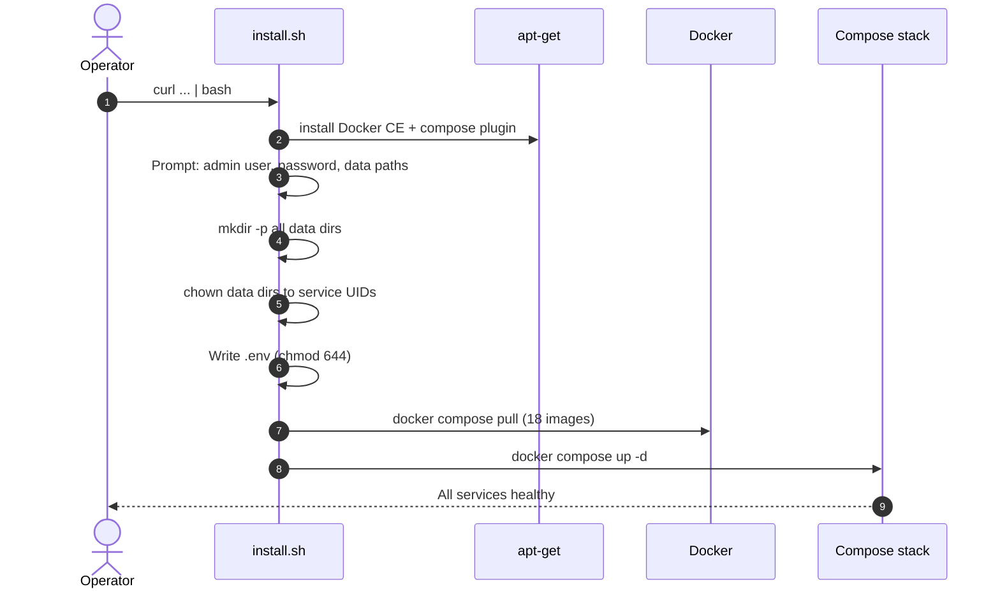
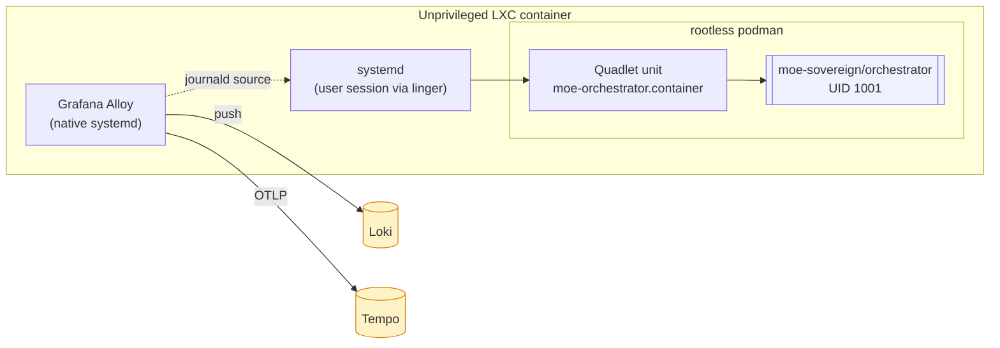
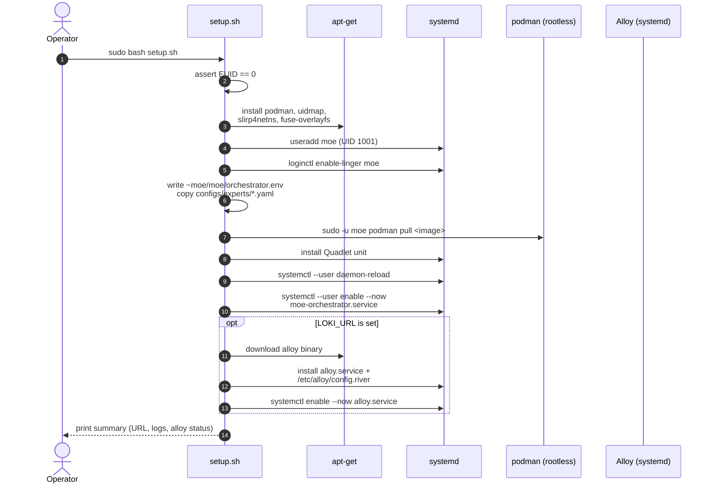

# LXC / Proxmox Deployment

Two deployment methods are supported. Choose based on your requirements:

| Method | Stack | LXC type | Services | When to use |
|---|---|---|---|---|
| **Full Stack** (this page, §1) | Docker Compose | **Privileged** (or features: nesting=1) | All 18 services (Neo4j, Kafka, Grafana, …) | Production, full feature set |
| **Lightweight Edge** (this page, §2) | Rootless Podman + Quadlet | Unprivileged | Orchestrator only | Edge node, limited resources, strict security |

---

## Method 1: Full Stack via Docker Compose

This method deploys the complete MoE Sovereign stack (18 Docker services) using the
one-line installer. It requires a **privileged LXC** or an LXC with nesting enabled.

### Proxmox LXC Configuration

Before running the installer, configure the LXC in Proxmox:

```bash
# In Proxmox shell (pct set or edit /etc/pve/lxc/<id>.conf):
# Required for Docker inside LXC:
features: nesting=1,keyctl=1
# Recommended: cgroupv2 (Proxmox 7.3+ default, check with: stat /sys/fs/cgroup/cgroup.controllers)

# If using AppArmor (Debian 12+), disable for the LXC:
lxc.apparmor.profile: unconfined
```

Alternatively, set `privileged: 1` — this grants all required capabilities automatically.

!!! warning "Security trade-off"
    Privileged LXC or `nesting=1` weakens container isolation. Acceptable for a dedicated
    inference server not exposed to the public internet. Do not use for multi-tenant
    environments. The Podman method (§2) is the secure alternative.

### One-Line Installer

From inside the LXC (Debian 12/13 or Ubuntu 22.04/24.04):

```bash
curl -sSL https://raw.githubusercontent.com/h3rb8rn/moe-sovereign/main/install.sh | bash
```

The installer will prompt for:
1. Admin username (default: `admin`)
2. Admin password
3. Data root path (default: `/opt/moe-infra`)
4. Grafana root path (default: `/opt/grafana`)

Expected runtime on a 4-vCPU LXC: **~3–5 minutes** (plus Docker image pull time, first pull ~5–10 min).

### What the installer does



### Post-install verification

```bash
# Check all 18 services
sudo docker compose -f /opt/moe-sovereign/docker-compose.yml ps

# Health check
curl -sf http://localhost:8002/health && echo "OK"

# Admin UI (via browser or Caddy reverse proxy)
# http://<LXC-IP>:8088
```

---

## Troubleshooting: Known Issues on Fresh Install

These issues were discovered and fixed during a live test on a Debian 13 (trixie)
LXC container on 2026-04-14. Fixed in `install.sh` as of `debug/lxc-install`.

### Container Permission Denials

The `install.sh` creates data directories as root. Each container runs as a specific
non-root UID defined in the upstream image. Mismatch causes crash loops.

| Service | Symptom | Container UID | Data directory | Fix (if still affected) |
|---|---|---|---|---|
| `moe-kafka` | `Command [dub path /var/lib/kafka/data writable] FAILED` | uid=1000 (appuser) | `kafka-data/` | `sudo chown -R 1000:1000 /opt/moe-infra/kafka-data` |
| `moe-prometheus` | Panic: `permission denied: /prometheus/queries.active` | uid=65534 (nobody) | `prometheus-data/` | `sudo chown -R 65534:65534 /opt/moe-infra/prometheus-data` |
| `moe-grafana` | `GF_PATHS_DATA is not writable` | uid=472 | `grafana/data`, `grafana/dashboards` | `sudo chown -R 472:472 /opt/grafana/data /opt/grafana/dashboards` |
| `langgraph-orchestrator` | `PermissionError: /app/.env` | uid=1001 (moe) | `.env` (bind-mount `:ro`) | `sudo chmod 644 /opt/moe-sovereign/.env` |

After fixing ownership, restart only the affected container:

```bash
sudo docker restart moe-kafka
sudo docker restart moe-prometheus
sudo docker restart moe-grafana
sudo docker restart langgraph-orchestrator
```

### ValueError: invalid literal for int() — `EVAL_CACHE_FLAG_THRESHOLD`

**Symptom:** `langgraph-orchestrator` crashes immediately with:
```
ValueError: invalid literal for int() with base 10: '2.0'
```

**Cause:** `.env` contains `EVAL_CACHE_FLAG_THRESHOLD=2.0` but `main.py` calls `int(os.getenv(...))`.
Python's `int("2.0")` raises `ValueError` — only pure integer strings are accepted.

**Fix (existing .env):**
```bash
sudo sed -i 's/EVAL_CACHE_FLAG_THRESHOLD=2.0/EVAL_CACHE_FLAG_THRESHOLD=2/' /opt/moe-sovereign/.env
sudo docker restart langgraph-orchestrator
```

### Container always `(unhealthy)` despite responding

**Symptom:** `docker compose ps` shows `(unhealthy)` for `langgraph-orchestrator`
even though requests are processed normally.

**Cause:** The Dockerfile `HEALTHCHECK` calls `GET /health` — this endpoint was missing
in older builds and returned HTTP 404. Added in `debug/lxc-install`.

**Verify:**
```bash
curl -sf http://localhost:8002/health
# Expected: {"status":"ok"}
```

If you get 404, you are running a build before the fix. Pull the latest image:
```bash
cd /opt/moe-sovereign && sudo docker compose pull langgraph-app && sudo docker compose up -d langgraph-app
```

### Expected Non-Fatal Messages

These appear in logs on every fresh install and are **not errors**:

```
ERROR - Topic moe.linting not found in cluster metadata
```
Kafka topics are auto-created on first message (`KAFKA_AUTO_CREATE_TOPICS_ENABLE=true`).
No action required — topics appear as soon as the first request is processed.

```
pthread_setaffinity_np failed for thread: ... error code: 22
```
LXC containers cannot pin CPU threads (kernel restriction). ChromaDB's ONNX runtime
logs this warning but operates correctly.

PostgreSQL initialization taking 60–90s on first start: normal. The `initdb` process
creates the data cluster; subsequent starts are much faster.

---

## Method 2: Lightweight Edge (Podman + Quadlet)

Target: an **unprivileged** LXC container — typically on Proxmox. The orchestrator
runs as a **rootless Podman** container managed by **systemd Quadlet**, with optional
**Grafana Alloy** as a native systemd service for observability.

This method deploys the orchestrator only (no Neo4j, no Kafka, no Grafana). Suitable
for edge nodes, resource-constrained environments, or scenarios requiring strict
container isolation without privileged capabilities.

### Why Podman (not Docker) in unprivileged LXC?



- **No privileged LXC flags needed.** Docker inside an unprivileged LXC needs
  nesting + keyctl + potentially cgroupv2 tweaks. Rootless Podman works out
  of the box.
- **systemd-native lifecycle.** Quadlet (Podman ≥ 4.4) lets systemd manage the
  container as if it were a first-class unit: `systemctl --user status`,
  auto-restart, dependency ordering — all free.
- **Journald log driver** means the orchestrator's stdout/stderr lands in the
  host journal, where Alloy can scrape it without bind-mounts.

### One-command bootstrap (Method 2)

From a git checkout inside the LXC:

```bash
sudo VERSION=0.1.0 \
     LOKI_URL=https://loki.example.com/loki/api/v1/push \
     TEMPO_URL=tempo.example.com:4317 \
     MOE_CLUSTER=lxc-edge-1 \
     bash deploy/lxc/setup.sh
```

What the script does (see `deploy/lxc/setup.sh`):



Expected runtime on a 2-vCPU LXC: **~60 seconds** (plus image pull time).

### Environment variables (Method 2)

The script honours all of these; any unset variable has the sensible default
noted.

| Variable | Default | Purpose |
|---|---|---|
| `VERSION` | `latest` | Image tag to pull |
| `MOE_REGISTRY` | `ghcr.io/moe-sovereign` | OCI registry |
| `MOE_USER` | `moe` | Service account name |
| `MOE_UID` | `1001` | Service account UID (matches image) |
| `LOKI_URL` | *(empty)* | Loki push endpoint; **empty disables Alloy install** |
| `TEMPO_URL` | *(empty)* | OTLP gRPC endpoint for traces |
| `PROM_REMOTE_WRITE_URL` | *(empty)* | Prometheus remote_write URL |
| `MOE_CLUSTER` | `lxc` | Label applied to every log line |
| `ALLOY_VERSION` | `latest` | Grafana Alloy release |

### The Quadlet unit (Method 2)

File: `deploy/podman/systemd/moe-orchestrator.container`

```ini
[Container]
Image=ghcr.io/moe-sovereign/orchestrator:latest
Volume=%h/moe/logs:/app/logs:Z
Volume=%h/moe/cache:/app/cache:Z
Volume=%h/moe/experts:/app/configs/experts:Z,ro
ReadOnly=true
Tmpfs=/tmp:rw,size=64m
PublishPort=8000:8000
LogDriver=journald
NoNewPrivileges=true
DropCapability=ALL
UserNS=keep-id
```

This mirrors the k8s `containerSecurityContext` byte-for-byte — so the
"same binary, same behaviour" guarantee holds from LXC all the way up to
OpenShift.

### Operating the service (Method 2)

```bash
# status
sudo -u moe XDG_RUNTIME_DIR=/run/user/1001 \
    systemctl --user status moe-orchestrator

# live logs (via journald)
sudo journalctl -u user@1001.service -u moe-orchestrator --follow

# restart after editing orchestrator.env
sudo -u moe XDG_RUNTIME_DIR=/run/user/1001 \
    systemctl --user restart moe-orchestrator

# update to a new image tag
sudo -u moe XDG_RUNTIME_DIR=/run/user/1001 \
    podman pull ghcr.io/moe-sovereign/orchestrator:0.2.0
sudo sed -i 's|:0.1.0|:0.2.0|' \
    /home/moe/.config/containers/systemd/moe-orchestrator.container
sudo -u moe XDG_RUNTIME_DIR=/run/user/1001 \
    systemctl --user daemon-reload
sudo -u moe XDG_RUNTIME_DIR=/run/user/1001 \
    systemctl --user restart moe-orchestrator
```

### Proxmox-specific notes (Method 2)

- **Nesting**: not required for rootless Podman. Leave `Features: nesting=0`.
- **Unprivileged**: `unprivileged: 1` is recommended.
- **Sub-UID/GID**: the script writes `moe:100000:65536` to `/etc/subuid` and
  `/etc/subgid` — but LXC already maps the container into a sub-range, so the
  effective UIDs on the Proxmox host end up in the 200000-range. No manual
  tuning needed for a standard Proxmox template.
- **AppArmor**: the default `lxc-container-default-cgns` profile is sufficient.

### Uninstall (Method 2)

```bash
sudo -u moe XDG_RUNTIME_DIR=/run/user/1001 \
    systemctl --user disable --now moe-orchestrator
sudo rm /home/moe/.config/containers/systemd/moe-orchestrator.container
sudo systemctl disable --now alloy 2>/dev/null || true
sudo rm -f /etc/systemd/system/alloy.service /etc/alloy/config.river
sudo -u moe podman rmi ghcr.io/moe-sovereign/orchestrator:latest
sudo loginctl disable-linger moe
sudo userdel -r moe
```
