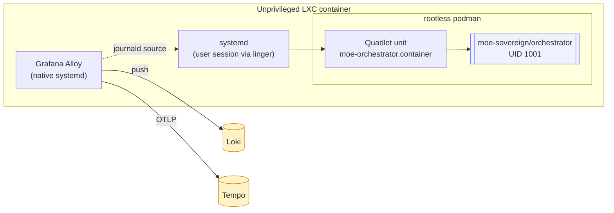
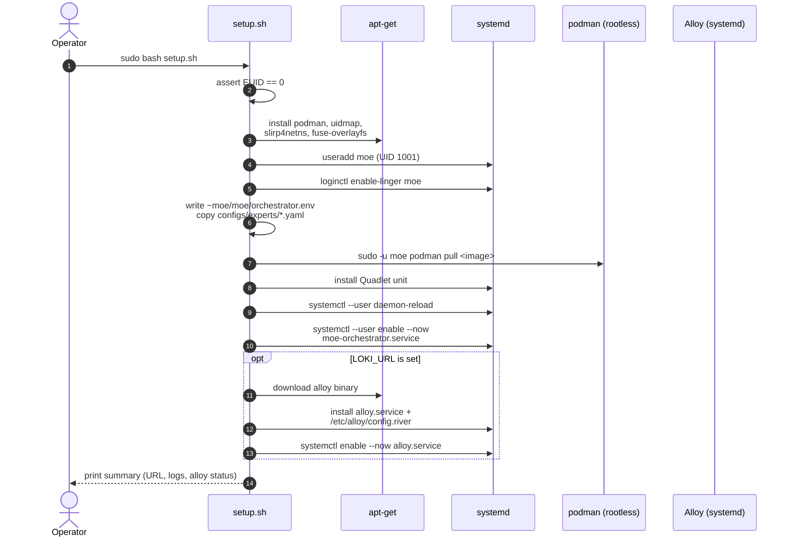

# LXC / Proxmox Deployment

Target: a fresh Debian 12 or Ubuntu 22.04/24.04 LXC container — typically on
Proxmox, but any unprivileged LXC environment works. The orchestrator runs as
a **rootless Podman** container managed by **systemd Quadlet**, with optional
**Grafana Alloy** as a native systemd service for observability.

## Why Podman (not Docker) in LXC?



- **No privileged LXC flags needed.** Docker inside an unprivileged LXC needs
  nesting + keyctl + potentially cgroupv2 tweaks. Rootless Podman works out
  of the box.
- **systemd-native lifecycle.** Quadlet (Podman ≥ 4.4) lets systemd manage the
  container as if it were a first-class unit: `systemctl --user status`,
  auto-restart, dependency ordering — all free.
- **Journald log driver** means the orchestrator's stdout/stderr lands in the
  host journal, where Alloy can scrape it without bind-mounts.

## One-command bootstrap

From a git checkout inside the LXC:

```bash
sudo VERSION=0.1.0 \
     LOKI_URL=https://loki.example.com/loki/api/v1/push \
     TEMPO_URL=tempo.example.com:4317 \
     MOE_CLUSTER=lxc-edge-1 \
     bash deploy/lxc/setup.sh
```

What the script does (see `deploy/lxc/setup.sh`):



Expected runtime on a 2-vCPU LXC: **~60 seconds** (plus image pull time).

## Environment variables

The script honours all of these; any unset variable has the sensible default
noted.

| Variable | Default | Purpose |
|---|---|---|
| `VERSION` | `latest` | Image tag to pull |
| `MOE_REGISTRY` | `ghcr.io/moe-sovereign` | OCI registry |
| `MOE_USER` | `moe` | Service account name |
| `MOE_UID` | `1001` | Service account UID (matches image) |
| `LOKI_URL` | *(empty)* | Loki push endpoint; **empty disables Alloy install** |
| `TEMPO_URL` | *(empty)* | OTLP gRPC endpoint for traces |
| `PROM_REMOTE_WRITE_URL` | *(empty)* | Prometheus remote_write URL |
| `MOE_CLUSTER` | `lxc` | Label applied to every log line |
| `ALLOY_VERSION` | `latest` | Grafana Alloy release |

## The Quadlet unit

File: `deploy/podman/systemd/moe-orchestrator.container`

```ini
[Container]
Image=ghcr.io/moe-sovereign/orchestrator:latest
Volume=%h/moe/logs:/app/logs:Z
Volume=%h/moe/cache:/app/cache:Z
Volume=%h/moe/experts:/app/configs/experts:Z,ro
ReadOnly=true
Tmpfs=/tmp:rw,size=64m
PublishPort=8000:8000
LogDriver=journald
NoNewPrivileges=true
DropCapability=ALL
UserNS=keep-id
```

This mirrors the k8s `containerSecurityContext` byte-for-byte — so the
"same binary, same behaviour" guarantee holds from LXC all the way up to
OpenShift.

## Operating the service

```bash
# status
sudo -u moe XDG_RUNTIME_DIR=/run/user/1001 \
    systemctl --user status moe-orchestrator

# live logs (via journald)
sudo journalctl -u user@1001.service -u moe-orchestrator --follow

# restart after editing orchestrator.env
sudo -u moe XDG_RUNTIME_DIR=/run/user/1001 \
    systemctl --user restart moe-orchestrator

# update to a new image tag
sudo -u moe XDG_RUNTIME_DIR=/run/user/1001 \
    podman pull ghcr.io/moe-sovereign/orchestrator:0.2.0
sudo sed -i 's|:0.1.0|:0.2.0|' \
    /home/moe/.config/containers/systemd/moe-orchestrator.container
sudo -u moe XDG_RUNTIME_DIR=/run/user/1001 \
    systemctl --user daemon-reload
sudo -u moe XDG_RUNTIME_DIR=/run/user/1001 \
    systemctl --user restart moe-orchestrator
```

## Proxmox-specific notes

- **Nesting**: not required for rootless Podman. Leave `Features: nesting=0`.
- **Unprivileged**: `unprivileged: 1` is recommended.
- **Sub-UID/GID**: the script writes `moe:100000:65536` to `/etc/subuid` and
  `/etc/subgid` — but LXC already maps the container into a sub-range, so the
  effective UIDs on the Proxmox host end up in the 200000-range. No manual
  tuning needed for a standard Proxmox template.
- **AppArmor**: the default `lxc-container-default-cgns` profile is sufficient.

## Uninstall

```bash
sudo -u moe XDG_RUNTIME_DIR=/run/user/1001 \
    systemctl --user disable --now moe-orchestrator
sudo rm /home/moe/.config/containers/systemd/moe-orchestrator.container
sudo systemctl disable --now alloy 2>/dev/null || true
sudo rm -f /etc/systemd/system/alloy.service /etc/alloy/config.river
sudo -u moe podman rmi ghcr.io/moe-sovereign/orchestrator:latest
sudo loginctl disable-linger moe
sudo userdel -r moe
```
