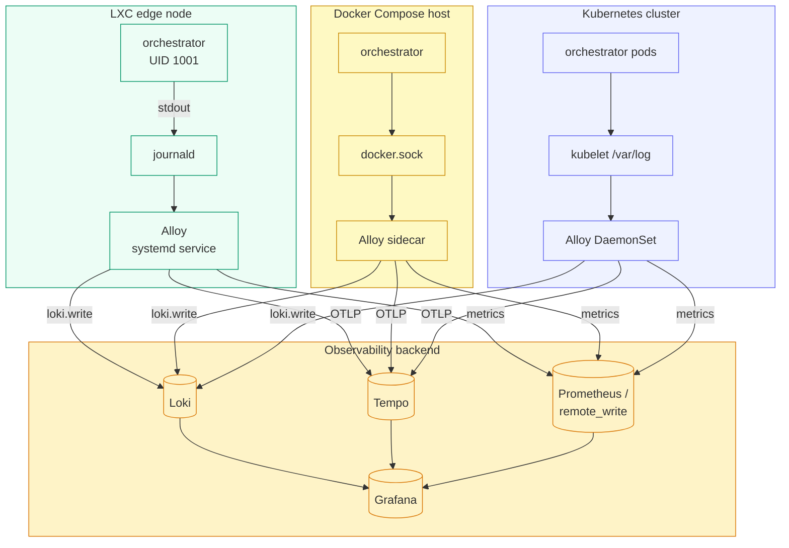
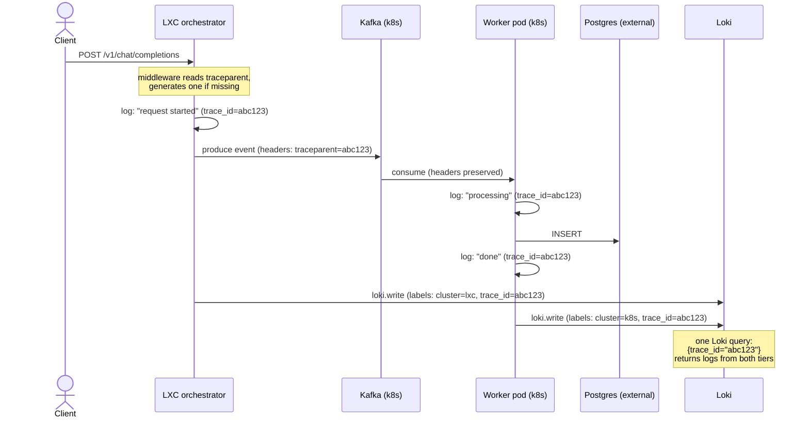

# Universal Observability with Grafana Alloy

One of the hardest parts of a multi-tier deployment is **correlating logs and
traces across tiers**. A user request that enters the orchestrator on an LXC
edge node, crosses into a Kafka cluster on Kubernetes, and ends in a Postgres
write on an external DB host should be visible as **a single trace** in your
observability backend.

MoE Sovereign solves this with a single Grafana Alloy config (`deploy/alloy/alloy.river`)
and W3C `traceparent`-header propagation in the orchestrator middleware.

## The universal pipeline



**The same `alloy.river` file runs in all three tiers.** Only the log-source
component differs (`loki.source.journal` for LXC, `loki.source.docker` for
Compose, `loki.source.kubernetes` for k8s) — everything downstream is identical.

## Trace-ID propagation



The key ingredient is a tiny Alloy pipeline stage that extracts the hex trace
ID from the log line and promotes it to a Loki label:

```hcl
loki.process "enrich" {
  stage.regex {
    expression = "traceparent=00-(?P<trace_id>[0-9a-f]{32})-"
  }
  stage.labels {
    values = { trace_id = "" }
  }
}
```

With that label in place, Grafana's **"Derived Fields"** feature turns every
`trace_id` label in a Loki panel into a clickable link to the matching Tempo
trace — giving you end-to-end observability across heterogeneous wrappers.

## Required environment variables

These are read by Alloy at startup (via `/etc/default/alloy` in LXC, env
block in the DaemonSet):

| Variable | Example | Purpose |
|---|---|---|
| `LOKI_URL` | `https://loki.example.com/loki/api/v1/push` | Loki push endpoint |
| `TEMPO_URL` | `tempo.example.com:4317` | OTLP gRPC for Tempo |
| `PROM_REMOTE_WRITE_URL` | `https://prom.example.com/api/v1/write` | Prometheus remote_write |
| `MOE_HOSTNAME` | `lxc-edge-1` | Host label applied to every log |
| `MOE_CLUSTER` | `lxc` / `homelab` / `prod-eu1` | Cluster label — the primary dimension for cross-tier filtering |

## Metrics side

The orchestrator exposes a `prometheus_client` endpoint at `:8000/metrics`.
Alloy scrapes it every 15 s and forwards via `prometheus.remote_write`:

```hcl
prometheus.scrape "moe_orchestrator" {
  targets         = [{ __address__ = "127.0.0.1:8000", job = "moe-orchestrator" }]
  metrics_path    = "/metrics"
  scrape_interval = "15s"
  forward_to      = [prometheus.remote_write.default.receiver]
}
```

So even in a federated setup where LXC edges write to a central Prometheus,
the metric label set (`cluster`, `host`, `job`) matches the Loki label set —
you can pivot from a Grafana dashboard panel straight into the matching logs.

## Quick smoke test

On any tier, after deployment:

```bash
# 1. Fire a request with a known trace id
TID=$(openssl rand -hex 16)
curl -X POST http://<orchestrator>:8000/v1/chat/completions \
     -H "traceparent: 00-${TID}-$(openssl rand -hex 8)-01" \
     -H 'Content-Type: application/json' \
     -d '{"model":"auto","messages":[{"role":"user","content":"ping"}]}'

# 2. Find the same trace_id in Loki (from any tier)
#    In Grafana: { cluster=~".+" } |= "$TID"

# 3. Click the trace_id in the result → Tempo trace opens
```

If step 2 returns lines from more than one `cluster` label, the cross-tier
correlation is working.
