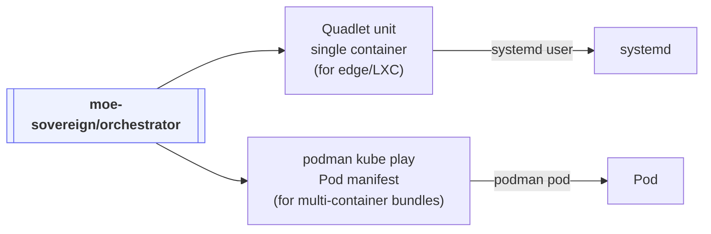

# Podman (rootless + Quadlet)

Podman is the bridge between "one Docker host" and "full Kubernetes". It runs
the exact same OCI image as the other wrappers — rootless, with systemd-native
lifecycle management via Quadlet.

## Two deployment shapes



- **Quadlet** (`deploy/podman/systemd/moe-orchestrator.container`) is the right
  choice when you want systemd-native lifecycle for a **single orchestrator
  container** — used by the [LXC wrapper](lxc.md).
- **`podman kube play`** (`deploy/podman/kube.yaml`) is the right choice when
  you want to bundle orchestrator + mcp + admin as a **Pod** that can later be
  lifted into Kubernetes without a rewrite.

## Rootless execution

```bash
# Create a dedicated user (same UID the image expects)
sudo useradd -u 1001 -m moe
sudo loginctl enable-linger moe

# Pull and start
sudo -u moe podman pull ghcr.io/moe-sovereign/orchestrator:latest
sudo -u moe podman run -d --name moe \
    --user 1001 --read-only --tmpfs /tmp:rw \
    -p 8000:8000 \
    -v /home/moe/moe/logs:/app/logs:Z \
    -e MOE_PROFILE=team \
    ghcr.io/moe-sovereign/orchestrator:latest
```

No `sudo docker` and no privileged flags: Podman's user-namespace mapping
handles everything.

## Lifting a pod into Kubernetes

The Pod YAML at `deploy/podman/kube.yaml` is a valid Kubernetes manifest. The
same file can be applied directly:

```bash
# Local: run as rootless Podman pod
podman kube play deploy/podman/kube.yaml

# Later, same YAML on k8s
kubectl apply -f deploy/podman/kube.yaml
```

This is the "compose → k8s bridge" that makes moving between tiers painless.

## Why prefer Quadlet over `podman generate systemd`?

`podman generate systemd` is deprecated as of Podman 4.4. Quadlet is the
successor: you drop a `.container` file into
`~/.config/containers/systemd/`, reload systemd, and a matching `.service`
unit is auto-generated. See the [LXC page](lxc.md#the-quadlet-unit) for the
full unit file.
