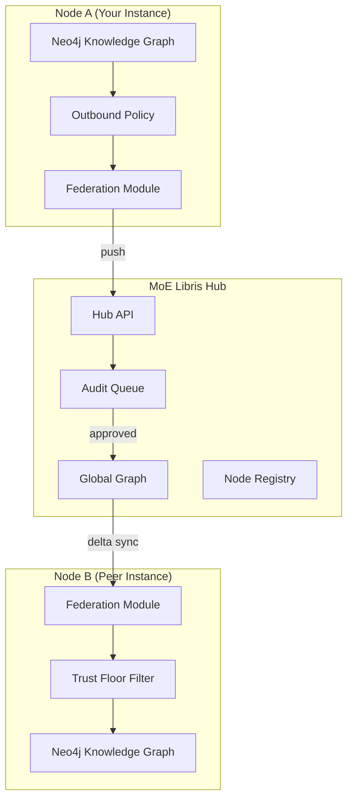

# Federation

## MoE Libris -- Federated Knowledge Exchange

**MoE Libris** is the federation layer for MoE Sovereign. It enables independent MoE Sovereign instances to exchange verified knowledge triples, building a shared knowledge graph across organizational boundaries while preserving data sovereignty.

!!! info "Etymology"
    The name *Libris* draws from Latin *liber* -- meaning both "free" and "book." Federation makes knowledge free to flow between trusted nodes, while each node maintains its own library of verified facts.

---

## Why Federation?

A single MoE Sovereign instance accumulates domain knowledge through its Neo4j knowledge graph and causal learning loop. Federation extends this to a network of instances:

- **Knowledge amplification** -- Triples verified by one node become available to all trusted peers.
- **Data sovereignty** -- Each node controls what it shares via outbound policies and what it accepts via trust floors.
- **No central authority** -- The hub coordinates exchange but does not own or control any node's data.

---

## Architecture

---

## Fediverse Inspiration

MoE Libris follows patterns established by the Fediverse (ActivityPub, Friendica, Mastodon):

| Fediverse Concept | MoE Libris Equivalent |
|---|---|
| Instance | MoE Sovereign Node |
| Follow / Accept | Handshake (register, accept, key exchange) |
| Post | Knowledge triple bundle (JSON-LD) |
| Moderation | Pre-audit pipeline + admin approval |
| Block list | Outbound policy (per-domain blocked) |
| Federation relay | MoE Libris Hub |

The key difference: while social federation distributes posts, MoE Libris distributes **verified knowledge triples** with confidence scores and provenance tracking.

---

## Getting Started

-   **Setup Guide**

    ---

    Configure your node for federation, connect to a hub, and perform your first sync.

    [:octicons-arrow-right-24: Setup Guide](setup.md)

-   **Protocol**

    ---

    Handshake flow, push/pull cycles, JSON-LD bundle format, and API endpoints.

    [:octicons-arrow-right-24: Protocol](protocol.md)

-   **Trust & Security**

    ---

    Pre-audit pipeline, abuse prevention, trust floors, and privacy scrubbing.

    [:octicons-arrow-right-24: Trust & Security](trust.md)

-   **Server Discovery**

    ---

    Register your server in the public registry and discover peers.

    [:octicons-arrow-right-24: Server Discovery](registry.md)

