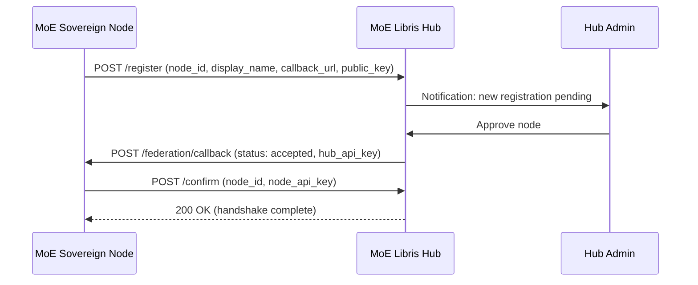
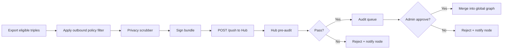
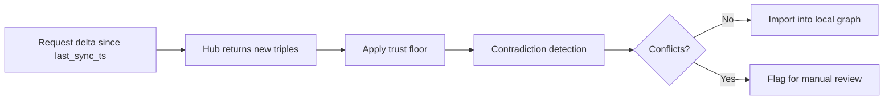

# Federation Protocol

This page describes the wire protocol used by MoE Libris for node-to-hub communication, including handshake, push/pull cycles, and the JSON-LD bundle format.

---

## Handshake Flow

Before a node can exchange knowledge with the hub, it must complete a four-step handshake:



| Step | Direction | Description |
|------|-----------|-------------|
| **1. Register** | Node to Hub | Node sends its identity and public key. Status: `pending`. |
| **2. Accept** | Hub Admin | Hub admin reviews and approves the node. |
| **3. Key Exchange** | Hub to Node | Hub sends its API key to the node's callback URL. |
| **4. Confirm** | Node to Hub | Node confirms and sends its own API key. Handshake complete. |

!!! warning "Security"
    Both the registration and callback requests must use HTTPS. The public key sent during registration is used to verify the authenticity of subsequent push/pull requests via signed payloads.

---

## Push Cycle

The push cycle exports knowledge triples from a node to the hub.



### Push Steps in Detail

1. **Export** -- The node queries its Neo4j knowledge graph for triples meeting the outbound policy criteria (domain, confidence threshold, verified-only flag).
2. **Policy Filter** -- Triples are filtered against per-domain outbound rules (`auto`, `manual`, `blocked`).
3. **Privacy Scrubber** -- Personally identifiable information, internal hostnames, file paths, and user identifiers are stripped from triple metadata (see [Trust & Security -- Privacy Scrubber](trust.md#privacy-scrubber)).
4. **Sign** -- The bundle is signed with the node's private key.
5. **Submit** -- The signed JSON-LD bundle is sent to `POST /api/v1/push`.
6. **Pre-Audit** -- The hub runs automated checks (syntax validation, heuristic analysis). See [Trust & Security -- Pre-Audit Pipeline](trust.md#pre-audit-pipeline).
7. **Audit Queue** -- Triples that pass pre-audit enter the hub admin's review queue.
8. **Approval** -- Hub admin approves or rejects the bundle.
9. **Merge** -- Approved triples are merged into the global graph with provenance metadata.

---

## Pull Cycle

The pull cycle imports knowledge from the hub's global graph into a node.



### Pull Steps in Detail

1. **Delta Request** -- The node sends `GET /api/v1/pull?since=<timestamp>` with its last successful sync timestamp.
2. **Hub Response** -- The hub returns all triples added or updated since that timestamp, excluding triples originating from the requesting node.
3. **Trust Floor** -- Imported triples have their confidence score capped at the node's configured trust floor (default: `0.5`). A triple with `confidence: 0.92` on the hub is stored locally as `confidence: 0.5`.
4. **Contradiction Detection** -- Each imported triple is checked against existing local triples for semantic contradictions.
5. **Import or Flag** -- Non-conflicting triples are imported. Conflicting triples are flagged for manual review with both the local and remote versions shown side-by-side.

---

## JSON-LD Bundle Format

Knowledge is exchanged as JSON-LD bundles. Each bundle contains one or more triples with metadata:

```json
{
  "@context": "https://moe-libris.org/ns/v1",
  "@type": "KnowledgeBundle",
  "source_node": "moe-sovereign-lab-01",
  "timestamp": "2026-04-13T10:00:00Z",
  "signature": "base64-encoded-signature",
  "triples": [
    {
      "@type": "Triple",
      "subject": "Python GIL",
      "predicate": "was_removed_in",
      "object": "Python 3.13 (PEP 703, experimental)",
      "domain": "programming",
      "confidence": 0.95,
      "provenance": {
        "source": "causal_learning",
        "verified_by": "judge_llm",
        "created_at": "2026-04-10T14:30:00Z"
      }
    },
    {
      "@type": "Triple",
      "subject": "Transformer attention",
      "predicate": "has_complexity",
      "object": "O(n^2) with sequence length",
      "domain": "machine_learning",
      "confidence": 0.88,
      "provenance": {
        "source": "user_interaction",
        "verified_by": "judge_llm",
        "created_at": "2026-04-09T09:15:00Z"
      }
    }
  ]
}
```

### Bundle Fields

| Field | Type | Description |
|-------|------|-------------|
| `@context` | string | JSON-LD context URL |
| `@type` | string | Always `KnowledgeBundle` |
| `source_node` | string | Node ID of the sender |
| `timestamp` | ISO 8601 | Bundle creation time |
| `signature` | string | Base64-encoded signature using the node's private key |
| `triples` | array | Array of triple objects |

### Triple Fields

| Field | Type | Description |
|-------|------|-------------|
| `subject` | string | The entity or concept |
| `predicate` | string | The relationship |
| `object` | string | The related entity, value, or fact |
| `domain` | string | Knowledge domain (e.g., `programming`, `machine_learning`) |
| `confidence` | float | Confidence score (0.0--1.0) |
| `provenance` | object | Origin and verification metadata |

---

## API Endpoints Reference

All endpoints are relative to the hub's base URL (e.g., `https://hub.moe-libris.org/api/v1`).

| Method | Endpoint | Auth | Description |
|--------|----------|------|-------------|
| `POST` | `/register` | None | Register a new node |
| `POST` | `/confirm` | API Key | Confirm handshake after key exchange |
| `GET` | `/health` | API Key | Hub health and node status |
| `POST` | `/push` | API Key | Push a knowledge bundle |
| `GET` | `/pull` | API Key | Pull delta since timestamp |
| `GET` | `/pull?since=<ts>` | API Key | Pull with explicit sync point |
| `GET` | `/nodes` | API Key | List all registered nodes |
| `GET` | `/nodes/{node_id}` | API Key | Get details for a specific node |
| `POST` | `/nodes/{node_id}/block` | Hub Admin | Block a node |
| `POST` | `/nodes/{node_id}/unblock` | Hub Admin | Unblock a node |
| `GET` | `/audit/pending` | Hub Admin | List bundles awaiting review |
| `POST` | `/audit/{bundle_id}/approve` | Hub Admin | Approve a bundle |
| `POST` | `/audit/{bundle_id}/reject` | Hub Admin | Reject a bundle |

!!! tip "Rate Limits"
    The hub enforces rate limits per node. Default limits are 60 requests/minute for read operations and 10 requests/minute for push operations. Nodes in the `rate_limited` abuse tier have these limits reduced by 75%.

---

## Multi-Hub Topology

MoE Libris supports multiple independent hubs. Each MoE Sovereign instance can connect to multiple hubs simultaneously, and hubs can exchange knowledge with each other.

### Hub-to-Hub Federation

A Libris hub is itself a federation node. It can register with another hub via the same handshake protocol used by MoE Sovereign instances. This enables hierarchical and mesh topologies:

```mermaid
graph TB
    subgraph "Regional Hub A (Europe)"
        HA["Libris Hub A"]
        NA1["Node A1<br/>University Hamburg"]
        NA2["Node A2<br/>Fraunhofer IAIS"]
        NA1 -->|push/pull| HA
        NA2 -->|push/pull| HA
    end

    subgraph "Regional Hub B (Asia)"
        HB["Libris Hub B"]
        NB1["Node B1<br/>Tokyo Institute"]
        NB2["Node B2<br/>KAIST"]
        NB1 -->|push/pull| HB
        NB2 -->|push/pull| HB
    end

    subgraph "Global Hub"
        HG["Libris Hub G<br/>(Global Aggregator)"]
    end

    HA <-->|hub-to-hub sync| HG
    HB <-->|hub-to-hub sync| HG
    HA <-.->|direct peering<br/>(optional)| HB
```

### How Hub-to-Hub Sync Works

A hub acts as both **provider** (serving pull requests) and **consumer** (pushing to other hubs):

1. **Hub A registers with Hub G** via `POST /v1/federation/handshake` — same as any node. Hub G's admin accepts.
2. **Hub A pushes approved knowledge** from its global graph to Hub G via `POST /v1/federation/push`. Only triples that passed Hub A's own audit queue are forwarded.
3. **Hub G receives the bundle**, runs its own pre-audit pipeline (independent validation), queues for its admin to approve.
4. **Hub G's admin approves** — triples enter Hub G's global graph.
5. **Hub B pulls from Hub G** via `GET /v1/federation/pull` — receives triples originating from Hub A (provenance preserved via `origin_node_id`).

This means: **every hop is audited independently**. Hub G does not blindly trust Hub A's approval — it re-validates and re-audits. This is the key difference from a replication system.

### Topology Patterns

| Pattern | Description | Use Case |
|---------|-------------|----------|
| **Star** | Multiple nodes → single hub | Single organisation, departmental sharing |
| **Hierarchical** | Regional hubs → global hub | Multi-national consortium |
| **Mesh** | Hubs peer directly with each other | Research networks, no central authority |
| **Hybrid** | Mix of star, hierarchical, and mesh | Large-scale deployment |

### Trust Propagation Across Hubs

When a triple traverses multiple hubs, trust is **attenuated, not amplified**:

- Node A exports with `confidence: 0.9`
- Hub A caps at its trust floor: `trust_score: min(0.9, 0.5) = 0.5`
- Hub G receives and caps again: `trust_score: min(0.5, 0.5) = 0.5`
- Hub B pulls and imports: `trust_score: min(0.5, 0.5) = 0.5`

Trust cannot increase through federation — only local verification (admin marking `verified: true`) raises trust above the floor.

### Configuration

A hub connects to another hub by configuring itself as a federation client in the MoE Admin UI → Federation tab:

| Setting | Value |
|---------|-------|
| **Hub URL** | URL of the upstream hub (e.g., `https://global-hub.example.org`) |
| **API Key** | Key received during handshake acceptance |
| **Node ID** | This hub's unique identifier |
| **Domain Policies** | Which domains to forward (auto/manual/blocked) |

### Open Research: Multi-Hub Challenges

!!! warning "Current Limitations"
    - **Loop detection**: If Hub A → Hub G → Hub B → Hub A, triples could circle. Current mitigation: `origin_node_id` prevents re-importing own triples, but transitive loops across 3+ hubs are not yet detected.
    - **Conflict resolution**: Two hubs may approve contradictory triples. The contradiction detection works per-hub but not cross-hub.
    - **Latency**: Multi-hop propagation adds review latency at each hub (human-in-the-loop).
    - **No cryptographic signatures**: Bundles are not signed, so provenance is trust-based, not cryptographically verifiable.
