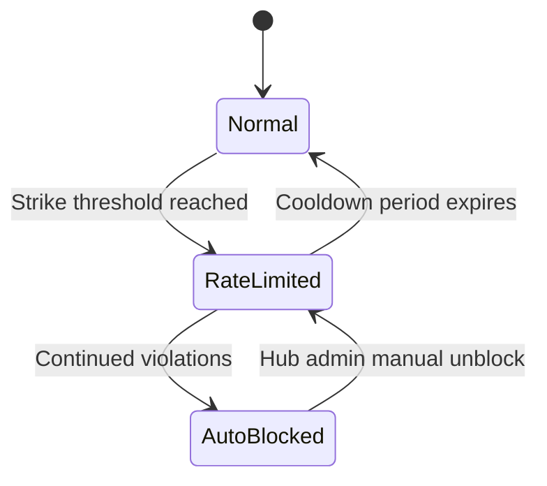

# Trust & Security Model

Federation introduces a trust boundary between independent MoE Sovereign instances. This page documents the mechanisms that ensure only high-quality, safe knowledge enters and leaves your node.

---

## Pre-Audit Pipeline

Every pushed bundle is processed by the hub's pre-audit pipeline before entering the admin review queue. The pipeline has two stages:

### Stage 1: Syntax Validation

Automated structural checks that run instantly:

- **JSON-LD schema validation** -- Bundle must conform to the MoE Libris JSON-LD context.
- **Required fields** -- All triple fields (`subject`, `predicate`, `object`, `domain`, `confidence`) must be present and non-empty.
- **Confidence range** -- Confidence must be a float between 0.0 and 1.0.
- **Signature verification** -- The bundle signature is verified against the node's registered public key.
- **Timestamp sanity** -- Bundle timestamp must not be in the future and must not be older than 30 days.

A Stage 1 failure immediately rejects the bundle with a detailed error response.

### Stage 2: Heuristic Analysis

Pattern-based checks that detect potentially harmful or low-quality content:

| Check | Pattern | Action |
|-------|---------|--------|
| **Prompt injection** | Regex: `ignore previous`, `system:`, `<\|im_start\|>` and similar control sequences | Reject + security strike |
| **Encoded payloads** | Base64/hex patterns in subject or object fields | Flag for review |
| **Excessive length** | Any single field exceeding 2048 characters | Reject |
| **Repetition** | Same triple submitted more than 3 times within 24 hours | Reject + syntax strike |
| **URL injection** | URLs in subject/predicate fields (objects may contain URLs) | Flag for review |
| **Profanity/abuse** | Configurable word list | Reject + security strike |

!!! info "Heuristic Updates"
    The heuristic rule set is maintained by the hub operator. Nodes receive updated rules during each pull cycle.

---

## Abuse Prevention

The hub maintains an abuse prevention system with three tiers:

### Tiers

| Tier | Condition | Effect |
|------|-----------|--------|
| **Normal** | Default state | Full rate limits, bundles enter audit queue normally |
| **Rate Limited** | 5+ strikes within 7 days | Rate limits reduced by 75%, bundles flagged as low-priority in audit queue |
| **Auto-Blocked** | 3+ strikes while already rate-limited | Node is blocked from pushing. Pull access remains active. Hub admin must manually unblock. |

### Strike System

Strikes are accumulated per node and decay after 7 days:

| Strike Type | Weight | Examples |
|-------------|--------|----------|
| **Syntax Strike** | 1x | Missing fields, invalid confidence, duplicate submissions |
| **Security Strike** | 3x | Prompt injection, profanity, encoded payloads confirmed as malicious |

The effective strike count is: `syntax_strikes + (3 * security_strikes)`. The rate-limit threshold is **5 effective strikes** within a rolling 7-day window.

!!! warning "Security Strikes"
    Security strikes carry 3x weight because they indicate either a compromised node or a malicious operator. A single confirmed prompt injection attempt (3 effective strikes) plus two duplicate submissions (2 effective strikes) is enough to trigger rate limiting.

---

## Trust Floor

The trust floor is the core mechanism preventing blind trust propagation across the federation:

- Every imported triple has its confidence score **capped** at the node's configured trust floor.
- Default trust floor: **0.5** (configurable per node in the Admin UI).
- This means an imported triple -- regardless of how confident the originating node was -- starts at moderate confidence locally.
- Local verification (through the causal learning loop or manual confirmation) can raise the confidence above the trust floor.

**Example:**

| Triple | Remote Confidence | Local Trust Floor | Stored Locally As |
|--------|-------------------|-------------------|-------------------|
| "Rust is memory-safe" | 0.95 | 0.5 | 0.5 |
| "Earth is flat" | 0.30 | 0.5 | 0.30 (below floor, kept as-is) |

The trust floor is a **cap**, not a minimum. Triples with confidence below the floor retain their original (lower) score.

---

## Contradiction Detection

When importing triples, the federation module checks for semantic contradictions against the local knowledge graph:

1. **Subject-predicate match** -- Find local triples with the same subject and predicate as the imported triple.
2. **Object comparison** -- If the objects differ, flag as a potential contradiction.
3. **Confidence comparison** -- If the local triple has higher confidence, the import is deprioritized; if lower, it is flagged for review.
4. **Manual resolution** -- Contradictions are presented in the Admin UI with both versions side-by-side. The admin can:
    - Keep the local triple and discard the import
    - Replace the local triple with the import
    - Keep both (if they represent different valid perspectives)
    - Merge into a more precise triple

!!! tip "Automatic Resolution"
    If `FEDERATION_AUTO_IMPORT` is enabled, contradictions are still flagged for manual review -- auto-import only applies to non-conflicting triples.

---

## Outbound Policy

Each node controls what knowledge it shares via per-domain outbound policies, configured in the Admin UI under **Federation > Outbound Policy**.

### Per-Domain Rules

| Mode | Behavior |
|------|----------|
| **Auto** | Triples in this domain are included in push bundles automatically |
| **Manual** | Triples in this domain are queued for admin review before push |
| **Blocked** | Triples in this domain are never pushed |

### Global Filters

In addition to per-domain rules, global filters apply to all outbound triples:

| Filter | Default | Description |
|--------|---------|-------------|
| **Confidence Threshold** | `0.7` | Only push triples with confidence at or above this value |
| **Verified Only** | `true` | Only push triples that have been verified by the judge LLM |
| **Min Age** | `24h` | Only push triples older than this (prevents pushing volatile, recently-learned knowledge) |

---

## Privacy Scrubber

Before any triple leaves the node, the privacy scrubber removes sensitive metadata:

| Data Type | Action |
|-----------|--------|
| **User identifiers** | Stripped from provenance (replaced with `anonymous`) |
| **Internal hostnames** | Removed or replaced with `[internal]` |
| **File paths** | Removed or replaced with `[path]` |
| **IP addresses** | Removed |
| **API keys / tokens** | Detected via regex and removed |
| **Email addresses** | Removed |

The scrubber runs after the outbound policy filter and before signing. The signed bundle contains only scrubbed data, ensuring the original sensitive metadata never leaves the node.

!!! warning "Custom Scrubber Rules"
    If your knowledge graph contains domain-specific sensitive data (e.g., patient IDs, internal project names), add custom scrubber rules in the Admin UI under **Federation > Privacy Rules**.
