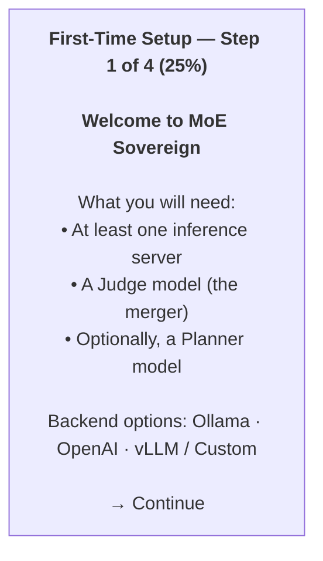

# First-Time Setup

After installation, the Admin UI automatically redirects first-time visitors to the **Setup Wizard**. This wizard runs whenever no inference servers are configured.

---

## Why Inference Servers Are Required

MoE Sovereign is a *Multi-Model Orchestrator* — it routes requests to specialized LLM models and merges their answers. Without at least one inference server (an LLM API endpoint), the system cannot route, plan, or respond to any queries.

The minimum viable configuration is:

- **1 inference server** (Ollama, OpenAI, LiteLLM, vLLM, or any OpenAI-compatible API)
- **1 Judge model** (the merger/synthesizer — can be the same model used for experts)

A separate Planner model is optional but recommended for large multi-GPU setups.

---

## Supported Backend Types

| Type | Example URL | Notes |
|---|---|---|
| **Ollama** (local) | `http://localhost:11434/v1` | Recommended for self-hosted GPU setups |
| **OpenAI API** | `https://api.openai.com/v1` | Use your OpenAI API key as the token |
| **LiteLLM** | `http://localhost:4000/v1` | Proxy for multiple providers |
| **vLLM** | `http://localhost:8000/v1` | High-performance inference server |
| **Any OpenAI-compatible** | `http://<host>:<port>/v1` | API must match the `/v1/chat/completions` schema |

---

## Wizard Walkthrough

### Step 1 — Welcome

The first screen explains what you will need. No input required — click **Continue**.



### Step 2 — Inference Servers

Add one or more LLM inference servers. Each row represents one server node.

| Field | Description | Example |
|---|---|---|
| **Name** | A short identifier (used in logs and model assignments) | `RTX`, `GPU1`, `OpenAI` |
| **URL** | Full base URL of the OpenAI-compatible API | `http://192.168.1.10:11434/v1` |
| **GPUs** | Number of GPUs on this node (informational) | `2` |
| **API Type** | `Ollama` or `OpenAI` — controls how the API is called | |
| **API Key / Token** | Authentication token (use `ollama` for local Ollama) | |

!!! tip "Local Ollama"
    If running Ollama on the same host as MoE Sovereign, use the Docker network address:
    `http://host.docker.internal:11434/v1` or the host IP `http://192.168.x.x:11434/v1`

Click **Add server** to add more rows. Click **Continue** when done.

### Step 3 — Core Models

Select the **Judge model** and optionally a **Planner model**.

**Judge model** — the merger/synthesizer. This model receives all expert responses and produces the final answer. Choose your most capable model.

**Planner model** — the routing brain. This model decomposes incoming requests and decides which experts to call. If left blank, the Judge model is used for planning as well.

| Setting | Recommendation |
|---|---|
| Single-GPU setup | Use the same model for Judge and Planner |
| Multi-GPU setup | Dedicate a fast small model (e.g. 8B) to planning, large model (e.g. 70B) to judging |

!!! note "Model names"
    For Ollama, model names follow the `name:tag` format (e.g. `qwen2.5:72b`, `llama3.1:8b`).
    For OpenAI, use the full model identifier (e.g. `gpt-4o`, `gpt-4-turbo`).

### Step 4 — Public Access URLs

Optional. Skip this step if using MoE Sovereign locally.

| Field | Description | Example |
|---|---|---|
| **Base URL** | API endpoint shown in response links | `https://moe-sovereign.org:8088` |
| **Public Admin URL** | URL of the Admin UI (if using Caddy) | `https://admin.moe-sovereign.org` |
| **Public API URL** | URL of the API endpoint (if using Caddy) | `https://api.moe-sovereign.org` |

Click **Launch Dashboard** to finish.

---

## After the Wizard

Once the wizard completes, the orchestrator restarts and applies the new configuration. The dashboard becomes available with all features enabled.

**Recommended next steps:**

1. **Expert Templates** → `/templates` — create model assignment templates for your users
2. **User Management** → `/users` — add users and assign templates
3. **Claude Code Profiles** → `/profiles` — configure agentic coding presets
4. **Monitoring** → `/` (dashboard) — verify all containers are green

---

## Repeating the Wizard

The wizard triggers automatically whenever `INFERENCE_SERVERS` is empty. To re-run it:

1. Go to the **Configuration** tab in the dashboard
2. Clear the Inference Servers table and save
3. The next page load will redirect to `/setup`

Or set it manually via the `.env` file:

```bash
sudo docker compose exec moe-admin bash -c \
  'sed -i "s/^INFERENCE_SERVERS=.*/INFERENCE_SERVERS=[]/" /app/.env'
sudo docker compose restart moe-admin
```

---

## Minimum Viable Config Example

For a single Ollama server with one large model:

| Setting | Value |
|---|---|
| Server Name | `Local` |
| Server URL | `http://192.168.1.10:11434/v1` |
| API Type | Ollama |
| API Key | `ollama` |
| Judge Model | `qwen2.5:72b` |
| Judge Endpoint | `Local` |
| Planner Model | *(leave blank)* |

This gives you a fully functional MoE Sovereign instance using a single model for all roles. Expert Templates can later assign specialized models per category.
