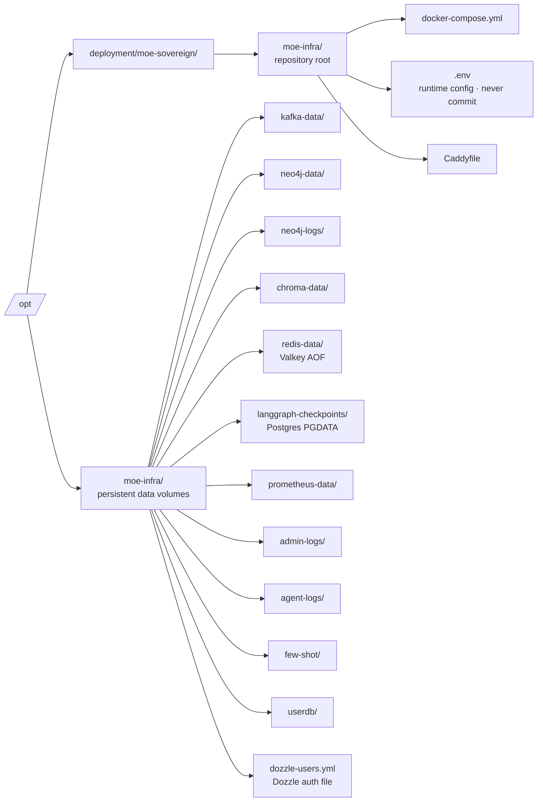

# Installation

## Requirements

| Resource | Minimum | Recommended |
|---|---|---|
| OS | Any Linux with Docker or Podman | See note below |
| RAM | 8 GB | 16 GB+ |
| Disk | 40 GB | 100 GB+ |
| CPU | 2 cores | 8 cores+ |
| GPU | optional | NVIDIA (CUDA), AMD (ROCm) |
| Container runtime | Docker CE 24+ **or** Podman 4+ | Docker CE (latest) |
| Internet | Required for setup | Optional after setup |

!!! info "Distribution independence"
    The stack runs via **Docker Compose or Podman Compose** — it has no
    OS-level dependencies beyond the container runtime itself. Any Linux
    distribution that provides Docker or Podman works.

    The **install script** (`install.sh`) is an optional convenience tool
    that sets up the container runtime for you. It currently supports
    **Debian 11–13** and **Ubuntu 22.04–26.04** via `apt`. On all other
    distributions, install Docker CE or Podman manually and then run
    `docker compose up -d` directly — no script needed.

---

## One-Line Install (Debian / Ubuntu)

Run this on a fresh Debian or Ubuntu system as root or with sudo:

```bash
curl -sSL https://moe-sovereign.org/install.sh | bash
```

**Supported by the install script:**

| Distribution | Versions |
|---|---|
| Debian | 11 (bullseye), 12 (bookworm), 13 (trixie) |
| Ubuntu | 22.04 (jammy), 24.04 (noble), 25.04 (plucky), 26.04+ |

The installer will interactively ask for:

1. **Installation directory** — where the repository is cloned (default `/opt/moe-sovereign`)
2. **Data directory** — where container volumes are stored (default `/opt/moe-infra`)
3. **Grafana directory** — for Grafana dashboards and data (default `/opt/grafana`)
4. **Container runtime** — Docker CE or Podman (only prompted if neither is installed)
5. **Admin account** — username and password for the Admin UI
6. **Domain** — public hostname for HTTPS (optional, leave blank for local use)
7. **Reverse proxy** — whether to deploy Caddy (skip if you already run Nginx or Traefik)
8. **SSO / Authentik** — whether to pre-configure OIDC (optional)

Then automatically:

- Installs the chosen container runtime from the official repository if missing
- Creates required host directories with correct ownership
- Clones the repository and generates `.env` with random secrets
- Builds and starts all containers
- Waits for the API to become healthy and prints access URLs

## macOS

`install.sh` is Linux-only (it uses `apt-get`). On macOS use the
dedicated bootstrap script — it generates `.env` with random secrets
and pre-creates the host directories under `$HOME`:

```bash
git clone https://github.com/h3rb3rn/moe-sovereign.git
cd moe-sovereign
bash scripts/bootstrap-macos.sh
docker compose up -d
```

Full walkthrough including Docker Desktop File Sharing setup,
Apple Silicon notes and host-side Ollama (Metal) tips:
[Deployment → macOS](../deployment/macos.md).

---

## Manual Installation (any distribution)

The stack is a standard Docker Compose application. If your distribution is
not covered by the install script, set up your container runtime manually
and then follow these steps.

### 1. Install Docker CE or Podman

=== "Docker CE"

    Follow the [official Docker documentation](https://docs.docker.com/engine/install/)
    for your distribution, or use the commands below for Debian/Ubuntu:

    ```bash
    sudo apt-get update
    sudo apt-get install -y ca-certificates curl gnupg

    sudo install -m 0755 -d /etc/apt/keyrings
    DISTRO=$(. /etc/os-release && echo "$ID")
    curl -fsSL "https://download.docker.com/linux/${DISTRO}/gpg" \
      | sudo gpg --dearmor -o /etc/apt/keyrings/docker.gpg
    sudo chmod a+r /etc/apt/keyrings/docker.gpg

    echo "deb [arch=$(dpkg --print-architecture) signed-by=/etc/apt/keyrings/docker.gpg] \
      https://download.docker.com/linux/${DISTRO} \
      $(. /etc/os-release && echo "$VERSION_CODENAME") stable" \
      | sudo tee /etc/apt/sources.list.d/docker.list

    sudo apt-get update
    sudo apt-get install -y docker-ce docker-ce-cli containerd.io \
      docker-buildx-plugin docker-compose-plugin
    sudo systemctl enable --now docker
    ```

=== "Podman"

    ```bash
    # Debian / Ubuntu (standard repos)
    sudo apt-get install -y podman podman-compose

    # Verify
    podman compose version
    ```

### 2. Create host directories

Adjust the paths to match your preferred layout — these are only the defaults:

```bash
DATA=/opt/moe-infra
GRAFANA=/opt/grafana
INSTALL=/opt/moe-sovereign

sudo mkdir -p \
  "${DATA}"/{kafka-data,neo4j-data,neo4j-logs,agent-logs,\
chroma-onnx-cache,chroma-data,redis-data,langgraph-checkpoints,\
prometheus-data,admin-logs,userdb,few-shot} \
  "${GRAFANA}"/{data,dashboards} \
  "${INSTALL}"
```

### 3. Clone the repository

```bash
git clone https://github.com/h3rb3rn/moe-sovereign.git /opt/moe-sovereign
cd /opt/moe-sovereign
```

### 4. Configure environment

```bash
cp .env.example .env
nano .env   # Fill in required values (see comments in the file)
```

Minimum required values:

```bash
ADMIN_USER=admin
ADMIN_PASSWORD=<your-password>
ADMIN_SECRET_KEY=<openssl rand -hex 32>
REDIS_PASSWORD=<openssl rand -hex 16>
POSTGRES_CHECKPOINT_PASSWORD=<openssl rand -hex 24>
NEO4J_PASS=<openssl rand -hex 16>
GF_SECURITY_ADMIN_PASSWORD=<openssl rand -hex 12>
```

### 5. Create Dozzle auth file

Dozzle (the log viewer) requires a bcrypt-hashed password file:

```bash
sudo apt-get install -y apache2-utils

HASH=$(htpasswd -bnBC 10 "" "YOUR_ADMIN_PASSWORD" | tr -d ':\n' | sed 's/$2y$/$2a$/')
cat > /opt/moe-infra/dozzle-users.yml << EOF
users:
  admin:
    name: admin
    password: "${HASH}"
    email: admin@localhost
EOF
```

### 6. Deploy the stack

```bash
# Docker
sudo docker compose build
sudo docker compose up -d

# Podman
podman compose build
podman compose up -d
```

### 7. Verify

```bash
# Check all containers are running
sudo docker compose ps   # or: podman compose ps

# Wait for the API
curl -f http://localhost:8002/v1/models
```

---

## Directory Layout

After installation, the following directories are used:



---

## Post-Install Checklist

- [ ] All containers are `Up` (`sudo docker compose ps`)
- [ ] Admin UI accessible at your configured URL (port 8088 by default)
- [ ] Complete the [Setup Wizard](first-setup.md) — add at least one inference server
- [ ] Configure Judge and Planner models in the wizard
- [ ] (Optional) Set up Caddy + public domain for HTTPS access

---

## Upgrade

Re-run the install script — it detects an existing installation and runs in
**update mode** (credentials preserved, data volumes untouched):

```bash
curl -sSL https://moe-sovereign.org/install.sh | bash
```

Or manually:

```bash
cd /opt/moe-sovereign   # your INSTALL_DIR
git pull
sudo docker compose build
sudo docker compose up -d
```

Configuration in `.env` is preserved. The database volumes under your data
directory are never touched by `docker compose pull/build`.

---

## Troubleshooting

```bash
# View logs for a specific service
sudo docker compose logs langgraph-app --tail=50 -f

# Restart a service
sudo docker compose restart moe-admin

# Full restart
sudo docker compose down && sudo docker compose up -d

# Check .env is loaded correctly
sudo docker compose exec langgraph-app env | grep JUDGE
```

!!! tip "Podman users"
    Replace `docker compose` with `podman compose` (or `podman-compose`) in all
    commands above. Everything else is identical.

!!! tip "Log Viewer"
    Once running, use the Dozzle log viewer at `https://logs.moe-sovereign.org` (or the Caddy-configured domain) for a browser-based view of all container logs.
