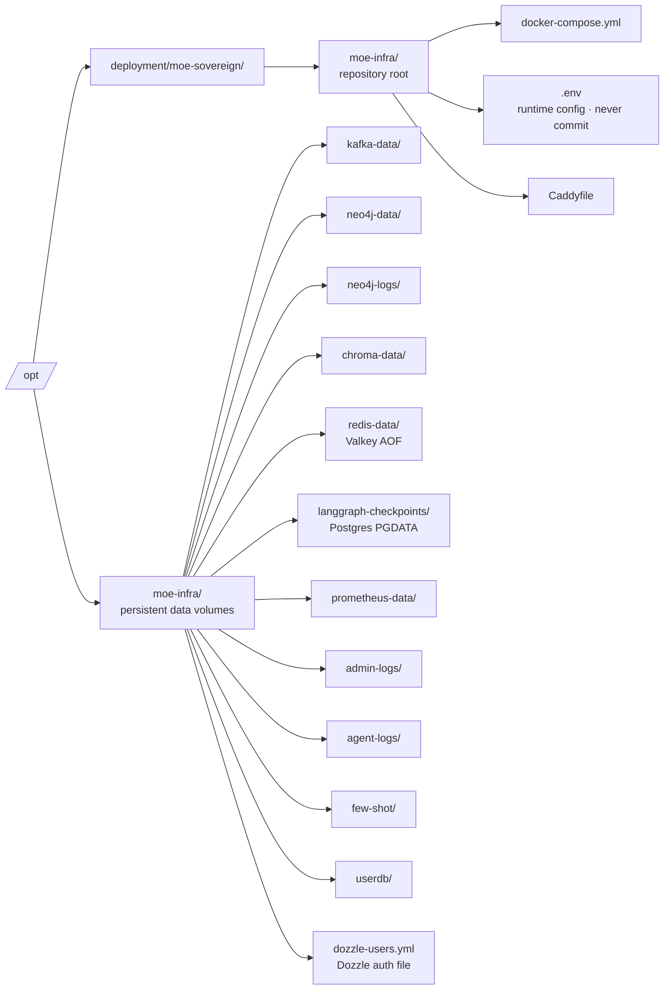

# Installation

## Requirements

| Resource | Minimum | Recommended |
|---|---|---|
| OS | Debian 11 (bullseye) | Debian 13 (trixie) |
| RAM | 8 GB | 16 GB+ |
| Disk | 40 GB | 100 GB+ |
| CPU | 4 cores | 8 cores+ |
| GPU | optional | NVIDIA (CUDA), AMD (ROCm) |
| Docker | CE or EE | Docker CE 24+ |
| Internet | Required for setup | Optional after setup |

Debian 11 (bullseye), 12 (bookworm), and 13 (trixie) are supported. Other Linux distributions are not tested.

---

## One-Line Install (Linux)

Run this on a fresh Debian system as root or with sudo:

```bash
curl -sSL https://moe-sovereign.org/install.sh | bash
```

## macOS

`install.sh` is Linux-only (it uses `apt-get`). On macOS use the
dedicated bootstrap script — it generates `.env` with random secrets
and pre-creates the host directories under `$HOME`:

```bash
git clone https://github.com/h3rb3rn/moe-sovereign.git
cd moe-sovereign
bash scripts/bootstrap-macos.sh
docker compose up -d
```

Full walkthrough including Docker Desktop File Sharing setup,
Apple Silicon notes and host-side Ollama (Metal) tips:
[Deployment → macOS](../deployment/macos.md).

The installer will:

1. Detect your OS version (Debian 11/12/13)
2. Install Docker CE if not already present
3. Create required directories under `/opt/`
4. Clone the repository
5. Prompt you for an admin username, password, and optional domain
6. Auto-generate secure secrets for Valkey, Neo4j, and Grafana
7. Write `/opt/deployment/moe-sovereign/moe-infra/.env`
8. Build and start all containers
9. Wait for the API to become healthy
10. Print access URLs

---

## Manual Installation

### 1. Install Docker CE

Follow the [official Docker documentation](https://docs.docker.com/engine/install/debian/) for Debian, or use the commands below:

```bash
sudo apt-get update
sudo apt-get install -y ca-certificates curl gnupg

sudo install -m 0755 -d /etc/apt/keyrings
curl -fsSL https://download.docker.com/linux/debian/gpg \
  | sudo gpg --dearmor -o /etc/apt/keyrings/docker.gpg
sudo chmod a+r /etc/apt/keyrings/docker.gpg

echo "deb [arch=$(dpkg --print-architecture) signed-by=/etc/apt/keyrings/docker.gpg] \
  https://download.docker.com/linux/debian $(. /etc/os-release && echo "$VERSION_CODENAME") stable" \
  | sudo tee /etc/apt/sources.list.d/docker.list

sudo apt-get update
sudo apt-get install -y docker-ce docker-ce-cli containerd.io \
  docker-buildx-plugin docker-compose-plugin
sudo systemctl enable --now docker
```

### 2. Create host directories

```bash
sudo mkdir -p \
  /opt/moe-infra/{kafka-data,neo4j-data,neo4j-logs,agent-logs,\
chroma-onnx-cache,chroma-data,redis-data,langgraph-checkpoints,\
prometheus-data,admin-logs,userdb,few-shot} \
  /opt/grafana/{data,dashboards} \
  /opt/deployment/moe-sovereign
```

### 3. Clone the repository

```bash
git clone https://github.com/h3rb3rn/moe-sovereign.git \
  /opt/deployment/moe-sovereign/moe-infra
cd /opt/deployment/moe-sovereign/moe-infra
```

### 4. Configure environment

```bash
cp .env.example .env
nano .env   # Fill in required values (see comments in the file)
```

Minimum required values:

```bash
ADMIN_USER=admin
ADMIN_PASSWORD=<your-password>
ADMIN_SECRET_KEY=<openssl rand -hex 32>
REDIS_PASSWORD=<openssl rand -hex 16>
POSTGRES_CHECKPOINT_PASSWORD=<openssl rand -hex 24>
NEO4J_PASS=<openssl rand -hex 16>
GF_SECURITY_ADMIN_PASSWORD=<openssl rand -hex 12>
```

### 5. Create Dozzle auth file

Dozzle (the log viewer) requires a bcrypt-hashed password file:

```bash
sudo apt-get install -y apache2-utils

HASH=$(htpasswd -bnBC 10 "" "YOUR_ADMIN_PASSWORD" | tr -d ':\n' | sed 's/$2y$/$2a$/')
cat > /opt/moe-infra/dozzle-users.yml << EOF
users:
  admin:
    name: admin
    password: "${HASH}"
    email: admin@localhost
EOF
```

### 6. Deploy the stack

```bash
sudo docker compose build
sudo docker compose up -d
```

### 7. Verify

```bash
# Check all containers are running
sudo docker compose ps

# Wait for the API
curl -f http://localhost:8002/v1/models
```

---

## Directory Layout

After installation, the following directories are used:



---

## Post-Install Checklist

- [ ] All containers are `Up` (`sudo docker compose ps`)
- [ ] Admin UI accessible at your configured URL (port 8088 by default)
- [ ] Complete the [Setup Wizard](first-setup.md) — add at least one inference server
- [ ] Configure Judge and Planner models in the wizard
- [ ] (Optional) Set up Caddy + public domain for HTTPS access

---

## Upgrade

Pull the latest code and rebuild:

```bash
cd /opt/deployment/moe-sovereign/moe-infra
git pull
sudo docker compose build
sudo docker compose up -d
```

Configuration in `.env` is preserved. The database volumes under `/opt/moe-infra/` are never touched by `docker compose` pull/build.

---

## Troubleshooting

```bash
# View logs for a specific service
sudo docker compose logs langgraph-app --tail=50 -f

# Restart a service
sudo docker compose restart moe-admin

# Full restart
sudo docker compose down && sudo docker compose up -d

# Check .env is loaded correctly
sudo docker compose exec langgraph-app env | grep JUDGE
```

!!! tip "Log Viewer"
    Once running, use the Dozzle log viewer at `https://logs.moe-sovereign.org` (or the Caddy-configured domain) for a browser-based view of all container logs.
