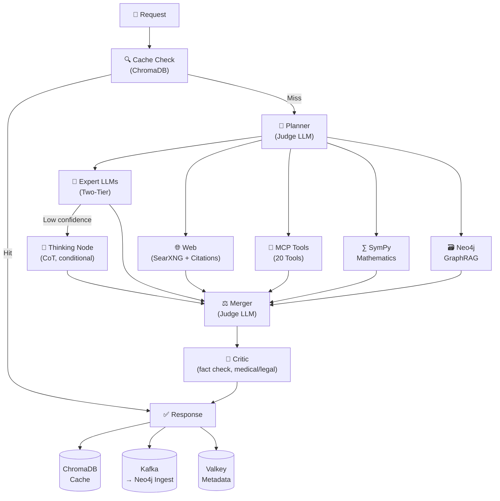

# Quickstart — MoE Sovereign

## What is MoE Sovereign?

A self-hosted Mixture-of-Experts LLM system running on dedicated GPU hardware.
Incoming requests are analyzed, distributed to specialized LLM experts, calculation tools, and a knowledge base, structurally analyzed by a reasoning model, and synthesized by a judge LLM.

**OpenAI API compatible** — drop-in replacement for Open WebUI and other clients.

---

## Services

| Container | Port | Function |
|---|---|---|
| `langgraph-orchestrator` | 8002 | Core API (OpenAI-compatible) |
| `moe-admin-ui` | 8088 | Web Admin: configure experts, models, prompts |
| `mcp-precision` | 8003 | 20 precision tools (math, date, network, German law, ...) |
| `neo4j-knowledge` | 7474 / 7687 | Knowledge graph (GraphRAG) |
| `terra_cache` | 6379 | Valkey: checkpoints, performance scores, metadata |
| `chromadb-vector` | 8001 | Vector cache (semantic cache) |
| `moe-kafka` | 9092 | Event streaming (ingest, audit log, feedback) |

> **Port collisions?** Every host port in the table can be remapped via
> `.env` (e.g. `ADMIN_UI_HOST_PORT=8089`) — see
> [Deployment → Docker Compose](../deployment/compose.md#configuration-via-env-no-compose-file-edits-needed)
> for the full list. macOS users should run
> `bash scripts/bootstrap-macos.sh` instead of `install.sh`; details
> in [Deployment → macOS](../deployment/macos.md).

---

## Pipeline



---

## Output Modes

Multiple model IDs for Open WebUI — selectable via the `model` field:

| Model | Mode |
|---|---|
| `moe-orchestrator` | Full answers with explanations (default) |
| `moe-orchestrator-code` | Source code only — no explanations |
| `moe-orchestrator-concise` | Short & precise — max 120 words |
| `moe-orchestrator-agent` | Coding agent (OpenCode, Continue.dev) |
| `moe-orchestrator-agent-orchestrated` | Claude Code — full MoE fanout |
| `moe-orchestrator-research` | In-depth research with private SearXNG search |
| `moe-orchestrator-report` | Structured report with sections and citations |
| `moe-orchestrator-plan` | Structured planning for complex tasks |

---

## Quick Start for Claude Code Users

### Step 1: Configure `.bashrc`

```bash
# ~/.bashrc or ~/.zshrc

# Use MoE API as Anthropic backend
export ANTHROPIC_BASE_URL=http://localhost:8002
export ANTHROPIC_API_KEY=moe-sk-xxxxxxxxxxxxxxxx...
```

Then: `source ~/.bashrc`

### Step 2: Start Claude Code

```bash
# Option A — per-session flag
claude --model moe-orchestrator-agent-orchestrated \
       --api-key $ANTHROPIC_API_KEY \
       --base-url $ANTHROPIC_BASE_URL/v1

# Option B — persistent in ~/.claude/settings.json
{
  "env": {
    "ANTHROPIC_BASE_URL": "http://localhost:8002/v1",
    "ANTHROPIC_API_KEY": "moe-sk-xxxxxxxx..."
  }
}
```

### Step 3: Check status

```bash
curl http://localhost:8002/v1/models
```

### Available Claude Code Skills

| Skill | Description |
|---|---|
| `/moe` | Direct query to the local MoE system (all modes available) |
| `/law` | Retrieve and interpret German federal law |
| `/calc` | Precise calculations via MCP tools (no LLM) |
| `/research` | Private web research via local SearXNG instance |
| `/local-doc` | Generate code documentation with local LLM |
| `/local-review` | Code review via local MoE system |
| `/explain-error` | Error analysis with technical support expert |
| `/moe-status` | Status of all services, models, and GPU utilization |

---

## Quick Start for API Users

### Deployment

For a fresh Debian server, the recommended approach is the one-line installer:

```bash
curl -sSL https://moe-sovereign.org/install.sh | bash
```

The installer handles Docker CE installation, directory creation, configuration, and deployment automatically. See [Installation](installation.md) for details and the [First-Time Setup](first-setup.md) guide for the post-install wizard.

For manual deployment:

```bash
# 1. Create configuration
cp .env.example .env
# Fill in required values — then run the Setup Wizard in the Admin UI
# to configure INFERENCE_SERVERS and core models

# 2. Start all services
sudo docker compose up -d

# 3. Check status
curl http://localhost:8002/v1/models
curl http://localhost:8002/graph/stats
```

**Endpoint:** `http://<host>:8002/v1`

### Chat (simple)

```bash
curl http://localhost:8002/v1/chat/completions \
  -H "Content-Type: application/json" \
  -d '{
    "model": "moe-orchestrator",
    "messages": [{"role": "user", "content": "Your question"}],
    "stream": false
  }'
```

### Chat (Streaming / SSE)

```bash
curl http://localhost:8002/v1/chat/completions \
  -H "Content-Type: application/json" \
  -d '{
    "model": "moe-orchestrator",
    "messages": [{"role": "user", "content": "Your question"}],
    "stream": true
  }'
```

### Feedback (learning loop)

```bash
curl http://localhost:8002/v1/feedback \
  -H "Content-Type: application/json" \
  -d '{"response_id": "chatcmpl-<id>", "rating": 5}'
```

Rating 1–2 = negative, 3 = neutral, 4–5 = positive.
The `response_id` is in the `id` field of each chat response.

### Graph API

```bash
curl http://localhost:8002/graph/stats
curl "http://localhost:8002/graph/search?q=Ibuprofen"
```

### OpenAI-compatible clients (Continue.dev, Open WebUI, curl)

```bash
# Chat completion (streaming)
curl -s http://localhost:8002/v1/chat/completions \
  -H "Content-Type: application/json" \
  -d '{
    "model": "moe-orchestrator",
    "stream": true,
    "messages": [{"role": "user", "content": "Explain Transformer architectures."}]
  }'

# List available model IDs
curl -s http://localhost:8002/v1/models | jq '.data[].id'
```
