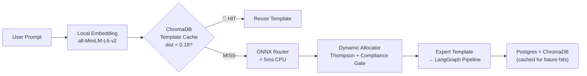
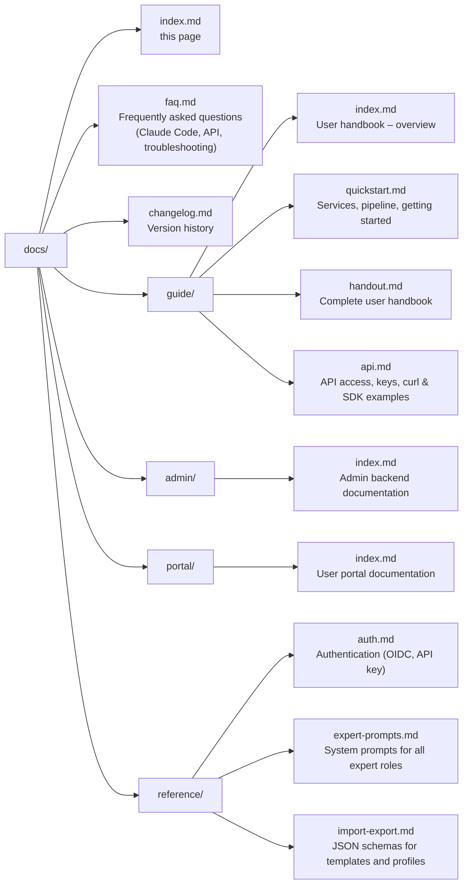

# Sovereign MoE – Documentation

**Self-hosted, Sovereign Multi-Model Orchestrator** — An intelligent ONNX gating network routes each request to the optimal specialist LLMs on local GPU hardware, enriches context via Neo4j Knowledge Graph and web search, and synthesizes results with a Judge LLM. OpenAI-compatible API — works with Claude Code, Continue.dev, and any OpenAI-compatible client.

---

## Quick Navigation

| Section | Pages | Description |
|---------|--------|-------------|
| **Installation** | [Installation](guide/installation.md) · [First-Time Setup](guide/first-setup.md) | Install on Debian, deploy the stack, run the Setup Wizard |
| **User Handbook** | [Quick Start](guide/quickstart.md) · [Handbook](guide/handout.md) · [API](guide/api.md) | Getting started, modes, skills, vision, API usage |
| **Admin Backend** | [Overview](admin/index.md) | Manage users, budgets, templates, profiles |
| **IMoE Gating Network** | [System Overview](system/overview.md#4-imoe-gating-network-new-june-2026) | Dynamic ONNX router, template cache, allocation scoring |
| **Federation** | [Overview](federation/index.md) | MoE Libris -- federated knowledge exchange between nodes |
| **User Portal** | [Overview](portal/index.md) | Self-service for end users: usage, keys, billing |
| **Intelligence** | [Agentic Loop](system/intelligence/agentic_loop.md) · [7B Ensemble](system/intelligence/7b_ensemble_capability.md) · [Causal Learning](system/intelligence/causal_learning.md) | Agentic re-planning, ensemble benchmarks, knowledge accumulation |
| **Reference** | [Authentication](reference/auth.md) · [Expert Prompts](reference/expert-prompts.md) · [Import/Export](reference/import-export.md) | API reference, system prompts, schemas |
| **FAQ** | [FAQ](faq.md) | Common questions about Claude Code, API, troubleshooting |
| **Changelog** | [Changelog](changelog.md) | Version history of all releases |

---

## Service Overview

| Service | URL | Purpose |
|---------|-----|---------|
| **Orchestrator API** | `http://localhost:8002/v1` | Main endpoint (OpenAI-compatible) |
| **Admin UI** | `http://localhost:8088` | Configuration & monitoring |
| **User Portal** | `http://localhost:8088/user/dashboard` | End-user interface |
| **Log Viewer (Dozzle)** | `https://logs.moe-sovereign.org` | Browser-based container log viewer |
| **Grafana** | `http://localhost:3001` | Metrics dashboards |
| **Prometheus** | `http://localhost:9090` | Raw metrics |
| **Neo4j Browser** | `http://localhost:7474` | Knowledge graph explorer |
| **MCP Server** | `http://localhost:8003` | Precision tools |

## 7B Ensemble — GPT-4o Class Performance, Self-Hosted

> **Benchmark result (April 2026):** 8 domain-specialist 7–9B models on legacy Tesla M10 GPUs
> achieve **6.11 / 10** on MoE-Eval — the same score class as GPT-4o mini — with zero data
> leaving the cluster. Three consecutive overnight epochs, 36 scenarios, 0 failures.

| | Single 7B | 8× 7B Ensemble | 30B+14B Orchestrated | H200 Cloud (120B) |
|---|---|---|---|---|
| MoE-Eval Score | 3.3–3.6 / 10 | **6.11 / 10** | 7.60 / 10 | 9.00 / 10 |
| VRAM required | 8 GB | 88 GB (distributed) | 80 GB RTX cluster | H200 GPU |
| Data sovereignty | ✅ | ✅ | ✅ | ❌ Cloud |
| Per-token cost | €0 | €0 | €0 | Metered |

The key insight: **specialisation beats scale**. A `meditron:7b` handles medical QA better than
a general 14B model; `mathstral:7b` outperforms general models on MATH tasks; `qwen2.5-coder:7b`
leads SWE-bench in its class. Routing each sub-task to its specialist model compounds these
advantages without requiring any single model to be large enough to cover all domains.

→ [Full benchmark report and LLM comparison](system/intelligence/7b_ensemble_capability.md)

---

## What's New (June 2026) — IMoE Gating Network

### Infrastructure Mixture of Experts (IMoE) — Dynamic Routing Intelligence

The biggest architectural leap since the initial release: a lightweight **ONNX gating classifier** now intercepts every request *before* the LangGraph pipeline. The project is officially supported by the **EuroHPC Joint Undertaking** (Proposal No. **EHPC-DEV-2026D06-XXX**), having been awarded a compute grant of **4,500 node-hours (18,000 GPU-hours)** on the **LUMI-G supercomputer** (AMD MI250x) for custom model training. The current gating classifier acts as the production prototype, while the approved EuroHPC resources are designated for the upcoming full-scale `Sovereign-14B` model and Phase 3 dataset retraining. In < 5ms on CPU, the classifier routes the prompt into:

- **14 Expert Categories** (multi-label, float ∈ [0,1])
- **4 Complexity Levels** (`trivial` / `moderate` / `complex` / `memory_recall`)
- **2 Retrieval Gates** (`web_research` / `graphrag`)

The classifier's outputs are used by a **Dynamic Allocator** to compile an optimal routing template at runtime — selecting the best available model for each category from the live cluster, scored by:

| Factor | Detail |
|---|---|
| **Warmed bonus** | Models already in GPU VRAM are strongly preferred |
| **Local priority** | On-premise nodes score higher than cloud |
| **Benchmark score** | MMLU / HumanEval / GSM8k from `model_metadata` DB |
| **Thompson Sampling** | Beta-Bernoulli per (model, category) from live feedback history |



### ChromaDB Semantic Template Cache

Every dynamically compiled template is stored in ChromaDB with the **raw prompt** as the embedded document. Subsequent requests with semantically similar prompts (`distance < 0.18`) skip ONNX inference entirely and reuse the existing template — preventing database bloat and redundant VRAM model reloads.

### Compliance Gate

`local_only` mode now works end-to-end through the full gating layer: all cloud endpoint entries from `INFERENCE_SERVERS` are excluded automatically. Zero data egress is guaranteed without any configuration change.

### Cloud Endpoints — Fully Admin-Configurable

Cloud providers (AIHUB, OpenRouter, etc.) are configured exclusively via **Admin UI → Inference Servers** as `api_type: openai` entries. The dynamic router discovers them automatically from `INFERENCE_SERVERS` — no hardcoded URLs or tokens anywhere in the codebase.

### Feedback Loop Fully Wired

User ratings (`POST /v1/feedback`) now propagate through all four layers: ChromaDB flagging, Valkey Thompson Sampling, Neo4j relation verification, **and** the `dynamic_template_feedback_log` Postgres table. Rated entries feed the `retraining_dataset.jsonl` buffer for future LUMI-G router retraining.

### VRAM Context Budget Enforcement

A new `resolve_requested_ctx()` helper in `context_budget.py` acts as a single source of truth for context window limits. It cross-references `model_metadata` DB overrides (e.g. `llama3.3-70b-ctx4k → 4096`) before any LLM call, preventing OOM reload cascades on the 60 GB N04-RTX node.

→ [Full technical documentation](system/overview.md)

---

## What's New (May 2026)

### MoE Codex — Compliance-Grade Data Intelligence

Catalog, Approval Workflow, Explorer, Drift Detection, OpenLineage, lakeFS Versioning,
NiFi ETL, and Notebook (JupyterLite) have moved to the dedicated **[moe-codex](https://github.com/h3rb3rn/moe-codex)**
repository — the compliance-grade data intelligence platform for regulated industries.

Deploy moe-sovereign for sovereign LLM infrastructure. Add moe-codex for
Foundry-inspired data governance features (catalog, lineage, approval workflows).
See the [Palantir Comparison](system/palantir_comparison.md) page for an honest assessment
of where the architectures converge and where the gap remains.

→ [Full changelog entry for 2026-05-10](changelog.md)

### Agentic Re-Planning Loop

The orchestrator now autonomously detects gaps in its own synthesis and launches focused follow-up research rounds — without user intervention.

After each Judge synthesis, a lightweight gap-detector LLM call evaluates `COMPLETION_STATUS: COMPLETE | NEEDS_MORE_INFO`. When incomplete, the **still-unresolved gap** and all previously established facts are injected back into the Planner as structured context. The Planner then routes exclusively the missing piece to `web_researcher` or `precision_tools` — not the full question again. Up to 3 agentic iterations per request.

→ [Agentic Re-Planning Loop — full architecture](system/intelligence/agentic_loop.md)

### PowerPoint Generation (MCP)

A new `generate_pptx` MCP tool creates fully formatted `.pptx` presentations from structured content (title, slides, bullet points, notes). The file is uploaded to MinIO and delivered as a signed download link directly in the chat response.

### Selective Template & Profile Export

The Admin UI now supports checkbox selection on the Templates and CC Profiles pages. Export only the items you need — the API accepts an optional `?ids=a,b,c` parameter. Exporting everything still works as before.

---

## CLI Agents — Best Of

MoE Sovereign works with any OpenAI-compatible client, but execution-loop
agents like Aider, Open Interpreter, and Continue.dev unlock the full
capability stack: correction memory, semantic caching, domain-expert routing,
and the Knowledge Graph all activate through their natural try → fail → fix
loops.

| Page | What it covers |
|---|---|
| [CLI Agents — Best Of](guide/cli-agents-best-of.md) | Plain-language explanation of why and how, Before/After comparison, connection examples for each tool |
| [Architectural Deep Dive](system/intelligence/cli_agent_integration.md) | Delta table, Mermaid data-flow diagrams, measured thresholds from the implementation |

---

## Connecting with Claude Code

```json title="~/.claude/settings.json"
{
  "env": {
    "ANTHROPIC_BASE_URL": "http://localhost:8002/v1",
    "ANTHROPIC_API_KEY": "moe-sk-..."
  }
}
```

Alternatively: configure a profile in the Admin UI under **Profiles** and enable it.

---

## Documentation Structure



---

## Stack

| Component | Role |
|-----------|-------|
| LangGraph | Pipeline orchestration |
| Ollama | Local LLM inference |
| **ONNX Runtime** | **IMoE gating network (< 5ms CPU)** |
| ChromaDB | Semantic response + template cache |
| Valkey | Checkpoints, Thompson Sampling, plan cache |
| Neo4j 5 | Knowledge graph (GraphRAG) |
| Apache Kafka | Event streaming & async learning |
| Prometheus + Grafana | Metrics & dashboards |
| FastAPI + uvicorn | HTTP API layer |
| PostgreSQL | User DB, templates, feedback log |
| all-MiniLM-L6-v2 | Local prompt embedding (IMoE gating) |
