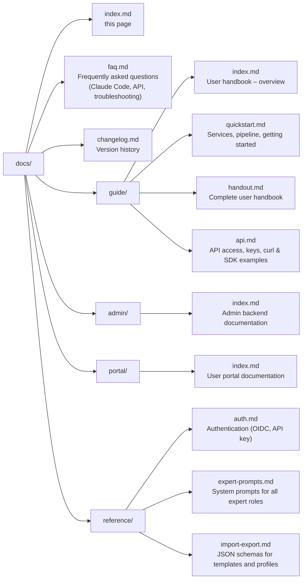

# Sovereign MoE – Documentation

**Self-hosted Multi-Model Orchestrator** — Routes requests to specialized local LLMs, enriches context via Neo4j Knowledge Graph and web search, and synthesizes results with a Judge LLM. OpenAI-compatible API endpoint — works with Claude Code, Continue.dev, and any OpenAI-compatible client.

---

## Quick Navigation

| Section | Pages | Description |
|---------|--------|-------------|
| **Installation** | [Installation](guide/installation.md) · [First-Time Setup](guide/first-setup.md) | Install on Debian, deploy the stack, run the Setup Wizard |
| **User Handbook** | [Quick Start](guide/quickstart.md) · [Handbook](guide/handout.md) · [API](guide/api.md) | Getting started, modes, skills, vision, API usage |
| **Admin Backend** | [Overview](admin/index.md) | Manage users, budgets, templates, profiles |
| **Federation** | [Overview](federation/index.md) | MoE Libris -- federated knowledge exchange between nodes |
| **User Portal** | [Overview](portal/index.md) | Self-service for end users: usage, keys, billing |
| **Reference** | [Authentication](reference/auth.md) · [Expert Prompts](reference/expert-prompts.md) · [Import/Export](reference/import-export.md) | API reference, system prompts, schemas |
| **FAQ** | [FAQ](faq.md) | Common questions about Claude Code, API, troubleshooting |
| **Changelog** | [Changelog](changelog.md) | Version history of all releases |

---

## Service Overview

| Service | URL | Purpose |
|---------|-----|---------|
| **Orchestrator API** | `http://localhost:8002/v1` | Main endpoint (OpenAI-compatible) |
| **Admin UI** | `http://localhost:8088` | Configuration & monitoring |
| **User Portal** | `http://localhost:8088/user/dashboard` | End-user interface |
| **Log Viewer (Dozzle)** | `https://logs.moe-sovereign.org` | Browser-based container log viewer |
| **Grafana** | `http://localhost:3001` | Metrics dashboards |
| **Prometheus** | `http://localhost:9090` | Raw metrics |
| **Neo4j Browser** | `http://localhost:7474` | Knowledge graph explorer |
| **MCP Server** | `http://localhost:8003` | Precision tools |

## 7B Ensemble — GPT-4o Class Performance, Self-Hosted

> **Benchmark result (April 2026):** 8 domain-specialist 7–9B models on legacy Tesla M10 GPUs
> achieve **6.11 / 10** on MoE-Eval — the same score class as GPT-4o mini — with zero data
> leaving the cluster. Three consecutive overnight epochs, 36 scenarios, 0 failures.

| | Single 7B | 8× 7B Ensemble | 30B+14B Orchestrated | H200 Cloud (120B) |
|---|---|---|---|---|
| MoE-Eval Score | 3.3–3.6 / 10 | **6.11 / 10** | 7.60 / 10 | 9.00 / 10 |
| VRAM required | 8 GB | 88 GB (distributed) | 80 GB RTX cluster | H200 GPU |
| Data sovereignty | ✅ | ✅ | ✅ | ❌ Cloud |
| Per-token cost | €0 | €0 | €0 | Metered |

The key insight: **specialisation beats scale**. A `meditron:7b` handles medical QA better than
a general 14B model; `mathstral:7b` outperforms general models on MATH tasks; `qwen2.5-coder:7b`
leads SWE-bench in its class. Routing each sub-task to its specialist model compounds these
advantages without requiring any single model to be large enough to cover all domains.

→ [Full benchmark report and LLM comparison](system/intelligence/7b_ensemble_capability.md)

---

## CLI Agents — Best Of

MoE Sovereign works with any OpenAI-compatible client, but execution-loop
agents like Aider, Open Interpreter, and Continue.dev unlock the full
capability stack: correction memory, semantic caching, domain-expert routing,
and the Knowledge Graph all activate through their natural try → fail → fix
loops.

| Page | What it covers |
|---|---|
| [CLI Agents — Best Of](guide/cli-agents-best-of.md) | Plain-language explanation of why and how, Before/After comparison, connection examples for each tool |
| [Architectural Deep Dive](system/intelligence/cli_agent_integration.md) | Delta table, Mermaid data-flow diagrams, measured thresholds from the implementation |

---

## Connecting with Claude Code

```json title="~/.claude/settings.json"
{
  "env": {
    "ANTHROPIC_BASE_URL": "http://localhost:8002/v1",
    "ANTHROPIC_API_KEY": "moe-sk-..."
  }
}
```

Alternatively: configure a profile in the Admin UI under **Profiles** and enable it.

---

## Documentation Structure



---

## Stack

| Component | Role |
|-----------|-------|
| LangGraph | Pipeline orchestration |
| Ollama | Local LLM inference |
| ChromaDB | Semantic vector cache |
| Valkey | Checkpoints, budget counters, scoring |
| Neo4j 5 | Knowledge graph (GraphRAG) |
| Apache Kafka | Event streaming & async learning |
| Prometheus + Grafana | Metrics & dashboards |
| FastAPI + uvicorn | HTTP API layer |
| PostgreSQL | User database |
