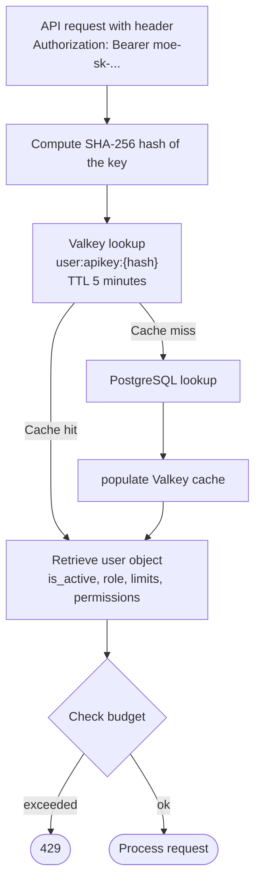

# API Keys

API keys are the primary authentication method for the MoE Orchestrator. Each user can create multiple keys, for example one per device or application.

## Key Format

```
moe-sk-{48 random hex characters}
```

**Example:** `moe-sk-<48_hex_chars_replace_me_with_real_key>`

!!! warning "Security"
    The full key is displayed **only once** after creation. Afterwards only the prefix is visible. The key is never stored in plaintext — only a SHA-256 hash.

## Manage Keys (`/user/keys`)

### My API Keys — Table

| Column | Description |
|--------|-------------|
| Key prefix | First 16 characters + `...` |
| Label | User-defined name |
| Created | Creation date |
| Last used | Timestamp of last use (`never` if unused) |
| Status | **Active** (green) or **Revoked** (red) |
| ✎ | Edit label |
| 🔒 | Revoke key |

### Create a new key

1. **Enter a label** (optional, max 100 characters, e.g. "Claude Code Laptop")
2. Click **Create key** → `POST /user/keys`
3. **View the full key once** — copy it to the clipboard!
4. The key now appears in the table with its prefix

### Edit key label

1. Click the ✎ icon → modal opens
2. Enter new label
3. Save → `PATCH /user/keys/{key_id}/label`

### Revoke a key

1. Click the 🔒 icon → confirmation
2. `POST /user/keys/{key_id}/revoke`
3. Key is immediately invalid; Valkey cache is invalidated

!!! tip "Recommendation"
    Create one key per device/application. This way a compromised key can be revoked without disrupting other integrations.

## Using API Keys in Applications

The MoE Orchestrator accepts two header formats:

=== "Bearer Token (OpenAI standard)"
    ```bash
    curl https://moe-intern/v1/chat/completions \
      -H "Authorization: Bearer moe-sk-..." \
      -H "Content-Type: application/json" \
      -d '{"model": "qwen2.5:32b", "messages": [{"role": "user", "content": "Hello"}]}'
    ```

=== "x-api-key (Anthropic-compatible)"
    ```bash
    curl https://moe-intern/v1/messages \
      -H "x-api-key: moe-sk-..." \
      -H "anthropic-version: 2023-06-01" \
      -H "Content-Type: application/json" \
      -d '{"model": "claude-sonnet-4-6", "messages": [{"role": "user", "content": "Hello"}], "max_tokens": 1024}'
    ```

=== "Claude Code (settings.json)"
    ```json
    {
      "env": {
        "ANTHROPIC_BASE_URL": "http://localhost:8002/v1",
        "ANTHROPIC_API_KEY": "moe-sk-..."
      }
    }
    ```

=== "Continue.dev"
    ```json
    {
      "models": [{
        "title": "MoE Local",
        "provider": "openai",
        "model": "qwen2.5:32b",
        "apiBase": "http://localhost:8002/v1",
        "apiKey": "moe-sk-..."
      }]
    }
    ```

## Technical Background

### Validation Flow



### Valkey Schema

```
user:apikey:{sha256}   →  HASH  {
    user_id: "...",
    username: "...",
    role: "user|expert|admin",
    is_active: "1",
    daily_limit: "100000",
    monthly_limit: "1000000",
    total_limit: "",
    permissions: "{...JSON...}"
}
TTL: 300 seconds (5 minutes)
```

After a revocation or permissions change, the cache is immediately invalidated → the next request is rejected outright or executed with the current permissions.

### Database Schema

```sql
CREATE TABLE api_keys (
    id          TEXT PRIMARY KEY,           -- UUID4
    user_id     TEXT NOT NULL REFERENCES users(id),
    key_hash    TEXT UNIQUE NOT NULL,       -- SHA-256
    key_prefix  TEXT NOT NULL,             -- First 16 characters
    label       TEXT,
    is_active   INTEGER DEFAULT 1,
    created_at  TEXT NOT NULL,
    last_used_at TEXT,                     -- NULL = never used
    expires_at  TEXT                       -- NULL = no expiry
);

CREATE INDEX idx_keys_hash    ON api_keys(key_hash);
CREATE INDEX idx_keys_user    ON api_keys(user_id);
```
