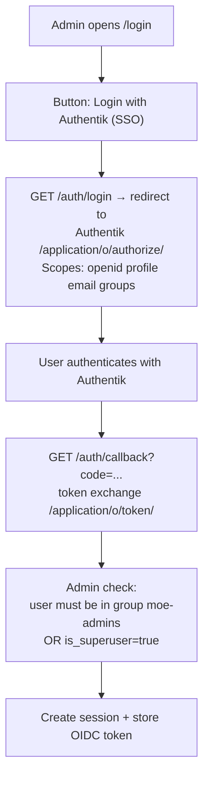
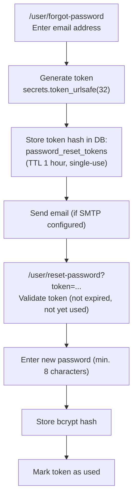
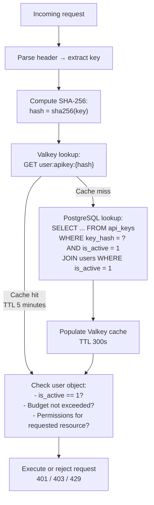

# Authentication & Authorization

The MoE system distinguishes two completely separate authentication levels:

| Level | Entry point | Users |
|-------|-------------|--------|
| **Admin backend** | `/login` | Admins (with `is_admin = 1`) |
| **User portal** | `/user/login` | End users (all roles) |

---

## Admin Authentication

### Local login

1. Fill in form: **username + password + CSRF token**
2. Password check: bcrypt comparison via passlib
3. `is_admin = 1` must be set — regular users are rejected
4. Session is created:
   ```python
   session["authenticated"] = True
   session["user"] = username
   session["admin_user_id"] = user_id
   ```

### OIDC / Authentik (optional)

Requires the following environment variables:

| Variable | Description |
|----------|-------------|
| `AUTHENTIK_URL` | Base URL of the Authentik instance |
| `OIDC_CLIENT_ID` | OAuth2 client ID |
| `OIDC_CLIENT_SECRET` | OAuth2 client secret |

**Flow:**



**Admin check for OIDC:**
```python
is_admin = "moe-admins" in userinfo.get("groups", []) or userinfo.get("is_superuser", False)
```

### Logout

- Local login: delete session
- OIDC: delete session + redirect to Authentik `end-session/` endpoint

---

## User Portal Authentication

### Login

Form at `/user/login`:

1. Enter username + password
2. bcrypt password comparison
3. `is_active = 1` is checked (blocked users are rejected)
4. Session:
   ```python
   session["user_authenticated"] = True
   session["user_id"] = user_id
   session["username"] = username
   session["user_role"] = role
   ```

### Password Reset Flow



!!! info "Security behavior"
    At `/user/forgot-password`, the system always shows the message "If an account exists..." — regardless of whether the email is actually registered. This prevents account enumeration.

---

## API Key Authentication

API keys are used for API requests to the orchestrator. No session cookie, no login — stateless.

### Supported Headers

```
Authorization: Bearer moe-sk-{48 hex chars}
x-api-key: moe-sk-{48 hex chars}
```

### Validation Flow



### Valkey Schema

```
user:apikey:{sha256-hash}   →   HASH
    user_id          STRING
    username         STRING
    role             STRING   (user|subscriber|expert|admin)
    is_active        STRING   (1|0)
    daily_limit      STRING   (integer or empty = unlimited)
    monthly_limit    STRING
    total_limit      STRING
    permissions      STRING   (JSON: {resource_type: [id, ...]})
    cost_factor      STRING   (float)

TTL: 300 seconds
```

---

## CSRF Protection

All forms in the Admin backend and User Portal are CSRF-protected:

```html
<input type="hidden" name="csrf_token" value="{{ csrf_token }}">
```

- Token generated per session: `secrets.token_hex(16)`
- Validated server-side with `secrets.compare_digest()`
- Session lifetime: max 8 hours (`SESSION_MAX_AGE = 28800`)

---

## Session Configuration

```python
SESSION_MAX_AGE = 28800  # 8 hours
SESSION_COOKIE_HTTPONLY = True
SESSION_COOKIE_SAMESITE = "lax"
```

---

## Admin Impersonation

Admins can take over user sessions:

```
GET /admin/users/{uid}/impersonate
```

1. Admin session is checked (`is_admin = 1`)
2. User session is set for the current session:
   ```python
   session["user_authenticated"] = True
   session["user_id"] = uid
   session["admin_impersonating"] = True
   ```
3. Redirect to `/user/dashboard`
4. Orange impersonation banner appears

**Exit:**
```
GET /user/impersonate/exit
```
Resets admin session, clears user impersonation flags.

---

## Security Overview

| Mechanism | Implementation |
|-------------|----------------|
| Password hashing | bcrypt (passlib) |
| API key storage | SHA-256 hash, never plaintext |
| CSRF protection | HMAC-based session token |
| Session TTL | 8 hours |
| Valkey cache TTL | 5 minutes (API keys) |
| OIDC group | `moe-admins` |
| Password reset TTL | 1 hour, single-use |
| Budget enforcement | Valkey counter + orchestrator check |
