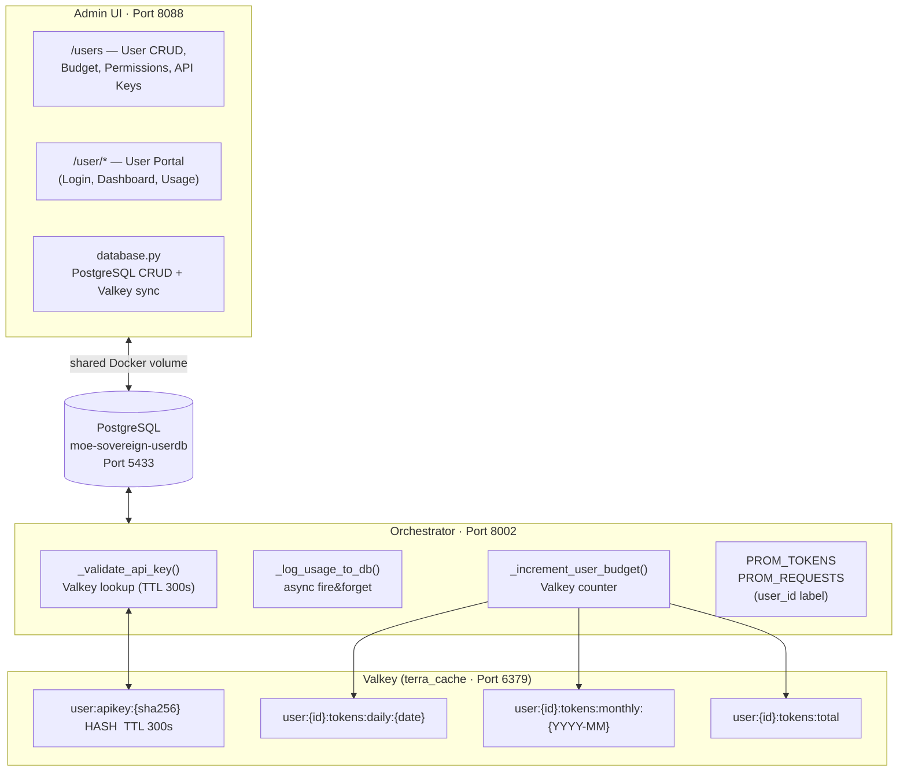
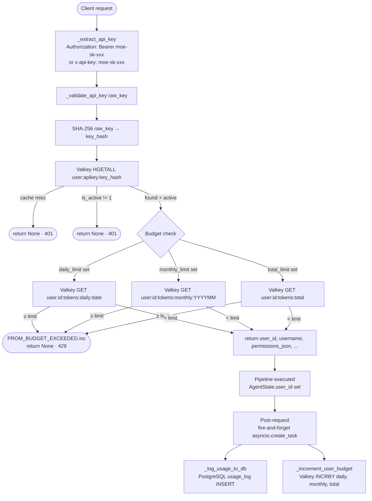

# User Management — Technical Documentation

**Sovereign MoE Orchestrator – User Management System**
Version 1.0 · April 2026

---

## Architecture Overview



---

## Database Schema

File: PostgreSQL database `moe-sovereign-userdb` (Port 5433)

### Tables

#### `users`

| Column | Type | Description |
|--------|-----|--------------|
| id | TEXT PK | UUID4 hex |
| username | TEXT UNIQUE | Login name |
| email | TEXT UNIQUE | Email |
| display_name | TEXT | Display name |
| hashed_password | TEXT | bcrypt hash (via passlib) |
| is_active | INTEGER | 1=active, 0=blocked |
| is_admin | INTEGER | 1=admin rights |
| created_at | TEXT | ISO-8601 UTC |
| updated_at | TEXT | ISO-8601 UTC |

#### `api_keys`

| Column | Type | Description |
|--------|-----|--------------|
| id | TEXT PK | UUID4 hex |
| user_id | TEXT FK→users | Owning user |
| key_hash | TEXT UNIQUE | SHA-256 of raw key |
| key_prefix | TEXT | First 16 characters (display) |
| label | TEXT | User-defined label |
| is_active | INTEGER | 1=active |
| created_at | TEXT | ISO-8601 UTC |
| last_used_at | TEXT | Last use (NULL=never) |
| expires_at | TEXT | Expiry date (NULL=unlimited) |

> Raw API keys are **never stored**. Only the SHA-256 hash is used for lookups.
> Key format: `moe-sk-{48 random hex chars}`.

#### `token_budgets`

| Column | Type | Description |
|--------|-----|--------------|
| user_id | TEXT PK FK | 1:1 with users |
| daily_limit | INTEGER | NULL = unlimited |
| monthly_limit | INTEGER | NULL = unlimited |
| total_limit | INTEGER | NULL = unlimited |
| updated_at | TEXT | Last update |

#### `permissions`

| Column | Type | Description |
|--------|-----|--------------|
| id | TEXT PK | UUID4 hex |
| user_id | TEXT FK | Owning user |
| resource_type | TEXT | `expert_template`, `cc_profile`, `model_endpoint`, `skill`, `mcp_tool`, `moe_mode` |
| resource_id | TEXT | e.g. `tmpl-abc123`, `profile-moe`, `qwen2.5-coder:32b@N04-RTX`, `native` |
| granted_at | TEXT | ISO-8601 UTC |

**Default: all access blocked.** Only explicitly granted permissions are allowed.

**Permission types:**

| resource_type | Meaning | Example resource_id |
|---------------|-----------|----------------------|
| `expert_template` | Expert configuration package | `tmpl-abc123` |
| `cc_profile` | Claude Code integration profile | `profile-moe` |
| `model_endpoint` | Native LLM via OpenAI API | `llama3.3:70b@N04-RTX` |
| `moe_mode` | MoE processing mode | `native`, `moe_orchestrated`, `moe_reasoning` |
| `skill` | Claude Code skill | `calc` |
| `mcp_tool` | MCP tool | `precision-calc` |

#### `usage_log`

| Column | Type | Description |
|--------|-----|--------------|
| id | TEXT PK | UUID4 hex |
| user_id | TEXT FK | Owning user |
| api_key_id | TEXT FK | Key used |
| request_id | TEXT | chat_id from orchestrator |
| model | TEXT | Requested model |
| moe_mode | TEXT | Routing mode |
| prompt_tokens | INTEGER | Input tokens |
| completion_tokens | INTEGER | Output tokens |
| total_tokens | INTEGER | Sum |
| status | TEXT | `ok`, `budget_exceeded`, `error` |
| requested_at | TEXT | ISO-8601 UTC |

---

## API Compatibility

The orchestrator (port 8002) provides two compatible interfaces:

| Endpoint | Format | Primary use |
|----------|--------|-----------------|
| `/v1/messages` | **Anthropic Messages API** | Claude Code (`ANTHROPIC_BASE_URL`), Anthropic SDK |
| `/v1/chat/completions` | **OpenAI Chat Completions API** | Open WebUI, native LLMs, OpenAI SDK |

Claude Code communicates exclusively via `/v1/messages` (Anthropic Messages API). The API choice depends on the client — the orchestrator supports both formats transparently.

---

## Valkey Key Structure

```
user:apikey:{sha256_of_key}     HASH  TTL 300s
  Fields:
    user_id          → UUID hex of user
    username         → login name (for logging)
    is_active        → "1" or "0"
    permissions_json → '{"model_endpoint":["qwen2.5-coder:32b@N04-RTX"],...}'
    budget_daily     → "50000" or "" (empty = no limit)
    budget_monthly   → "500000" or ""
    budget_total     → "" or number

user:{user_id}:tokens:daily:{YYYY-MM-DD}    STRING  INCRBY  TTL 48h
user:{user_id}:tokens:monthly:{YYYY-MM}     STRING  INCRBY  TTL 35d
user:{user_id}:tokens:total                 STRING  INCRBY  no TTL
```

### Cache Invalidation

| Event | Valkey action |
|----------|-------------|
| User created | HSET all keys + TTL 300s |
| User deactivated | DEL all keys |
| API key created | HSET new key |
| API key revoked | DEL specific key |
| Permission changed | HSET all keys (permissions_json) |
| Budget changed | HSET all keys (budget_*) |

---

## Auth Flow (Orchestrator)



---

## Admin UI Routes

### User Management (requires admin login)

| Method | Path | Function |
|---------|------|----------|
| GET | `/users` | User list (HTML) |
| GET | `/api/users` | User list JSON |
| POST | `/api/users` | Create user |
| GET | `/api/users/{id}` | User details (incl. keys, perms, usage) |
| PUT | `/api/users/{id}` | Update user |
| DELETE | `/api/users/{id}` | Deactivate user (soft delete) |
| PUT | `/api/users/{id}/budget` | Set token budget |
| GET | `/api/users/{id}/permissions` | List permissions |
| POST | `/api/users/{id}/permissions` | Grant permission |
| DELETE | `/api/users/{id}/permissions/{pid}` | Revoke permission |
| GET | `/api/users/{id}/keys` | List API keys |
| POST | `/api/users/{id}/keys` | Create API key |
| DELETE | `/api/users/{id}/keys/{kid}` | Revoke API key |
| GET | `/api/users/{id}/usage` | Usage statistics |

### Expert Templates (requires admin login)

| Method | Path | Function |
|---------|------|----------|
| GET | `/templates` | Templates overview (HTML) |
| GET | `/api/expert-templates` | List templates (JSON) |
| POST | `/api/expert-templates` | Create template |
| PUT | `/api/expert-templates/{id}` | Edit template |
| DELETE | `/api/expert-templates/{id}` | Delete template |

### User Portal (requires user login)

| Method | Path | Function |
|---------|------|----------|
| GET/POST | `/user/login` | User login |
| GET | `/user/logout` | Logout |
| GET | `/user/dashboard` | Dashboard |
| GET/POST | `/user/profile` | Profile & password |
| GET | `/user/usage` | Usage history |
| GET | `/user/billing` | Billing |
| GET/POST | `/user/keys` | API keys |
| POST | `/user/keys/{id}/revoke` | Revoke key |

---

## Prometheus Metrics

### Updated Metrics (new `user_id` label)

```python
# Before:
moe_tokens_total{model, token_type, node}
moe_requests_total{mode, cache_hit}

# After:
moe_tokens_total{model, token_type, node, user_id}
moe_requests_total{mode, cache_hit, user_id}
```

Unauthenticated requests carry `user_id="anon"`.

### New Metric

```python
moe_budget_exceeded_total{user_id, limit_type}
# limit_type: "daily" | "monthly" | "total"
```

### Example PromQL Queries

```promql
# Tokens per user (last hour)
sum by (user_id) (increase(moe_tokens_total[1h]))

# Requests per user today
sum by (user_id) (increase(moe_requests_total[24h]))

# Budget violations this week
sum by (user_id, limit_type) (increase(moe_budget_exceeded_total[7d]))

# Top 5 users by consumption (total)
topk(5, sum by (user_id) (moe_tokens_total))
```

---

## Deployment

### New Services / Volumes

```yaml
# docker-compose.yml additions:

volumes:
  userdb_data:        # Shared between moe-admin and langgraph-app
    driver: local
    driver_opts:
      type: none
      o: bind
      device: /opt/moe-infra/userdb

# moe-admin gets:
environment:
  - REDIS_URL=redis://terra_cache:6379
  - DB_PATH=/app/userdb/users.db
volumes:
  - userdb_data:/app/userdb

# langgraph-app gets:
environment:
  - DB_PATH=/app/userdb/users.db
volumes:
  - userdb_data:/app/userdb
```

### Rebuild & Deploy

```bash
cd /opt/deployment/moe-infra

# Rebuild Admin UI (new requirements + database.py)
sudo docker compose build moe-admin

# Rebuild orchestrator (psycopg in requirements)
sudo docker compose build langgraph-app

# Restart services
sudo docker compose up -d moe-admin langgraph-app
```

### Verification

```bash
# Check DB file
ls -la /opt/moe-infra/userdb/

# Admin UI logs (DB init)
sudo docker logs moe-admin --tail 20

# Test: create user via API
curl -s -X POST http://localhost:8088/api/users \
  -H "Content-Type: application/json" \
  -d '{"username":"testuser","email":"test@example.com","password":"test1234"}' \
  -b "session=<admin-session-cookie>"

# Check Valkey key after key creation:
sudo docker exec terra_cache valkey-cli keys "user:apikey:*"
```

---

## Security Notes

1. **Password hashing**: bcrypt via passlib (work factor 12), asyncio.to_thread for non-blocking
2. **API key storage**: SHA-256 one-way hash, raw key never persisted
3. **CSRF protection**: All POST forms in the User Portal use CSRF tokens (Starlette SessionMiddleware)
4. **Session isolation**: Admin session (`authenticated`) and user session (`user_authenticated`) are separate keys in the same session store
5. **PostgreSQL**: Enables concurrent reads and writes across Docker containers
6. **Valkey TTL**: API key cache expires after 300 seconds — immediate DEL on revoke
7. **Principle of least privilege**: New user has **no** permissions — everything must be explicitly granted

---

## Grafana Dashboard

The dashboard `MoE – User Metrics` (UID: `moe-users-v1`) is stored at
`/opt/grafana/dashboards/moe-users.json` and loaded automatically via provisioning.

**Panels:**
- Stat: total requests, total tokens, budget violations (24h), active users (1h)
- Timeseries: token consumption per user (rate 5m), requests per user, budget violations
- Table: top users by token consumption
- Bar chart: token consumption by user × model

**Template variable**: `user_id` — filters all panels to selected users.

---

*As of April 2026 · MoE Sovereign Orchestrator*
