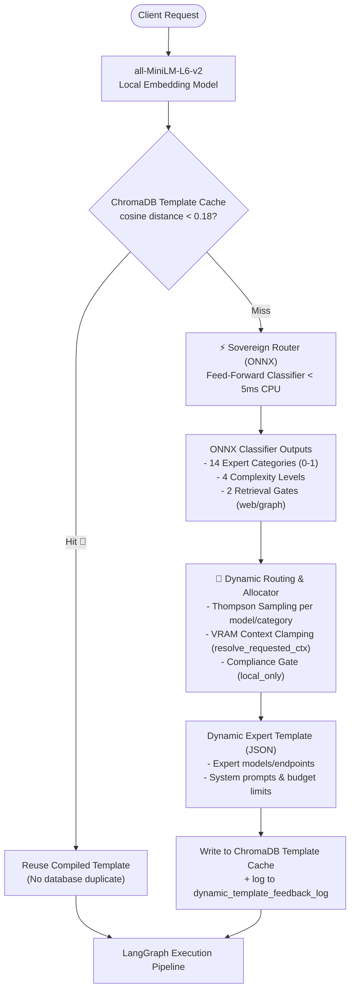
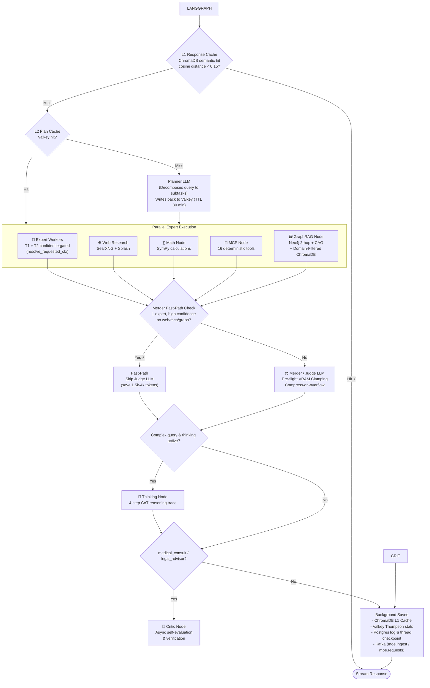

# MoE Sovereign — System Architecture

> Last updated: 2026-06-13 — Version 3.0.0
> Project directory: `/opt/moe-sovereign`

---

## 1. Pipeline Overview

MoE Sovereign is a LangGraph-based Multi-Model LLM Orchestrator. The system is designed to route incoming queries to the most optimal specialist LLMs on local GPU hardware while allowing dynamic integration of cloud providers (like AIHUB, LiteLLM, or custom OpenAI endpoints) without hardcoding them in the software stack.

The request lifecycle is managed by an intelligent **Infrastructure Mixture of Experts (IMoE) Gating Layer** followed by a structured **LangGraph Execution Pipeline**.

---

## 2. IMoE Gating Layer & Pipeline Flowchart

Before entering the LangGraph pipeline, each prompt is analyzed by the **IMoE Gating Layer** to compile a request-specific dynamic template.

### The LangGraph Pipeline

Once the template is compiled, the request enters the main execution pipeline:

---

## 3. Node Descriptions

| Node | Function | Key Logic & Safeguards |
|---|---|---|
| `cache_lookup` | ChromaDB semantic response cache | Cosine distance < 0.15 → hard hit (skips all LLM nodes); 0.15-0.50 → soft hit (few-shot examples injected) |
| `planner` | Task decomposition | Generates `[{task, category, search_query?, mcp_tool?, metadata_filters?}]`. Extracts `metadata_filters` from the first task for domain-scoped memory retrieval. |
| `expert_worker` | Specialist execution | Two-tier routing. Runs T1 first. If T1 confidence is low, escalates to T2. Limits VRAM allocation and context windows using `resolve_requested_ctx()`. |
| `research` | SearXNG web search | Multi-query web search. Runs if the compiled template enables web research or `research` category is planned. |
| `math` | SymPy calculation | Executed if `math` is in the plan, providing zero-hallucination symbolic calculations. |
| `mcp` | MCP Precision Tools | Executes 16 deterministic system tools (CIDR, date math, hashing, unit conversions) via HTTP. |
| `graph_rag` | Neo4j knowledge base | Performs a 2-hop traversal in Neo4j. If `metadata_filters` are present, queries ChromaDB with a `where` filter and appends results as `[Domain-Filtered Memory]`. |
| `merger` | Response synthesis | The Judge LLM synthesizes all inputs. Runs a **PRE-FLIGHT** context check using `resolve_requested_ctx()` and proportional pruning to prevent OOMs on judge nodes. |
| `critic` | Post-generation verification | Actively reviews medical and legal expert outputs for correctness, applying self-correction logs to Valkey and files. |

---

## 4. Hardware & VRAM Context Clamping

To prevent VRAM page out and OOM cascades, the system strictly enforces context budgets via `resolve_requested_ctx()` in `context_budget.py`.

Static Postgres metadata overrides live node `/api/ps` telemetry. This prevents VRAM allocations from expanding beyond the physical GPU capacities of:
- **N04-RTX:** 60 GB total VRAM (Pins `qwen3.6:35b` at 32k ctx and `llama3.3-70b-ctx4k` at 4k ctx).
- **N11-M10:** 32 GB total VRAM (Max 30B parameter models at constrained context).

---

## 5. Configuration Strategy & Dynamic Admin UI

Operational variables must remain fully configurable and not hardcoded to a single provider.
- All endpoints and cloud-model parameters are derived from the `INFERENCE_SERVERS` JSON list.
- Cloud providers (such as AIHUB, LiteLLM, custom OpenAI servers) can be added or toggled dynamically in the **Admin UI → Inference Servers**.
- The `SYSTEM_API_KEY` is loaded from `.env` to authenticate internal system loops without baking plaintext keys into source files.

---

## 6. Development Roadmap Preview

The system is currently preparing for:
1. **LUMI-G Supercomputer CPT/SFT Training:** Retraining the `Sovereign-14B` model using node-hours on LUMI-G to replace the judge model with a dedicated distilled local alternative.
2. **JMoE Framework:** An adversarial debate engine utilizing paraconsistent Belnap-Dunn logic (True / False / Inconsistent / Unknown) to arbitrate truth across conflicting expert predictions.
