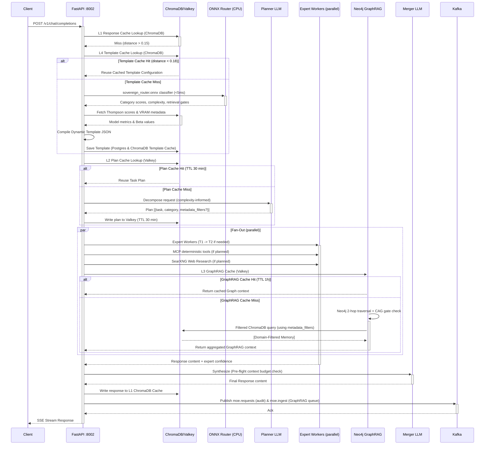
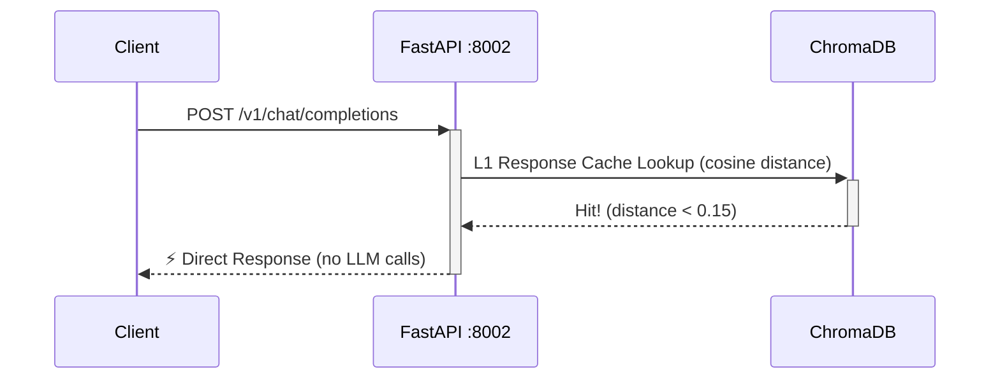
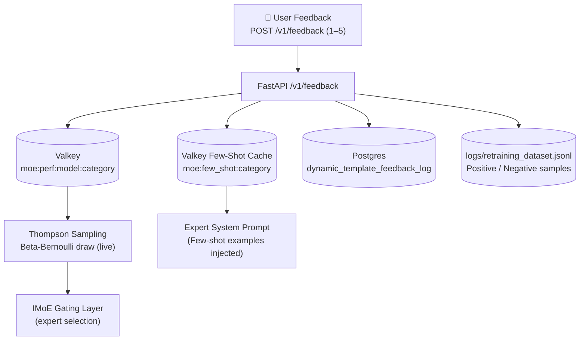
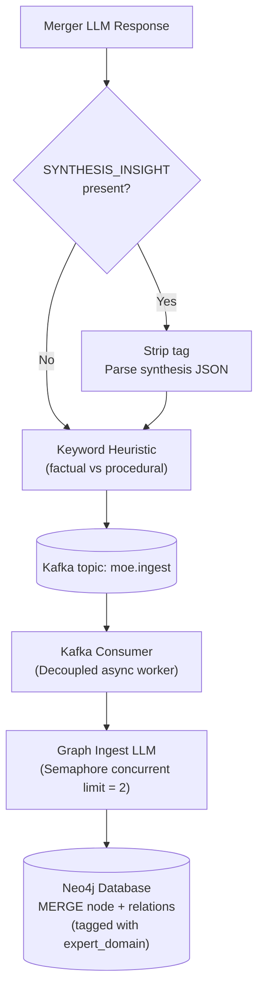

# System Data Flow & Caching

This section describes the detailed request sequence, caching tiers, and feedback telemetry loops in the MoE Sovereign platform.

---

## 1. Normal Request Flow (With IMoE Gating)

The following sequence diagram outlines a normal request flow that misses the L1 semantic response cache and goes through the **IMoE Gating Layer** to compile a dynamic template, followed by parallel expert execution and judge synthesis.

---

## 2. L1 Cache Hit Fast Path

If an identical or semantically equivalent query has been resolved recently, the system skips all LLMs and database lookups entirely, returning the answer in less than 50 ms.

---

## 3. Telemetry & Thompson Feedback Loop

When users submit ratings, the data propagates to update expert selections dynamically. High-scoring models are preferred in subsequent runs, whereas low-scoring ones trigger fallback routes.

---

## 4. GraphRAG Ingest Pipeline

The response content is checked for insights to ingest back into Neo4j in the background, reinforcing the knowledge base over time.

