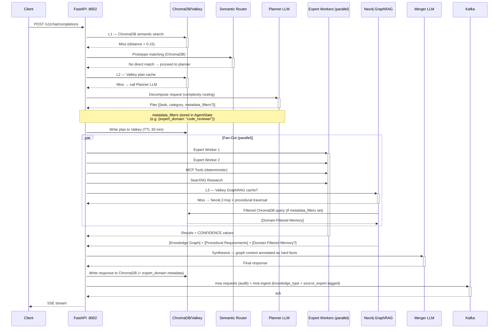
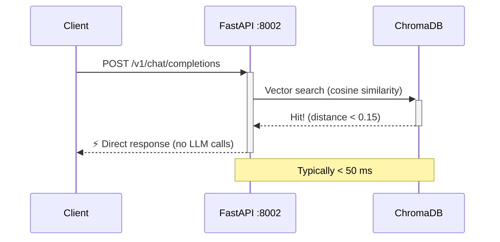
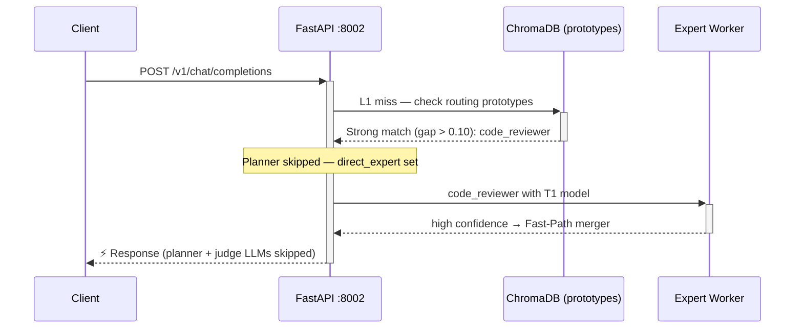
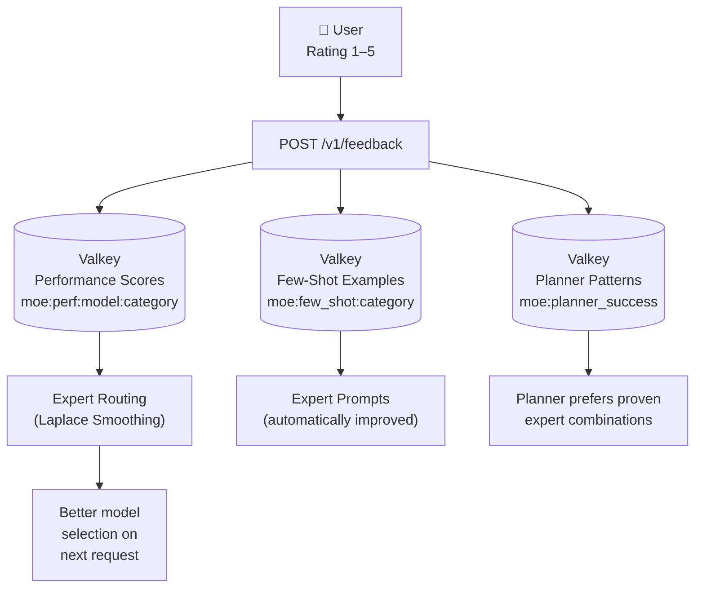
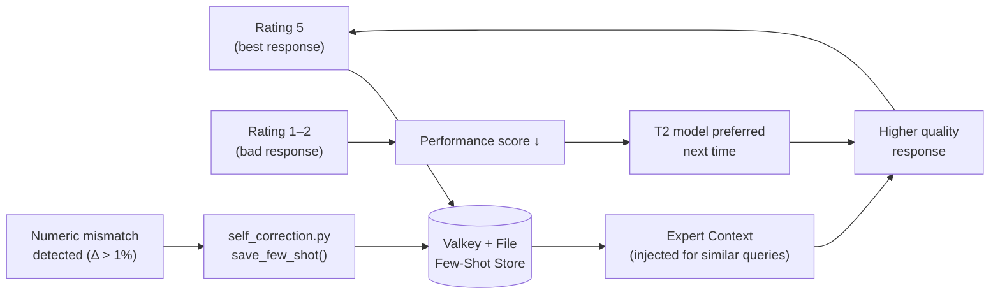
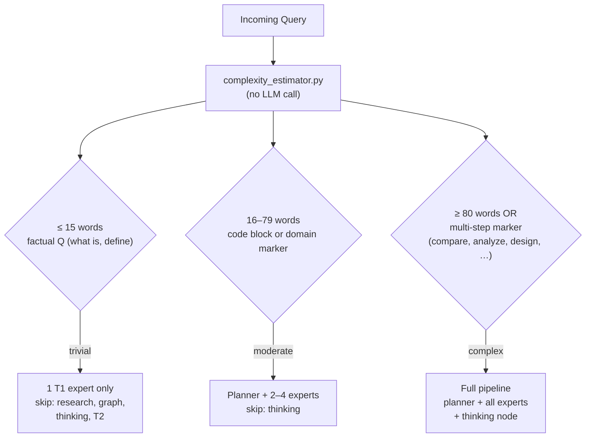
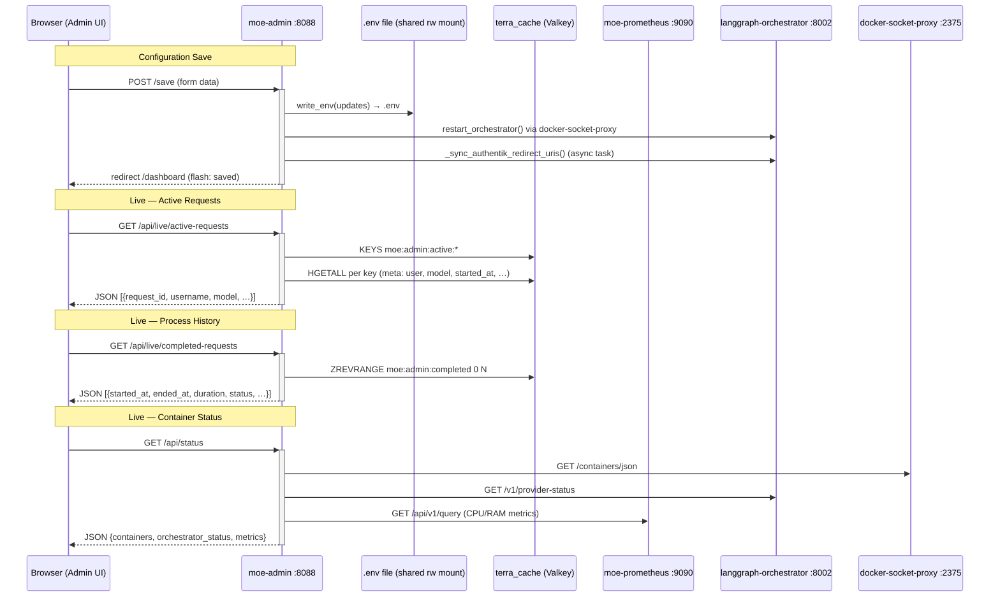
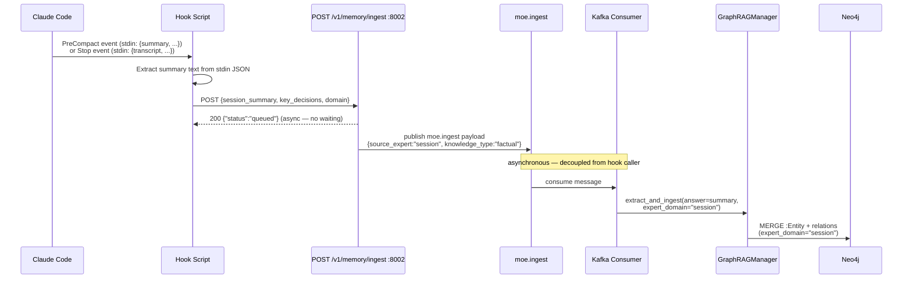

# Data Flow & Caching

## Normal Request Flow

---

## Cache Hit Fast Path

---

## Semantic Pre-Router Fast Path

---

## GraphRAG Ingest — Causal Learning Loop & Synthesis Persistence

```mermaid
flowchart TD
    Response["Merger LLM output\n(raw res.content)"] --> SynthDetect

    SynthDetect{"SYNTHESIS_INSIGHT\nblock present?\n(regex scan)"}
    SynthDetect -->|yes| StripTag["Strip tag → res_content_clean\nparse JSON → _synthesis_payload"]
    SynthDetect -->|no| KWDetect
    StripTag --> KWDetect

    KWDetect{"Knowledge-type\nheuristic\n(keyword scan on\nres_content_clean)"}
    KWDetect -->|action + location\nkeywords found| PKafka[("Kafka moe.ingest\nknowledge_type=procedural\nsynthesis_insight=…|null")]
    KWDetect -->|no action markers| FKafka[("Kafka moe.ingest\nknowledge_type=factual\nsynthesis_insight=…|null")]

    PKafka --> Consumer["Kafka Consumer\n(async, decoupled)"]
    FKafka --> Consumer

    Consumer --> ExpertDomain["Extract source_expert\nfrom payload\n(expert_domain tag)"]
    ExpertDomain --> SynthCheck{"synthesis_insight\nfield present?"}
    SynthCheck -->|yes| SynthIngest["ingest_synthesis(expert_domain=…)\nMERGE :Synthesis {expert_domain}\nMERGE (s)-[:RELATED_TO]->(e)"]
    SynthCheck -->|no / null| IngestLLM
    SynthIngest --> IngestLLM

    IngestLLM["Graph Ingest LLM\n(GRAPH_INGEST_MODEL or\nfallback: Judge LLM)\nSemaphore(2) — max 2 concurrent"]

    IngestLLM --> ExtractPrompt["Extended extraction prompt\n— factual triples (IS_A, TREATS, …)\n— procedural triples\n  (NECESSITATES_PRESENCE,\n   DEPENDS_ON_LOCATION,\n   ENABLES_ACTION)"]

    ExtractPrompt --> TypeDetect{"Auto-detect\nknowledge_type\nfrom extracted triples"}
    TypeDetect -->|procedural rel found| PTriples["Procedural triples\n(Action → Location,\n Condition → Action)"]
    TypeDetect -->|factual rels only| FTriples["Factual triples\n(Drug → Disease, …)"]

    PTriples --> Neo4j[("Neo4j\nMERGE — idempotent\nversioned provenance\n+ expert_domain property")]
    FTriples --> Neo4j
    SynthIngest --> Neo4j

    Neo4j --> GraphRAGNode["graph_rag_node\n(next request)\n2-hop traversal\n+ _query_procedural_requirements\n+ :Synthesis nodes via RELATED_TO"]
    GraphRAGNode --> ProcBlock["[Procedural Requirements]\nblock in graph_context"]
    ProcBlock --> MergerAnnotation["Merger receives structured\nknowledge + prior syntheses"]
```

### Knowledge-Type Classification

| `knowledge_type` | Meaning | Example |
|---|---|---|
| `factual` | Entity properties, measurements, taxonomies | "Ibuprofen TREATS Pain" |
| `procedural` | Action→location requirements, enabling conditions | "CarWashing NECESSITATES_PRESENCE CarWashFacility" |

The classification happens at two points:

1. **At publish** (`merger_node`): keyword heuristic on the final response — presence of terms like *requires*, *necessitates*, *on-site*, *physically* (the actual production set also contains German equivalents to support multilingual queries)
2. **At ingest** (`extract_and_ingest`): auto-overrides to `procedural` if any extracted triple uses a procedural relation type

### Synthesis Detection

Before the knowledge-type heuristic runs, the merger response is scanned for a `<SYNTHESIS_INSIGHT>` block. If found:

- The block is parsed into a JSON object with `summary`, `entities`, and `insight_type`
- It is stripped from the user-facing response (`res_content_clean`)
- It is attached to the `moe.ingest` payload as `synthesis_insight`

The consumer then calls `graph_manager.ingest_synthesis()` **in parallel** with the normal triple extraction. The two paths are independent — a synthesis can exist alongside extracted triples from the same response.

See [Graph-basierte Wissensakkumulation](../intelligence/compounding_knowledge.md) for full details.

---

## Feedback Loop (Valkey → Expert Scoring)

The feedback system operates on three levels:

1. **Performance scores** — Model ratings per category (Laplace-smoothed)
   - Rating ≥ 4 → score increases; T1 stays preferred
   - Rating ≤ 2 → score decreases, T2 escalation more likely

2. **Few-shot examples** — Good responses (rating 5) stored in Valkey + file
   - Injected into expert prompts for similar future queries
   - Self-correction loop catches numeric discrepancies before they propagate

3. **Planner patterns** — Successful expert combinations stored as signatures
   - `"code_reviewer+technical_support"` → planner reuses this pattern for similar queries

---

## Self-Correction Mechanism

### Numeric Mismatch Detection

`self_correction.py` runs as a background task after every merger response:

1. Extracts all numbers from the original query and the final response
2. Compares relative differences (flags Δ > 1% but < 1000% to exclude units)
3. Saves correction examples (Valkey `moe:few_shot:{category}`, max 20 LRU + file `/opt/moe-infra/few_shot_examples/*.md`)
4. These examples surface in the planner prompt as *"known error patterns — avoid these"*

---

## Complexity Routing

| Level | Max Tasks | Research | Graph | Thinking | T2 Allowed |
|---|---|---|---|---|---|
| `trivial` | 1 | ✗ | ✗ | ✗ | ✗ |
| `moderate` | 2 | ✓ | ✓ | ✗ | ✓ |
| `complex` | 4 | ✓ | ✓ | ✓ | ✓ |

---

## Admin UI — Configuration & Live Monitoring Flow

The Admin UI (`moe-admin`) interacts with multiple backends for configuration management
and live process monitoring.

### Process Lifecycle Tracking (Valkey)

The orchestrator registers and deregisters every request in Valkey:

| Event | Valkey Key | Operation |
|-------|-----------|-----------|
| Request start | `moe:admin:active:{request_id}` | `HSET` with user, model, started\_at, mode, type |
| Request end (ok) | `moe:admin:completed` (sorted set) | `ZADD` with score=timestamp; `DEL` active key |
| Request killed | `moe:admin:completed` (sorted set) | `ZADD` with `ended_at` + `status=killed` |

The Admin UI live monitor polls `/api/live/active-requests` every 5 seconds and
`/api/live/completed-requests` every 10 seconds.

---

## Claude Code Auto-Save Hook Flow

External tools such as Claude Code can persist session knowledge before context is
compacted or the session ends. Two hook scripts (`hooks/mempal_precompact_hook.sh`,
`hooks/mempal_save_hook.sh`) POST to the `/v1/memory/ingest` endpoint, which enqueues
the content on `moe.ingest` for the same async GraphRAG pipeline used internally.

The `expert_domain` is set to `"session"` for all hook-sourced ingests, keeping them
in a dedicated namespace that can be queried or filtered independently from expert-generated knowledge.

See [Memory Palace — Auto-Save Hooks](../intelligence/memory_palace.md#feature-3--claude-code-auto-save-hooks) for full setup and reference.
