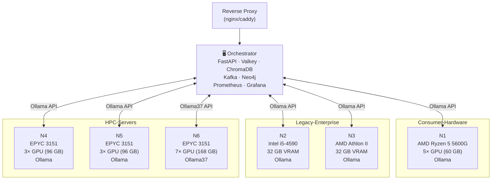
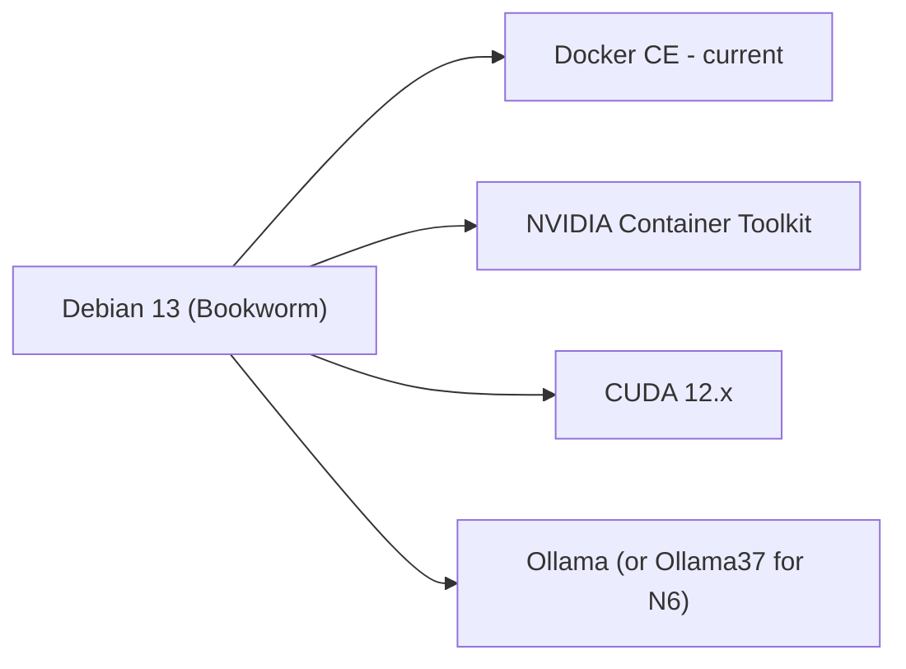

# Hardware

## GPU Node Overview

| Node | CPU | RAM | GPUs | VRAM | Runtime | Notes |
|------|-----|-----|------|------|---------|-------|
| **N1** | AMD Ryzen 5 5600G | 64 GB DDR4 | 3× RTX 2060 12 GB 2× RTX 3060 12 GB | 60 GB | Ollama (Docker CE) | Consumer GPUs |
| **N2** | Intel Core i5-4590 | 32 GB DDR3 | 1× Tesla M10 (4× 8 GB) | 32 GB | Ollama (Docker CE) | Legacy Enterprise |
| **N3** | AMD Athlon II X2 270 | 16 GB DDR3 | 1× Tesla M10 (4× 8 GB) | 32 GB | Ollama (Docker CE) | Ultra-Legacy CPU |
| **N4** | AMD EPYC Embedded 3151 | 128 GB DDR4 ECC | 3× Tesla M10 (96 GB) | 96 GB | Ollama (Docker CE) | HPC Server (4U) |
| **N5** | AMD EPYC Embedded 3151 | 128 GB DDR4 ECC | 3× Tesla M10 (96 GB) | 96 GB | Ollama (Docker CE) | HPC Server (4U) |
| **N6** | AMD EPYC Embedded 3151 | 128 GB DDR4 ECC | 7× Tesla K80 (168 GB) | 168 GB | **Ollama37** (Docker CE) | Kepler CC3.7 |
| **EXP** | Dell Wyse Thin Client | minimal | Tesla M10 (32 GB) via eGPU | 32 GB | Ollama (Docker CE) | MiniPCI → PCIe x16 |

**Total VRAM: ~516 GB**

## Network Topology

## Ollama37 – Kepler Fork (PoC)

Node N6 uses the **Ollama37 fork**, which reactivates Tesla K80 GPUs (Kepler architecture, Compute Capability 3.7) that are unsupported by standard Ollama.

| | Standard Ollama | Ollama37 |
|-|----------------|---------|
| Minimum Compute Capability | 5.0 (Maxwell) | 3.7 (Kepler) |
| Tesla K80 | ❌ not supported | ⚗️ functional (Ollama37 fork) |
| Tesla M10 | ✅ | ✅ |
| Consumer GPUs (RTX etc.) | ✅ | ✅ |
| API compatibility | Standard | Identical |

!!! info "Machbarkeitsstudie — nicht als Produktionsaussage verstehen"
    Die Aktivierung der Tesla K80 durch den Ollama37-Fork ist ein **Proof of Concept**.
    Es wurde gezeigt, dass 7× Tesla K80 = 168 GB VRAM für LLM-Inferenz mit 7B-Modellen
    funktionieren. Ob das für Produktionsworkloads wirtschaftlich oder latenz-technisch
    vertretbar ist, lässt sich erst nach dem ausstehenden Hardware-Latenzvergleich
    (K80 vs. RTX vs. H100) beurteilen — siehe [Ausstehend: Hardware-Latenzvergleich](#ausstehend-hardware-latenzvergleich).

## VRAM Summary

| GPU Type | Nodes | VRAM per GPU | Total GPUs | Total VRAM |
|---------|-------|-------------|------------|------------|
| RTX 2060 12 GB | N1 | 12 GB | 3 | 36 GB |
| RTX 3060 12 GB | N1 | 12 GB | 2 | 24 GB |
| Tesla M10 (4× 8 GB) | N2, N3, N4, N5 | 32 GB | 8 | 256 GB |
| Tesla K80 (2× 12 GB) | N6 | 24 GB | 7 | 168 GB |
| Tesla M10 (eGPU) | EXP | 32 GB | 1 | 32 GB |
| **Total** | | | | **~516 GB** |

## Operating System & Runtime

All nodes run on:

## Experiment: Thin Client eGPU (EXP)

The EXP node demonstrates absolute hardware minimalism:

- **Base**: Dell Wyse Thin Client (< €20 used)
- **Extension**: MiniPCI-Express → PCIe x16 riser + 3D-printed enclosure
- **GPU**: Tesla M10 (4× 8 GB = 32 GB VRAM)
- **Result**: `gpt-oss:20b` at 15 tokens/s ✅

**PoC-Fazit:** Das Experiment zeigt, dass LLM-Inferenz auch auf €50-Hardware prinzipiell
funktioniert. Die Latenz ist für produktive Nutzung nicht untersucht worden — das Ziel war
ausschließlich der Nachweis der technischen Machbarkeit.

---

## Ausstehend: Hardware-Latenzvergleich

Ein vollständiger Latenzvergleich über die gesamte GPU-Leistungsspanne ist in Planung und
wird die Grundlage für konkrete Hardware-Empfehlungen liefern:

| Hardware-Klasse | VRAM | Beispiel | Inferenz-Modus | Status |
|---|---|---|---|---|
| CPU-only | — | x86 / ARM | llama.cpp CPU | ausstehend |
| Embedded / Low-end | 4–6 GB | GT 1060, RPi-GPU | 7B quantisiert | ausstehend |
| Legacy Enterprise | 8–32 GB | Tesla M10, M60 | 7–14B Q4 | **gemessen** (PoC) |
| Legacy HPC | 12–24 GB/GPU | Tesla K80 (Ollama37) | 7B Q4 | **gemessen** (PoC) |
| Consumer | 12–24 GB | RTX 3060–4090 | 7–32B Q4 | **gemessen** |
| Semi-Pro / Workstation | 24–48 GB | RTX 6000 Ada, A5000 | 32–70B | ausstehend |
| Enterprise | 40–80 GB | A100, H100, H200 | 70–120B FP16 | AIHUB gemessen |

**Methodik (geplant):**

- Lokale Hardware (RTX / Tesla M10 / M60 / K80): Ollama mit gemessenen Token/s und
  End-to-End-Latenzen für 7B, 14B und 30B Modelle
- Google Colab mit H100-Karten: Ollama mit 120B LLM, gleiche Testfälle
- Zielmetrik: Token/s (Durchsatz), Time-to-first-token (TTFT), Latenz pro Benchmark-Testfall
- Ergebnis: einheitliche Vergleichstabelle, die die wirtschaftliche Break-Even-Grenze zwischen
  Legacy-Hardware und Consumer/Enterprise-GPUs sichtbar macht
