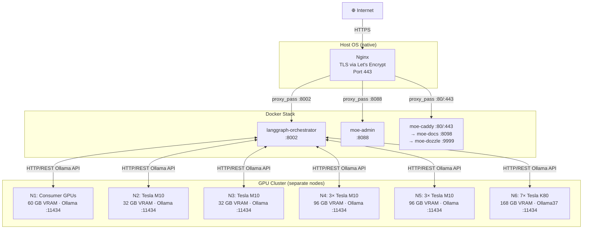
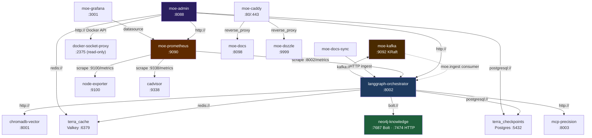
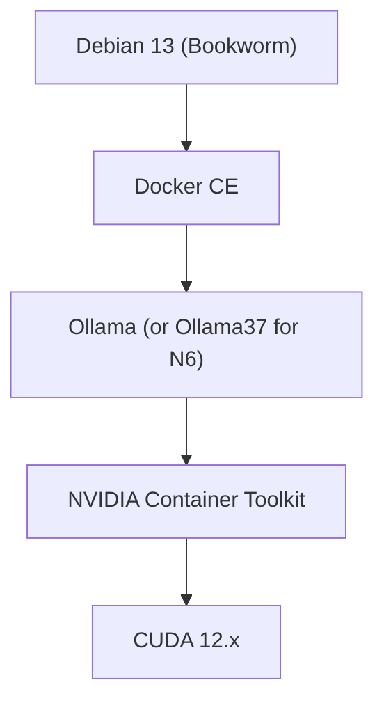

# Infrastructure & Hardware

## Overview

The reference infrastructure consists of 7 GPU nodes running on repurposed enterprise and consumer hardware. It demonstrates that MoE Sovereign functions across a wide spectrum of hardware — from CPU-only inference with 7B models up to high-end enterprise GPUs. The Tesla M10, M60 and K80 nodes are **Proof-of-Concept hardware**: they show what is technically feasible, not what is recommended for production deployments. A systematic latency comparison across all hardware tiers is planned.

!!! note "Reference Implementation"
    The nodes shown are Ollama instances. In an enterprise environment,
    these can be replaced by cloud API endpoints, dedicated GPU clusters, or
    cloud inference services.

## Hardware Table

| Node | CPU | RAM | GPUs | Total VRAM | Notes |
|------|-----|-----|------|------------|-------|
| **N1** | AMD Ryzen 5 5600G | 64 GB DDR4 | 3× RTX 2060 12 GB + 2× RTX 3060 12 GB | 60 GB | Consumer GPUs |
| **N2** | Intel Core i5-4590 | 32 GB DDR3 | 1× Tesla M10 (4× 8 GB) | 32 GB | Legacy Enterprise |
| **N3** | AMD Athlon II X2 270 | 16 GB DDR3 | 1× Tesla M10 (4× 8 GB) | 32 GB | Ultra-Legacy CPU |
| **N4** | AMD EPYC Embedded 3151 | 128 GB DDR4 ECC | 3× Tesla M10 (96 GB) | 96 GB | HPC Server |
| **N5** | AMD EPYC Embedded 3151 | 128 GB DDR4 ECC | 3× Tesla M10 (96 GB) | 96 GB | HPC Server (identical to N4) |
| **N6** | AMD EPYC Embedded 3151 | 128 GB DDR4 ECC | 7× Tesla K80 (2× 12 GB) | 168 GB | Ollama37 fork (Kepler CC3.7) |
| **EXP** | Dell Wyse Thin Client | minimal | Tesla M10 (32 GB) via eGPU | 32 GB | Experiment: MiniPCI → PCIe x16 |

**Total VRAM: ~516 GB** (all nodes)

## Network Topology

### External Access — Host-Level Nginx

The external access layer uses a Nginx instance running **natively on the host OS** (not in Docker).
It terminates TLS via Let's Encrypt (certbot) and proxies requests to the Docker service ports.
See [Webserver & Reverse Proxy](webserver.md) for full details.

### Internal Container Dependency Graph

## Ollama vs. Ollama37

### Standard Ollama
- Supports NVIDIA GPUs from **Compute Capability 5.0** (Maxwell+)
- Tesla K80 (Kepler, CC 3.7): **not supported**

### Ollama37 Fork
- Reactivates CUDA support for **Compute Capability 3.7** (Kepler architecture)
- Enables full inference on Tesla K80 GPUs
- Same API as standard Ollama (drop-in)
- Node N6: 7× Tesla K80 = 168 GB VRAM

!!! info "Machbarkeitsstudie"
    Tesla K80 GPUs are officially no longer supported by Ollama.
    The Ollama37 fork reactivates these cards and enables LLM inference
    on hardware that others treat as electronic waste — demonstrated as a PoC.
    How this compares in latency and throughput to consumer or enterprise GPUs
    remains to be quantified in the planned hardware comparison study.

## VRAM Management

The orchestrator manages model placement dynamically:

- **VRAM inventory**: Each node reports available VRAM via Ollama API
- **Model routing**: Large T2 models are preferentially placed on nodes with more VRAM
- **Multi-GPU**: Tesla M10 and K80 are treated as a single logical pool
- **Failover**: If a node fails, requests are automatically redirected to others

## Runtime Stack per Node

