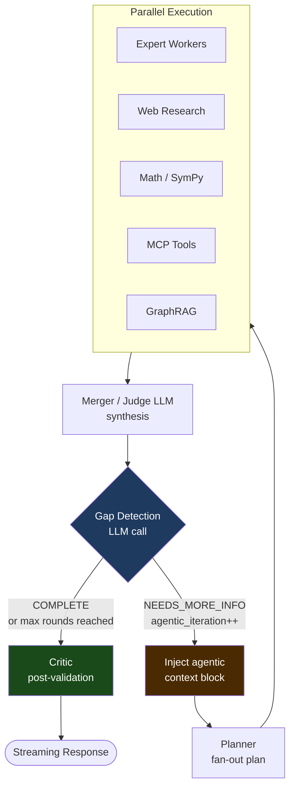

# Agentic Re-Planning Loop

## What is the Agentic Loop?

The agentic loop is a multi-iteration reasoning mechanism that allows MoE Sovereign to autonomously decide whether a question has been fully answered — and if not, to re-plan and execute additional tool calls with the new information.

It addresses the fundamental bottleneck of the single-pass pipeline for complex, multi-step questions (GAIA Level 3 class):

| Approach | Flow | Limitation |
|---|---|---|
| Single-pass | Planner → Experts → Merger → Done | Multi-step chains (search → fetch → parse → calculate) impossible |
| Agentic loop | Planner → Experts → Merger → Gap detection → *(re-plan if needed)* → Critic | Resolves gaps iteratively, up to `max_agentic_rounds` |

---

## How It Works

After each synthesis by the Merger/Judge, an additional lightweight LLM call checks whether the original question has been fully answered:

```
Based on the original question and the current answer, assess completion:

ORIGINAL QUESTION: {input}
CURRENT ANSWER: {final_response}

Reply ONLY in this exact format:
COMPLETION_STATUS: COMPLETE | NEEDS_MORE_INFO
GAP: <what specific fact/calculation/document is still missing, or "none">
NEXT_FOCUS: <one concrete question/action for the next iteration>
```

If the gap detector returns `NEEDS_MORE_INFO`, the pipeline routes back to the **Planner** node with an injected context block explaining what was already established and what still needs resolving. The planner then generates a focused new plan, experts run again in parallel, and the merger synthesizes the enriched results.

This continues until either:
- The gap detector returns `COMPLETE`
- The maximum iteration count (`max_agentic_rounds`) is reached
- The token budget guard triggers (`prompt_tokens > 80 000` → force exit)

---

## Pipeline Flow



---

## AgentState Fields

Four new fields are added to `AgentState` to track agentic loop progress:

| Field | Type | Description |
|---|---|---|
| `agentic_iteration` | `int` | Current iteration index (0 = first pass) |
| `agentic_max_rounds` | `int` | Maximum iterations from template config (0 = disabled) |
| `agentic_history` | `list` | Per-round history: `{iteration, plan_summary, findings, gap}` |
| `agentic_gap` | `str` | What is still unresolved — output of the gap detection call |

---

## Re-Plan Context Injection

On every agentic re-plan iteration, the following block is prepended to the planner's system prompt:

```
=== AGENTIC ITERATION {n}/{max} ===
Previously established facts:
{agentic_history[-1]["findings"]}

Still unresolved:
{agentic_gap}

Instructions: Focus ONLY on resolving the gap above.
Do NOT repeat subtasks that are already answered.
Use web_researcher or precision_tools to fetch missing data.
```

This ensures the planner does not repeat already-completed work and targets exactly the information gap identified by the gap detector.

Additionally, `web_research`, `mcp_result`, and `math_result` are cleared from state before each re-plan so stale results from the previous iteration do not contaminate the new synthesis.

---

## Valkey Plan Cache Bypass

On re-plan iterations, the Valkey plan cache is bypassed even if the input hash matches. The same question produces a different plan in iteration 2 because the context block changes the planner's instructions — caching would return the stale iteration-1 plan.

---

## Streaming Status Messages

During an agentic re-plan, the following messages are streamed to the client (visible in Open-WebUI):

```
🔄 Agentic Loop — Iteration 2/3
📌 Still open: {agentic_gap[:120]}
```

These use the existing `_report()` streaming mechanism — no UI changes required.

---

## Template Configuration

The agentic loop is **opt-in per template**. Set `max_agentic_rounds` in the template's `config_json`:

```json
{
  "max_agentic_rounds": 3
}
```

| Value | Behavior |
|---|---|
| `0` (default) | Agentic loop disabled — standard single-pass pipeline |
| `1–4` | Enable up to N re-plan iterations |

Recommended values by use case:

| Template / Use Case | `max_agentic_rounds` |
|---|---|
| Standard chat | `0` |
| NextGen (AIHUB free) | `3` |
| GAIA / research benchmark | `4` |
| Real-time / low-latency | `0` |

!!! warning "Latency Impact"
    Each agentic round adds one full pipeline pass (planner + experts + merger + gap detection).
    For GAIA L3 questions this is the intended trade-off — depth over speed.
    Do not enable for latency-sensitive templates.

---

## Safety Mechanisms

| Guard | Trigger | Effect |
|---|---|---|
| `max_agentic_rounds` limit | `agentic_iteration >= max` | Force-routes to critic, no more re-plans |
| Token budget | `prompt_tokens > 80 000` | Skip gap detection, set `agentic_gap = "COMPLETE"` |
| Gap detection — empty/COMPLETE | `gap.upper() == "COMPLETE"` or `"none"` | Routes to critic immediately |
| Expert results deduplication | `_dedup_by_category()` | Higher-confidence results from later iterations supersede earlier ones |

---

## Implementation Reference

| Location | What changes |
|---|---|
| `main.py` — `AgentState` | Four new fields: `agentic_iteration`, `agentic_max_rounds`, `agentic_history`, `agentic_gap` |
| `main.py` — `planner_node` | Reads `max_agentic_rounds` from template config; injects agentic context block on iteration > 0; bypasses Valkey plan cache |
| `main.py` — `merger_node` | After synthesis: gap detection LLM call; appends to `agentic_history`; returns `agentic_gap` |
| `main.py` — `_should_replan()` | Routing function: `"planner"` if gap found and rounds remain, else `"critic"` |
| `main.py` — graph edges | `add_edge("merger","critic")` replaced by `add_conditional_edges("merger", _should_replan, ...)` |
