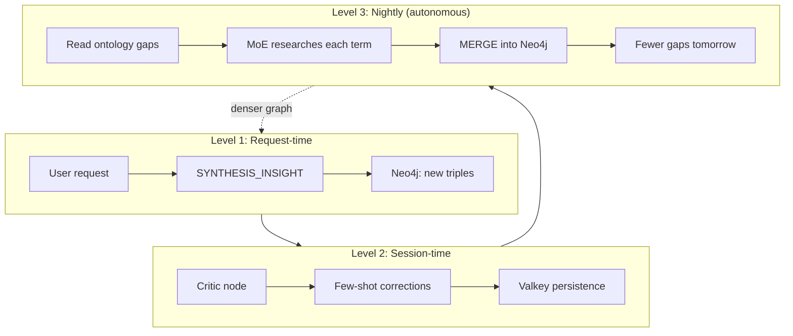

# Autonomous Knowledge Healing

The MoE Sovereign orchestrator includes a **self-healing knowledge loop**
that automatically identifies and closes gaps in the Neo4j knowledge graph
— without human intervention.

## The three compounding levels



- **Level 1** (per request): the merger node emits `<SYNTHESIS_INSIGHT>`
  blocks that are ingested into Neo4j as new entities and relations.
- **Level 2** (per session): the critic node detects numerical deviations
  and persists few-shot corrections that improve future answers.
- **Level 3** (nightly cron): the `close_ontology_gaps.py` script reads
  terms the system could not classify, uses the MoE orchestrator itself
  to research them, and writes the results back into Neo4j.

## What are ontology gaps?

An **ontology gap** is a term that appears in an LLM answer but cannot be
matched to any existing Neo4j entity label. The orchestrator counts these
via the Prometheus metric `moe_ontology_gaps_total`.

Example: if the merger output mentions "Differential Privacy" but the
knowledge graph has no entity with that name or alias, it is counted as a
gap. The admin can see the top gaps in the Admin UI.

## How the gap healer works

The script `scripts/close_ontology_gaps.py`:

1. **Reads** the top-N gaps from `/v1/admin/ontology-gaps`
2. **Researches** each term by sending a structured prompt to the MoE
   orchestrator: "Classify this term for our knowledge graph"
3. **Parses** the JSON response (entity type, aliases, relations)
4. **Writes** the entities into Neo4j via idempotent `MERGE` statements
5. **Logs** every action for auditing

## Installation

```bash
# Copy systemd units
sudo cp scripts/ontology-gap-healer.service /etc/systemd/system/
sudo cp scripts/ontology-gap-healer.timer /etc/systemd/system/
sudo systemctl daemon-reload
sudo systemctl enable --now ontology-gap-healer.timer

# Check schedule
systemctl list-timers ontology-gap-healer.timer

# Manual run (dry)
MOE_API_KEY=moe-sk-... DRY_RUN=1 python3 scripts/close_ontology_gaps.py

# Manual run (live)
MOE_API_KEY=moe-sk-... python3 scripts/close_ontology_gaps.py
```

## Configuration

| Variable | Default | Description |
|---|---|---|
| `MOE_API_KEY` | *(required)* | API key for the orchestrator |
| `MOE_TEMPLATE` | `moe-reference-30b-balanced` | Template for research calls |
| `NEO4J_URI` | `bolt://neo4j-knowledge:7687` | Neo4j connection |
| `MAX_GAPS_PER_RUN` | `20` | Max gaps to close per invocation |
| `DRY_RUN` | `0` | Set to `1` to preview without writing |

## Ontology anatomy: entities, relations, gaps

The healing loop operates on three interlocking data structures:

**Neo4j entities** — nodes in the knowledge graph, each carrying a canonical
name, a typed classification (e.g. `Framework`, `Protocol`, `Concept`), a
bilingual description and a confidence score. Every entity is a "known
term" the system can reason about.

**Neo4j relations** — typed, directed edges (`IS_A`, `USES`, `IMPLEMENTS`,
`PART_OF`, `EXTENDS`, `RELATED_TO`) that turn the node set into an actual
graph. Relations are what make the ontology queryable beyond a flat
vocabulary — GraphRAG traverses them at retrieval time.

**Ontology gaps** — entries in the Valkey sorted set `moe:ontology_gaps`.
Each gap is a term that appeared in an answer but could not be matched to
any existing entity's name or alias. The score counts how often the term
was seen. Gaps are the graph's "known unknowns": terms the system has
encountered but not yet taxonomised.

The loop closes as follows. When a user asks a question, the orchestrator
produces an answer and extracts noun-like terms from it. Each term is
checked against Neo4j. Terms that match existing entities are retained as
provenance. Terms that do not match are `ZINCRBY`-ed into
`moe:ontology_gaps`. The gap healer later pulls the top gaps, routes them
through a curator expert template for classification, writes the resulting
entities and relations into Neo4j via idempotent `MERGE`, and `ZREM`s the
resolved term from the gap queue.

```
user request ──▶ answer ──▶ term extraction
                                 │
                                 ├─ known term  ──▶ Neo4j entity (provenance)
                                 │
                                 └─ unknown term ──▶ Valkey gap queue
                                                         │
                          gap healer ◀────────────────── │
                               │
                               ▼
                   curator template classifies
                               │
                               ▼
                      MERGE entity + relations
                          into Neo4j
                               │
                               ▼
                    ZREM term from gap queue
```

### The self-replenishing trap

A naive implementation turns the healer into a **net-positive gap producer**:
classifying `Flask` generates a description like *"Flask is a Python
web framework that implements WSGI"*, whose noun extraction adds
`Python`, `WebFramework`, and `WSGI` as three new gaps. One resolved term
produces three new ones — the gap queue monotonically grows.

The MoE orchestrator prevents this by tagging every Kafka `moe.ingest`
message with the originating `template_name`. When the gap-detection
branch in the ingest consumer sees a template name containing
`ontology-curator`, it skips the `ZINCRBY` step entirely: curator
responses are *classifications* of gaps, not sources of them. This
single flag converts the loop from divergent to convergent.

## Parallel healing via per-node curator templates

For a hetero-GPU cluster (mixed RTX and Tesla nodes) the healer uses a
pool of **per-node curator templates**, each pinning its planner, all
expert roles and the judge to a single physical node. This keeps the
warm-model cache local to one GPU and lets four or five concurrent
classifications land on four or five different nodes without routing
contention.

Example pool:

```
moe-ontology-curator-n04-rtx  → 5×12 GB RTX, planner qwen2.5:7b,
                                 general mistral-nemo:12b
moe-ontology-curator-n06-m10-01 → 1×8 GB Tesla M10, mistral-nemo:latest
moe-ontology-curator-n06-m10-02 → 1×8 GB Tesla M10, glm4:9b
moe-ontology-curator-n06-m10-03 → 1×8 GB Tesla M10, llama3.1:8b
moe-ontology-curator-n06-m10-04 → 1×8 GB Tesla M10, hermes3:8b
moe-ontology-curator-n07-gt   → 2×6  GB GT 1060, uniform 7B quantised
moe-ontology-curator-n09-m60  → 4×8  GB Tesla M60, mistral:7b + hermes3:8b
moe-ontology-curator-n11-m10-01 → 1×8 GB Tesla M10, mistral:7b
moe-ontology-curator-n11-m10-02 → 1×8 GB Tesla M10, glm4:9b (cross-node vs N06-02)
moe-ontology-curator-n11-m10-03 → 1×8 GB Tesla M10, llama3.1:8b (cross-node vs N06-03)
moe-ontology-curator-n11-m10-04 → 1×8 GB Tesla M10, qwen2.5:7b
```

The healer rotates round-robin across the pool. Because each template
has an explicit `@node` suffix on every model reference, the sticky-
session router in `_select_node` is bypassed entirely — load balancing
happens at the client, not inside the orchestrator.

Lessons learned during deployment:

- **Per-node templates beat floating mode** for sustained throughput.
  Floating routing collapsed onto a single warm node within seconds.
- **Tesla M60 and M10 crash on 9B+ at Q4.** Swapped to `mistral:7b` and
  `llama3.1:8b` (both Q4_K_M, ~4.5 GB file, ~7 GB runtime VRAM).
- **The admin HTTP endpoint is not durable under load.** The healer now
  reads the gap queue from Valkey directly and uses the admin endpoint
  only as a fallback.
- **Neo4j property polymorphism bites silently.** Some legacy entities
  have `name` stored as a `StringArray`; `toLower` on an array throws a
  Cypher type error that `asyncio.gather(return_exceptions=True)` will
  swallow. The healer filters array-typed names with
  `valueType(e.name) STARTS WITH 'LIST'`.
- **Permissions must include the curator template IDs.** The orchestrator
  silently falls back to the first allowed template when the requested
  one is not in the user's permission set, routing requests to the wrong
  node. Grant `expert_template` perms for every curator template ID.

## Observed growth

After a benchmark session (71 jobs, 9 cognitive tests):

| Metric | Before | After | Growth |
|---|---:|---:|---|
| Graph entities | ~400 | 1,542 | +285% |
| Graph relations | ~200 | 1,264 | +532% |
| Ontology gaps | 0 | 140 | 140 new terms identified |

The 140 gaps represent terms like "Legitimate Interest Assessment",
"Data Protection Impact Assessment", "Differential Privacy", "Subnet
Mask", "Broadcast Address" — domain terminology that the base ontology
(400 entities) does not yet cover. The nightly healer will research
and classify these automatically.
