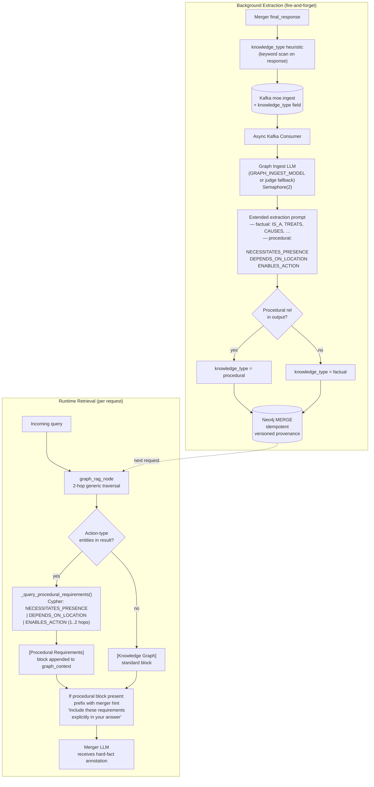

# Causal Learning Loop

## Why This Was Needed

The original knowledge graph in MoE Sovereign was populated with factual triples — entity taxonomies, drug interactions, framework dependencies. This worked well for questions like *"What does Ibuprofen treat?"* or *"What does LangGraph depend on?"*.

It broke down for questions that require **procedural reasoning** — understanding what *must happen* for an action to be possible.

**Example:** A user asks *"I want to wash my car. What do I need to do?"*

A system with only semantic similarity (ChromaDB) returns responses that are topically related to car washing. A system with only flat factual triples (Neo4j) can retrieve that a *CarWashFacility* is a *Location* — but it cannot derive that going to a *CarWashFacility* is a **necessary physical precondition** for the action of *CarWashing*.

The gap is between **semantic similarity** and **causal necessity**:

| Layer | What it knows | What it cannot express |
|---|---|---|
| ChromaDB | "These concepts are related" | "This action requires this precondition" |
| Flat Neo4j entities | "X is a Y" | "Doing X physically requires being at Y" |
| **Causal learning loop** | All of the above | **"Action X NECESSITATES_PRESENCE Location Y"** |

This matters at enterprise scale. Consider:

- *Hardware installation requires physical access to the server room.*
- *On-premises deployment requires a data center to be reachable.*
- *Running an SSH command requires network connectivity.*

These are world-rules that no amount of semantic similarity will surface. They need to be **extracted, stored, and explicitly retrieved** as procedural facts.

---

## Architecture



---

## New Ontology Elements

### Entity Types

Three new entity types were added to `graph_rag/ontology.py`:

| Type | Examples | Role in reasoning |
|---|---|---|
| `Action` | Car washing, Hardware installation, Remote deployment | Subject of procedural relations |
| `Location` | Car wash facility, Data center, Server room | Physical or logical place required for an action |
| `Condition` | Car key, Network access, Admin access, SSH key | Prerequisite resource or state |

### Relation Types

Three new relation types were added to the ontology and to the extraction prompt:

| Relation | Direction | Meaning | Example |
|---|---|---|---|
| `NECESSITATES_PRESENCE` | Action → Location | Performing the action requires physical presence at the location | `CarWashing NECESSITATES_PRESENCE CarWashFacility` |
| `DEPENDS_ON_LOCATION` | Action → Location | The action's outcome depends on a specific location being reachable | `RemoteDeployment DEPENDS_ON_LOCATION NetworkAccess` |
| `ENABLES_ACTION` | Condition → Action | A prerequisite resource or state makes the action possible | `CarKey ENABLES_ACTION CarTrip` |

### Seed Triples (loaded at startup)

```
CarWashing         -[NECESSITATES_PRESENCE]→ CarWashFacility
CarTrip            -[NECESSITATES_PRESENCE]→ Vehicle
On-Premises Deploy -[NECESSITATES_PRESENCE]→ DataCenter
HardwareInstall    -[NECESSITATES_PRESENCE]→ ServerRoom
HardwareInstall    -[DEPENDS_ON_LOCATION]→   ServerRoom
RemoteDeployment   -[DEPENDS_ON_LOCATION]→   NetworkAccess
CarKey             -[ENABLES_ACTION]→         CarTrip
NetworkAccess      -[ENABLES_ACTION]→         RemoteDeployment
AdminAccess        -[ENABLES_ACTION]→         On-Premises Deployment
SSHKey             -[ENABLES_ACTION]→         RemoteDeployment
```

These seed triples are hardcoded as safe anchors. The learning loop adds new ones as the system processes real queries.

---

## Extraction Pipeline Details

### 1. Knowledge-Type Tagging (merger_node)

Before publishing to Kafka, the merger scans the final response for procedural language:

```python
_proc_markers = {
    "requires", "necessitates", "physically", "on-site", "must be present",
    # German equivalents (production code supports multilingual queries)
    "muss", "notwendig", "Voraussetzung", "benötigt", "Standort", "vor Ort",
}
knowledge_type = "procedural" if any(kw in answer for kw in _proc_markers) else "factual"
```

This is a lightweight heuristic — no LLM call needed. The ingest step may override it.

### 2. Dedicated Graph Ingest LLM

A separate LLM (`GRAPH_INGEST_MODEL`) can be assigned exclusively for extraction, so it does not compete with the judge/merger model for VRAM:

```
Admin UI → Dashboard → Models section → "Graph Ingest-Modell"
Format: model-name@endpoint (e.g. qwen2.5:7b@RTX)
Empty = falls back to JUDGE_MODEL
```

Concurrent ingest calls are capped at 2 via `asyncio.Semaphore(2)` to prevent GPU saturation during high-volume ingestion.

### 3. Extended Extraction Prompt

The extraction prompt sent to the ingest LLM covers both factual and procedural triples in a single call:

```
Allowed relation types:
  IS_A, PART_OF, TREATS, CAUSES, INTERACTS_WITH, CONTRAINDICATES,
  DEFINES, REGULATES, USES, IMPLEMENTS, DEPENDS_ON, EXTENDS,
  RELATED_TO, EQUIVALENT_TO, AFFECTS, RUNS,
  NECESSITATES_PRESENCE, DEPENDS_ON_LOCATION, ENABLES_ACTION

Allowed entity types:
  [...factual types...], Action, Location, Condition

IMPORTANT — also extract procedural world-rules:
  If the text implies that performing an action requires physical presence
  at a location, use NECESSITATES_PRESENCE (Action → Location).
  If a prerequisite condition enables an action, use ENABLES_ACTION
  (Condition → Action). Maximum 4 procedural triples.
```

The result is parsed as JSON; any triple using a procedural relation overrides `knowledge_type` to `"procedural"` regardless of the heuristic.

### 4. Conflict Detection

Existing conflict detection (`_CONTRADICTORY_PAIRS`) is extended for the new relation types. Currently no contradictory pairs are defined for procedural relations (they do not have logical inverses that would conflict), but the extension point is present for future rules.

### 5. Neo4j MERGE (Idempotent)

All triples are written with `MERGE` — re-sending the same triple only updates provenance metadata (source model, confidence, version counter). This ensures the pipeline is safe to replay without graph corruption.

Provenance fields on every relation:

| Field | Meaning |
|---|---|
| `source_model` | Model name that extracted this triple |
| `confidence` | Float derived from expert confidence at time of extraction |
| `version` | Increments on each MATCH (update) |
| `valid_from` | Timestamp of last update |
| `from_q` | Original query that triggered the extraction |
| `domain` | Expert category domain (technical_support, general, …) |

---

## Runtime Retrieval

During a request, `graph_rag_node` performs two passes:

**Pass 1 — Generic 2-hop traversal** (existing)

```cypher
MATCH (e:Entity)
WHERE toLower(e.name) CONTAINS toLower($term)
WITH e LIMIT 3
OPTIONAL MATCH (e)-[r1]->(n1:Entity)
OPTIONAL MATCH (n1)-[r2]->(n2:Entity)
RETURN e, collect(r1, n1), collect(r2, n2)
```

**Pass 2 — Procedural requirement lookup** (new, only if Action-type entities found in Pass 1)

```cypher
MATCH (a:Entity {type: 'Action'})
WHERE a.name IN $action_names
MATCH (a)-[r:NECESSITATES_PRESENCE|DEPENDS_ON_LOCATION]->(dep)
RETURN a.name, type(r), dep.name, dep.type
UNION
MATCH (cond)-[r:ENABLES_ACTION]->(a:Entity {type: 'Action'})
WHERE a.name IN $action_names
RETURN a.name, 'ENABLED_BY', cond.name, cond.type
LIMIT 20
```

### Output Example

When an `Action` entity is found, the graph context includes:

```
[Knowledge Graph]
• CarWashing (Action): NECESSITATES_PRESENCE CarWashFacility | ...

[Procedural Requirements]
• CarWashing NECESSITATES_PRESENCE CarWashFacility (Location)
• CarKey ENABLED_BY CarTrip (Action)
```

And the merger receives this annotation prepended to the context:

> *"The following knowledge graph facts describe physical or procedural requirements. Include these requirements explicitly in your answer."*

This ensures the merger cannot ignore or soften procedural constraints the way it might treat general semantic context.

---

## Enterprise Use Cases

The causal learning loop is designed to scale to enterprise IT workflows, not just everyday examples:

| Scenario | Extracted world-rule |
|---|---|
| Deploying software on-premises | `On-Premises Deployment NECESSITATES_PRESENCE DataCenter` |
| Running infrastructure automation | `Ansible Playbook DEPENDS_ON_LOCATION NetworkAccess` |
| Hardware provisioning | `ServerRackMounting NECESSITATES_PRESENCE ServerRoom` |
| Database migration | `Schema Migration ENABLES_ACTION Application Deployment` |
| Security audit | `PenetrationTest DEPENDS_ON_LOCATION AuthorizedNetwork` |

As the system processes real queries about these scenarios, new world-rules are automatically extracted and persist in Neo4j — without any manual ontology editing.

---

## Domain Filters

The new entity types (`Action`, `Location`, `Condition`) are included in the domain filters for categories that benefit from procedural reasoning:

| Category | Procedural types included |
|---|---|
| `technical_support` | Action, Location, Condition |
| `code_reviewer` | Action, Condition |
| `general`, `reasoning`, `research` | All types (no filter) |
| `medical_consult`, `legal_advisor` | Not included (domain isolation) |

---

## Configuration

| Setting | Location | Description |
|---|---|---|
| `GRAPH_INGEST_MODEL` | Admin UI → Dashboard → Models | Model name for extraction LLM (`model@endpoint` format) |
| `GRAPH_INGEST_ENDPOINT` | Admin UI → Dashboard → Models | Inference server for the ingest LLM |
| Semaphore limit | `manager.py` `_get_ingest_semaphore()` | Hard-coded at 2 concurrent calls |
| Proc. keyword set | `main.py` `_proc_markers` | Keywords triggering `knowledge_type=procedural` at publish time |
