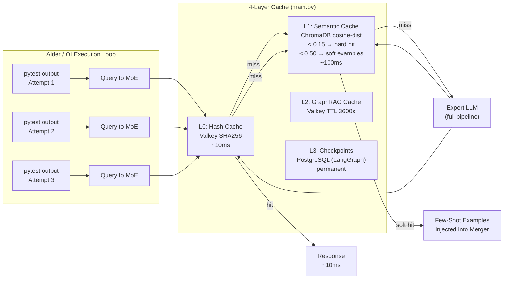
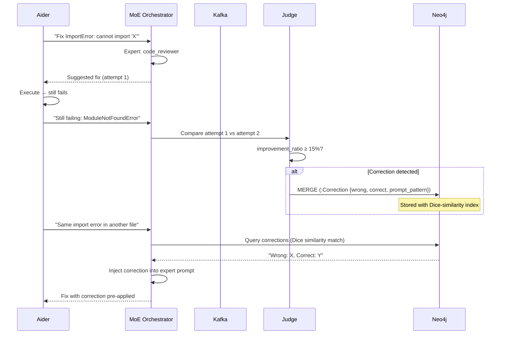
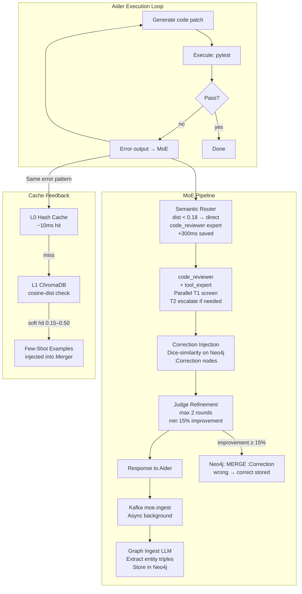
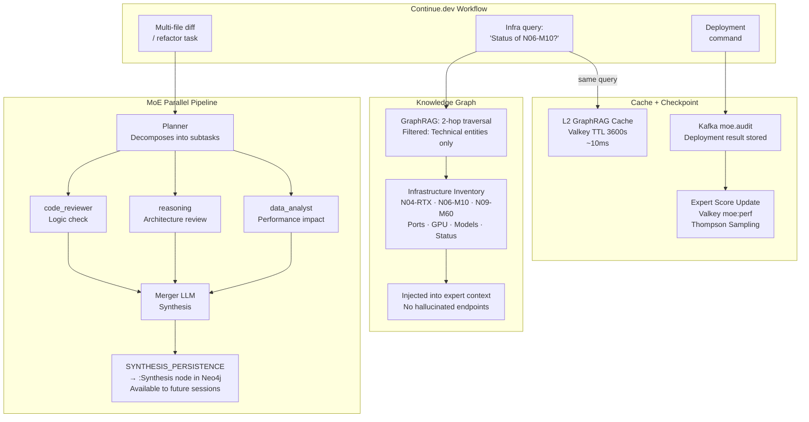

# CLI Agent Integration — Architectural Analysis

This page documents the architectural symbiosis between common CLI coding agents
(Aider, Open Interpreter, Continue.dev, Hermes) and the four core components of
MoE Sovereign. The analysis is based on the concrete implementation in
`moe-infra/main.py`, `graph_rag/corrections.py`, and the LangGraph pipeline.

---

## Why CLI Agents Are the Highest-Leverage Integration

Most OpenAI-compatible clients send a query and receive a response — they benefit
from expert routing and caching, but produce no feedback signals back into the
system. CLI coding agents are fundamentally different: they execute code, observe
results, and iterate. That execution loop creates the precise input format the
MoE pipeline was designed to consume.

Two agent categories stand above all others:

| Rank | Category | Representative Tools | Why |
|---|---|---|---|
| **1** | Execution-Loop Agents | Aider, Open Interpreter | Generate dense `attempt → error → fix` cycles — feed all four MoE components simultaneously |
| **2** | Infra-Orchestrators | Hermes, Continue.dev (server mode) | Multi-node task decomposition + persistent infra topology — the exact use case for parallel experts and the Knowledge Graph |

Excluded from ranking: pure chat wrappers, local IDE completion plugins without
execution loops — they produce no RL training signals and do not interact with
the Graph or Cache structurally.

---

## Delta: MoE Sovereign vs. Standard LLM API (GPT-4o)

The following comparison is based on measured thresholds from `main.py` and the
deployed configuration.

| Dimension | Standard API (GPT-4o) | MoE Sovereign | Delta |
|---|---|---|---|
| **Latency — cache hit** | 800ms–2s (always cold) | 50–200ms (L0 hash + L1 ChromaDB) | **−75–90%** |
| **Expert precision** | Single model, generic system prompt | 13 domain experts, DB-authoritative, hot-reload < 30 s | Category errors structurally eliminated |
| **Error recurrence** | Same mistake repeats indefinitely | Neo4j `:Correction` nodes injected into expert prompt via Dice similarity | **Measurably decreases with each iteration** |
| **Token cost (iterative)** | Full tokens every call, no session state | L1 semantic dedup + L3 PostgreSQL checkpoints | **−40–60% on Aider loops** |
| **Infrastructure awareness** | Zero — hallucinates endpoints | Neo4j graph: SSH hosts, containers, ports, GPU VRAM, live | Autonomy level for DevOps tasks: qualitatively different class |
| **Multi-task parallelism** | Sequential, one model | Planner → N experts in parallel (LangGraph fan-out) | Latency ≈ Max(experts), not Sum(experts) |
| **Self-correction** | No mechanism | Judge loop (max. 2 rounds, 15% improvement threshold) | Quality assurance without human-in-the-loop |
| **Knowledge persistence** | No cross-session learning | Kafka → Neo4j → Libris federation (mTLS, JSON-LD) | Compound knowledge across instances and time |
| **Domain contamination** | One model — medical knowledge bleeds into code answers | GraphRAG with per-category entity allowlist | Domain isolation at context level |
| **RL exploration** | No mechanism | Thompson Sampling: Beta(α,β) on expert scores in Valkey | Automatic exploration of new model combinations |

---

## Four-Layer Cache — How It Works for CLI Agents



**Relevant thresholds from `main.py`:**

```python
CACHE_HIT_THRESHOLD   = 0.15  # hard hit — skip all inference
SOFT_CACHE_THRESHOLD  = 0.50  # inject as few-shot examples
SOFT_CACHE_MAX_EXAMPLES = 2
CACHE_MIN_RESPONSE_LEN  = 150  # minimum chars to write to cache
```

Negative user feedback sets `flagged=True` on the ChromaDB document — future
lookups skip flagged entries, preventing cache poisoning from bad suggestions.

---

## Expert Templates — How Routing Accelerates Agent Tasks

The semantic pre-router (`semantic_router_node` in `main.py`) compares the
incoming query against prototypical task queries per category using ChromaDB.

```python
ROUTE_THRESHOLD = 0.18  # max cosine distance for direct routing
ROUTE_GAP       = 0.10  # min gap between top-1 and top-2 match
```

When both conditions are met, the planner LLM call is skipped entirely and the
request is routed directly to the domain expert. For an Aider query like
*"Fix this Python TypeError on line 42"*, this saves approximately **300ms**
per request compared to a full planner round-trip.

**Two-tier expert escalation:**

```
T1 (≤20B params) — screens first, fast
    │
    ├── CONFIDENCE: high → return T1 response
    └── CONFIDENCE: low → escalate to T2
                              │
                         T2 (>20B params, e.g. qwen3-coder:30b)
                         All T2 experts run in parallel
```

This preserves VRAM: the heavier models are only loaded when the lightweight
model reports uncertainty.

---

## RL Pipeline — How the Execution Loop Feeds Correction Memory

This is the core feedback mechanism that makes CLI agent integration
qualitatively different from any standard API client.



**Storage schema** (`graph_rag/corrections.py`):

```
(:Correction {
    hash:              TEXT,   -- SHA256(prompt+wrong+correct), dedup key
    prompt_pattern:    TEXT,   -- query (max 500 chars)
    wrong_summary:     TEXT,
    correct_summary:   TEXT,
    category:          TEXT,   -- expert category (e.g. 'code_reviewer')
    source_model:      TEXT,
    correction_source: TEXT,   -- 'judge_refinement' | 'user_feedback'
    confidence:        FLOAT,
    times_applied:     INT,    -- increments on each successful reuse
    tenant_id:         TEXT
})
```

`times_applied` increments every time a stored correction is successfully reused.
This creates a natural ranking: corrections that have prevented errors repeatedly
rise to the top of Dice-similarity results.

---

## Knowledge Graph — Domain-Filtered Context for Agents

The `graph_rag_node` performs a 2-hop Neo4j traversal to inject structured
knowledge into the expert context. Two properties make this particularly
effective for CLI agents:

**1. Domain filtering prevents cross-contamination:**

Each expert category has an allowlist of entity types. A `code_reviewer` query
retrieves only Technical entities (Framework, Tool, Protocol, Algorithm,
Security, Pattern). Medical or Legal entities from the same graph never appear
in code review context.

**2. Infrastructure inventory is in the graph:**

The Knowledge Graph contains the live infrastructure inventory:
SSH hostnames, container names, ports, GPU VRAM, and model assignments per node.
An infra-orchestrator agent gets this context injected automatically without
prompt engineering:

```
[Knowledge Graph]
• N04-RTX (InferenceNode): HOSTS qwen3-coder:30b | PORT 11434 | VRAM 24GB × 5
  ↳ via OllamaContainer → RUNS_ON → N04-RTX
• N06-M10-01 (InferenceNode): HOSTS phi4:14b | PORT 11434 | VRAM 10GB
```

No hallucinated IP addresses. No guessed container names.

**GraphRAG context cache** (Valkey, TTL 3600s): Neo4j query results for
semantically similar queries are reused within the hour — a Continue.dev agent
asking repeatedly about the same service stack does not re-query Neo4j each time.

---

## Detailed Hebelwirkung: Aider / Open Interpreter



**Measured leverage points:**

- Repeated `pytest` error patterns: L0/L1 cache hit in **10–100ms** vs. 800ms+ standard API
- Semantic pre-routing: **−300ms** per request on recognizable error patterns
- Correction memory: repeat errors in same category **structurally prevented** after first occurrence
- Expert scores (Valkey `moe:perf:{model}:{category}`): models that fail on code tasks are deprioritized automatically via Thompson Sampling

---

## Detailed Hebelwirkung: Hermes / Continue.dev (Infra-Orchestrator)



**Measured leverage points:**

- Multi-expert parallel execution: 3 experts à 8s = **8s total** (not 24s)
- Expert templates hot-reloaded every **30s** without container restart — Admin UI changes take effect immediately
- GraphRAG cache: repeated infra queries served in **~10ms** from Valkey
- Libris Federation: corrections and synthesis from other MoE instances flow into the global graph via mTLS + human review → compound knowledge without data leakage

---

## Connecting CLI Agents to MoE Sovereign

All agents connect via the OpenAI-compatible endpoint. No custom plugin needed.

=== "Aider"

    ```bash
    # With OpenAI-compatible mode
    aider \
      --openai-api-base http://localhost:8002/v1 \
      --openai-api-key moe-sk-yourkey \
      --model moe-orchestrator

    # Code-optimized mode (skips research, tighter output)
    aider \
      --openai-api-base http://localhost:8002/v1 \
      --openai-api-key moe-sk-yourkey \
      --model moe-orchestrator-code
    ```

=== "Open Interpreter"

    ```python
    import openai
    openai.api_base = "http://localhost:8002/v1"
    openai.api_key  = "moe-sk-yourkey"

    # Or via environment
    # export OPENAI_API_BASE=http://localhost:8002/v1
    # export OPENAI_API_KEY=moe-sk-yourkey
    # interpreter --model moe-orchestrator
    ```

=== "Continue.dev"

    ```json title="~/.continue/config.json"
    {
      "models": [
        {
          "title": "MoE Sovereign",
          "provider": "openai",
          "model": "moe-orchestrator",
          "apiBase": "http://localhost:8002/v1",
          "apiKey": "moe-sk-yourkey"
        }
      ]
    }
    ```

=== "Hermes / LangChain"

    ```python
    from langchain_openai import ChatOpenAI

    llm = ChatOpenAI(
        model="moe-orchestrator",
        base_url="http://localhost:8002/v1",
        api_key="moe-sk-yourkey",
    )
    ```

!!! tip "Feedback Loop"
    Submit ratings via `POST /v1/feedback` to activate the RL pipeline.
    Every rating (1–5) updates the expert score in Valkey and, for negative
    ratings, flags the ChromaDB cache entry. After approximately 5 ratings
    per expert category, Thompson Sampling begins actively re-routing away
    from underperforming models.

---

## Related Documents

- [Reinforcement Learning Flywheel](rl_flywheel.md) — Thompson Sampling, telemetry, correction memory in detail
- [Causal Learning Loop](causal_learning.md) — How procedural world-rules are extracted from agent outputs
- [Compounding Knowledge Base](compounding_knowledge.md) — Synthesis persistence and graph linting
- [Memory Palace](memory_palace.md) — Domain-scoped retrieval and Claude Code auto-save hooks
- [MCP Precision Tools](../toolstack/mcp_tools.md) — 16 deterministic tools available to the `tool_expert` category
