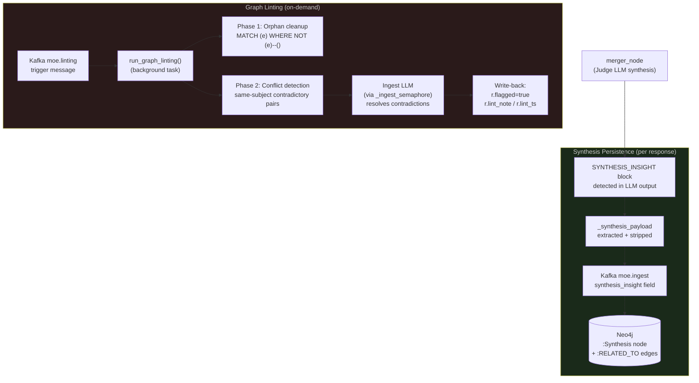
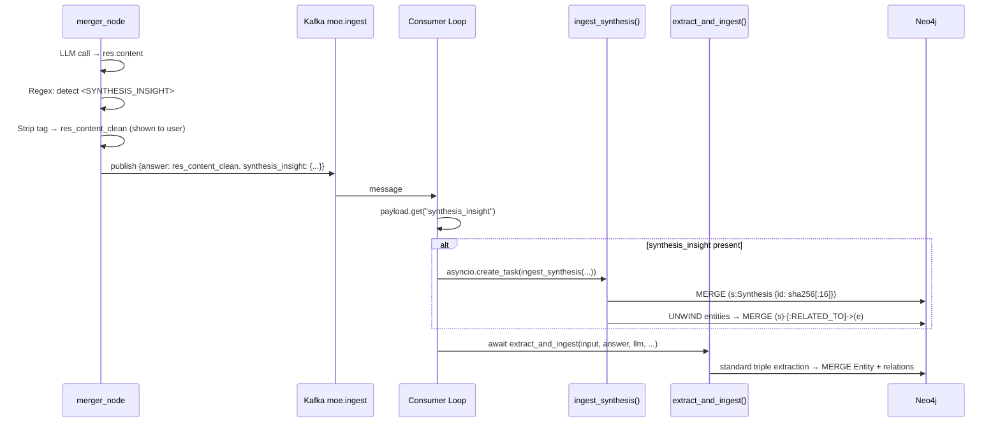

# Graph-basierte Wissensakkumulation

> **Design Principle:** MoE Sovereign does not just retrieve knowledge — it actively builds it. Every synthesis the system produces is a candidate for permanent storage. Every contradiction in the graph is a candidate for resolution. Over time, the knowledge base becomes more accurate, more connected, and more valuable.

---

## Motivation

The causal learning loop (see [Causal Learning](causal_learning.md)) established that responses can be mined for reusable facts. But factual and procedural triple extraction has two blind spots:

1. **High-level insights are lost.** When the merger synthesizes a nuanced comparison across multiple expert results — for example, how two frameworks differ in five dimensions — that synthesis exists only in the chat history. The next user asking a similar question starts from zero.

2. **The graph accumulates contradictions.** As different expert models and different versions contribute triples, conflicting relationship pairs emerge (`Drug A TREATS Disease X` vs. `Drug A CAUSES Disease X`). There is no automatic mechanism to clean them up.

The **Graph-basierte Wissensakkumulation** addresses both gaps with two complementary background mechanisms:

| Mechanism | What it does | Trigger |
|---|---|---|
| **Synthesis Persistence** | Captures novel multi-source insights as `:Synthesis` nodes in Neo4j | Every response (merger_node) |
| **Graph Linting** | Removes orphaned nodes, resolves contradictory relationships | On-demand via `moe.linting` Kafka topic |

---

## Architecture Overview



---

## Feature 1: Synthesis Persistence

### How It Works

The merger_node's system prompt includes a **synthesis persistence instruction**: if the LLM produces a genuinely novel multi-source comparison, causal chain, or logical inference — not a simple factual lookup — it appends a tagged JSON block to the end of its response:

```
<SYNTHESIS_INSIGHT>
{"summary": "...", "entities": ["entity1", "entity2"], "insight_type": "comparison|synthesis|inference"}
</SYNTHESIS_INSIGHT>
```

The orchestrator then:

1. **Detects and strips** the block from the response using a regex (`_SYNTH_RE`). The user never sees the tag — only the clean answer.
2. **Parses the JSON** and attaches it as `synthesis_insight` to the `moe.ingest` Kafka payload.
3. The Kafka consumer detects the `synthesis_insight` field and calls `graph_manager.ingest_synthesis()` **in addition to** the normal triple extraction.

### Synthesis Node Schema (Neo4j)

A new node label `:Synthesis` is created for each unique insight. Uniqueness is determined by `sha256(summary)[:16]` — so the same insight is never duplicated, even if it appears in multiple responses.

```cypher
MERGE (s:Synthesis {id: $id})
ON CREATE SET
    s.text         = $summary,
    s.insight_type = $insight_type,    -- "comparison" | "synthesis" | "inference"
    s.entities     = $entity_names,    -- list of entity names for quick lookup
    s.created      = timestamp(),
    s.domain       = $domain,
    s.source_model = $source_model,
    s.confidence   = $confidence
```

**Relationships:** The synthesis node is linked to all matching `:Entity` nodes via `:RELATED_TO`:

```cypher
UNWIND $entity_names AS ename
MATCH (e:Entity {name: ename})
MERGE (s)-[:RELATED_TO]->(e)
```

This means that when the `graph_rag_node` traverses relationships around a known entity (2-hop), it will also surface relevant `:Synthesis` nodes, enriching the context for future queries.

### Synthesis Instruction

The constant `SYNTHESIS_PERSISTENCE_INSTRUCTION` is appended to the merger's system prompt before every LLM call (not on fast-path bypass). The model is explicitly told to omit the block for simple factual lookups:

> *"If your response contains a novel multi-source comparison, logical inference, or non-trivial synthesis (not a simple factual lookup), append exactly ONE block at the very end of your response: `<SYNTHESIS_INSIGHT>` ... `</SYNTHESIS_INSIGHT>`. Omit this block entirely for direct factual answers or simple retrievals."*

### Ingest Flow



---

## Feature 2: Graph Linting (Knowledge Janitor)

### How It Works

The graph accumulates noise over time: orphaned entities (no relationships), and contradictory relationship pairs from different models or versions. The **graph linting** background task runs on demand and cleans both categories.

**Trigger:** Push any JSON message to the `moe.linting` Kafka topic:

```bash
# Trigger a linting run
sudo docker exec moe-kafka kafka-console-producer \
  --bootstrap-server localhost:9092 \
  --topic moe.linting <<< '{}'
```

The consumer receives the message and launches `asyncio.create_task(graph_manager.run_graph_linting(llm))` — fire-and-forget, never blocking active requests.

### Phase 1: Orphan Cleanup

Orphaned nodes (entities with no relationships, `source = 'extracted'`) contribute no value to graph traversal. They are deleted in batches of 50:

```cypher
MATCH (e:Entity)
WHERE NOT (e)--()
WITH e LIMIT 50
DELETE e
RETURN count(e) AS deleted
```

Ontology nodes (`source = 'ontology'`) are never touched — they are the base vocabulary.

### Phase 2: Conflict Detection & Resolution

The linting process iterates all unique contradictory relationship pairs defined in `_CONTRADICTORY_PAIRS`:

| Pair | Conflict |
|---|---|
| `TREATS` ↔ `CAUSES` | A substance cannot both treat and cause the same disease |
| `TREATS` ↔ `CONTRAINDICATES` | A substance cannot both treat and be contraindicated for the same condition |

For each pair, the Cypher query finds all instances where the **same entity** holds both contradictory relationships to the **same target**:

```cypher
MATCH (a:Entity)-[r1:TREATS]->(x:Entity)
WHERE (a)-[:CAUSES]->(x)
  AND (r1.flagged IS NULL OR r1.flagged = false)
MATCH (a)-[r2:CAUSES]->(x)
WHERE (r2.flagged IS NULL OR r2.flagged = false)
RETURN a.name AS subject, x.name AS target,
       r1.confidence AS conf_a, r2.confidence AS conf_b,
       r1.source_model AS model_a, r2.source_model AS model_b
LIMIT 10
```

For each conflict, the Ingest LLM is asked to resolve it:

```
Two contradictory facts are stored:
  (1) (Drug A)-[TREATS]->(Disease X)  [confidence=0.8, model=phi4:14b]
  (2) (Drug A)-[CAUSES]->(Disease X)  [confidence=0.5, model=llama3.1:8b]
Which is more likely correct?
Respond ONLY with JSON: {"keep": "TREATS", "reason": "..."}
```

The losing relationship is flagged — not deleted — so the decision remains auditable:

```cypher
MATCH (a:Entity {name: $subject})-[r:CAUSES]->(x:Entity {name: $target})
SET r.flagged    = true,
    r.lint_note  = $reason,
    r.lint_ts    = timestamp(),
    r.lint_model = $model
```

### Throttling & VRAM Safety

Graph linting never competes with active user requests because:

1. All LLM calls go through `_get_ingest_semaphore()` — the same module-level `asyncio.Semaphore(2)` that limits all background ingest calls. Active expert workers use their own per-endpoint semaphores, so there is no head-of-line blocking.
2. `await asyncio.sleep(0.5)` between each conflict resolution LLM call yields the event loop, allowing pending HTTP responses to be processed.
3. The linting task is launched with `asyncio.create_task()` — it runs in the event loop but does not block the Kafka consumer from processing the next message.

### Linting Summary Log

After each run, the linting process logs a summary:

```
🧹 Graph-Linting orphans: 12 nodes deleted
🧹 Linting: flagged (Ibuprofen)-[CAUSES]->(Headache) — TREATS has higher confidence (0.8 vs 0.3)
🧹 Graph-Linting complete: 3 conflicts resolved
```

---

## Neo4j Schema Changes

### New Node Label: `:Synthesis`

| Property | Type | Description |
|---|---|---|
| `id` | string | `sha256(text)[:16]` — unique, idempotent identifier |
| `text` | string | Full insight text (max 500 chars) |
| `insight_type` | string | `"comparison"`, `"synthesis"`, or `"inference"` |
| `entities` | list[string] | Entity names linked via `:RELATED_TO` |
| `created` | integer | Unix timestamp (ms) |
| `domain` | string | Knowledge domain from originating response |
| `expert_domain` | string | Source expert category (e.g. `"medical_consult"`, `"session"`) — enables per-expert namespace filtering |
| `source_model` | string | Model that produced the insight |
| `confidence` | float | Confidence score from originating response |

**Index:** `synthesis_domain_idx` on `(s:Synthesis).domain` for domain-filtered queries.

### Entity and Relation Properties (Expert Domain Isolation)

All `:Entity` nodes and their connecting relations created via `extract_and_ingest()` now
carry an additional property for domain-scoped retrieval:

| Property | Node / Relation | Description |
|---|---|---|
| `expert_domain` | `:Entity`, relations | Source expert category (e.g. `"code_reviewer"`, `"session"`) |

This property is set `ON CREATE` and is not overwritten on subsequent MERGE operations,
preserving the original attribution. Useful for querying:

```cypher
MATCH (e:Entity {expert_domain: "medical_consult"}) RETURN e.name LIMIT 20
MATCH (a)-[r {expert_domain: "legal_advisor"}]->(b) RETURN a.name, type(r), b.name LIMIT 10
```

### New Relationship Properties (Linting)

Flagged relationships on `:Entity` nodes receive three new properties:

| Property | Type | Description |
|---|---|---|
| `flagged` | bool | `true` → relationship is contested, not used for retrieval |
| `lint_note` | string | LLM's one-sentence reason for flagging |
| `lint_ts` | integer | Unix timestamp of the linting run |
| `lint_model` | string | Model that made the resolution decision |

### Index

```cypher
CREATE INDEX synthesis_domain_idx IF NOT EXISTS
FOR (s:Synthesis) ON (s.domain)
```

This index is created automatically in `_create_schema()` on startup.

---

## Querying the Graph-basierte Wissensakkumulation

### Find all Synthesis nodes for a domain

```cypher
MATCH (s:Synthesis {domain: "medical_consult"})
RETURN s.text, s.insight_type, s.confidence, s.created
ORDER BY s.created DESC
LIMIT 20
```

### Find syntheses connected to a specific entity

```cypher
MATCH (s:Synthesis)-[:RELATED_TO]->(e:Entity {name: "Ibuprofen"})
RETURN s.text, s.insight_type, s.confidence
```

### Inspect flagged (contested) relationships

```cypher
MATCH (a:Entity)-[r]->(b:Entity)
WHERE r.flagged = true
RETURN a.name, type(r), b.name, r.lint_note, r.lint_model
ORDER BY r.lint_ts DESC
LIMIT 20
```

### Count orphan candidates before linting

```cypher
MATCH (e:Entity)
WHERE NOT (e)--() AND e.source = 'extracted'
RETURN count(e) AS orphan_count
```

---

## Operational Runbook

### Triggering a Linting Run

```bash
# Trigger immediately
sudo docker exec moe-kafka kafka-console-producer \
  --bootstrap-server localhost:9092 \
  --topic moe.linting <<< '{}'

# Watch linting progress in logs
sudo docker logs langgraph-orchestrator -f 2>&1 | grep -E "(Linting|🧹)"
```

### Monitoring Synthesis Growth

```bash
# Query Neo4j browser at http://<host>:7474
# Count synthesis nodes
MATCH (s:Synthesis) RETURN count(s) AS total

# Most recent syntheses
MATCH (s:Synthesis) RETURN s.text, s.domain, s.insight_type
ORDER BY s.created DESC LIMIT 10
```

### Inspecting Flagged Relationships

```bash
# In Neo4j browser
MATCH (a)-[r]->(b) WHERE r.flagged = true
RETURN a.name, type(r), b.name, r.lint_note
```

### Verifying Synthesis Ingestion via Kafka

```bash
# Watch moe.ingest for synthesis_insight fields
sudo docker exec moe-kafka kafka-console-consumer \
  --bootstrap-server localhost:9092 \
  --topic moe.ingest \
  --from-beginning | grep -i synthesis
```
