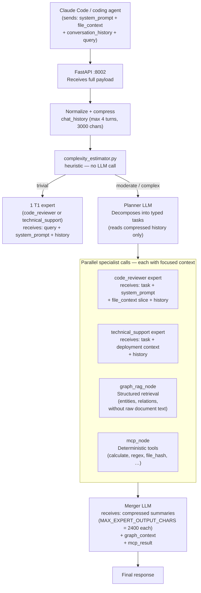

# Context Extension for Coding Agents & Large Documents

## The Problem

Local LLMs have small context windows — typically 4k to 32k tokens depending on the model. This creates a hard ceiling for tasks that involve:

- **Entire codebases**: A mid-size project may contain 100k–500k tokens of source code. No single LLM call can hold all of it.
- **Long documents**: Technical specifications, legal contracts, research papers routinely exceed 20k tokens.
- **Ongoing conversations with coding agents**: Tools like Claude Code or Continue.dev send the system prompt, file contents, tool results, and conversation history in every API call. This accumulates quickly.
- **Multi-step agentic workflows**: Each tool call adds to the history; a long session can exhaust context before the task is done.

Increasing the context window is not a solution — larger windows require more VRAM, slow inference, and still have a ceiling. The real answer is **architectural**: restructure how information reaches LLMs so that each call receives only what it needs.

---

## How MoE Sovereign Extends Effective Context

MoE Sovereign does not extend the *physical* context window of any individual LLM. Instead, it extends the **effective context** available to a query by distributing information across multiple specialized calls and structured retrieval layers.



---

## Mechanism 1 — Distributed Context (MoE Fan-Out)

Instead of one LLM receiving everything, each expert receives only what is relevant to its subtask:

| Expert | Receives | Does NOT receive |
|---|---|---|
| `code_reviewer` | User query + code/file context + task | Legal reasoning, medical knowledge, math derivations |
| `technical_support` | User query + deployment/infra context + task | Creative writing, translation, irrelevant file sections |
| `math` (SymPy) | Symbolic expression only | Any natural language context |
| `mcp` | Tool name + arguments only | Full conversation history |
| `graph_rag` | Query terms + category filter | Raw document text (graph is pre-indexed) |

Each expert call uses **at most ~2400 characters** of output (`MAX_EXPERT_OUTPUT_CHARS`). The merger synthesizes these focused outputs — it never needs to see the full raw documents itself.

**Effective throughput:** A 50k-token codebase is split by the planner into file-focused tasks. Each expert handles a relevant slice. The merger receives 2–4 × 2400 character summaries — well within any context window.

---

## Mechanism 2 — History Compression

Every request from a coding agent carries conversation history. Without management this grows unbounded.

**Strategy:**
- **Maximum turns**: Only the last 4 turns of conversation are included (`HISTORY_MAX_TURNS=4`)
- **Maximum chars**: Total history is truncated at 3000 characters (`HISTORY_MAX_CHARS=3000`)
- **Compression**: Turns that exceed the limit are replaced with `[…]` markers — the LLM can infer that prior context was compressed
- **What is preserved**: The most recent turns (most relevant for coding tasks) are always included; older turns are dropped first

This keeps history consumption bounded regardless of session length.

**Per-template override (since April 2026):**

Expert templates can now override the global limits via `history_max_turns` and
`history_max_chars` in their config. Setting either to `-1` disables compression
entirely for that template — useful for benchmarking or long-context models.

| Config value | Behaviour |
|---|---|
| `0` (default) | Use global `HISTORY_MAX_TURNS` / `HISTORY_MAX_CHARS` |
| `-1` | Unlimited — no compression, full history passed through |
| `N > 0` | Override with custom limit |

---

## Mechanism 3 — Structured Graph Retrieval (GraphRAG)

Rather than dumping raw documents into an LLM prompt, MoE Sovereign pre-indexes project knowledge into Neo4j:

- Architecture decisions → entities + relations
- Dependency graphs → `DEPENDS_ON`, `USES`, `IMPLEMENTS` triples
- Procedural requirements → `NECESSITATES_PRESENCE`, `ENABLES_ACTION` (see [Causal Learning](causal_learning.md))

At query time, `graph_rag_node` retrieves **only the relevant slice** as structured text:

```
[Knowledge Graph]
• LangGraph (Framework): DEPENDS_ON LangChain | USES Python
• FastAPI (Framework): USES Python | IS_A Framework

[Procedural Requirements]
• On-Premises Deployment NECESSITATES_PRESENCE Rechenzentrum (Location)
```

This is ~200–500 tokens of **dense, structured information** — far more efficient than including the full documentation or source files in the prompt.

---

## Mechanism 4 — System Prompt as File Context Carrier

Claude Code and similar tools pass file context in the `system_prompt` field of the API request. MoE Sovereign passes this through the `AgentState.system_prompt` field and attaches it to expert calls in agent mode:

```python
# In expert_worker, agent mode
if mode in ("agent", "agent_orchestrated"):
    expert_messages.insert(0, {"role": "system", "content": system_prompt})
```

This means:

- The **file context** (active file, open tabs, tool results) travels with every expert call
- The **user query** is separated from the file context and handled as a focused task
- Experts can reference specific files without needing the full repo in context

For very large file contexts, the `MAX_EXPERT_OUTPUT_CHARS` limit ensures that even if an expert reads a large file, its *output* is bounded before reaching the merger.

---

## Mechanism 5 — ChromaDB Semantic Cache

Repeated or similar queries hit the cache without any LLM call:

```
Cache distance < 0.15 → return stored response (< 50 ms, 0 tokens)
Cache distance 0.15–0.50 → inject few-shot example (~200 tokens) to guide expert
```

For coding agents that repeatedly ask similar questions in a session (e.g., variations of *"how do I configure X"*), the cache eliminates both context consumption and latency.

---

## Mechanism 6 — Complexity-Based Context Pruning

The `complexity_estimator.py` module classifies queries without an LLM call:

| Level | How determined | Context allocation |
|---|---|---|
| `trivial` | ≤15 words, simple factual question | 1 expert, no graph, no research, no thinking |
| `moderate` | 16–79 words, code block or domain marker | Planner + 2–4 experts, graph allowed |
| `complex` | ≥80 words or multi-step marker | Full pipeline including thinking node |

**Trivial queries** (e.g., *"What is a Docker volume?"*) never reach the planner, graph, or research nodes — they get a single focused expert call. This frees resources for complex queries that need the full pipeline.

---

## Coding Agent Modes

Two operation modes are specifically designed for coding agent workflows:

### `agent` (model: `moe-orchestrator-agent`)

Optimized for fast turnaround in IDEs (OpenCode, Continue.dev):

- Forces `code_reviewer` + `technical_support` categories — skips unrelated experts
- Skips `<think>` wrapper in SSE stream (rendered as raw text by IDE clients)
- History and file context passed to both experts
- Planner may be skipped entirely by semantic pre-router for common patterns

### `agent_orchestrated` (model: `moe-orchestrator-agent-orchestrated`)

For Claude Code — full MoE pipeline with synthesis:

- All expert categories available — planner decides freely based on query
- `force_think=True`: thinking node runs to produce a coherent synthesis plan
- `skip_think=True`: `<think>` tags are NOT emitted in SSE stream (Claude Code renders inline)
- System prompt (file context) passed to all relevant experts
- Graph context + MCP tools available for architecture queries

---

## Token Budget Summary

| Component | Token cost (typical) | Notes |
|---|---|---|
| Planner call | ~400–800 tokens | Compressed history only; cached for 30 min |
| Expert call × 2 | ~600–1200 tokens each | Focused task + system_prompt slice |
| Expert output × 2 | ≤2400 chars (~600 tokens each) | Hard-limited |
| GraphRAG context | ~100–500 tokens | Structured triples, not raw text |
| MCP tool result | ~50–300 tokens | Deterministic, compact |
| Merger call | ~2000–6000 tokens | Receives compressed summaries |
| **Total typical** | **~6000–12000 tokens** | vs. 50k+ if full codebase in one call |

For a codebase that would naively require 100k tokens in a single call, the MoE approach brings the per-request token cost down to the 6k–12k range while covering the same semantic surface — through distribution, compression, and structured retrieval.

---

## Configuration

| Setting | Default | Effect |
|---|---|---|
| `HISTORY_MAX_TURNS` | `4` | Conversation turns included per request |
| `HISTORY_MAX_CHARS` | `3000` | Total history char limit |
| `history_max_turns` (template) | `0` | Per-template override (`0` = global, `-1` = unlimited) |
| `history_max_chars` (template) | `0` | Per-template override (`0` = global, `-1` = unlimited) |
| `MAX_EXPERT_OUTPUT_CHARS` | `2400` | Per-expert output cap before merger |
| `TOOL_MAX_TOKENS` | `8192` | Max tokens for MCP tool responses |
| `REASONING_MAX_TOKENS` | `16384` | Max tokens for thinking node output |
| `CACHE_HIT_THRESHOLD` | `0.15` | Cosine distance for hard cache bypass |
| `SOFT_CACHE_THRESHOLD` | `0.50` | Distance for few-shot injection |

All of these are adjustable via Admin UI → Dashboard → Pipeline Settings.
