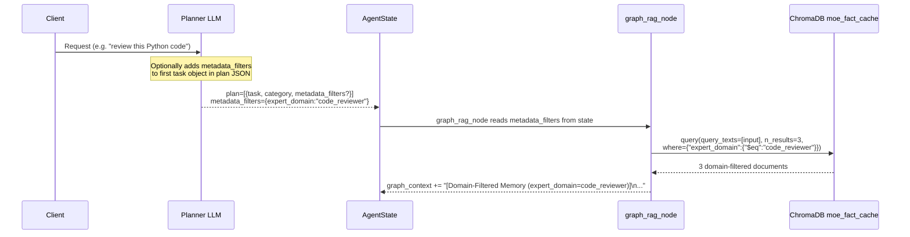
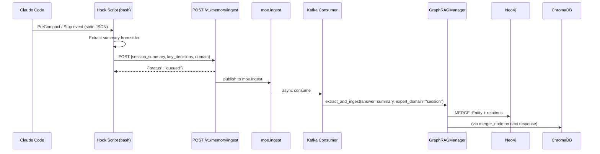
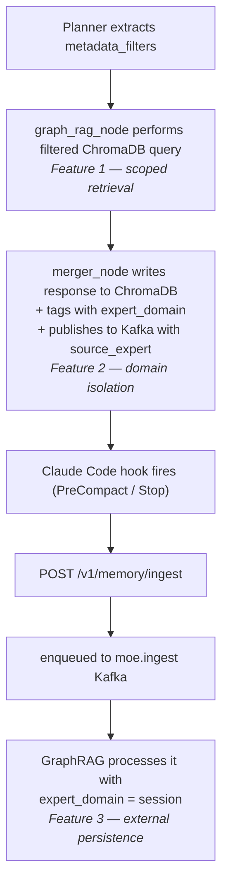

# Memory Palace

> **Design Principle:** Raw knowledge retrieval is noisy. A corpus that spans code reviews, legal questions, and medical consultations must not treat all stored facts as interchangeable. The Memory Palace gives each domain its own namespace, lets the planner attach retrieval filters to its plan, and provides a persistent ingest path so that even session-level knowledge — from tools like Claude Code — survives context resets.

---

## Overview

Three related features work together to make memory retrieval precise and domain-aware:

| Feature | What it does |
|---|---|
| **Metadata-Filtered Search** | The planner optionally extracts domain filters from the query; `graph_rag_node` applies them as a ChromaDB `where` clause for scoped retrieval |
| **Isolated Expert Memory** | Every fact stored in ChromaDB or Neo4j is tagged with the source expert category (`expert_domain`); reads can be filtered to stay within a domain |
| **Auto-Save Hooks** | Claude Code hook scripts and a new `/v1/memory/ingest` endpoint allow external sessions to persist key decisions into the knowledge base before context is lost |

---

## Feature 1 — Metadata-Filtered Semantic Search

### Motivation

Pure vector similarity returns the most *similar* documents regardless of domain. A query
about "Python list comprehensions" might surface cached responses from a `data_analyst`
session that happen to mention Python, rather than the directly relevant `code_reviewer`
answer. With millions of cached responses across all expert domains this noise grows
significantly.

Metadata filtering restricts the vector search to a specific namespace *before* computing
cosine similarity — the equivalent of searching only the relevant "room" of the memory palace.

### How it Works



### Planner Integration

The planner prompt contains an optional instruction:

```
OPTIONAL: Add a "metadata_filters" key to the FIRST task object when the domain
is unambiguous, to scope downstream memory retrieval. Use string values only.
Omit when unsure.
Example: {"task": "...", "category": "code_reviewer",
          "metadata_filters": {"expert_domain": "code_reviewer", "project": "frontend"}}
```

The planner includes `metadata_filters` only when it is confident — e.g., a clearly
domain-specific query. The parser in `planner_node` extracts the dict from the first task
before calling `_sanitize_plan()`, storing it in `AgentState.metadata_filters`.

### ChromaDB where Clause

`graph_rag_node` builds the `where` clause from the state field:

```python
_where = {k: {"$eq": v} for k, v in _meta_filters.items() if isinstance(v, str) and v}
if len(_where) > 1:
    _where = {"$and": [{k: v} for k, v in _where.items()]}

_chroma_res = await asyncio.to_thread(
    cache_collection.query,
    query_texts=[state["input"]],
    n_results=3,
    where=_where,
)
```

The filtered results are appended to `graph_context` under a `[Domain-Filtered Memory]`
label. Any ChromaDB error silently degrades to unfiltered Neo4j-only context — the
filtered path is always additive, never a hard dependency.

### Supported Filter Keys

Any string-valued metadata field stored on ChromaDB documents can be used:

| Key | Example Value | Description |
|---|---|---|
| `expert_domain` | `"code_reviewer"` | Expert category that created the cached response |
| `project` | `"frontend"` | Optional project tag added by the planner |

---

## Feature 2 — Isolated Expert Memory

### Motivation

Without domain isolation, a `medical_consult` expert's cached knowledge pollutes
the retrieval context of a `code_reviewer` expert and vice versa. Isolation ensures that:

- **ChromaDB** only surfaces domain-relevant cached responses when filtered
- **Neo4j** entities and relations carry their origin domain for graph traversal filtering
  and provenance inspection

### Write Path: expert_domain Tagging

Every time `merger_node` stores a response, it derives `_expert_domain` from the plan:

```python
# Priority: safety-critical domains first, then first plan category
_expert_domain = next(
    (c for c in ("medical_consult", "legal_advisor", "technical_support")
     if c in _plan_cats_early),
    _plan_cats_early[0] if _plan_cats_early else "general",
)
```

This value is then written to three places:

#### 1. ChromaDB metadata

```python
metadatas=[{
    "ts":            datetime.now().isoformat(),
    "input":         state["input"][:200],
    "flagged":       False,
    "expert_domain": _expert_domain,   # NEW
}]
```

#### 2. Kafka moe.ingest payload

```python
{
    "domain":        ingest_domain,
    "source_expert": ingest_domain,    # NEW — forwarded by Kafka consumer
    ...
}
```

#### 3. Neo4j via graph_manager

The Kafka consumer extracts `source_expert` and passes it to both ingest methods as
`expert_domain`. The graph manager writes it to:

- `:Entity` nodes — `ON CREATE SET ... a.expert_domain = $expert_domain`
- Extracted relations — `ON CREATE SET ... r.expert_domain = $expert_domain`
- `:Synthesis` nodes — `ON CREATE SET ... s.expert_domain = $expert_domain`

### Updated Neo4j Schema

See also [Compounding Knowledge Base — Neo4j Schema](compounding_knowledge.md#neo4j-schema-changes).

**`:Entity` nodes — new property:**

| Property | Type | Description |
|---|---|---|
| `expert_domain` | string | Source expert category (e.g. `"medical_consult"`) |

**Relations on `:Entity` edges — new property:**

| Property | Type | Description |
|---|---|---|
| `expert_domain` | string | Expert category that contributed the triple |

**`:Synthesis` nodes — new property:**

| Property | Type | Description |
|---|---|---|
| `expert_domain` | string | Expert category that generated the synthesis insight |

### Querying by Domain

#### ChromaDB — filter to a single expert namespace

```python
cache_collection.get(where={"expert_domain": {"$eq": "code_reviewer"}})
```

#### Neo4j — entities from a specific expert

```cypher
MATCH (e:Entity {expert_domain: "medical_consult"})
RETURN e.name, e.type, e.domain
LIMIT 20
```

#### Neo4j — syntheses from a specific expert

```cypher
MATCH (s:Synthesis {expert_domain: "legal_advisor"})
RETURN s.text, s.insight_type, s.confidence
ORDER BY s.created DESC
LIMIT 10
```

#### Neo4j — cross-domain contamination check

```cypher
MATCH (e:Entity)
WHERE e.expert_domain IS NOT NULL
RETURN e.expert_domain, count(e) AS entity_count
ORDER BY entity_count DESC
```

---

## Feature 3 — Claude Code Auto-Save Hooks

### Motivation

Claude Code operates with a sliding context window. When the window fills up, older context
is compacted and summarised — key technical decisions, constraints, and reasoning can be
lost. The Auto-Save Hooks provide a two-part mechanism to prevent this:

1. **Hook scripts** (`hooks/`) capture context at the moment of compaction or session end
   and POST it to the orchestrator
2. **`/v1/memory/ingest` endpoint** accepts the payload and enqueues it on `moe.ingest`
   for async GraphRAG processing — the same pipeline used for all other knowledge ingest

The result: session-level knowledge (architecture decisions, bug root causes, code
constraints) flows into Neo4j and becomes retrievable in future sessions.

### Architecture



### `/v1/memory/ingest` Endpoint

```
POST /v1/memory/ingest
Authorization: Bearer <api-key>
Content-Type: application/json
```

**Request body:**

| Field | Type | Required | Description |
|---|---|---|---|
| `session_summary` | string | yes | Text content to persist (decisions, context, insights) |
| `key_decisions` | list[string] | no | Bullet-point decisions, appended to summary |
| `domain` | string | no | Knowledge domain tag (default: `"session"`) |
| `source_model` | string | no | Hook identifier (default: `"claude-code-hook"`) |
| `confidence` | float | no | Confidence score 0.0–1.0 (default: `0.8`) |

**Response:**

```json
{"status": "queued", "domain": "session", "length": 142}
```

The endpoint publishes to `moe.ingest` and returns immediately — persistence is
asynchronous and does not block the caller.

**Example:**

```bash
curl -X POST http://localhost:8002/v1/memory/ingest \
  -H "Content-Type: application/json" \
  -H "Authorization: Bearer $MOE_API_KEY" \
  -d '{
    "session_summary": "Decision: use Valkey for session caching, not in-memory dicts. Rationale: multi-instance deployment.",
    "key_decisions": ["Valkey over in-memory cache", "TTL=3600 for session keys"],
    "domain": "technical_support"
  }'
```

### Hook Scripts

Both scripts live in `hooks/` at the project root. They are invoked by Claude Code and
receive context as JSON on stdin.

#### `hooks/mempal_precompact_hook.sh` — PreCompact hook

Fires **before** Claude Code compacts the context window. The stdin payload includes a
`summary` field with the LLM-generated compaction summary — the highest-signal snapshot
available before context is truncated.

```bash
# Configuration in ~/.claude/settings.json:
{
  "hooks": {
    "PreCompact": [{
      "matcher": "",
      "hooks": [{"type": "command",
                 "command": "/path/to/moe-infra/hooks/mempal_precompact_hook.sh"}]
    }]
  }
}
```

#### `hooks/mempal_save_hook.sh` — Stop hook

Fires **when Claude Code finishes** a response. Extracts the last 10 assistant messages
from the transcript and POSTs the concatenated text as a session summary.

```bash
# Configuration in ~/.claude/settings.json:
{
  "hooks": {
    "Stop": [{
      "matcher": "",
      "hooks": [{"type": "command",
                 "command": "/path/to/moe-infra/hooks/mempal_save_hook.sh"}]
    }]
  }
}
```

#### Environment Variables

| Variable | Default | Description |
|---|---|---|
| `MOE_MEMORY_ENDPOINT` | `http://localhost:8002/v1/memory/ingest` | Full URL of the ingest endpoint |
| `MOE_API_KEY` | `""` | API key for authentication (leave empty if not configured) |

#### Full Setup

See `hooks/README.md` for step-by-step configuration instructions including shell profile
setup and verification commands.

---

## Interaction Between Features

The three features form a coherent stack:



In a typical multi-session workflow:

1. A `code_reviewer` session builds up knowledge — stored with `expert_domain=code_reviewer`
2. A later `code_reviewer` session asks a similar question — the planner sets
   `metadata_filters={"expert_domain": "code_reviewer"}` — only code review facts surface
3. Before the context window fills, the PreCompact hook fires — the session summary is
   persisted to Neo4j as `expert_domain=session`, available for future cross-domain retrieval

---

## Operational Reference

### Verify expert_domain tagging in ChromaDB

```python
# Connect to ChromaDB (port 8001)
import chromadb
client = chromadb.HttpClient(host="localhost", port=8001)
col = client.get_collection("moe_fact_cache")
results = col.get(where={"expert_domain": {"$eq": "code_reviewer"}}, limit=5)
print(results["documents"])
```

### Query session memory in Neo4j

```cypher
-- All session-sourced entities
MATCH (e:Entity {expert_domain: "session"})
RETURN e.name, e.type, e.domain
ORDER BY e.name
LIMIT 20
```

### Check ingest endpoint health

```bash
curl -s http://localhost:8002/v1/memory/ingest \
  -X POST \
  -H "Content-Type: application/json" \
  -d '{"session_summary":"health-check","domain":"session"}' | jq .
# Expected: {"status":"queued","domain":"session","length":12}
```

### Monitor ingest pipeline

```bash
# Watch GraphRAG ingest processing
sudo docker compose logs -f langgraph-app \
  | grep -E "(memory_ingest|GraphRAG ingest|Filtered ChromaDB|metadata_filters)"
```
