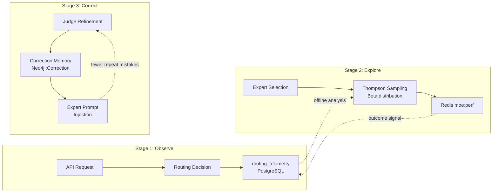

# Reinforcement Learning Flywheel

## Overview

MoE Sovereign uses a three-stage incremental reinforcement learning loop that
improves routing quality and expert accuracy over time — without external
training infrastructure, GPU allocation, or new services.

All three stages reuse existing components (Redis, Neo4j, PostgreSQL) and are
individually toggleable via environment variables.



---

## Stage 1: Routing Telemetry

Every API request produces a telemetry row in `routing_telemetry` (PostgreSQL)
capturing the full routing decision context and outcome.

### Captured Fields

| Group | Fields |
|---|---|
| Request features | `prompt_length`, `prompt_lang` (de/en), `complexity` (trivial/moderate/complex), `has_images`, `has_code` |
| Routing decision | `planner_plan` (JSON), `experts_used[]`, `mcp_tools_used[]`, `cache_hit`, `fast_path` |
| Outcome | `self_score` (1-5, async), `user_rating` (1-5, from /v1/feedback), `total_tokens`, `wall_clock_ms` |
| Scoring snapshot | `expert_scores` (JSON — Thompson-sampled values at routing time) |

### Integration

- Written async at request completion (fire-and-forget, never blocks inference).
- `self_score` updated after the async self-evaluation loop completes.
- `user_rating` updated when a user submits feedback via `/v1/feedback`.

### Offline Analysis

The telemetry table enables queries like:

```sql
-- Experts with low user ratings
SELECT unnest(experts_used) AS expert, avg(user_rating) AS avg_rating
FROM routing_telemetry WHERE user_rating IS NOT NULL
GROUP BY expert ORDER BY avg_rating;

-- Routing patterns that lead to corrections
SELECT template_name, planner_plan, count(*)
FROM routing_telemetry WHERE correction_applied = true
GROUP BY template_name, planner_plan ORDER BY count DESC;
```

---

## Stage 2: Thompson Sampling

Replaces the static Laplace-smoothed expert scoring with stochastic Beta
distribution sampling for natural exploration.

### How It Works

**Before (Laplace point estimate):**
```
score = (positive + 1) / (total + 2)
```
Always returns the same score for the same data — pure exploitation.

**After (Thompson Sampling):**
```
α = positive + 1    (successes + prior)
β = (total - positive) + 1    (failures + prior)
score = random.betavariate(α, β)
```
Each call draws a different sample. Experts with fewer observations have wider
variance and occasionally score higher than their point estimate.

### Why This Is Better

- **Natural exploration:** An expert with 5/5 successes occasionally scores lower
  than one with 50/55 — giving the weaker expert a chance to prove itself on
  unfamiliar query types.
- **Convergence:** As data accumulates, the Beta distribution narrows. After
  ~100 observations, Thompson Sampling and Laplace produce nearly identical rankings.
- **Zero migration:** Same Redis structure (`moe:perf:{model}:{category}` with
  positive/negative/total fields). No schema changes.

### Configuration

| Env var | Default | Effect |
|---|---|---|
| `THOMPSON_SAMPLING_ENABLED` | `true` | Set to `false` for instant rollback to Laplace |
| `EXPERT_MIN_DATAPOINTS` | `5` | Below this threshold: return 0.5 (neutral) regardless of method |

### Monitoring

Prometheus histogram `moe_thompson_sample` tracks sampled score distribution.
Compare with the theoretical Laplace point estimates in Grafana to visualize
exploration breadth over time.

---

## Stage 3: Correction Memory

Stores past expert corrections in Neo4j as `:Correction` nodes and injects
relevant corrections into expert prompts to prevent repeat mistakes.

### Write Path

Corrections are created when:

1. **Judge refinement succeeds** — improvement ratio ≥ 15% (configurable via
   `JUDGE_REFINE_MIN_IMPROVEMENT`). The original (wrong) and refined (correct)
   responses are stored as a correction pair.
2. **Self-correction detects a numerical mismatch** — the wrong and corrected
   values are persisted.
3. **User negative feedback** — when a subsequent positive interaction exists
   for the same topic, the correction pair is extracted.

### Storage Schema (Neo4j)

```
(:Correction {
    hash:              TEXT,     -- SHA256(prompt+wrong+correct), dedup key
    prompt_pattern:    TEXT,     -- user query (max 500 chars)
    wrong_summary:     TEXT,     -- what went wrong
    correct_summary:   TEXT,     -- what the correction was
    category:          TEXT,     -- expert category
    source_model:      TEXT,     -- which model failed
    correction_source: TEXT,     -- 'judge_refinement' | 'self_correction' | 'user_feedback'
    confidence:        FLOAT,   -- reliability score (0-1)
    times_applied:     INT,     -- how often this correction prevented a repeat
    tenant_id:         TEXT      -- RBAC isolation
})
```

### Read Path

At expert invocation, the orchestrator queries Neo4j for corrections matching
the current category and prompt similarity:

```
[CORRECTION MEMORY — avoid repeating these past errors]
- Wrong: {wrong_summary}
  Correct: {correct_summary}
```

This is injected into the expert's system prompt before the user query.

### Configuration

| Env var | Default | Effect |
|---|---|---|
| `CORRECTION_MEMORY_ENABLED` | `true` | Set to `false` to disable read and write |

---

## Rollback

Each stage can be independently disabled without deployment:

| Stage | Rollback | Impact |
|---|---|---|
| Telemetry | `DROP TABLE routing_telemetry;` | No runtime effect |
| Thompson Sampling | `THOMPSON_SAMPLING_ENABLED=false` | Instant revert to Laplace |
| Correction Memory | `CORRECTION_MEMORY_ENABLED=false` | Disables injection + storage |

---

## Design Decision: Why Not Contextual Bandits or DPO?

An earlier proposal suggested Vowpal Wabbit contextual bandits for routing and
DPO LoRA fine-tuning for expert models. We chose the incremental approach
because:

1. **VW competes with the LLM planner.** The planner already performs contextual
   routing — a parallel statistical router creates conflicting signals.
2. **DPO requires dedicated GPU time.** Training on inference hardware evicts
   production models from VRAM. The local cluster has no spare capacity.
3. **Cold-start problem.** VW needs thousands of samples per action. During
   cold-start, the system performs worse than deterministic routing.
4. **The incremental approach covers 80% of the RL value with 10% of the
   complexity:** Thompson Sampling provides exploration, telemetry provides
   analysis, correction memory provides model improvement — all without new
   infrastructure.

DPO remains a future option once 2,000+ clean preference pairs accumulate per
model, on separate training hardware.
