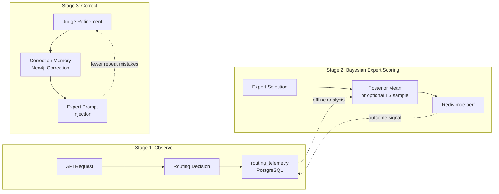

# Adaptive Feedback Loop (RL Flywheel)

## Overview

MoE Sovereign uses a three-stage incremental adaptive feedback loop that
improves routing quality and expert accuracy over time — without external
training infrastructure, GPU allocation, or new services.

The loop is informally called the "RL Flywheel" throughout the codebase and
documentation, but it does not implement policy-gradient reinforcement learning.
The core scoring mechanism is a **Laplace-smoothed Bayesian posterior mean**
over a Beta-Binomial model: after M successes in N observations the routing
score is `(M+1)/(N+2)`. An optional Thompson Sampling exploration mode
(`THOMPSON_SAMPLING_ENABLED=true`) draws from the full Beta posterior instead
of the mean, trading lower variance for exploration breadth.

All three stages reuse existing components (Redis, Neo4j, PostgreSQL) and are
individually toggleable via environment variables.


```mermaid
flowchart LR
    subgraph "Stage 1: Observe"
        A[API Request] --> B[Routing Decision]
        B --> C[routing_telemetry\nPostgreSQL]
    end
    subgraph "Stage 2: Bayesian Expert Scoring"
        D[Expert Selection] --> E[Posterior Mean\nor optional TS sample]
        E --> F[Redis moe:perf]
    end
    subgraph "Stage 3: Correct"
        G[Judge Refinement] --> H[Correction Memory\nNeo4j :Correction]
        H --> I[Expert Prompt\nInjection]
    end
    C -.->|offline analysis| E
    F -.->|outcome signal| C
    I -.->|fewer repeat mistakes| G
```

---

## Stage 1: Routing Telemetry

Every API request produces a telemetry row in `routing_telemetry` (PostgreSQL)
capturing the full routing decision context and outcome.

### Captured Fields

| Group | Fields |
|---|---|
| Request features | `prompt_length`, `prompt_lang` (de/en), `complexity` (trivial/moderate/complex), `has_images`, `has_code` |
| Routing decision | `planner_plan` (JSON), `experts_used[]`, `mcp_tools_used[]`, `cache_hit`, `fast_path` |
| Outcome | `self_score` (1-5, async), `user_rating` (1-5, from /v1/feedback), `total_tokens`, `wall_clock_ms` |
| Scoring snapshot | `expert_scores` (JSON — Thompson-sampled values at routing time) |

### Integration

- Written async at request completion (fire-and-forget, never blocks inference).
- `self_score` updated after the async self-evaluation loop completes.
- `user_rating` updated when a user submits feedback via `/v1/feedback`.

### Offline Analysis

The telemetry table enables queries like:

```sql
-- Experts with low user ratings
SELECT unnest(experts_used) AS expert, avg(user_rating) AS avg_rating
FROM routing_telemetry WHERE user_rating IS NOT NULL
GROUP BY expert ORDER BY avg_rating;

-- Routing patterns that lead to corrections
SELECT template_name, planner_plan, count(*)
FROM routing_telemetry WHERE correction_applied = true
GROUP BY template_name, planner_plan ORDER BY count DESC;
```

---

## Stage 2: Bayesian Expert Scoring

Assigns each `(model, category)` pair a routing score derived from accumulated
outcome observations, using a Laplace-smoothed Beta-Binomial posterior mean as
the default and an optional Thompson Sampling exploration mode.

### How It Works

**Default mode — Laplace-smoothed posterior mean:**
```
score = (positive + 1) / (total + 2)
```
This is the Bayesian posterior mean under a uniform Beta(1,1) prior.
It is deterministic: the same observation history always produces the same score.
New experts start at 0.5 and move toward their true success rate as evidence
accumulates, without ever collapsing to 0 or 1 on sparse data.

**Optional exploration mode — Thompson Sampling (`THOMPSON_SAMPLING_ENABLED=true`):**
```
α = positive + 1          # successes + prior
β = (total - positive) + 1  # failures + prior
score = random.betavariate(α, β)
```
Each call draws a stochastic sample from the Beta posterior. Experts with fewer
observations have wider variance and occasionally outscore their mean estimate,
enabling natural exploration of less-tried experts on unfamiliar query types.

**Distinction:** the default mode is a deterministic routing rule; Thompson
Sampling is a full Bayesian exploration-exploitation strategy. Both use the
same Beta-Binomial model and the same Redis counters — only the score
computation differs.

### Why the Posterior Mean is the Default

- **Reproducibility:** identical request history produces identical routing
  decisions, which simplifies debugging and audit trails.
- **Convergence:** after ~100 observations, Thompson Sampling and the posterior
  mean produce nearly identical rankings. Exploration is most valuable early
  in deployment.
- **Low-variance for critical paths:** routing decisions for medical, legal, and
  precision-tool categories benefit from determinism over stochastic exploration.

### Configuration

| Env var | Default | Effect |
|---|---|---|
| `THOMPSON_SAMPLING_ENABLED` | `false` | Set to `true` to enable Beta-posterior sampling for exploration |
| `EXPERT_MIN_DATAPOINTS` | `5` | Below this threshold: return 0.5 (neutral) regardless of mode |

### Monitoring

Prometheus histogram `moe_thompson_sample` tracks sampled score distribution
when exploration mode is active. Compare with the deterministic Laplace
estimates in Grafana to visualise exploration breadth over time.

---

## Stage 3: Correction Memory

Stores past expert corrections in Neo4j as `:Correction` nodes and injects
relevant corrections into expert prompts to prevent repeat mistakes.

### Write Path

Corrections are created when:

1. **Judge refinement succeeds** — improvement ratio ≥ 15% (configurable via
   `JUDGE_REFINE_MIN_IMPROVEMENT`). The original (wrong) and refined (correct)
   responses are stored as a correction pair.
2. **Self-correction detects a numerical mismatch** — the wrong and corrected
   values are persisted.
3. **User negative feedback** — when a subsequent positive interaction exists
   for the same topic, the correction pair is extracted.

### Storage Schema (Neo4j)

```
(:Correction {
    hash:              TEXT,     -- SHA256(prompt+wrong+correct), dedup key
    prompt_pattern:    TEXT,     -- user query (max 500 chars)
    wrong_summary:     TEXT,     -- what went wrong
    correct_summary:   TEXT,     -- what the correction was
    category:          TEXT,     -- expert category
    source_model:      TEXT,     -- which model failed
    correction_source: TEXT,     -- 'judge_refinement' | 'self_correction' | 'user_feedback'
    confidence:        FLOAT,   -- reliability score (0-1)
    times_applied:     INT,     -- how often this correction prevented a repeat
    tenant_id:         TEXT      -- RBAC isolation
})
```

### Read Path

At expert invocation, the orchestrator queries Neo4j for corrections matching
the current category and prompt similarity:

```
[CORRECTION MEMORY — avoid repeating these past errors]
- Wrong: {wrong_summary}
  Correct: {correct_summary}
```

This is injected into the expert's system prompt before the user query.

### Configuration

| Env var | Default | Effect |
|---|---|---|
| `CORRECTION_MEMORY_ENABLED` | `true` | Set to `false` to disable read and write |

---

## Rollback

Each stage can be independently disabled without deployment:

| Stage | Rollback | Impact |
|---|---|---|
| Telemetry | `DROP TABLE routing_telemetry;` | No runtime effect |
| Thompson Sampling | `THOMPSON_SAMPLING_ENABLED=false` | Instant revert to Laplace |
| Correction Memory | `CORRECTION_MEMORY_ENABLED=false` | Disables injection + storage |

---

## Design Decision: Why Not Contextual Bandits or DPO?

An earlier proposal suggested Vowpal Wabbit contextual bandits for routing and
DPO LoRA fine-tuning for expert models. We chose the incremental approach
because:

1. **VW competes with the LLM planner.** The planner already performs contextual
   routing — a parallel statistical router creates conflicting signals.
2. **DPO requires dedicated GPU time.** Training on inference hardware evicts
   production models from VRAM. The local cluster has no spare capacity.
3. **Cold-start problem.** VW needs thousands of samples per action. During
   cold-start, the system performs worse than deterministic routing.
4. **The incremental approach covers 80% of the RL value with 10% of the
   complexity:** Thompson Sampling provides exploration, telemetry provides
   analysis, correction memory provides model improvement — all without new
   infrastructure.

DPO remains a future option once 2,000+ clean preference pairs accumulate per
model, on separate training hardware.
