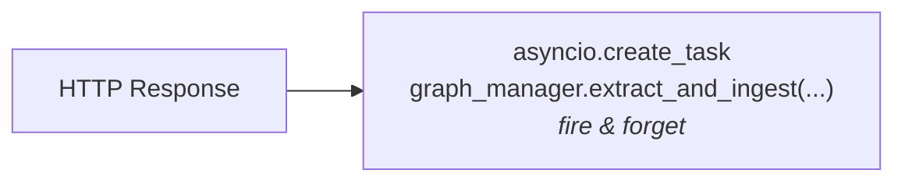
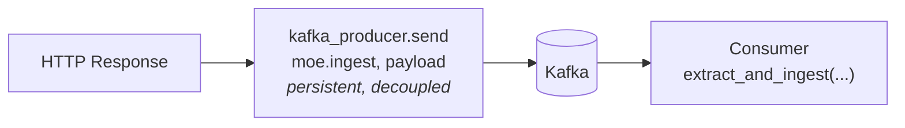
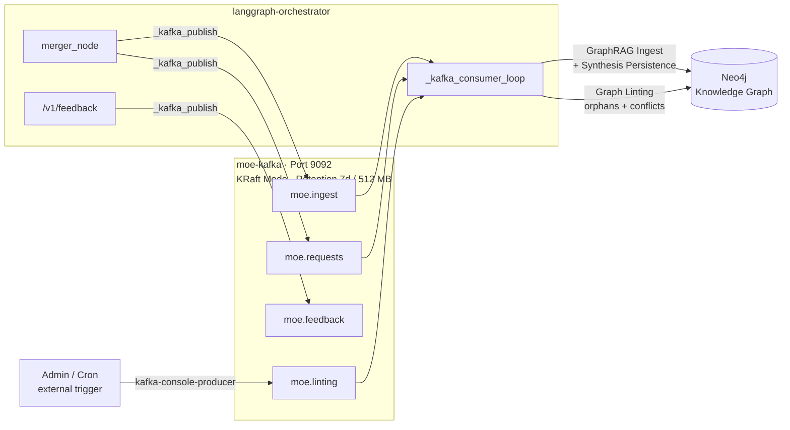
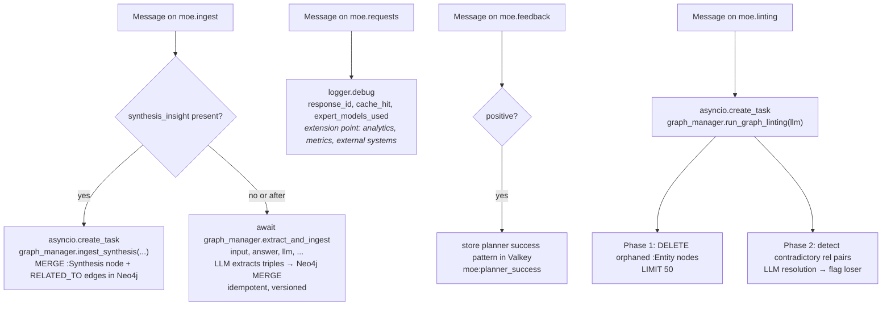

# Kafka — Architecture, Topics & How-To

> Sovereign MoE — Kafka Documentation  
> Last updated: 2026-04-08

---

## 1. Overview & Architecture Decision

### Why Kafka?

Before Kafka, all background operations (GraphRAG ingest, audit logging) were handled as `asyncio.create_task()` in the orchestrator process:



**Problems with this approach:**
- Running ingest tasks are lost on container restart
- No retry on errors (Neo4j briefly unavailable → data lost)
- No decoupling: errors in ingest can affect the main event loop
- No way to attach external consumers (analytics, monitoring)

**With Kafka:**



- **Persistence:** Messages survive container restarts (7-day retention)
- **Decoupling:** Ingest errors do not affect the HTTP response path
- **Extensibility:** External consumers can subscribe to topics at any time
- **Observability:** All events are traceable in topics

### Architecture in the System



---

## 2. Setup & Configuration

### Docker Service

```yaml
# docker-compose.yml
moe-kafka:
  image: confluentinc/cp-kafka:7.7.0
  container_name: moe-kafka
  restart: always
  ports:
    - "9092:9092"
  environment:
    CLUSTER_ID: "moe-kafka-cluster-01"
    KAFKA_NODE_ID: 1
    KAFKA_PROCESS_ROLES: "broker,controller"
    KAFKA_CONTROLLER_QUORUM_VOTERS: "1@moe-kafka:9093"
    KAFKA_LISTENERS: "PLAINTEXT://0.0.0.0:9092,CONTROLLER://0.0.0.0:9093"
    KAFKA_ADVERTISED_LISTENERS: "PLAINTEXT://moe-kafka:9092"
    KAFKA_AUTO_CREATE_TOPICS_ENABLE: "true"
    KAFKA_OFFSETS_TOPIC_REPLICATION_FACTOR: 1
    KAFKA_LOG_RETENTION_HOURS: 168
    KAFKA_LOG_RETENTION_BYTES: 536870912
    KAFKA_LOG_DIRS: "/var/lib/kafka/data"
  volumes:
    - /opt/moe-infra/kafka-data:/var/lib/kafka/data
```

### Environment Variable

```bash
# In .env or docker-compose environment of the orchestrator
KAFKA_URL=kafka://moe-kafka:9092
```

The orchestrator parses this to get the bootstrap server: `moe-kafka:9092`

### Python Dependency

```
aiokafka>=0.11.0   # requirements.txt
```

---

## 3. Topics

| Topic | Producer | Consumer | Purpose |
|---|---|---|---|
| `moe.ingest` | `merger_node` | `_kafka_consumer_loop` | GraphRAG triple extraction + synthesis persistence |
| `moe.requests` | `merger_node` | `_kafka_consumer_loop` (logging) | Full audit log of all requests |
| `moe.feedback` | `POST /v1/feedback` | `_kafka_consumer_loop` (score worker) | Feedback events, planner pattern storage |
| `moe.linting` | external trigger | `_kafka_consumer_loop` → `run_graph_linting` | On-demand graph cleanup: orphan deletion + contradiction resolution |

### Topic Parameters (auto-created)

All topics are created automatically (`KAFKA_AUTO_CREATE_TOPICS_ENABLE=true`) with:
- **Partitions:** 1 (single broker, no clustering needed)
- **Replication:** 1
- **Retention:** 7 days or 512 MB (whichever is reached first)

---

## 4. Producer

**File:** `main.py` — `_kafka_publish()`

```python
async def _kafka_publish(topic: str, payload: dict) -> None:
    if kafka_producer is None:
        return                          # Kafka not available → silent return
    data = json.dumps(payload).encode()
    await kafka_producer.send_and_wait(topic, data)
```

The producer is initialized on startup in `_init_kafka()` (12 attempts, backoff 5–60s):

```python
producer = AIOKafkaProducer(
    bootstrap_servers=KAFKA_BOOTSTRAP,
    value_serializer=lambda v: v,       # bytes, already encoded by _kafka_publish
)
```

**When is published:**

| Time | Topic | Trigger |
|---|---|---|
| After every merger response (> 150 chars) | `moe.ingest` | `merger_node` |
| After every merger response | `moe.requests` | `merger_node` |
| On cache hit | `moe.requests` | `merger_node` |
| On POST /v1/feedback | `moe.feedback` | Feedback endpoint |
| On-demand (admin or cron) | `moe.linting` | External producer |

---

## 5. Consumer

**File:** `main.py` — `_kafka_consumer_loop()`

The consumer runs as a permanent `asyncio` background task, started in `lifespan`.

```python
consumer = AIOKafkaConsumer(
    "moe.ingest",
    "moe.requests",
    "moe.feedback",
    "moe.linting",
    bootstrap_servers=KAFKA_BOOTSTRAP,
    group_id="moe-worker",
    auto_offset_reset="earliest",       # on first start, read from beginning
    value_deserializer=lambda b: json.loads(b.decode()),
)
```

**Consumer logic:**



**Consumer Group:** `moe-worker`
- Offset is persisted in Kafka → no messages are processed twice on restart
- On container restart, consumer resumes from last confirmed position

---

## 6. Message Schemas

### `moe.ingest`

```json
{
  "response_id":       "chatcmpl-550e8400-e29b-41d4-a716-446655440000",
  "input":             "What does Ibuprofen treat?",
  "answer":            "Ibuprofen is an NSAID used to treat pain...",
  "domain":            "medical_consult",
  "source_model":      "phi4:14b",
  "confidence":        0.85,
  "knowledge_type":    "factual",
  "synthesis_insight": null
}
```

When a synthesis was detected in the merger response, `synthesis_insight` is populated:

```json
{
  "synthesis_insight": {
    "summary":      "Ibuprofen and Aspirin differ in COX selectivity, GI risk, and platelet effects.",
    "entities":     ["Ibuprofen", "Aspirin", "COX-1", "COX-2"],
    "insight_type": "comparison"
  }
}
```

| Field | Type | Description |
|---|---|---|
| `response_id` | string | Chat ID from the response |
| `input` | string | Original user query (untruncated) |
| `answer` | string | Full merger response (synthesis block already stripped) |
| `domain` | string | Dominant knowledge domain (`medical_consult`, `legal_advisor`, …) |
| `source_model` | string | Primary expert model used as provenance |
| `confidence` | float | Mean expert confidence (0.0–1.0) |
| `knowledge_type` | string | `"factual"` or `"procedural"` (keyword heuristic) |
| `synthesis_insight` | object\|null | Parsed `SYNTHESIS_INSIGHT` block, or `null` |

### `moe.linting`

```json
{}
```

The linting topic carries an empty (or ignored) payload. The consumer only needs to receive a message to trigger a linting run. Any additional fields are silently ignored.

| Field | Type | Description |
|---|---|---|
| *(none required)* | — | Empty JSON object is sufficient |

### `moe.requests`

```json
{
  "response_id":        "chatcmpl-550e8400-...",
  "input":              "What does Ibuprofen treat?",
  "answer":             "Ibuprofen is an NSAID...",
  "expert_models_used": ["gemma3:27b::general", "qwen3.5:27b::general"],
  "cache_hit":          false,
  "ts":                 "2026-03-29T11:12:36.399123"
}
```

| Field | Type | Description |
|---|---|---|
| `response_id` | string | Chat ID |
| `input` | string | Query (max 300 chars) |
| `answer` | string | Response (max 500 chars) |
| `expert_models_used` | array | `["model::category", ...]` |
| `cache_hit` | bool | Was there a cache hit? |
| `ts` | string | ISO timestamp |

On cache hits, `answer` and `expert_models_used` are absent (not relevant).

### `moe.feedback`

```json
{
  "response_id": "chatcmpl-550e8400-...",
  "rating":      4,
  "positive":    true,
  "ts":          "2026-03-29T11:15:00.123456"
}
```

| Field | Type | Description |
|---|---|---|
| `response_id` | string | Reference to the rated response |
| `rating` | int | 1–5 (1-2=negative, 3=neutral, 4-5=positive) |
| `positive` | bool | `rating >= 4` |
| `ts` | string | ISO timestamp |

---

## 7. How-To: Administrators

### Managing the Kafka Service

```bash
# Check status
sudo docker compose ps moe-kafka

# View logs
sudo docker logs moe-kafka --tail=50

# Restart
sudo docker compose restart moe-kafka

# List topics
sudo docker exec moe-kafka kafka-topics \
  --bootstrap-server localhost:9092 --list

# Show topic details
sudo docker exec moe-kafka kafka-topics \
  --bootstrap-server localhost:9092 \
  --describe --topic moe.ingest

# Show all consumer groups
sudo docker exec moe-kafka kafka-consumer-groups \
  --bootstrap-server localhost:9092 --list

# Check consumer group offsets and lag
sudo docker exec moe-kafka kafka-consumer-groups \
  --bootstrap-server localhost:9092 \
  --describe --group moe-worker
```

### Live Message Monitoring (Debugging)

```bash
# Monitor moe.ingest live
sudo docker exec moe-kafka kafka-console-consumer \
  --bootstrap-server localhost:9092 \
  --topic moe.ingest \
  --from-beginning

# Monitor moe.requests live (audit log)
sudo docker exec moe-kafka kafka-console-consumer \
  --bootstrap-server localhost:9092 \
  --topic moe.requests \
  --from-beginning

# Monitor moe.feedback live
sudo docker exec moe-kafka kafka-console-consumer \
  --bootstrap-server localhost:9092 \
  --topic moe.feedback \
  --from-beginning

# Last 10 messages from a topic
sudo docker exec moe-kafka kafka-console-consumer \
  --bootstrap-server localhost:9092 \
  --topic moe.requests \
  --max-messages 10 \
  --from-beginning
```

### Counting Messages

```bash
# Number of messages in a topic (end offset)
sudo docker exec moe-kafka kafka-run-class kafka.tools.GetOffsetShell \
  --bootstrap-server localhost:9092 \
  --topic moe.ingest \
  --time -1
```

### Triggering a Graph Linting Run

```bash
# Trigger immediately (empty payload is sufficient)
sudo docker exec moe-kafka kafka-console-producer \
  --bootstrap-server localhost:9092 \
  --topic moe.linting <<< '{}'

# Watch linting progress in orchestrator logs
sudo docker logs langgraph-orchestrator -f 2>&1 | grep -E "(Linting|🧹)"
```

### Monitoring moe.linting

```bash
# Monitor linting triggers live
sudo docker exec moe-kafka kafka-console-consumer \
  --bootstrap-server localhost:9092 \
  --topic moe.linting \
  --from-beginning

# Check how many linting runs have been triggered
sudo docker exec moe-kafka kafka-run-class kafka.tools.GetOffsetShell \
  --bootstrap-server localhost:9092 \
  --topic moe.linting \
  --time -1
```

### Monitoring Synthesis Ingestion

```bash
# Filter moe.ingest messages that contain a synthesis
sudo docker exec moe-kafka kafka-console-consumer \
  --bootstrap-server localhost:9092 \
  --topic moe.ingest \
  --from-beginning | grep -i '"synthesis_insight":\s*{'
```

### Creating Topics Manually (if auto-create is disabled)

```bash
sudo docker exec moe-kafka kafka-topics \
  --bootstrap-server localhost:9092 \
  --create --topic moe.ingest \
  --partitions 1 \
  --replication-factor 1 \
  --config retention.ms=604800000 \
  --config retention.bytes=536870912

# Same for moe.requests, moe.feedback, and moe.linting
```

### Resetting Consumer Group Offset (Reprocessing)

```bash
# Stop consumer (shut down orchestrator)
sudo docker compose stop langgraph-app

# Reset offset to beginning
sudo docker exec moe-kafka kafka-consumer-groups \
  --bootstrap-server localhost:9092 \
  --group moe-worker \
  --reset-offsets \
  --to-earliest \
  --all-topics \
  --execute

# Start orchestrator again — consumer reads all messages again
sudo docker compose start langgraph-app
```

**Note:** When reprocessing `moe.ingest`, all triples are written to Neo4j again. Since `MERGE` is used, no duplicates are created.

### Check Disk Usage

```bash
# Kafka data
du -sh /opt/moe-infra/kafka-data/

# Log segments in container
sudo docker exec moe-kafka du -sh /var/lib/kafka/data/
```

### Full Kafka Reset (data loss!)

```bash
sudo docker compose stop moe-kafka
sudo rm -rf /opt/moe-infra/kafka-data/*
sudo docker compose up -d moe-kafka
# Topics will be recreated on next use
```

---

## 8. How-To: Developers

### Writing a New Consumer for an Existing Topic

Example: A consumer for `moe.requests` that writes statistics to a file.

```python
from aiokafka import AIOKafkaConsumer
import asyncio, json

async def analytics_consumer():
    consumer = AIOKafkaConsumer(
        "moe.requests",
        bootstrap_servers="moe-kafka:9092",     # internal
        # bootstrap_servers="localhost:9092",   # from outside (port 9092 exposed)
        group_id="moe-analytics",               # own group, independent of moe-worker
        auto_offset_reset="earliest",
        value_deserializer=lambda b: json.loads(b.decode()),
    )
    await consumer.start()
    try:
        async for msg in consumer:
            payload = msg.value
            print(f"[{payload['ts']}] cache_hit={payload.get('cache_hit')} "
                  f"experts={payload.get('expert_models_used')}")
    finally:
        await consumer.stop()

asyncio.run(analytics_consumer())
```

**Important:** Always use your own `group_id` — never share `moe-worker`, as the internal consumer would then miss messages.

### Adding a New Topic

1. Add constant in `main.py`:

```python
KAFKA_TOPIC_MY_EVENT = "moe.my-event"
```

2. Publish at the desired location:

```python
asyncio.create_task(_kafka_publish(KAFKA_TOPIC_MY_EVENT, {
    "field1": value1,
    "ts":    datetime.now().isoformat(),
}))
```

3. If a consumer is needed, add the topic to the consumer subscription in `_kafka_consumer_loop()`:

```python
consumer = AIOKafkaConsumer(
    KAFKA_TOPIC_INGEST,
    KAFKA_TOPIC_REQUESTS,
    KAFKA_TOPIC_MY_EVENT,    # ← new
    ...
)
```

4. Handle the new message in the consumer loop:

```python
elif msg.topic == KAFKA_TOPIC_MY_EVENT:
    # processing
    pass
```

### Sending Messages from Outside (Testing)

Port 9092 is exposed on the host. From outside or from a test script:

```python
from aiokafka import AIOKafkaProducer
import asyncio, json

async def send_test():
    producer = AIOKafkaProducer(bootstrap_servers="<orchestrator-host>:9092")
    await producer.start()
    payload = json.dumps({"input": "Test", "answer": "Response", "response_id": "test-1"}).encode()
    await producer.send_and_wait("moe.ingest", payload)
    await producer.stop()

asyncio.run(send_test())
```

### Integration Testing (End-to-End)

```bash
# 1. Send request
RESPONSE=$(curl -s http://localhost:8002/v1/chat/completions \
  -H "Content-Type: application/json" \
  -d '{"model":"moe-orchestrator","messages":[{"role":"user","content":"What is Docker?"}],"stream":false}')

echo $RESPONSE | python3 -m json.tool

# 2. Extract response ID
RESPONSE_ID=$(echo $RESPONSE | python3 -c "import sys,json; print(json.load(sys.stdin)['id'])")
echo "Response ID: $RESPONSE_ID"

# 3. Check Kafka message (should contain 1 message each in moe.ingest and moe.requests)
sudo docker exec moe-kafka kafka-run-class kafka.tools.GetOffsetShell \
  --bootstrap-server localhost:9092 --topic moe.ingest --time -1

# 4. Send feedback
curl -s http://localhost:8002/v1/feedback \
  -H "Content-Type: application/json" \
  -d "{\"response_id\":\"$RESPONSE_ID\",\"rating\":5}" | python3 -m json.tool

# 5. Check feedback topic
sudo docker exec moe-kafka kafka-console-consumer \
  --bootstrap-server localhost:9092 \
  --topic moe.feedback \
  --from-beginning \
  --max-messages 1
```

### Monitoring Consumer Lag

Lag indicates how many messages have not yet been processed.

```bash
sudo docker exec moe-kafka kafka-consumer-groups \
  --bootstrap-server localhost:9092 \
  --describe --group moe-worker
```

**Example output:**

```
GROUP       TOPIC        PARTITION  CURRENT-OFFSET  LOG-END-OFFSET  LAG
moe-worker  moe.ingest   0          42              42              0    ← no lag
moe-worker  moe.requests 0          87              87              0
```

Lag > 0 means the consumer is falling behind — typically because Neo4j ingest is slow.

---

## 9. Monitoring & Debugging

### Check Orchestrator Logs

```bash
# Kafka-specific log lines
sudo docker logs langgraph-orchestrator 2>&1 | grep -i kafka

# Consumer joins and partition assignments
sudo docker logs langgraph-orchestrator 2>&1 | grep -E "(group|partition|Consumer)"

# Publish errors
sudo docker logs langgraph-orchestrator 2>&1 | grep "Kafka publish"
```

### Typical Log Patterns on Startup

```
# Normal startup (good)
✅ Kafka Producer connected (moe-kafka:9092)
Joined group 'moe-worker' (generation 1) ...
✅ Kafka Consumer started

# Kafka not ready yet (normal, will be retried)
⚠️ Kafka not reachable (attempt 1/12): ... — retry in 5s
Topic moe.ingest not found in cluster metadata   ← disappears after topic creation

# Kafka permanently unreachable (problem)
❌ Kafka not reachable after 12 attempts — Kafka disabled
```

### Common Problems

| Problem | Cause | Solution |
|---|---|---|
| `GroupCoordinatorNotAvailableError` on startup | Kafka still starting up | Normal — consumer retries automatically |
| `Topic X not found in cluster metadata` | Topic not yet created | Normal — created on first produce |
| Consumer lag constantly growing | Neo4j ingest too slow | Check Neo4j performance, increase heap if needed |
| `Kafka publish [moe.ingest] failed` | Kafka briefly unavailable | Message lost — check container |
| Orchestrator starts but Kafka disabled | 12 connection attempts failed | `sudo docker compose restart moe-kafka` |

---

## 10. Error Handling & Graceful Degradation

The system is built to **function completely without Kafka**:

```python
async def _kafka_publish(topic: str, payload: dict) -> None:
    if kafka_producer is None:
        return          # no Kafka → no action, no error
    try:
        await kafka_producer.send_and_wait(topic, data)
    except Exception as e:
        logger.warning(f"Kafka publish [{topic}] failed: {e}")
        # No raise → main path (HTTP response) not affected
```

**Consequences of Kafka failure:**
- HTTP responses are still delivered correctly
- GraphRAG ingest fails (knowledge graph stops growing)
- Request audit log fails
- Feedback events are not published (but synchronous Valkey/Neo4j updates continue)

**On restart after failure:**
- Producer reconnects automatically
- Consumer resumes from last confirmed offset
- Messages that were produced during the outage were never sent (no local buffer) → not recoverable

---

## 11. Extensions & Roadmap

### Active Background Consumers

| Consumer | Topic | Purpose | Status |
|---|---|---|---|
| GraphRAG ingest + synthesis | `moe.ingest` | Triple extraction → Neo4j; `:Synthesis` node creation | ✅ active |
| Graph linting janitor | `moe.linting` | Orphan cleanup + contradition resolution via LLM | ✅ active |
| Feedback & planner patterns | `moe.feedback` | Valkey performance scoring + planner success patterns | ✅ active |
| Request audit log | `moe.requests` | Debug logging of all request metadata | ✅ active |

### Planned Extensions

| Consumer | Topic | Purpose | Status |
|---|---|---|---|
| Analytics writer | `moe.requests` | Statistics in InfluxDB/Grafana | open |
| Feedback aggregator | `moe.feedback` | Weekly performance reports | open |
| Re-ranking trigger | `moe.feedback` | Automatically deselect expert models on poor scores | open |
| Dead-letter queue | all | Retry failed ingest messages | open |
| Scheduled linting | `moe.linting` | Auto-trigger via cron (e.g. nightly at 02:00) | open |

### Scaling (Multi-Broker)

Currently Kafka runs as single broker (sufficient for this setup). For higher availability:

```yaml
# Multiple brokers via KRaft
KAFKA_CONTROLLER_QUORUM_VOTERS: "1@kafka-1:9093,2@kafka-2:9093,3@kafka-3:9093"
```

Topics would need to be recreated with `--replication-factor 3`.

### Schema Registry

For type-safe messages (Avro/Protobuf), the Confluent Schema Registry can be added:

```yaml
schema-registry:
  image: confluentinc/cp-schema-registry:7.7.0
  environment:
    SCHEMA_REGISTRY_KAFKASTORE_BOOTSTRAP_SERVERS: "moe-kafka:9092"
  ports:
    - "8081:8081"
```

### External Connections

Kafka is exposed on port 9092 on the host. External services (other servers on the LAN) can directly consume topics:

```python
bootstrap_servers="<orchestrator-host>:9092"
```
