# Sovereign MoE — System Documentation

> Last updated: 2026-06-13 — Version 3.0.0
> Project directory: `/opt/moe-sovereign`

---

## 1. Overview

**Sovereign MoE** is a fully self-hosted, sovereign Multi-Model LLM Orchestration System. Incoming requests are analyzed by an intelligent gating network, decomposed into subtasks, and distributed to specialized LLM experts, external search tools, and deterministic precision tools. Results are synthesized by a Judge LLM into a single coherent response.

The system is **OpenAI API-compatible** and can be used as a drop-in replacement in clients like Open WebUI, Claude Code, Continue.dev, and any OpenAI SDK.

### Core Principles

- **Sovereign by design** — all LLMs run locally via Ollama on own GPU hardware; cloud is optional and opt-in
- **Specialization over generalization** — the best available model per category, dynamically selected
- **Exact over estimated** — calculations, hashes, data queries run deterministically via MCP tools
- **Learning through use** — every request feeds back into the routing policy, knowledge graph, and expert performance scores
- **Infrastructure-adaptive routing** — the ONNX gating network adapts to the live cluster state in real time
- **Compliance-first** — a `local_only` mode enforces zero data egress; all cloud endpoints are disabled automatically
- **No hardcoded infrastructure** — all endpoints, models, and tokens are configured via Admin UI; zero hardcodes in source

---

## 2. Development Status (as of 2026-06-13)

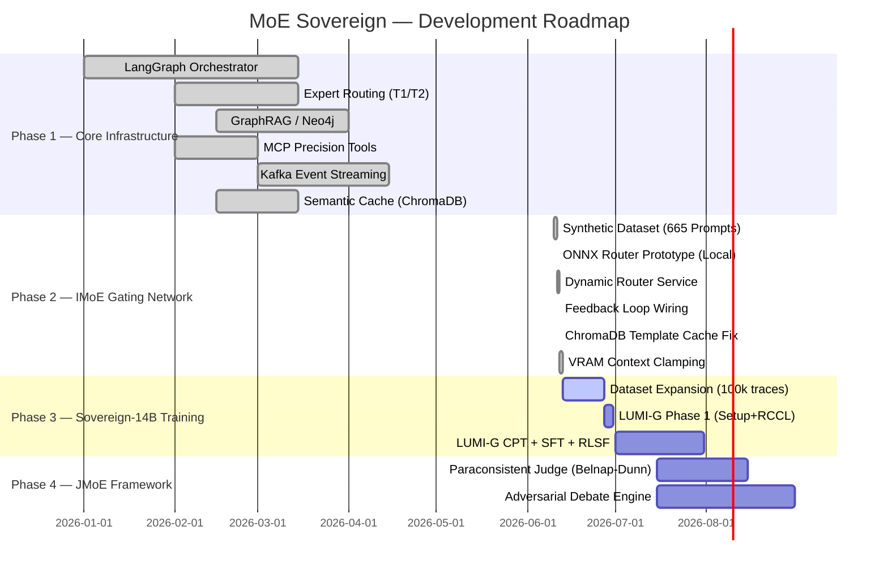

### Component Status

| Component | Status | Since |
|---|---|---|
| LangGraph Orchestrator | ✅ Production | 2026-03 |
| OpenAI-compatible API | ✅ Production | 2026-03 |
| Expert Routing (T1/T2, 14 categories) | ✅ Production | 2026-04 |
| GraphRAG / Neo4j (14.796 entities) | ✅ Production | 2026-04 |
| MCP Precision Tools (16 tools) | ✅ Production | 2026-03 |
| Semantic Response Cache (ChromaDB) | ✅ Production | 2026-03 |
| Kafka Event Streaming | ✅ Production | 2026-04 |
| Thompson Sampling (expert scoring) | ✅ Production | 2026-04 |
| **IMoE ONNX Gating Network** | ✅ Production | **2026-06-12** |
| **Dynamic Template Router** | ✅ Production | **2026-06-12** |
| **ChromaDB Template Cache** | ✅ Production | **2026-06-12** |
| **Feedback-Loop → Retraining Buffer** | ✅ Production | **2026-06-12** |
| **VRAM Context Budget Clamping** | ✅ Production | **2026-06-13** |
| Sovereign-14B (LUMI-G Training) | 🔄 In Preparation | — |
| JMoE Adversarial Debate Engine | 🔄 Planned | — |

---

## 3. Hardware & Infrastructure

```mermaid
graph TB
    subgraph KI_NODE05["ki-vm-node05 (Host Server)"]
        ORCH["langgraph-orchestrator :8002\nLangGraph + FastAPI + IMoE Router"]
        ADMIN["moe-admin :8088\nAdmin UI (Config, Users, Monitoring)"]
        MCP["mcp-precision :8003\n16 Deterministic Precision Tools"]
        EMBED["moe-embed\nall-MiniLM-L6-v2 (local)"]
        CHROMA["chromadb-vector\n3.310 Documents\nSemantic Cache + Template Cache"]
        NEO4J["neo4j-knowledge :7687\n14.796 Entities\n15.565 Relations"]
        PG["terra_checkpoints :5432\nPostgres — LangGraph State\nTemplates, Feedback Log"]
        VALKEY["terra_cache :6379\nValkey — Thompson Sampling\nPlan Cache, Context Budget Cache"]
        KAFKA["moe-kafka :9092\nKRaft — Audit, Ingest, Feedback"]
        GRAFANA["moe-grafana :3001\nPrometheus + Dashboards"]
    end

    subgraph N04_RTX["N04-RTX (node-0X.internal)"]
        direction TB
        GPU_RTX["5× GPU\n60 GB VRAM total"]
        OLLAMA_RTX["Ollama :11434\nqwen3.6:35b (warm)\nqwen3-coder:30b\nllama3.3-70b-ctx4k\n+ weitere"]
    end

    subgraph N11_M10["N11-M10 (node-0X.internal)"]
        direction TB
        GPU_M10["4× GPU\n32 GB VRAM total"]
        OLLAMA_M10["Ollama :11434\nqwen3.6:35b (Judge)\nphi4:14b\n+ weitere"]
    end

    ORCH --> N04_RTX
    ORCH --> N11_M10
    ORCH --> CHROMA
    ORCH --> NEO4J
    ORCH --> PG
    ORCH --> VALKEY
    ORCH --> KAFKA
    ORCH --> MCP
    ORCH --> EMBED
```

### VRAM Budget (enforced)

| Node | VRAM | Judge Limit | Expert Limit |
|---|---|---|---|
| N04-RTX | 60 GB | `qwen3.6:35b` @32k ctx = ~26 GB | `llama3.3-70b-ctx4k` @4k = ~43 GB |
| N11-M10 | 32 GB | `qwen3.6:35b` @32k ctx = ~26 GB | max 1× 30B model |

Context windows are enforced via `resolve_requested_ctx()` in `context_budget.py` — static DB metadata overrides live Ollama `/api/ps` to prevent OOM reload cascades.

---

## 4. IMoE Gating Network (NEW — June 2026)

The **Infrastructure Mixture of Experts (IMoE) Gating Network** is the core innovation of the current development sprint. Instead of static admin-defined templates, a lightweight ONNX classifier dynamically compiles optimal routing configurations per request.

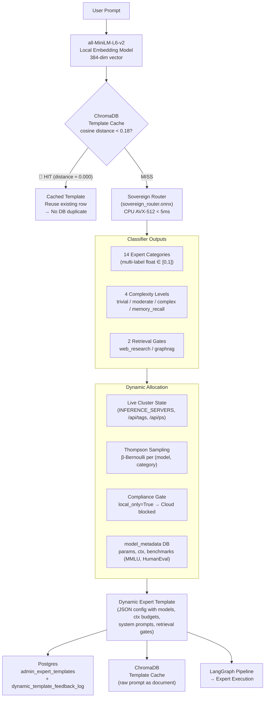

### ONNX Model Details

| Parameter | Value |
|---|---|
| Architecture | Multi-Task Feed-Forward Classifier |
| Base embeddings | `all-MiniLM-L6-v2` (384 dim) |
| Training dataset | 665 synthetic prompts (12 expert domains) |
| Training | 40 epochs, loss 0.285 → 0.032 |
| Training hardware | Local Dev Server (RTX 3060) (LUMI-G export prepared) |
| Inference latency | < 5ms CPU (AVX-512) |
| Deployment | `/app/models/sovereign_router.onnx` |
| Outputs | 14 category scores + 4 complexity classes + 2 gates |

> [!NOTE]
> The MoE Sovereign project has been officially awarded a **EuroHPC Development Grant** (Proposal No. **EHPC-DEV-2026D06-XXX**) of **4,500 node-hours (18,000 GPU-hours)** on the **LUMI-G supercomputer** (AMD MI250x partition). While the current 22M parameter gating model was trained locally to establish the pipeline, the approved EuroHPC resources are reserved for the upcoming large-scale `Sovereign-14B` LLM training (Phase 3) and full-scale dataset retraining.

### Allocation Scoring Formula

For each candidate model $M$ in category $C$:

$$\text{Score}(M, C) = w_{\text{warmed}} \cdot \mathbb{I}(M_{\text{warm}}) + w_{\text{local}} \cdot \mathbb{I}(M_{\text{local}}) + w_{\text{bench}} \cdot \text{Benchmark}(M) + w_{\text{feedback}} \cdot \text{ThompsonSample}(M, C)$$

- **Warmed bonus**: Models already loaded in GPU VRAM are strongly preferred
- **Local priority**: On-premise nodes score higher than cloud endpoints
- **Benchmark**: MMLU/HumanEval/GSM8k scores from `model_metadata` Postgres table
- **Thompson Sample**: Beta-Bernoulli distribution from live success/failure history in Valkey

---

## 5. System Architecture — Full Pipeline

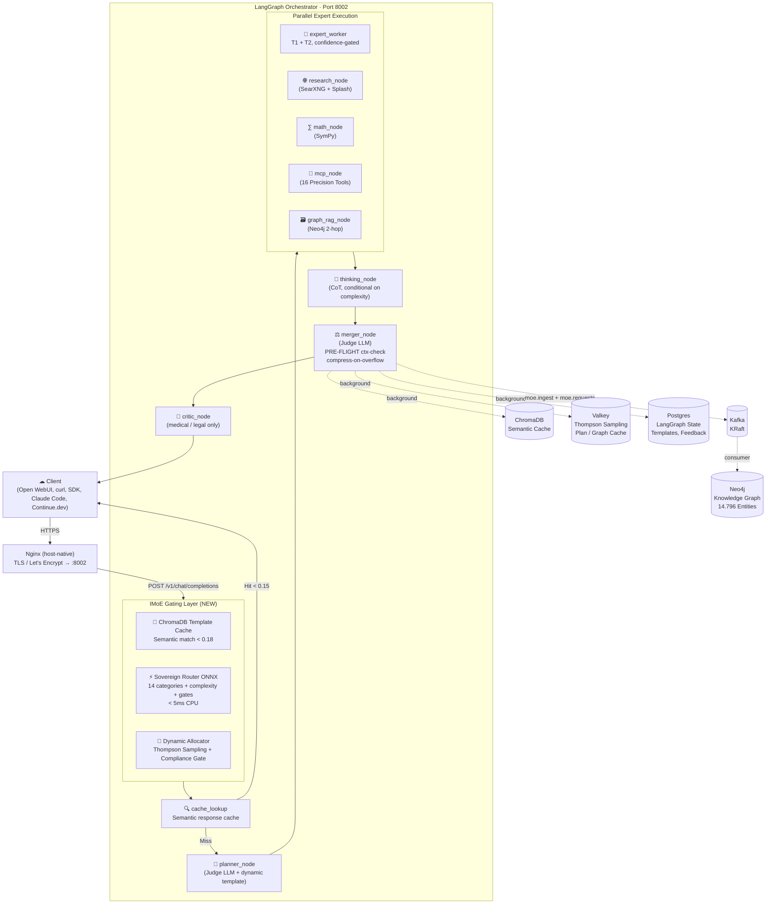

---

## 6. LangGraph Pipeline — Node Details

### Pipeline Flow

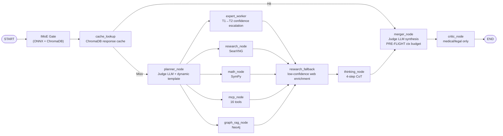

### Key Node Behaviours

#### `planner_node`
- Receives dynamic template from IMoE gate (`complexity_level`, expert categories, retrieval gates)
- Judge LLM decomposes query into 1–4 typed subtasks
- `_sanitize_plan()` validates; falls back to `[{task: input, category: "general"}]`
- **Context clamping**: `resolve_requested_ctx()` enforces per-model VRAM-safe limits

#### `expert_worker`
- **T1 (≤ 20B)** runs first; `CONFIDENCE: high` → T2 skipped; otherwise T2 escalates
- Thompson-sampled performance scores gate expert selection (score < 0.3 → skip)
- Injects chat history (last 4 turns, max 3000 chars) into all messages
- Output cap: `MAX_EXPERT_OUTPUT_CHARS` (2400 chars)
- Confidence-weighted merge in `merger_node`: `★★★ PRIMARY > ★★☆ SUPPORTING > ★☆☆ BACKGROUND`

#### `merger_node`
- **PRE-FLIGHT**: `resolve_requested_ctx()` computes available context budget *before* the LLM call
- On overflow: `compress_prompt_to_fit()` prunes expert inputs proportionally
- Source priority: `Reasoning trace > MCP > Knowledge Graph > Experts > Web > Cache`
- Background writes: ChromaDB cache, Valkey metadata, Kafka audit, Kafka ingest

#### `thinking_node`
- Active if plan has > 1 task **OR** any expert returns `CONFIDENCE: low`
- 4-step Chain-of-Thought: (1) decomposition → (2) source evaluation → (3) gaps → (4) conclusion
- Output as `reasoning_trace` → top-priority section in merger prompt

---

## 7. Expert System

### Expert Categories (14 total)

| Category | T1 Model | T2 Model | Notes |
|---|---|---|---|
| `general` | `gemma3:12b` | `qwen3-coder:30b` | Default fallback |
| `math` | `phi4:14b` | `qwq:32b` | STEM-focused |
| `technical_support` | `deepseek-coder-v2:16b` | `devstral:24b` | DevOps/IT |
| `creative_writer` | `gemma3:27b` | `qwen3.5:35b` | Diverse architectures |
| `code_reviewer` | `devstral:24b` | `qwen3-coder:30b` | Security + modern patterns |
| `medical_consult` | `phi4:14b` | `gemma3:27b` | Safety-critical, triggers critic node |
| `legal_advisor` | `magistral:24b` | `command-r:35b` | Citation-aware RAG |
| `translation` | `translategemma:27b` | `qwen3.5:35b` | Specialist + multilingual |
| `reasoning` | `phi4:14b` | `deepseek-r1:32b` | True CoT reasoning |
| `vision` | — | multimodal model | Image understanding |
| `data_analyst` | `phi4:14b` | `qwen3-coder:30b` | Data analysis |
| `science` | `phi4:14b` | `qwen3.5:35b` | Scientific reasoning |
| `tool_expert` | `qwen3-coder:30b` | — | Tool/API usage |
| `research` | SearXNG | — | Web research gate |

**Current active config (`.env`):** All categories mapped to `qwen3-coder:30b@N04-RTX` as forced override during testing. Revert to per-category config via Admin UI → Expert Templates.

**Judge LLM:** `qwen3.6:35b@N11-M10` — planner, merger, thinking node, critic, GraphRAG extraction

---

## 8. Feedback Loop & Policy Learning

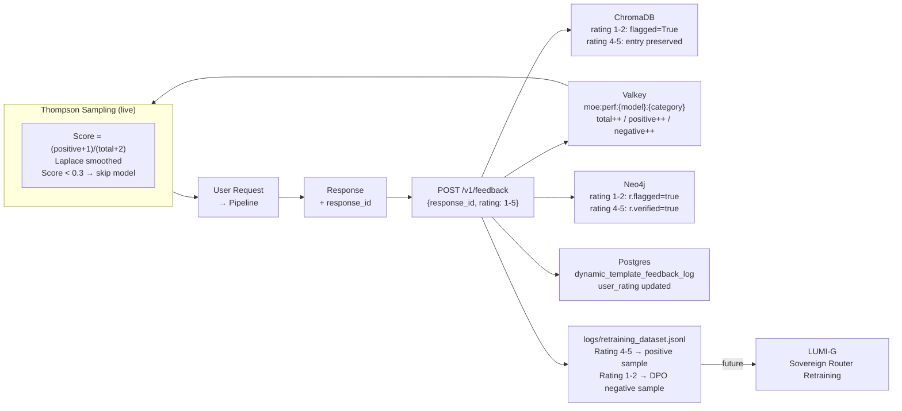

### Expert Performance Scoring

```
Key:    moe:perf:{model}:{category}
Fields: total, positive, negative

Score = (positive + 1) / (total + 2)   # Laplace smoothing
```

| Score | Behaviour |
|---|---|
| < 5 ratings | 0.5 (neutral start) |
| ≥ 0.7 | Preferred; warmed bonus applied |
| < 0.3 after ≥5 ratings | Expert skipped for this category |

---

## 9. MCP Precision Tools

**Port:** 8003 · **File:** `mcp_server/server.py`

All 16 tools run deterministically — no LLM estimation:

| Tool | Description |
|---|---|
| `calculate` | Exact arithmetic, formulas, percentages |
| `solve_equation` | Algebraic equations (SymPy) |
| `date_diff` | Exact date difference (days, years, months) |
| `date_add` | Date arithmetic |
| `day_of_week` | Day of week, calendar week |
| `unit_convert` | Physical units (pint) |
| `statistics_calc` | mean, median, stdev, variance, ... |
| `hash_text` | MD5, SHA1, SHA256, SHA512 |
| `base64_codec` | Base64 encode / decode |
| `regex_extract` | Regex matching with flags |
| `subnet_calc` | CIDR: network, broadcast, host range |
| `text_analyze` | Words, chars, sentences, reading time |
| `prime_factorize` | Prime factorization |
| `gcd_lcm` | GCD and LCM |
| `json_query` | JSON path queries |
| `roman_numeral` | Arabic ↔ Roman |

---

## 10. GraphRAG & Knowledge Graph

**File:** `graph_rag/manager.py` · **DB:** Neo4j 5

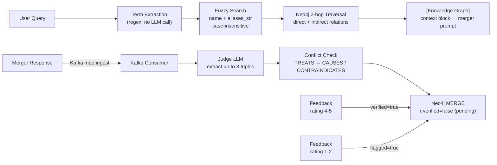

**Current state:** 14.796 entities · 15.565 relations · Growing with every request

### Base Ontology

- **104 base entities** — Medical, Legal, Technical, Math/Science domains
- **100+ relation types** — IS_A, TREATS, CAUSES, IMPLEMENTS, DEPENDS_ON, EXTENDS, ...

---

## 11. Memory Architecture (4 Levels)

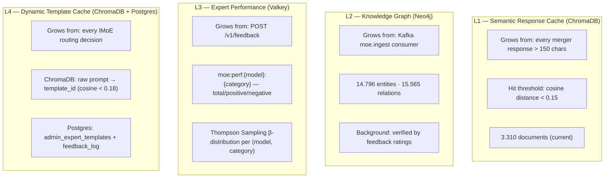

---

## 12. Configuration (Admin UI)

All operational parameters are configured via **MoE Admin UI** (`:8088`) or `.env`. No infrastructure values are hardcoded in source.

### Key Environment Variables

| Variable | Description |
|---|---|
| `INFERENCE_SERVERS` | JSON array of all inference endpoints (Ollama + Cloud) — **single source of truth** |
| `JUDGE_MODEL` / `JUDGE_ENDPOINT` | Model and node for planner/merger/critic |
| `JUDGE_NUM_CTX` | Context window for judge (enforced by `resolve_requested_ctx()`) |
| `EXPERT_MODELS` | JSON: category → `[{model, endpoint, enabled, forced}]` |
| `POLICY_LOG_PATH` | Container-internal path for policy training JSONL |
| `SYSTEM_API_KEY` | System account API key for cloud model discovery |
| `LOG_LEVEL` | `DEBUG` / `INFO` / `WARNING` |

> [!IMPORTANT]
> Cloud endpoints for the IMoE Dynamic Router are derived automatically from `INFERENCE_SERVERS` entries with `api_type != "ollama"`. Configure AIHUB or any other cloud provider via **Admin UI → Inference Servers** — no `.env` changes or container restarts needed.

---

## 13. Docker Services

The full stack consists of **50+ Docker services** on `ki-vm-node05`. Core services:

| Container | Ports | Function |
|---|---|---|
| `langgraph-orchestrator` | `8002→8000` | Core orchestrator, FastAPI, LangGraph, IMoE Router |
| `mcp-precision` | `8003→8003` | 16 deterministic precision tools |
| `moe-admin` | `8088→8088` | Admin UI: config, users, templates, monitoring |
| `moe-embed` | internal | Local embedding model (`all-MiniLM-L6-v2`) |
| `chromadb-vector` | internal | Semantic response + template cache |
| `neo4j-knowledge` | `7474, 7687` | Knowledge graph (GraphRAG + ontology) |
| `terra_checkpoints` | internal | Postgres — LangGraph state, templates, feedback |
| `terra_cache` | internal | Valkey — Thompson Sampling, plan cache, ctx cache |
| `moe-kafka` | `9092` | Kafka KRaft — audit, ingest, feedback events |
| `moe-grafana` | `3001` | Prometheus dashboards |
| `moe-jupyterlab` | `8899` | Jupyter for data analysis and model experiments |
| `moe-mlflow` | `5002` | ML experiment tracking |
| `open-webui` | `3000` | Chat frontend |
| `moe-docs` | `8098` | This documentation |

---

## 14. Quality & Safety Mechanisms

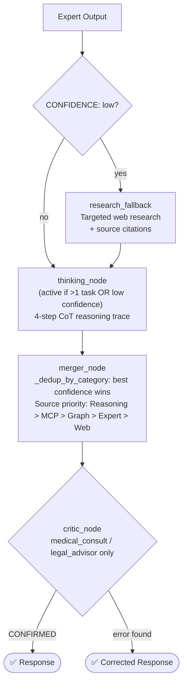

### VRAM Safety (Context Budget)

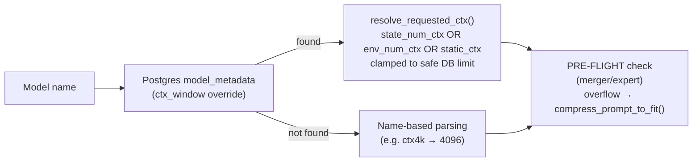

---

## 15. API Reference

**Base URL:** `http://<host>:8002`

```http
# Chat (streaming or non-streaming)
POST /v1/chat/completions
Authorization: Bearer <api-key>
{"model": "moe-auto", "messages": [{"role": "user", "content": "..."}], "stream": false}

# Available models
GET /v1/models

# Feedback (1-5 rating)
POST /v1/feedback
{"response_id": "chatcmpl-...", "rating": 4}

# Knowledge graph stats
GET /graph/stats
GET /graph/search?q=<term>&limit=10
```

**Model IDs:**

| ID | Mode |
|---|---|
| `moe-auto` | Full pipeline with dynamic routing |
| `moe-orchestrator` | Default (full explanations) |
| `moe-orchestrator-code` | Code only, no prose |
| `moe-orchestrator-concise` | Max 120 words |

---

## 16. Project Structure

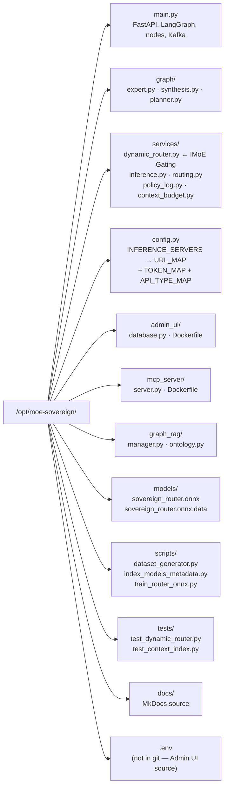

---

## 17. What's Next — Development Preview

The next development phase focuses on three parallel tracks:

### Track A — Training Data Pipeline
Expansion of the synthetic training dataset from 665 to 100,000 traces across three data types: routing decisions, multi-agent debate logs (Proponent vs. Skeptic), and paraconsistent logical maps. This dataset will serve as the foundation for full-scale LLM training on the LUMI-G supercomputer.

### Track B — LUMI-G Sovereign-14B Training
Using the 4,500 allocated node-hours on LUMI-G (AMD MI250x), a custom `Sovereign-14B` model will be trained through three stages: Continual Pre-Training (CPT) on domain knowledge, Supervised Fine-Tuning (SFT) on routing and planning behavior, and Reinforcement Learning from System Feedback (RLSF) using real cluster telemetry. The trained model will replace the current Judge LLM.

### Track C — JMoE Adversarial Framework
Implementation of the Judicial Mixture of Experts framework: an adversarial debate engine (Proponent vs. Skeptic agents) combined with a paraconsistent Judge based on Belnap-Dunn 4-valued logic (True / False / Inconsistent / Unknown). This replaces single-model synthesis with verifiable, formally grounded truth arbitration.

---

*Generated on 2026-06-13 — Version 3.0.0*
