# LangGraph Pipeline & Execution Lifecycle

The MoE Sovereign pipeline is built on LangGraph to manage the entire request lifecycle. It routes tasks dynamically, executes specialists in parallel, performs contextual RAG searches, and synthesizes final answers.

---

## 1. Request Lifecycle Flowchart

With the integration of the **IMoE Gating Network** (June 2026), the request lifecycle is split into two phases: **1. Gate Phase** (dynamic template compilation) and **2. Execution Phase** (LangGraph execution).

```mermaid
flowchart TD
    Start([Client Request]) --> GateEmbed["Local Embedding\n(all-MiniLM-L6-v2)"]
    GateEmbed --> GateCache{"ChromaDB Template Cache\ncosine distance < 0.18?"}
    
    GateCache -->|Hit 🎯| GateReady["Apply Cached Template"]
    GateCache -->|Miss| GateONNX["⚡ Sovereign Router ONNX\nClassifier < 5ms CPU"]
    
    GateONNX --> GateAlloc["🔀 Dynamic Allocator\n(Thompson Sampling + VRAM clamping)"]
    GateAlloc --> GateReady
    
    GateReady --> PipeCheck{"L1 Response Cache Hit?\nChromaDB cosine < 0.15?"}
    
    PipeCheck -->|Yes ⚡| ReturnResponse([SSE Response Stream])
    
    PipeCheck -->|No| PlanCacheCheck{"L2 Plan Cache Hit?\nValkey SHA256 plan key"}
    
    PlanCacheCheck -->|Yes| FanOut
    PlanCacheCheck -->|No| PlannerNode["🧠 Planner Node\nJudge LLM task decomposition"]
    
    PlannerNode --> ValkeyWrite["Write plan to Valkey (TTL 30 min)"]
    ValkeyWrite --> FanOut
    
    subgraph FanOut ["Parallel execution fan-out"]
        direction LR
        Workers["👥 Expert Workers\nT1 + T2 confidence-gated"]
        Research["🌐 SearXNG Research"]
        Math["∑ Math (SymPy)"]
        MCP["🔧 MCP Node\n16 deterministic tools"]
        GraphRAG["🗃 GraphRAG Node\nNeo4j 2-hop + CAG"]
    end
    
    FanOut --> MergeCheck{"Merger Fast-Path?\n1 expert, high confidence,\nno external context?"}
    
    MergeCheck -->|Yes ⚡| FastPath["Fast-Path merger\n(Skip Judge LLM)"]
    MergeCheck -->|No| MergerNode["⚖ Merger / Judge LLM\nPre-flight VRAM budget check\nProportional context compression"]
    
    FastPath --> ThinkCheck{"Complex query & thinking active?"}
    MergerNode --> ThinkCheck
    
    ThinkCheck -->|Yes| ThinkNode["💭 Thinking Node\n4-step CoT reasoning trace"]
    ThinkNode --> CriticCheck{"medical_consult / legal_advisor?"}
    ThinkCheck -->|No| CriticCheck
    
    CriticCheck -->|Yes| CriticNode["🔎 Critic Node\nAsync self-evaluation"]
    CriticCheck -->|No| SaveResults
    CriticNode --> SaveResults
    
    SaveResults["Post-pipeline saves\n- ChromaDB L1 response cache\n- Valkey Thompson success/fail scores\n- Kafka moe.ingest / moe.requests"]
    
    SaveResults --> ReturnResponse
```

---

## 2. Pipeline State (`MoEState` / `AgentState`)

The LangGraph state object passes through all pipeline nodes to retain execution history and metadata:

| Field | Type | Description |
|---|---|---|
| `input` | `str` | Original user query |
| `response_id` | `str` | UUID for response tracking and feedback correlation |
| `mode` | `str` | Operation mode (`default`, `code`, `concise`, `agent`, `agent_orchestrated`, `research`, `report`, `plan`) |
| `plan` | `List[Dict]` | Execution steps: `[{task, category, search_query?, mcp_tool?, metadata_filters?}]` |
| `complexity_level` | `str` | `trivial` / `moderate` / `complex` (classified by the IMoE ONNX router) |
| `expert_results` | `List[str]` | Accumulated responses from active expert workers |
| `expert_models_used` | `List[str]` | `["model::category", ...]` recorded for system metrics |
| `web_research` | `str` | Formatted web research hits with inline citations |
| `cached_facts` | `str` | Hard cache content retrieved on L1 cache hits |
| `math_result` | `str` | Deterministic SymPy computation output |
| `mcp_result` | `str` | Outputs from deterministic MCP precision tools |
| `graph_context` | `str` | Structured Neo4j query results (with optional `[Procedural Requirements]` block) |
| `final_response` | `str` | Final synthesized response from the merger/judge |
| `reasoning_trace` | `str` | Intermediate Chain-of-Thought trace generated by `thinking_node` |
| `metadata_filters` | `Dict` | Optional domain filters extracted by the planner for scoped database retrieval |

---

## 3. Node Mechanics

### 3a. IMoE Gate (Pre-Pipeline)
- Runs prompt-embedding and semantic distance matching in ChromaDB.
- Fallback ONNX model classifies query into domains, complexity, and retrieval needs in `< 5ms`.
- Selects models dynamically using Thompson Sampling and applies VRAM-safe context limits.

### 3b. Planner Node
- Only active for `moderate` and `complex` requests.
- Invokes the Judge LLM to construct a structured task list.
- Extracts domain filters (`metadata_filters`) to query target databases selectively.

### 3c. Expert Worker Node
- Executes tasks in parallel.
- Automatically escalates from T1 to T2 models if confidence threshold is not met.

### 3d. Merger / Judge Node
- Enforces a **PRE-FLIGHT** context check to calculate prompt tokens against the Judge's absolute model limit.
- If prompt exceeds limits, context is compressed proportionally (`compress_prompt_to_fit`).
- Combines expert findings and outputs the final stream.
