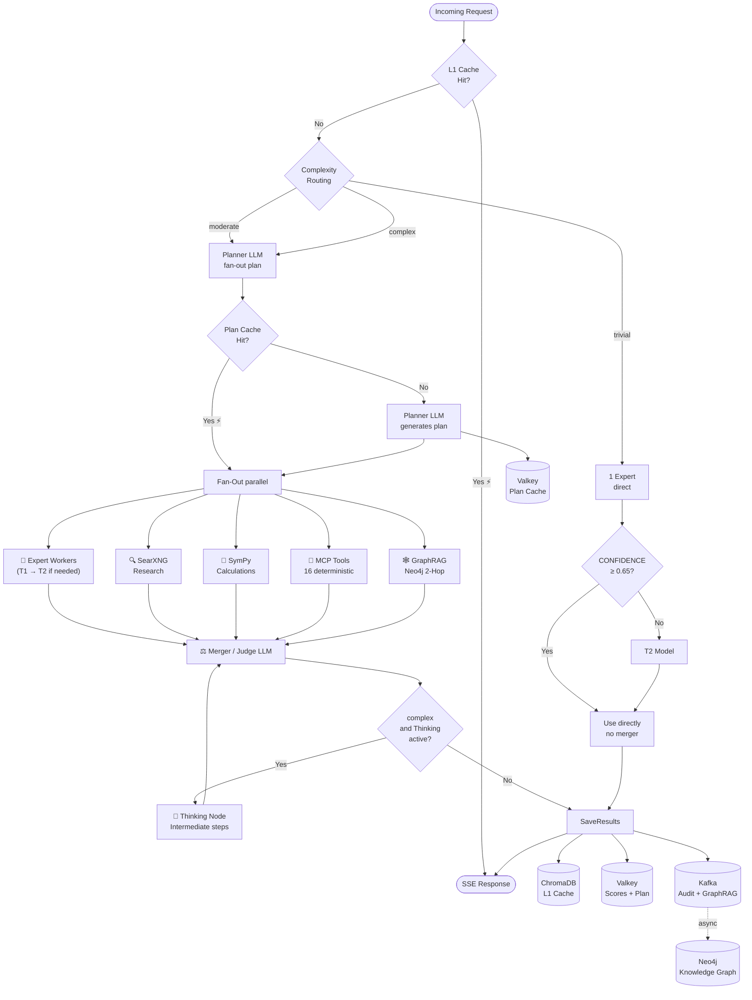
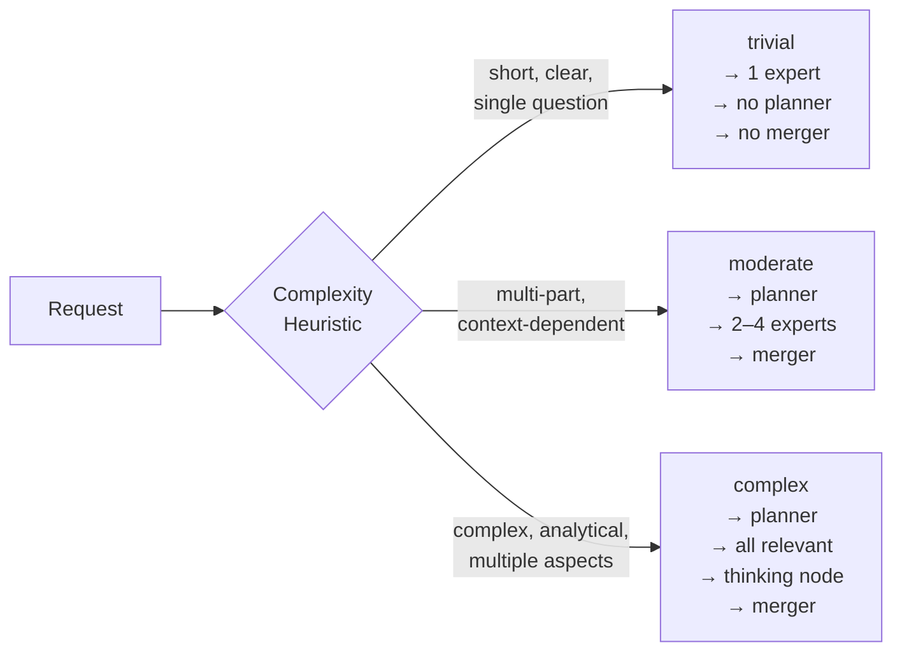
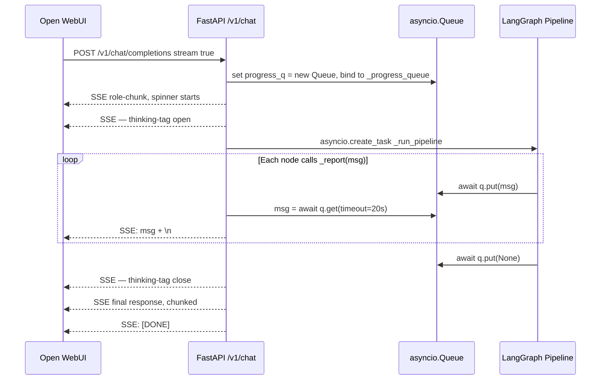

# LangGraph Pipeline

The MoE Sovereign pipeline is based on LangGraph and manages the entire request lifecycle from query to response.

## LangGraph State Schema

The pipeline state (`MoEState`) contains the following fields:

| Field | Type | Description |
|------|-----|-------------|
| `messages` | `list[BaseMessage]` | Chat history (OpenAI format) |
| `request_id` | `str` | Unique request ID (UUID) |
| `complexity` | `str` | `trivial` / `moderate` / `complex` |
| `expert_categories` | `list[str]` | Active expert categories |
| `expert_results` | `dict[str, str]` | Results per expert |
| `expert_confidences` | `dict[str, float]` | Confidence values per expert |
| `tool_results` | `dict[str, Any]` | MCP tool outputs |
| `research_results` | `str \| None` | SearXNG search results |
| `graph_context` | `str \| None` | Neo4j GraphRAG context |
| `plan` | `dict \| None` | Planner LLM output (from Valkey cache); task objects may include optional `metadata_filters` key on first item |
| `metadata_filters` | `Dict` | Optional domain filters extracted from first plan task; passed to `graph_rag_node` for scoped ChromaDB retrieval |
| `final_response` | `str` | Merged final response |
| `cache_hit` | `bool` | Whether L1 cache was hit |
| `thinking_output` | `str \| None` | Thinking node intermediate steps |
| `feedback_score` | `float \| None` | Last user rating (1–5) |

## Pipeline Flowchart



## Complexity Routing

Heuristic complexity routing classifies each request **without an LLM call**:



| Class | Active Nodes | Typical Savings |
|-------|-------------|----------------|
| `trivial` | 1 expert (no planner, no merger) | ~80% pipeline cost |
| `moderate` | Planner + 2–4 experts + merger | ~40% vs. complex |
| `complex` | Planner + all relevant + thinking + merger | Full cost |

## Node Descriptions

### Planner Node
- Analyzes the request and creates an expert plan
- Output is cached in Valkey (TTL 30 min)
- Determines: which experts, which tools, whether research is needed
- Optionally extracts `metadata_filters` from the first task object (e.g. `{"expert_domain": "code_reviewer"}`) and stores it in `AgentState` for scoped downstream retrieval

### Expert Worker Nodes
- Each expert runs in parallel in its own LangGraph task
- T1 model → if CONFIDENCE < 0.65 → T2 escalation
- Returns CONFIDENCE (0.0–1.0) and GAP markers

### Research Node (SearXNG)
- Activated when `research_needed: true` in plan
- Searches via SearXNG (self-hosted, no tracking)
- Result flows into all expert contexts

### Math Node (SymPy)
- Activated for mathematical expressions
- Exact symbolic evaluation via SymPy
- No LLM hallucination risk for calculations

### MCP Node
- Calls deterministic precision tools
- 16 tools (mathematics, date, units, crypto, network, law)
- Result injected as fact

### GraphRAG Node
- Searches Neo4j for relevant context (2-hop traversal)
- Cache in Valkey (TTL 1 h)
- If `metadata_filters` is set in state, additionally queries ChromaDB `moe_fact_cache` with a `where` clause — results are appended to `graph_context` as `[Domain-Filtered Memory]`
- Ingest via Kafka consumer (async)

### Thinking Node
- Only active for `complex` requests
- Generates explicit intermediate steps (Chain-of-Thought)
- Output flows as additional context into the merger

### Merger / Judge Node
- Synthesizes all expert results
- Evaluates quality and consistency
- Generates the final response (SSE stream or JSON)
- Appends a `<SYNTHESIS_INSIGHT>` JSON block when the response constitutes a novel multi-source comparison or logical inference (see [Graph-basierte Wissensakkumulation](intelligence/compounding_knowledge.md))
- The synthesis block is stripped from the user-facing response and persisted as a `:Synthesis` node in Neo4j via the `moe.ingest` Kafka topic

---

## Thought Stream & Transparency

Each pipeline stage writes to an internal progress queue (`_progress_queue` ContextVar).
While the pipeline runs asynchronously, these messages are streamed as a `<think>` block
to Open WebUI — in real time, unfiltered.

### Technical Flow



### Visible Events in the Thinking Panel

| Emoji | Event | Visible Content |
|-------|-------|----------------|
| 🎯 | **Skill resolution** | Skill name, arguments, resolved prompt (complete) |
| 📋 | **Planner prompt** | Full prompt to planner LLM incl. system role, rules, few-shot examples |
| 📋 | **Planner result** | Generated JSON plan with all subtasks and categories |
| 📤 | **Expert system prompt** | Full system prompt of the respective expert + task text |
| 🚀 | **Expert call** | Model name, category, GPU node, task |
| ✅ | **Expert response** | Complete, unfiltered LLM response incl. GAPS/REFER |
| ⚡ | **T1/T2 routing** | Which tier runs, whether T2 escalation is triggered |
| ⚙️ | **MCP call** | Tool name + full arguments as JSON |
| ⚙️ | **MCP result** | Complete result from precision tool server |
| 🌐 | **Web research** | Search query + full result incl. sources |
| 🔗 | **GraphRAG** | Neo4j query + structured context excerpt |
| 🧠 | **Reasoning prompt** | Full Chain-of-Thought prompt (4-step analysis) |
| 🧠 | **Reasoning result** | Full CoT trace (decomposition → conclusion) |
| 🔄 | **Judge refinement prompt** | Prompt for refinement round for low-confidence experts |
| 🔄 | **Judge refinement response** | Judge feedback text + confidence delta per category |
| 🔀 | **Merger prompt** | Full synthesis prompt incl. all expert results |
| 🔀 | **Merger response** | Full judge/merger output before critic review |
| 🔎 | **Critic prompt** | Fact-check prompt for safety-critical domains |
| 🔎 | **Critic response** | Review result: `CONFIRMED` or corrected response |
| ⚠️ | **Low confidence** | Category + confidence level of affected experts |
| 💨 | **Fast path** | Direct pass-through without merger (single high-confidence expert) |

### Implementation Details

```python
# ContextVar — automatically inherited by asyncio.create_task()
_progress_queue: contextvars.ContextVar[Optional[asyncio.Queue]] = \
    contextvars.ContextVar("_progress_queue", default=None)

async def _report(msg: str) -> None:
    """Sends a message to the thought stream."""
    q = _progress_queue.get()
    if q is not None:
        await q.put(msg)

# Skill resolution (before pipeline start) is passed via state:
# pending_reports: List[str]  →  planner_node emits them as first _report
```

!!! note "Agent Mode"
    In `agent` mode (Claude Code, Continue.dev), `skip_think=True` is set.
    The progress queue is silently drained — coding tools would render `<think>` tags
    as raw text.
