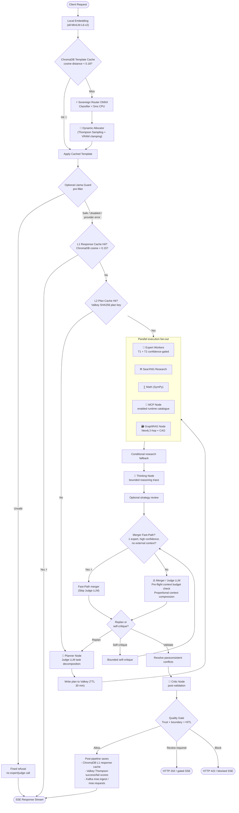

# LangGraph Pipeline & Execution Lifecycle

The MoE Sovereign pipeline is built on LangGraph to manage the entire request lifecycle. It routes tasks dynamically, executes specialists in parallel, performs contextual RAG searches, and synthesizes final answers.

---

## 1. Request Lifecycle Flowchart

With the integration of the **IMoE Gating Network** (June 2026), the request lifecycle is split into two phases: **1. Gate Phase** (dynamic template compilation) and **2. Execution Phase** (LangGraph execution).

```mermaid
flowchart TD
    Start([Client Request]) --> GateEmbed["Local Embedding\n(all-MiniLM-L6-v2)"]
    GateEmbed --> GateCache{"ChromaDB Template Cache\ncosine distance < 0.18?"}
    
    GateCache -->|Hit 🎯| GateReady["Apply Cached Template"]
    GateCache -->|Miss| GateONNX["⚡ Sovereign Router ONNX\nClassifier < 5ms CPU"]
    
    GateONNX --> GateAlloc["🔀 Dynamic Allocator\n(Thompson Sampling + VRAM clamping)"]
    GateAlloc --> GateReady
    
    GateReady --> Guard{"Optional Llama Guard\npre-filter"}
    Guard -->|Unsafe| GuardRefusal["Fixed refusal\nno expert/judge call"]
    Guard -->|Safe / disabled /\nprovider error| PipeCheck{"L1 Response Cache Hit?\nChromaDB cosine < 0.15?"}
    GuardRefusal --> ReturnResponse
    
    PipeCheck -->|Yes ⚡| ReturnResponse([SSE Response Stream])
    
    PipeCheck -->|No| PlanCacheCheck{"L2 Plan Cache Hit?\nValkey SHA256 plan key"}
    
    PlanCacheCheck -->|Yes| FanOut
    PlanCacheCheck -->|No| PlannerNode["🧠 Planner Node\nJudge LLM task decomposition"]
    
    PlannerNode --> ValkeyWrite["Write plan to Valkey (TTL 30 min)"]
    ValkeyWrite --> FanOut
    
    subgraph FanOut ["Parallel execution fan-out"]
        direction LR
        Workers["👥 Expert Workers\nT1 + T2 confidence-gated"]
        Research["🌐 SearXNG Research"]
        Math["∑ Math (SymPy)"]
        MCP["🔧 MCP Node\nenabled runtime catalogue"]
        GraphRAG["🗃 GraphRAG Node\nNeo4j 2-hop + CAG"]
    end
    
    FanOut --> Fallback["Conditional research fallback"]
    Fallback --> ThinkNode["💭 Thinking Node\nbounded reasoning trace"]
    ThinkNode --> StrategyReview["Optional strategy review"]
    StrategyReview --> MergeCheck{"Merger Fast-Path?\n1 expert, high confidence,\nno external context?"}

    MergeCheck -->|Yes ⚡| FastPath["Fast-Path merger\n(Skip Judge LLM)"]
    MergeCheck -->|No| MergerNode["⚖ Merger / Judge LLM\nPre-flight context budget check\nProportional context compression"]

    FastPath --> RevisionCheck{"Replan or\nself-critique?"}
    MergerNode --> RevisionCheck
    RevisionCheck -->|Replan| PlannerNode
    RevisionCheck -->|Self-critique| SelfCritique["Bounded self-critique"]
    SelfCritique --> MergeCheck
    RevisionCheck -->|Validate| Conflicts["Resolve paraconsistent conflicts"]
    Conflicts --> CriticNode["🔎 Critic Node\npost-validation"]
    CriticNode --> QualityGate{"Quality Gate\nTrust + boundary + HITL"}
    QualityGate -->|Allow| SaveResults
    QualityGate -->|Review required| ReviewResponse([HTTP 202 / gated SSE])
    QualityGate -->|Block| BlockResponse([HTTP 422 / blocked SSE])
    
    SaveResults["Post-pipeline saves\n- ChromaDB L1 response cache\n- Valkey Thompson success/fail scores\n- Kafka moe.ingest / moe.requests"]
    
    SaveResults --> ReturnResponse
```

---

## 2. Pipeline State (`MoEState` / `AgentState`)

The LangGraph state object passes through all pipeline nodes to retain execution history and metadata:

| Field | Type | Description |
|---|---|---|
| `input` | `str` | Original user query |
| `response_id` | `str` | UUID for response tracking and feedback correlation |
| `mode` | `str` | Operation mode (`default`, `code`, `concise`, `agent`, `agent_orchestrated`, `research`, `report`, `plan`) |
| `plan` | `List[Dict]` | Execution steps: `[{task, category, search_query?, mcp_tool?, metadata_filters?}]` |
| `complexity_level` | `str` | `trivial` / `moderate` / `complex` (classified by the IMoE ONNX router) |
| `expert_results` | `List[str]` | Accumulated responses from active expert workers |
| `expert_models_used` | `List[str]` | `["model::category", ...]` recorded for system metrics |
| `web_research` | `str` | Formatted web research hits with inline citations |
| `cached_facts` | `str` | Hard cache content retrieved on L1 cache hits |
| `math_result` | `str` | Deterministic SymPy computation output |
| `mcp_result` | `str` | Outputs from deterministic MCP precision tools |
| `graph_context` | `str` | Structured Neo4j query results (with optional `[Procedural Requirements]` block) |
| `retrieved_graph_chunks` | `List[Dict]` | Graph entities actually supplied to synthesis, used by retrieval attribution |
| `final_response` | `str` | Final synthesized response from the merger/judge |
| `reasoning_trace` | `str` | Intermediate Chain-of-Thought trace generated by `thinking_node` |
| `metadata_filters` | `Dict` | Optional domain filters extracted by the planner for scoped database retrieval |
| `quality_gate_status` | `str` | Final `allow`, `review_required`, or `block` decision exposed by the API transport |
| `deliberation_policy` | `Dict` | Strict template policy snapshot; never produced by the planner LLM |
| `deliberation_capacity` | `Dict` | Frozen deterministic initial/reserve agents, rounds and call budget |
| `deliberation_events` | `List[Dict]` | Bounded operational events without prompts, secrets or full transcripts |

---

## 3. Node Mechanics

### 3a. IMoE Gate (Pre-Pipeline)
- Runs prompt-embedding and semantic distance matching in ChromaDB.
- The local ONNX fallback classifies the query into domains, complexity and
  retrieval needs; latency is exposed through routing telemetry rather than
  promised as a fixed bound.
- Selects models dynamically using Thompson Sampling and applies VRAM-safe context limits.

### 3b. Safety Guard
- Runs before response-cache lookup when a global or per-template guard model is configured.
- Unsafe input is short-circuited to a fixed response without planner, expert or judge execution.
- The model request, result, provider error or request-timeout cancellation is persisted through
  the same AI-I/O audit lifecycle as other model calls.
- Provider failures currently fail open and continue to the cache/planner path; this is an
  explicit availability policy, not a claim that the guard is always enforced.

### 3c. Planner Node
- Only active for `moderate` and `complex` requests.
- Invokes the Judge LLM to construct a structured task list.
- Extracts domain filters (`metadata_filters`) to query target databases selectively.

### 3d. Expert Worker Node
- Executes tasks in parallel.
- Automatically escalates from T1 to T2 models if confidence threshold is not met.
- Applies the template's [adaptive deliberation policy](deliberation.md) before
  normal worker execution. Micro debates share a request-wide call budget;
  moderated debates run across the planned domains and then enter the existing
  merger, critic and quality-gate path.

### 3e. Merger / Judge Node
- Enforces a **PRE-FLIGHT** context check to calculate prompt tokens against the Judge's absolute model limit.
- If prompt exceeds limits, context is compressed proportionally (`compress_prompt_to_fit`).
- Combines expert findings and outputs the final stream.

### 3f. Validation and Quality Gate
- Conflict resolution and the critic run before any response is released.
- Declared gaps can trigger a bounded replan or self-critique loop.
- The final quality gate combines Trust, boundary and structured-output failures.
- `review_required` creates an owner-bound HITL gate and returns HTTP 202 for
  non-streaming calls. `block` returns HTTP 422. Streaming calls emit an
  explicit gate/block control event instead of answer text.
